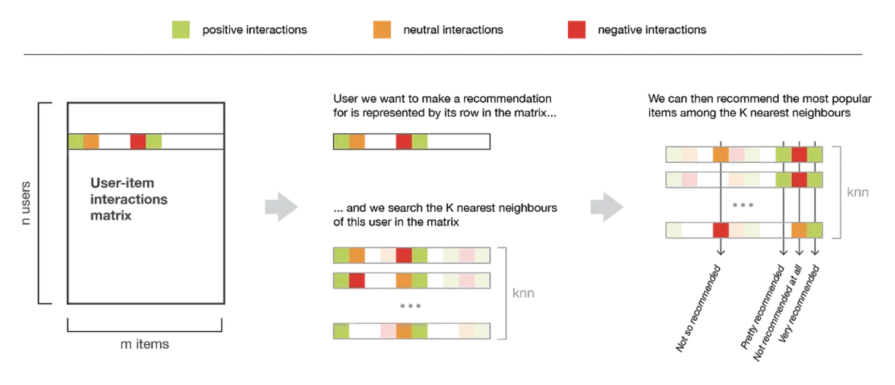
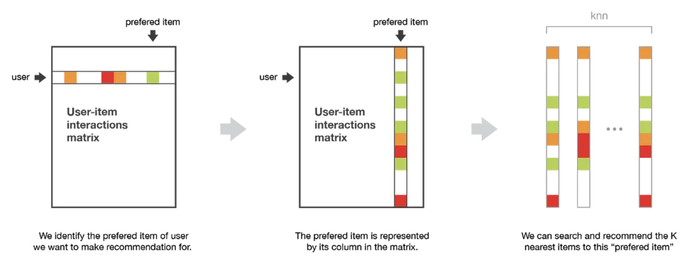

# Empfehlungssysteme
von *Olha Solodovnyk, Daria Likhacheva und Zi Xun Tan*

## Abstract 
Diese Arbeit behandelt das Thema Empfehlungssysteme und präsentiert es in verschiedenen Formaten, darunter einem Podcast, einem Vortrag und einer Code-Demo.

Der Podcast bietet eine einfache und unkomplizierte Einführung in Empfehlungssysteme. Es werden verschiedene Arten von Empfehlungssystemen behandelt, darunter inhaltsbasierte, kollaborative, kontext-basierte und hybride Ansätze. Der Podcast richtet sich an ein allgemeines Publikum und soll Zuhörer einbeziehen und ihnen einen Überblick über die Funktionsweise von Empfehlungssystemen und -anwendungen geben.

In dem Vortrag wird hingegen näher auf Empfehlungssysteme eingegangen. Die Grundlagen und Funktionsweise inhaltsbasierter, kollaborativer und hybrider Empfehlungssysteme werden erläutert und die Vor- und Nachteile dieser Ansätze diskutiert. Der Vortrag richtet sich an ein technisch versiertes Publikum und vermittelt ein tieferes Verständnis der Konzepte und Algorithmen hinter Empfehlungssystemen.

Die Code-Demo zeigt eine praktische Implementierung eines einfachen Filmempfehlungssystems. Es werden verschiedene Algorithmen und Techniken präsentiert, einschließlich inhaltsbasierter, kollaborativer und hybrider Filter. Durch die Demonstration des Codes wird gezeigt, wie ein Datensatz verarbeitet und Empfehlungen generiert werden, die sowohl auf Inhaltsinformationen als auch auf Benutzerinteraktionen basieren. Der bereitgestellte Code ist frei verfügbar, sodass jeder die Implementierung von Empfehlungssystemen besser verstehen und damit experimentieren kann.
## 1 Einleitung / Motivation
In der heutigen digitalen Welt werden die Empfehlungssysteme fast jeden Tag benutzt. Sie haben einen sehr großen Einfluss auf unsere täglichen Aktivitäten. Von Online-Shopping-Plattformen bis hin zu Streaming-Dienste (wie Spotify oder Netflix) werden die Empfehlungen benutzt, um unsere Entscheidungen zu beeinflussen und unsere Erfahrungen zu personalisieren. Was bedeuten aber diese Empfehlungssysteme und wie funktionieren sie?

Wir werden immer mit relevanten Informationen, Produkten und Dienstleistungen versorgt, da die Empfehlungssysteme dafür verantwortlich sind. Für die Empfehlungssysteme zu funktionieren, brauchen wir sehr viele Daten, die aus unseren Vorlieben, Nutzerverhalten und Aktivitäten im Netz gesammelt und analysiert werden. Mit ständigen Empfehlungen von neuen Filmen, Bücher, Musik, Produkte und Dienstleistungen haben die Empfehlungssysteme das Potenzial, unser Leben immer mehr einfacher und bequemer zu gestalten. Sie verbessern aber nicht nur das Leben von Nutzern, sondern auch den Unternehmen und Künstlern. Indem sie ihnen eine Möglichkeit bieten, ihre Werke einem breiteren Publikum zu präsentieren oder über ihre Dienstleistungen zu informieren, können sie dazu beitragen, die Sichtbarkeit von Künstlern, Autoren, Filmemachern, Dienstleistungsanbieter und Unternehmen zu erhöhen.

Dennoch begegnen uns in der modernen Welt auch spezifische Herausforderungen im Zusammenhang mit Empfehlungssystemen. Unter den ethischen Fragen, die berücksichtigt werden müssen, sind die Privatsphäre von Kunden, Manipulation und Voreingenommenheit der Empfehlungsalgorithmen. 

Im Folgenden wollen wir einen Blick auf die Welt der Empfehlungssysteme werfen, die verschiedenen Arten der Empfehlungssysteme uns anschauen, ihre Funktionsweise verstehen, ihre Vor- und Nachteile beleuchten und die Auswirkungen auf unsere Gesellschaft sowie individuellen Entscheidungsprozesse untersuchen. Wenn wir und das Thema genauer anschauen, können wir besser verstehen, wie Empfehlungssysteme unseren Alltag verbessern und wie wir als Nutzerinnen und Nutzer bewusste Entscheidungen treffen können.
## 2 Methoden

### 2.1 Inhaltsbasierte Filterung
Die Inhaltsfilterung analysiert die Merkmale der Objekte (z. B. Filme, Produkte, Artikel) und Benutzervorlieben und versucht, auf der Grundlage dieser Merkmalen geeignete Empfehlungen zu generieren.

Der Prozess der Inhaltsbasierten Filterung beinhaltet in der Regel die folgenden Schritte:

**Objekt-Profileerstellung:** Für jedes Objekt werden relevante Merkmale extrahiert und daraus ein oder mehrere Profile erstellt. Bei Filmen könnten dies beispielsweise Genre, Schauspieler, Regisseur oder Handlungsbeschreibung sein. Die Merkmale können aus Metadaten oder Inhalten des Objekts (z.B. Textanalyse) gewonnen werden. 

**Benutzer-Profilerstellung:** Für jeden Benutzer wird ein Profil erstellt, das seine Vorlieben basierend auf seinen vergangenen Bewertungen oder Interaktionen widerspiegelt. Das Profil kann durch Gewichtung der Merkmale entsprechend der Wichtigkeit für den Benutzer erstellt werden.

**Übereinstimmungsberechnung:** Die Ähnlichkeit zwischen Objektvektoren kann mit drei Methoden berechnet werden: 

* Euklidischer Abstand
* Pearson-Korrelation und 
* Kosinus-Ähnlichkeit, die wir in unserer Arbeit genauer betrachten.

Kosinus-Ähnlichkeit ist ein Maß dafür, wie ähnlich zwei Vektoren sind. Der Kosinus des Winkels zwischen zwei Vektoren wird bestimmt. 

$$
Kosinus&#8209;Ähnlichkeit(u, i) = cos(u,i)= \frac{u \cdot i}{\|u\| \cdot \|i\|}
$$

Der Nutzervektor $u$ repräsentiert die Präferenzen, Eigenschaften oder Merkmale des Nutzers, während der Objektvektor $i$ die Merkmale oder Eigenschaften des Items oder eines anderen Nutzers darstellt.
Die Euklidische Norm $∥u∥$ des Nutzervektors gibt an, wie groß der Vektor ist, während die Euklidische Norm $∥i∥$ des Objektvektors dessen Größe angibt.
Das Skalarprodukt $u⋅i$ zwischen dem Nutzervektor $u$ und dem Objektvektor $i$ ergibt sich aus der Summe der Produkte der entsprechenden Elemente beider Vektoren.

Der Kosinus des eingeschlossenen Nullwinkels ist $1$, was 100 % Ähnlichkeit bedeutet. Für jeden anderen Winkel ist der Kosinus des eingeschlossenen Winkels kleiner als $1$.

**Empfehlungsgenerierung:** Basierend auf den Ähnlichkeiten werden Objekte ausgewählt, die dem Benutzer empfohlen werden sollen. Dies können Objekte sein, die eine hohe Ähnlichkeit zu den vom Benutzer bevorzugten Merkmalen aufweisen.

### 2.2 Kollaborative Filterung
Die kollaborative Filterung ist ein Ansatz, der die vergangenen Bewertungen eines Benutzers nutzt, um eine Datenbank (Benutzer-Objekt-Matrix) von Präferenzen zu erstellen und Vorhersagen über Gegenstände zu treffen, die mit den Vorlieben des Benutzers übereinstimmen. Sie wird in zwei Hauptkategorien unterteilt: memory-basierte kollaborative Filterung und modellbasierte kollaborative Filterung.

#### 2.2.1 Memory-basierte kollaborative Filterung
Die klassische kollaborative Filterung umfasst den memory-basierten Ansatz. Dieser Ansatz nutzt Informationen über die Vergangenheit von Benutzern und/oder Objekten, um Empfehlungen zu generieren. Der Schwerpunkt liegt auf der Speicherung und Auswertung von Informationen über Benutzerinteraktionen und Bewertungen, um Ähnlichkeiten zwischen Benutzern oder Objekten zu berechnen. 

Es gibt zwei Haupttypen memory-basierter Ansätze, beide sind k-nearest neighbor Algorithmen, aber sie haben dennoch große Unterschiede:

#### Benutzer-basierte Methode:
Das Benutzer-basierte Verfahren analysiert die Ähnlichkeit zwischen Benutzern. Die Idee ist, dass Benutzer mit ähnlichen Vorlieben ähnliche Interaktionen mit Objekten haben. Das Empfehlungssystem sucht nach Benutzern mit ähnlichem Verhalten und generiert basierend auf deren Bewertungen Empfehlungen für einen bestimmten Benutzer. 

<figure markdown>
  { width="600" }
  <figcaption> Eine Illustration der Benutzer-basierte-Methode.</figcaption>
</figure>


#### Objekt-basierte Methode:
Das Objekt-basierte Verfahren konzentriert sich auf die Ähnlichkeit zwischen Objekten. Die Hauptidee besteht darin, ähnliche Objekte anhand von Bewertungen oder Benutzerinteraktionen zu finden. Das Empfehlungssystem vergleicht Benutzer-Bewertung-Modelle für verschiedene Objekte und sucht nach ähnlichen Objekte. 

<figure markdown>
  { width="600" }
  <figcaption> Illustration der Objekt-basierte-Methode. </figcaption>
</figure>

In beiden Fällen kann Ähnlichkeitsmaß wie die Kosinus-Ähnlichkeit oder andere verwendet werden, um die Ähnlichkeit zwischen Benutzern oder  Objekten zu berechnen.

#### 2.2.2 Modellbasierte kollaborative Filterung
Bei der Verwendung von memory-basierte Methoden entsteht das Problem, dass die Benutzer-Objekt-Matrix aufgrund einer großen Anzahl von fehlenden Bewertungen sehr dünn besetzt ist. Diese Datenspärlichkeit beeinträchtigt die Fähigkeit, Benutzervorlieben genau einzuschätzen und zuverlässige Empfehlungen zu geben. 

Ein Lösungsansatz für dieses Problem besteht in der Verwendung von modellbasierten Methoden. Im Gegensatz zu memory-basierte Methoden lernen modellbasierte Algorithmen aus den vorhandenen Bewertungen ein Modell, das dann zur Vorhersage fehlender Bewertungen genutzt werden kann. Diese Modelle können auf Techniken wie Clustering, Bayes'schen Klassifikatoren oder Matrixfaktorisierung basieren.

**Singular Value Decomposition (SVD) / Singulärwertzerlegung**  
Obwohl es verschiedene Algorithmen gibt, konzentrieren wir uns hauptsächlich auf die Matrixfaktorisierung mit SVD. Die zentrale Idee bei der SVD-basierten Matrixfaktorisierung besteht darin, eine niedrigdimensionale Approximation der ursprünglichen Bewertungsmatrix zu finden. Diese niedrigdimensionale Approximation ermöglicht es uns, die wichtigsten latenten Faktoren zu erfassen, die zu Benutzervorlieben und Objekteigenschaften beitragen. In einem Filmempfehlungssystem könnten latenten Faktoren beispielsweise zugrunde liegende Attribute wie Genre, Regisseur oder Schauspieler darstellen.

Angenommen, wir haben eine Matrix $A_{m \times p}$, in der die $m$ Zeilen die Benutzer repräsentieren und die $p$ Spalten die Objekte darstellen. Das Ziel des SVD-Theorems besteht darin, die hochdimensionale Matrix $A_{m \times p}$ in drei Matrizen mit geringerer Dimension aufzuteilen. Das Theorem besagt:

$$
A = UΣV^T
$$

$U$ steht für die Benutzermatrix, $Σ$ ist eine diagonale Matrix mit den Singulärwerten und $V^T$  bezeichnet die Objektmatrix. Die Singulärwerte in der $Σ$-Matrix werden in absteigender Reihenfolge sortiert. Durch Auswahl der obersten $k$ Singulärwerte und ihrer entsprechenden Spalten in $U$ und $V^T$ reduzieren wir die Dimensionalität der Matrizen. Der Wert von $k$ bestimmt die Anzahl der beibehaltenen latenten Faktoren. 

Wenn wir uns das Filmempfehlungssystem als Beispiel nehmen, geht dieser Ansatz davon aus, dass es versteckte Beziehungen zwischen Benutzern und Filmen gibt, die sich auf die Bewertung eines Benutzers für einen bestimmten Film auswirken. Konkret wird angenommen, dass es eine Reihe von $k$ Faktoren gibt, die bestimmen, wie ein Benutzer einen Film bewertet, und dass diese Faktoren durch die Rang-$k$ SVD erfasst werden können.

**Training des Modells mit Surprise Library**  
In der Surprise-Bibliothek ist SVD als Empfehlungssystem-Modul implementiert. Im Wesentlichen geht es darum, das Empfehlungsproblem in ein Optimierungsproblem umzuwandeln. Wir können die Güte unserer Vorhersagen für die Nutzerbewertungen von Objekten messen. Eine häufig verwendete Metrik dafür ist der Root Mean Squared Error (RMSE). Je niedriger der RMSE, desto besser die Güte.

```python
from surprise import SVD

# Create a reader object
reader = Reader()

# Load the dataset from the DataFrame, specifying the columns for userId, movieId, and rating
data = Dataset.load_from_df(df_ratings[["userId", "movieId", "rating"]], reader)

# Instantiate the SVD algorithm
svd = SVD()

# Run 5-fold cross-validation and print results
cross_validate(svd, data, measures=["RMSE", "MAE"], cv=5, verbose=True)
```
Um eine Bewertung für einen bestimmten Benutzer vorherzusagen, kann die Methode `predict()` verwendet werden. Beachten Sie jedoch, dass der Benutzer in Ihrer Datenbank vorhanden sein muss.
```python
predicted_rating = svd.predict(user_id=1, movie_id=12)
predicted_rating.est
```
**Hyperparameter Tuning**  
Bei der Optimierung des SVD-Modells in der Surprise-Bibliothek gibt es mehrere wichtige Hyperparameter zu beachten:

`n_factors`: Dieser Hyperparameter bestimmt die Anzahl der latenten Faktoren oder Dimensionen, die zur Darstellung von Benutzern und Objekten verwendet werden. Durch Erhöhung der Anzahl der Faktoren können möglicherweise komplexere Beziehungen erfasst werden, es kann jedoch auch zu Overfitting kommen.

`n_epochs`: Dieser Hyperparameter repräsentiert die Anzahl der Iterationen oder Epochen, die während des Optimierungsprozesses verwendet werden. Durch Erhöhung der Anzahl der Epochen kann das Modell besser aus den Daten lernen, aber zu viele Epochen können ebenfalls zu Overfitting führen.

`lr_all`: Dieser Hyperparameter steuert die Lernrate, die den Schrittweite im Optimierungsalgorithmus bestimmt. Eine höhere Lernrate kann zu schnellerer Konvergenz führen, aber auch dazu führen, dass das optimale Ergebnis überschritten wird.

`reg_all`: Dieser Hyperparameter steuert den Regularisierungsterm für alle Parameter im Modell. Regularisierung hilft, Overfitting zu verhindern, indem eine Strafe für komplexe Modelle hinzugefügt wird. Die Anpassung dieses Hyperparameters kann einen Kompromiss zwischen der Erfassung nützlicher Muster und der Vermeidung von Overfitting darstellen.
### 2.3 Hybride Empfehlungssysteme 
Sowohl das Inhaltsbasierte als auch das kollaborative Filtermodell haben ihre Einschränkungen. Inhaltsbasierte Empfehlungssysteme haben die Einschränkung, dass sie stark von den verfügbaren Merkmalen oder Attributen eines Objekts abhängen, um Ähnlichkeiten zu ermitteln. Dadurch können sie Schwierigkeiten haben, komplexe und subtile Zusammenhänge zwischen verschiedenen Objekten zu erfassen, die sich nicht einfach durch Attribute beschreiben lassen.

Auf der anderen Seite können kollaborative Filterungssysteme Einschränkungen aufweisen, wenn es um die Bewältigung des sogenannten "Cold-Start"-Problems geht. Dieses Problem tritt auf, wenn ein neuer Benutzer oder ein neues Objekt in das System eingeführt wird und keine ausreichenden Informationen über die Vorlieben oder Ähnlichkeiten zu anderen Benutzern oder Objekten vorliegen. Dadurch kann die Genauigkeit der Empfehlungen in solchen Situationen beeinträchtigt werden.

Die Idee hinter hybriden Techniken besteht darin, dass eine Kombination von Algorithmen genauere und effektivere Empfehlungen liefert als ein einzelner Algorithmus, da die Nachteile eines Algorithmus durch einen anderen Algorithmus überwunden werden können. Indem verschiedene Empfehlungsmethoden miteinander verbunden werden, können hybride Filtertechniken die Stärken der einzelnen Ansätze nutzen und gleichzeitig deren Schwächen reduzieren. Dadurch ermöglichen sie eine verbesserte Personalisierung und Präzision bei den Empfehlungen für Benutzer.

Das Hybrid-Empfehlungsmodell ist in sieben Typen unterteilt: 

| Typ | Beschreibung | Vorteile | Beispiel |
|-----|--------------|----------|----------|
| Gewichtet | Eine Methode, bei der die Gewichtung allmählich angepasst wird, je nachdem, inwieweit die Bewertung eines Gegenstandes durch den Benutzer mit der durch das Empfehlungssystem vorhergesagten Bewertung übereinstimmt. | Nutzung der Stärken verschiedener Empfehlungssysteme, einfache Implementierung. | P-tango |
| Schalten | Wechselt zwischen Empfehlungstechniken basierend auf einer heuristischen Methode, die die Fähigkeit zur Erzeugung guter Bewertungen berücksichtigt. Löst spezifische Probleme einzelner Methoden. | Vermeidet Probleme spezifischer Methoden, sensibel für Stärken und Schwächen der Empfehlungssysteme. | DailyLearner |
| Kaskade   |Nach der Erstellung einer Kandidatenliste unter Verwendung eines Empfehlungssystemmodells mit ähnlichem Geschmack wie der Benutzer kombiniert die Methode das zuvor verwendete Empfehlungssystemmodell mit einem anderen Modell, um die Kandidatenliste nach den für den Benutzer am besten geeigneten Artikeln zu sortieren. | Verfeinert Empfehlungen durch Iteration, effizient und tolerant gegenüber Störungen. | EntreeC |
| Gemischt  | Kombiniert Empfehlungsergebnisse verschiedener Techniken gleichzeitig für jeden Artikel und liefert mehrere Empfehlungen. | Bietet mehrere Empfehlungen pro Artikel, individuelle Leistungen beeinflussen die Gesamtleistung in einem begrenzten Bereich nicht. | PTV-System, Profinder, PickAFlick |
| Merkmalskombination | Bezieht sich auf die Integration von Merkmalen, die von einer Empfehlungstechnik erzeugt wurden, in eine andere Technik. Durch die Einbeziehung spezifischer Merkmale oder Bewertungen einer Technik als zusätzliche Eingabe für eine andere Technik wird der Empfehlungsprozess verbessert, indem verschiedene Informationsquellen genutzt werden, um die Genauigkeit und Relevanz der Empfehlungen zu steigern. | Nutzt kollaborative Daten in Verbindung mit anderen Techniken, reduziert die Abhängigkeit von der kollaborativen Filterung. | Pipper |
| Funktionserweiterung | Nutzt Bewertungen und zusätzliche Informationen, die von vorherigen Empfehlungssystemen generiert werden. Erfordert zusätzliche Funktionalität der Empfehlungssysteme.  | Fügt dem primären Empfehlungssystem eine geringe Anzahl von Merkmalen hinzu, verbessert die Genauigkeit der Empfehlungen. | Libra-System |
| Meta-Ebene | Verwendet das interne Modell einer Technik als Eingabe für eine andere. Bietet umfassendere Informationen im Vergleich zu einzelnen Bewertungen. | Löst das Problem der Datenspärlichkeit bei kollaborativen Filterungstechniken, nutzt umfassende Modelle für verbesserte Empfehlungen. | LaboUr |


## 3 Anwendungen
Empfehlungssysteme finden in sehr vielen Bereichen Anwendung und tragen dazu bei, die Entscheidungsfindung von Benutzern zu erleichtern. Hier werden einige der Hauptanwendungen von Empfehlungssystemen aufgezeigt:

- **E-Commerce:** Online-Shopping-Plattformen wie Amazon oder Zalando nutzen Empfehlungssysteme, um ihren Kunden Produkte vorzuschlagen, die ihren individuellen Vorlieben entsprechen. Basierend auf dem bisherigen Kaufverhalten, den Produktbewertungen und den Präferenzen anderen Nutzern werden personalisierte Produktvorschläge gemacht, um die Einkaufserfahrung zu verbessern und die Kundenbindung zu stärken.
- **Streaming-Dienste:** Plattformen wie Netflix und YouTube verwenden Empfehlungssysteme, um Nutzern Inhalte vorzuschlagen, die ihren Geschmack treffen. Basierend auf dem Seh- und Hörverhalten sowie den Bewertungen vergangener Inhalte werden individuelle Serienempfehlungen und Musikvorschläge generiert, um das Unterhaltungserlebnis zu personalisieren.
- **Soziale Medien:** Hier setzen Facebook, Instagram und Twitter Empfehlungssysteme ein, um Nutzern relevante Inhalte, Beiträge und Kontakte anzuzeigen. Basierend auf dem sozialen Netzwerk, den Interaktionen und den Vorlieben der Nutzer werden Beiträge von Freunden, Seiten oder Themen empfohlen, um das Engagement und die Nutzung der Plattform zu fördern.
- **Musikdienste:** Musik-Streaming-Dienste wie Spotify oder Apple Musik nutzen Empfehlungssysteme, um personalisierte Wiedergabelisten zu erstellen. "Discover Weekly" und "Release Radar" sind Beispiele dafür, wie Empfehlungssysteme basierend auf dem individuellen Musikgeschmack der Nutzer neue Künstler, Songs und Alben vorschlagen.
- **Nachrichten und Content-Aggregatoren:** Empfehlungssysteme werden auch in Nachrichten-Apps und Content-Aggregatoren eingesetzt, um Nutzern relevante Artikel, Blogposts und Nachrichten vorzuschlagen. Basierend auf den Präferenzen, dem Leseverhalten und den Interessen werden personalisierte Newsfeeds und Inhaltszusammenstellungen erstellt.
- **Reise- und Hotelbuchungen:** Empfehlungssysteme kommen auch in der Tourismusbranche zum Einsatz. Plattformen wie Booking.com oder Airbnb nutzen sie, um Nutzern maßgeschneiderte Hotelvorschläge, Reiserouten und Attraktionen zu präsentieren, die ihren individuellen Vorlieben und Bedürfnissen entsprechen.

Diese Anwendungen von Empfehlungssystemen sind nur einige Beispiele für die vielfältigen Einsatzmöglichkeiten dieser Technologie. Ob im Bereich des Online-Shoppings, der Unterhaltung, der sozialen Interaktion oder der Informationsbeschaffung, Empfehlungssysteme spielen eine zentrale Rolle dabei, unsere Erlebnisse zu verbessern, relevante Inhalte zu entdecken und unsere Zeit effizienter zu nutzen.

## 4 Fazit
Empfehlungssysteme sind zu einem integralen Bestandteil unseres digitalen Lebens geworden und bieten personalisierte und relevante Vorschläge für eine Vielzahl von Produkten, Dienstleistungen und Inhalten. Diese Arbeit behandelt die verschiedenen Arten von Empfehlungssystemen, einschließlich inhaltsbasierter, kollaborativer Filterung und hybrider Ansätze.

Die inhaltsbasierte Filterung nutzt die Merkmale von Objekten und die Benutzerpräferenzen, um Empfehlungen zu generieren. Dieser Ansatz ist effektiv, wenn die Benutzerpräferenzen stark von den Eigenschaften des Inhalts abhängen. Bei der kollaborativen Filterung werden hingegen das Benutzerverhalten und die Interaktionen verwendet, um Ähnlichkeiten zwischen den Benutzern zu identifizieren und Empfehlungen auf der Grundlage dieser Ähnlichkeiten zu geben. Dieser Ansatz ist besonders wertvoll, wenn explizite Rückmeldungen wie Bewertungen oder Rezensionen verfügbar sind. Hybride Empfehlungssysteme kombinieren mehrere Ansätze, um deren Stärken zu nutzen und ihre Einschränkungen zu berücksichtigen.

Jeder Empfehlungsansatz hat Vor- und Nachteile. Die inhaltsbasierte Filterung kann Schwierigkeiten bei der Merkmalsextraktion und dem möglichen "Filterblasen"-Effekt haben. Die kollaborative Filterung kann mit Herausforderungen wie dem "Cold Start" und der Datenspärlichkeit konfrontiert sein. Hybride Systeme müssen die Komplexität bewältigen, um verschiedene Ansätze effektiv zu kombinieren und qualitativ hochwertige Empfehlungen bereitzustellen.

Obwohl Empfehlungssysteme insgesamt beträchtliche Vorteile bieten, ist es wichtig zu erkennen, dass sie auch ethische Bedenken aufwerfen. Der Prozess basiert stark auf der Erfassung und Analyse von Benutzerdaten, wodurch erhöhte Aufmerksamkeit für den Datenschutz und effektive Datenschutzmaßnahmen erforderlich sind. Transparenz und Benutzerkontrolle spielen eine entscheidende Rolle bei der Verwaltung der erfassten Daten und ihrer anschließenden Verwendung. Zusätzlich muss die Präsenz von Vorurteilen oder Ungerechtigkeiten in Empfehlungsalgorithmen schnell angegangen werden, da solche Empfehlungen bestehende Ungleichheiten verstärken und bestimmte Vorlieben festigen können.

Zusammenfassend ist es unbestreitbar, dass Empfehlungssysteme unsere Konsumgewohnheiten, Entscheidungsfähigkeiten und Gesamterfahrungen als Benutzer maßgeblich verändert haben. Diese Systeme bieten nicht nur die Möglichkeit, die Benutzerzufriedenheit zu steigern, sondern leisten auch wichtige Unterstützung für Unternehmen. Es ist jedoch entscheidend, Empfehlungssysteme mit einem kritischen Blick zu betrachten und ihre Einschränkungen und ethischen Implikationen zu berücksichtigen.
## 5 Weiterführendes Material

### 5.1 Podcast
Hier Link zum Podcast.

### 5.2 Talk
Hier einfach Youtube oder THD System embedden.

### 5.3 Demo
Hier Link zum Demo Video  
[Link zum GitHub Repository](https://github.com/Gary0417/movie_recommendation_system)


## 6 Literaturliste
[Ko, H. Y., Lee, S. Y., Park, Y., & Choi, A. L. (2022). A Survey of Recommendation Systems: Recommendation Models, Techniques, and Application Fields. Electronics; MDPI. https://doi.org/10.3390/electronics11010141](https://doi.org/10.3390/electronics11010141)

[Isinkaye, F. O., Folajimi, Y., & Ojokoh, B. A. (2015). Recommendation systems: Principles, methods and evaluation. Egyptian Informatics Journal; Elsevier BV. https://doi.org/10.1016/j.eij.2015.06.005](https://doi.org/10.1016/j.eij.2015.06.005)

[Baptiste Rocca (2019). Introduction to recommender systems
Overview of some major recommendation algorithms. https://towardsdatascience.com/introduction-to-recommender-systems-6c66cf15ada](https://towardsdatascience.com/introduction-to-recommender-systems-6c66cf15ada)


[G. Adomavicius, A. Tuzhilin. (2005). Toward the next generation of recommender systems: a survey of the state-of-the-art and possible extensions.  https://ieeexplore.ieee.org/abstract/document/1423975](https://ieeexplore.ieee.org/abstract/document/1423975)