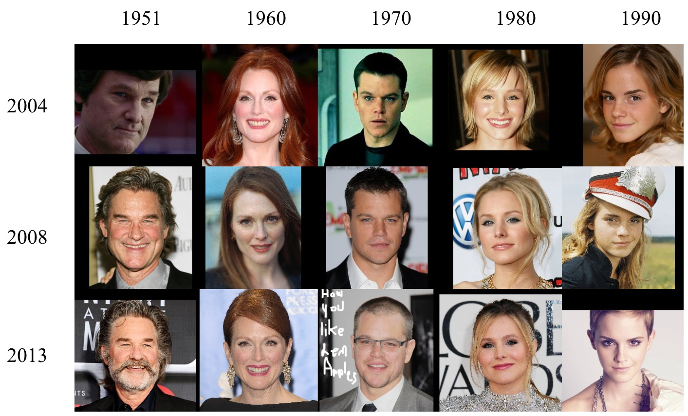

# Face Aging

von *Felix Rösch, Julian Steiner*

## Abstract

Bei Face Aging handelt es sich um die technische Möglichkeit Gesichter von Menschen digital altern zu lassen. Wichtig hierbei ist, dass das zukünftige Aussehen mit natürlichen Alterungseffekten vorhergesagt werden und gleichzeitig die persönlichen Merkmale erhalten bleiben. Neuentwickelte Generative Adversarial Networks (GANs) in verschiedenen Formen erzielten eine bessere Vorhersage der Alterung als herkömmliche Methoden. 

In diesen Report gehen wir auf den aktuellen Stand der Forschung, die Methoden und potentielle Anwendungen ein. Zusätzlich zu dieser schriftlichen Ausarbeitung wurde ein Fachvortrag und eine Code-Präsentation erarbeitet.

Im Fachvortrag gehen wir detaillierter auf das Paper ["PFA-GAN: Progressive Face Aging With Generative Adversarial Network"][1] und dessen Generative Adversarial Network zum Thema Face Aging ein. Die Code-Demonstration greift diesen Vortrag auf und implementiert das neuronale Netz in einem Jupyter Notebook.

## Einleitung / Motivation

!!! info Definition

    Gesichtsalterung (Face Aging), auch bekannt als Alterssynthese (Age Synthesis) und Altersprogression (Age Progression), wird als ästhetische Darstellung eines Gesichtsbildes mit natürlichen Alterungs- und Verjüngungseffekten auf das einzelne Gesicht definiert.[2]

Anwendung finden diese Methoden zum Beispiel in den Bereichen der Unterhaltung, sozialer Sicherheit, altersübergreifenden Gesichtserkennung, Forensik und Medizin.

Mögliche Anwendungsbeispiele sind zum einen Applikationen, die das Gesicht einer Person mit einem bestimmten Lebensstil vorhersagen. Solche Anwendungen können zum Beispiel dazu genutzt werden, um Personen mit einen übermäßigen Alkohol- und Nikotinkonsum die Auswirkungen aufzuzeigen um damit den Konsum zu verringern. Des Weiteren können solche Technologien helfen den Menschenhandel zu bekämpfen und Familien wieder zusammenführen, denn das menschliche Gesicht durchläuft von der Kindheit bis zum Erwachsenenalter eine deutliche körperliche Veränderung. Deswegen ist es zehn bis 15 Jahre nach der Entführung schwierig, ein verlorenes Kind wiederzuerkennen.

Die traditionellen Alterungsmethoden basieren meist auf der mechanischen Modellierung von Falten, Haaren, Textur und Gesichtsausdruck oder nutzen viele Daten, um Prototypen als Altersmuster zu konstruieren. Neue Deep Learning Methoden erzielten große Erfolge bei dem Thema Face Aging. Durch das Training zum Erlernen spezifischer Altersmuster und Zuordnungen zwischen Eingabegesichtern und Zielaltersbezeichnungen können Deep-Learning-Methoden Gesichter einer bestimmten Altersgruppe direkt generieren. Grob können die verschiedenen Methoden in drei Kategorien eingeteilt werden:

1. Physikalische modellbasierte Methoden
2. Prototypbasierte Methoden
3. Deep Generative Networks (Tiefe generative Netzwerke)

Obwohl sich mit Deep-Learning-Methoden die Altersmuster leicht erlernen lassen, können sie in der gewünschten Altersgruppe keine zufriedenstellenden Ergebnisse erzielen. Die altersgruppenbasierte Synthese teilt den Langzeitverlauf in mehrere unabhängige Gruppen auf und fügt Identitätserhaltung zwischen Eingabe und Ausgabe hinzu. Jedoch werden die fortschreitende Änderung des Altersmuster und Identitätserhaltung zwischen den synthetisierten Bildern ignoriert. Um diese Probleme zu lösen wurden verschiedene Arten von Deep-Learning-Methoden entwickelt.

In den folgenden Kapiteln werden wir die Herausforderungen bei der Erstellung der Datensätze und der Entwicklung solcher neuronalen Netzwerke in ihren verschiedenen Methoden genauer beleuchten.

## Stand der Forschung

### Datensätze

In diesem Abschnitt wollen wir die wichtigsten aktuell verfügbaren und verwendeten Datensätze für das Thema Face Aging vorstellen. Diese Datensätze wurden in den Papern, die im Kapitel Methoden genauer vorgestellt werden, verwendet. Bei den Datensätzen MORPH und CACD handelt es sich um die meistverwendeten Datensätze.

#### MORPH

Im Jahr 2006 gab es nur drei öffentlich bekannte zugängliche Datenbanken, die Doppelbilder einer Person in verschiedenen Altersstufen enthielten. [MORPH][21], [FERET][22] und [FG-NET][23].

MORPH war zu diesem Zeitpunkt die einzige dieser drei Datenbanken, die die ethnische Zugehörigkeit, die Größe, das Gewicht und das Geschlecht der Probanden erfasste. Diese Eigenschaften sind für das Verständnis der Veränderung des Aussehens des menschlichen Gesichts im Alter aber von entscheidender Bedeutung. Zusätzlich beinhaltete diese Datenbank den größten Satz öffentlich verfügbarer Bilder von Personen über einen längeren Zeitraum. Dieser konnte von ein paar Monaten von bis zu über zwanzig Jahren sein. Bei den damaligen Methoden war diese Eigenschaft Voraussetzung für die Erstellung eines erfolgreichen Modells.

Seitdem wird dieser Datensatz ständig weiterentwickelt. Aktuell gibt es den Datensatz der University of North Carolina Wilmington in drei unterschiedliche Varianten. Dem MORPH Commercial Set, MORPH Academic Set und der MORPH Longitudinal Database. Um den Datensatz zu erhalten muss man die Universität kontaktieren um anschließend eine Lizenz und die Daten zu erhalten. Weitere Informationen finden Sie auf dieser [Website](https://uncw.edu/myuncw/research/innovation-commercialization/technology-portfolio/morph).

<figure markdown>
  { width="800" }
  <figcaption>Beispiel Bilder MORPH Datensatz</figcaption>
</figure>

#### Cross-Age Celebrity Dataset (CACD)

Der [CACD][24] Datensatz beinhaltet über 160.000 Bilder von über 2.000 berühmten Persönlichkeiten. Diese Bilder stammen aus dem Internet und wurden automatisch über Suchmaschinen gesammelt und gespeichert. Dabei dienten die Namen der Personen und das Jahr (2004-2013) als Schlüsselwörter. Das Alter einer Person wurde bestimmt, indem das Geburtsjahr der Person von dem Jahr subtrahiert wurde, indem das Foto aufgenommen wurde. Zusätzliche zu den Bildern gibt es einen Metadatensatz im MATLAB-Format, welcher wichtige Informationen zu den Bildern beinhaltet. Hierbei handelt es sich z.B. um den Namen und das Alter der Person. 

<figure markdown>
  { width="600" }
  <figcaption>Beispiel Bilder CACD Datensatz</figcaption>
</figure>

Der Datensatz und die Metadaten können auf der [Homepage][24] heruntergeladen werden.

#### FG-NET

Eingeführt wurde der Datensatz FG-NET mit dem Paper [Toward automatic simulation of aging effects on face images][25]. Insgesamt beinhaltet er über 1.000 Bilder von 82 Personen. Es wird beim Alter eine Spanne von 0 bis 69 Jahren und ein Altersunterschied von bis zu 45 Jahren abgedeckt. Heruntergeladen kann der Datensatz auf dieser [Webseite][23].

#### IMDB-WIKI

Im [IMDB-WIKI][26] Datensatz wurden ein große Sammlung von Bildern und Metadten von Berühmtheiten zusammengestellt. Hierbei sammelten die Ersteller automatisch das Geburtsdatum, den Namen, das Geschlecht und alle Bilder der 100.000 beliebtesten Schauspieler auf der IMDb-Website. Zusätzlich wurden zu diesen Personen alle Profilbilder von Personenseiten aus Wikipedia mit denselben Metadaten automatische gesammelt. Entfernt wurden die Bilder, die keinen Zeitstempel hatten. Das reale Alter der Person auf einem Bild wurde durch das Geburtsdatum und den Zeitstempel des Bildes errechnet. Der Datensatz beinhaltet über 460.000 Gesichtsbilder von mehr als 20.000 Prominenten aus IMDb und mehr als 62.000 Bilder aus Wikipedia. Insgesamt umfasst er über 520.000 Bilder.

<figure markdown>
  { width="600" }
  <figcaption>Beispiel Bilder IMDB-WIKI Datensatz</figcaption>
</figure>

Auf der [Webseite][26] des Datensatzes können die Bilder und Metadaten in verschiedensten Varianten heruntergeladen werden. Auch bereits vortrainierte Gewichte zu implementierten Modellen sind hier zu finden.

### Methoden

Mit der folgenden Abbildung wollen wir die Entwicklung der GAN-Methoden darstellen, die wir für dieses Projekt betrachtet haben. Die Zeitreihe stellt die jeweiligen Paper mit dem Jahr der Veröffentlich dar.

<figure markdown>
  { width="600" }
  <figcaption>Entwicklung GAN Methoden</figcaption>
</figure>

## Methoden

### Physikalische modellbasierte Methoden

Physikalische, modellbasierte Methoden befassen sich mit dem Entwurf eines komplexen Modells zur Nachahmung des Gesichtsaussehens und zur Simulation von Alterungsmechanismen in Bezug auf Haare, Muskeln und Textur bei Erwachsenen und mit der Anwendung spezifischer Transformationen auf eine Reihe von Orientierungspunkten oder statistischer Parameter zur Modellierung altersbedingter Formveränderungen bei Kindern. Für diese Methode muss jedoch ein parametrisches Modell erstellt werden, und es werden viele Gesichter derselben Identitäten in verschiedenen Altersstufen benötigt, was rechenintensiv und schwer zu erfassen ist.

### Prototypbasierte Methoden

Die prototypenbasierten Methoden verwenden ein nichtparametrisches Modell. Die Gesichter sollten zunächst in Gruppen nach verschiedenen Altersgruppen eingeteilt werden. Das durchschnittliche Gesicht jeder Altersgruppe wird als Prototyp und Altersmuster einer bestimmten Altersgruppe bezeichnet. Im Paper [Personalized Age Progression with Aging Dictionary][12] hat das Autorenteam eine auf Wörterbüchern basierende Alterssynthesemethode vorgeschlagen. [Yang et al.][13] haben mit Hilfe der Hidden Factor Analysis eine gemeinsame spärliche Darstellung eingeführt. Diese vorgeschlagenen Alterungsmethoden modellieren getrennt die stabilen personenabhängigen Eigenschaften über einen relativ langen Zeitraum und die altersabhängigen Informationen, die sich im Laufe der Zeit allmählich ändern. Da das Altersmuster jedoch aus dem Durchschnittsgesicht gewonnen wird, können prototypbasierte Methoden die personalisierten Informationen ignorieren.

### Deep Generative Networks

Die obengenannten Ansätze erfordern jedoch häufig die Erstellung von Alterungssequenzen derselben Person mit einem breiten Altersspektrum, deren Erfassung sehr kostspielig ist. Generative Adversarial Networks (GANs) können besser mit Altersverläufen umgehen.

#### Generative Adversarial Networks (GANs)

Generative Adversarial Networks sind tiefe neuronale Netzwerke. Diese nutzen unbeaufsichtigtes maschinelles Lernen um Daten zu generieren. Eingeführt wurden diese 2014 in einem [Paper][3] von Ian Goodfellow, Yoshua Bengio, and Aaron Courville.

Ein solches neuronales Netzwerk besteht aus zwei weiteren Netzwerken. Einem Generator Netzwerk und einem Discriminator Netzwerk. Durch mehrere Generations- und Diskriminierungszyklen trainieren sich beide Netzwerke gegenseitig und versuchen gleichzeitig, sich gegenseitig zu überlisten. Das Ziel solcher Netze ist es, Datenpunkte zu generieren, die einigen Datenpunkten im Trainingssatz stark ähneln.

Viele GAN-basierte Methoden können im Bereich Face Aging die plausibelsten und realistischsten Bilder erzeugen, die aufgrund des Alters nur schwer von echten Daten zu unterscheiden sind. Allerdings nutzen alle diese die sequentiellen Daten nicht vollständig aus. Diese Methoden können die Übergangsmuster, die als Korrelationen der Gesichtsmerkmale zwischen verschiedenen Altersgruppen für eine Person definiert sind, nicht explizit berücksichtigen. Daher sind ihre Ergebnisse normalerweise nicht in der Lage, die Gesichtsidentität beizubehalten oder die Übergangsregeln für Kreuzungen nicht gut zu erfüllen.

Um diese Probleme zu lösen und den Alterungsprozess von Personen mit Hilfe von GANs noch detaillierter und akkurater darzustellen, wurden verschiedene Variationen von diesen Netzwerken entwickelt.

#### Conditional Generative Adversiral Networks

Ebenfalls im Jahr führten die Autoren Mehdi Mirza und Simon Osindero das [Conditional Generative Adversarial Network][28] ein. Bei einem unkonditionierten generativen gibt es keine Kontrolle über die Modi der erzeugten Daten. Durch die Konditionierung des Modells auf zusätzliche Informationen ist es jedoch möglich, den Datengenerierungsprozess zu steuern. Eine solche Konditionierung könnte auf Klassenlabels, auf einem Teil der Daten für Inpainting wie oder sogar auf Daten aus verschiedenen Modalitäten basieren. 

GANs können zu einem konditionalen Modell (Conditional GAN) erweitert werden, wenn sowohl der Generator als auch der Diskriminator durch eine zusätzliche Information konditioniert werden. Die Konditionierung kann durchgeführt werden, indem die Information sowohl in den Diskriminator als auch in den Generator als zusätzliche Eingabeschicht eingespeist wird.

<figure markdown>
  { width="400" }
  <figcaption>Conditional Adversarial Net</figcaption>
</figure>

Die Ergebnisse des Papers demonstrierten das Potenzial von diesen Netzwerken.  

#### Face Aging with Conditional Generative Adversarial Networks

Auch mit dem nächsten Paper - ["Face Aging with Conditional Generative Adversarial Networks"][5] -, aus dem Jahr 2017, wurde versucht, die Probleme mit dem Verlust der Identität der ursprünglichen Person in modifizierten Bildern, zu minimieren. Daher konzentriert sich diese Studie auf die identitätserhaltende Gesichtsalterung. Dafür entwickelten die Autoren das Age-cGAN (Age Conditional Generative Adversarial Network). Es sollte das erste GAN sein, das qualitativ hochwertige synthetische Bilder innerhalb der geforderten Alterskategorien erzeugt. Zusätzlich schlug das Team einen neuartigen Ansatz zur Optimierung latenter Vektoren vor, der es Age-cGAN ermöglicht, ein eingegebenes Gesichtsbild zu rekonstruieren, ohne die Identität der ursprünglichen Person zu verändern.

Ein Conditional GAN (cGAN) erweitert das GAN-Modell und ermöglicht die Erzeugung von Bildern mit bestimmten Bedingungen (Attributen). Diese Bedingungen können jede beliebige Information, die sich auf das Zielgesichtsbild bezieht. Zum Beispiel Beleuchtungsniveau, Gesichtshaltung oder Gesichtsattribute. Hierbei wird die bedingte Information in den Eingang des Generators und in die erste Faltungsschicht (Convolution Layer) von dem Discriminator Netzwerk injiziert.

Conditional GANs verfügen nicht über einen expliziten Mechanismus zur inversen Abbildung eines Eingangsbildes $x$ mit Attributen $y$ auf einen latenten Vektor $z$, der für die Bildrekonstruktion notwendig. Die Autoren umgehen dieses Problem, indem ein Encoder $E$ trainiert wird. Bei diesen handelt es sich um ein neuronales Netz, das die inverse Abbildung annhähert. Dieser erzeugtanfängliche latente Approximationen, die gut genug sind, um als Initalisierungen für den Optimierungsalgorithmus zu dienen. Das Team nutzt einen neuartigen "identitätserhaltenden Ansatz" (Identity-Preserving) zur Optimierung latenter Vektoren. Hierbei lautet der Grundgedanke folgendermaßen: Bei einem neuronalen Gesichtserkennungsnetz (Face Recognition), das in der Lage ist, die Identität einer Person in einem eingegebenen Gesichtsbild zu erkennen, kann der Unterschied zwischen den Identiäten in den ursprünglichen und rekonstruiertern Bildern als euklidischer Abstand zwischen den entsprechenenden Einbettungen ausgedrückt werden. Daher sollte die Minimierung dieses Abstands die Erhaltung der Identität im rekonstruierten Bild verbessern.

<figure markdown>
  { width="800" }
  <figcaption>Verwendete Methode. (a) Approximative Gesichtsrekonstruktion mit Age-cGAN (b) Wechseln der Altersbedingung am Eingang des Generators G, um die Gesichtsalterung durchzuführen.</figcaption>
</figure>

Die Autoren kamen zum Schluss, dass der Teil der Gesichtsrekonstruktion mit deren Methode weiter verbessert werden kann, indem "pixelweise" (Pixelwise) und "identitätserhaltende" (Identity-Preserving) Ansätze in einem Optimizerungsziel kombiniert werden.

#### Face Aging with Contextual Generative Adversarial Nets

Im Jahr 2018 veröffentlichten eine Autorengruppe um Liu et. al., ein Paper mit dem Titel ["Face Aging with Contextual Generative Adversarial Nets"][4]. Im Gegensatz zu traditionellen GANs, die nur die reale Datenverteilung jedes einzelnen Alters modellieren, konzentrierte sich das Team auf die altersübergreifenden Korrelationen höherer Ordnung, die die Ergebnisse der Gesichtsalterung attraktiver machen. Um dies umzusetzen, schlugen die Autoren die Umsetzung der Gesichtsalterung mittels einem "Contextual Generative Adversarial (C-GANs)" vor.

<figure markdown>
  { width="400" }
  <figcaption>Vorgeschlagener C-GANs-Algorithmus für die Gesichtsalterung.</figcaption>
</figure>

Conextual-GANs bestehen aus drei neuronalen Netzwerken. Um sicherzustellen, dass die erzeugten Bilder echt sind, werden zwei diskriminierende Netzwerke verwendet, um die Verteilung jeder einzelnen Altersgruppe sowie die Übergangspaare von zwei benachbarten Gruppen zu modellieren. Das altersdiskriminierende Netz (Age Discriminative Network) hilft bei der Erzeugung von Bildern, die von den echten nicht zu unterscheiden sind. Das bedingte Transformationsnetzwerk (Conditional Transformation Network) transformiert das Gesicht der Eingabe in das gewünschte Alter. Das diskriminierende Netz für Übergangsmuster (Transition Pattern Discriminative Network) reguliert die erzeugten Bilder, die den altersübergreifenden Alterungsregeln entsprechen

<figure markdown>
  { width="400" }
  <figcaption>Struktur des vorgeschlagenen C-GANs.</figcaption>
</figure>

#### Face Aging With Identity-Preserved Conditional Generative Adversarial Networks

In diesem [Paper][7], welches 2018 veröffentlicht wurde, schlug das Autorenteam ein Identity-Preserved Conditional Generative Adversarial Network (IPCGAN) - zu Deutsch: identitätserhaltendes bedingtes generatives adversariales Netzwerk - für die Gesichtsalterung vor. Dieses besteht aus drei Modulen. Einem Conditional Generative Adversarial Network (CGAN), einem identitätserhaltenden (Identity-Preserved) Modul und einem Altersklassifikator.

Als Eingabe für den Generator im CGAN wird ein Eingabebild und eine Zielalterklasse verwendet. Dieser versucht ein Gesicht mit dem Alter in der Zielalterklasse zu erzeugen. Das generierte Gesicht soll sich nciht von realen Gesichtern in der Zielaltersgruppe unterscheiden. Um die Identitätsinformationen zu erhalten, wird ein Wahrnehmungsverlust (Perceptual Loss) eingeführt. Um zu garantieren, dass die synthetisierten Gesichter in die Zielaltersgruppe fallen, werden die erzeugten gealterten Gesichter an einen vortrainiertern Alterklassifikator übergeben und ein Altersklassifikationsverlust hinzugefügt.   

<figure markdown>
  { width="600" }
  <figcaption>Struktur des vorgeschlagenen IPCGAN.</figcaption>
</figure>

#### Learning Face Age Progression: A Pyramid Architecture of GANs

2019 veröffentlichten die Autoren Hongyu Yang, Di Huang, Yunhong Wang und Anil K. Jain ein Paper mit dem Titel ["Learning Face Age Progression: A Pyramid Architecture of GANs"][8], indem ein neuartiger Ansatz zur Alterung von Gesichtern vorgeschlagen wird. Hierbei werden die Vorteile von Generative Adversarial Netweorks (GAN) bei  der Synthese visuell plausibler Bilder mit dem Vorwissen über  die menschliche Alterung verbunden. Die Autoren versprechen, dass ihr Modell im Vergleich zu bestehenden Methoden in der Literatur besser in der Lage ist, die beiden kritischen Anforderungen bei der Altersentwicklung zu erfüllen, d.h. Identitätsbeständigkeit und Alterungsgenauigkeit.

In dieser Methode nimmt der CNN-basierte Generator junge Gesichter als Input und lernt eine Zuordnung zu einem Bereich, der älteren Gesichtern entspricht. Um Alterungseffekte zu erzielen und gleichzeitig personenspezifische Informationen beizubehalten, wird ein zusammengesetzter Loss verwendet.

<figure markdown>
  { width="600" }
  <figcaption>Framework der vorgeschlagenen Methode der Altersprogression.</figcaption>
</figure>

#### Triple-GAN: Progressive Face Aging with Triple Translation Loss

Mit dem Triple-GAN aus dem Jahr 2020 wollten die Autoren die Probleme bei der Gesichtsalterung mittels Deep-Learning-Methoden lösen. Hierbei handelt es sich um die nicht zufriedenstellenden Ergebnisse in der gewünschten Altersgruppe, die Ignorierung der fortschreitenden Veränderung der Altersmuster und die Identitätserhlautng zwischen den synthetisierten Bildern. Dazu erforschten sie, wie man verschiedene Altermsuter gleichzeitig übersetzen kann, um mehrere Trainingsphasen für kontraddiktorisches Lernen zu erhalten. Das Discriminator-Netzwerk wurde so angepasst, dass es nicht nur auf der Ebene von echt und falsch unterscheidet, sondern auch effizienten Zuordnungen zwischen Mustern und Bezeichnungen erstellt, indem verschiedene Altersmuster gemeinsam gelernt werden. Um die Altersbeziehungen zwischen den verschiedenen Altersgruppen zu modellieren wurde die Leistung des Generators verbessert und zusätzlich eine dreifache Überstzung (Triple-Translation) hinzugefügt. Diese hilft, um das synthetisierte Gesicht eines bestimmten Alters in ein anderes Alter zu übersetzern. 

<figure markdown>
  { width="400" }
  <figcaption>Pipeline für die dreifache Überstzung (Triple Translation)</figcaption>
</figure>

Durch die Verwendung eines dreifachen Übersetzungsverlust (Triple Translation Loss) werden synthetisierte Gesichter im gleichen Ziel aus verschiedenen Pfaden gezwungen, nahe beieinander zu liegen, so dass die Übersetzung von Altersmustern korreliert werden kann, um progressive in kontinuierliche Veränderungen der Gesichtsalterung besser zu simulieren.

Das Framework der Autoren beinhaltet vier Komponenten:

1. Generator Netzwerk
2. Pre-Trained Identity-Preserved Netzwerk
3. Pre-Trained Age Classification Netzwerk
4. Discriminator Netzwerk

<figure markdown>
  { width="400" }
  <figcaption>Framework des vorgeschlagenen Triple-GAN für Gesichtsalterung</figcaption>
</figure>

#### Only a Matter of Style: Age Transformation Using a Style-Based Regression Model

[9]

https://yuval-alaluf.github.io/SAM/

#### PFA-GAN: Progressive Face Aging With Generative Adversarial Network

[1]

## Anwendungen

- https://play.google.com/store/apps/details?id=com.agt.smokerface&hl=de & https://pubmed.ncbi.nlm.nih.gov/30111525/

## Fazit

## Weiterführendes Material

### Talk

Hier einfach Youtube oder THD System embedden.

### Demo

Hier Link zum Demo Video + Link zum GIT Repository mit dem Demo Code.

Hier der Link zum [GIT Repository](https://github.com/julian-steiner-ai/face-aging)

## Literaturliste

### Datensätze
- [K. Ricanek and T. Tesafaye, "MORPH: a longitudinal image database of normal adult age-progression," 7th International Conference on Automatic Face and Gesture Recognition (FGR06), Southampton, UK, 2006, pp. 341-345, doi: 10.1109/FGR.2006.78.][21]
- [P. J. Phillips, Hyeonjoon Moon, S. A. Rizvi and P. J. Rauss, "The FERET evaluation methodology for face-recognition algorithms," in IEEE Transactions on Pattern Analysis and Machine Intelligence, vol. 22, no. 10, pp. 1090-1104, Oct. 2000, doi: 10.1109/34.879790.][22]
- [FG-NET dataset by Yanwei Fu][23]
- [Bor-Chun Chen, , Chu-Song Chen, and Winston H. Hsu. "Cross-Age Reference Coding for Age-Invariant Face Recognition and Retrieval." . In Proceedings of the European Conference on Computer Vision (ECCV).2014.][24]
- [A. Lanitis, C. J. Taylor and T. F. Cootes, "Toward automatic simulation of aging effects on face images," in IEEE Transactions on Pattern Analysis and Machine Intelligence, vol. 24, no. 4, pp. 442-455, April 2002, doi: 10.1109/34.993553.][25]
- [IMDB-WIKI – 500k+ face images with age and gender labels][26]
- [Gary B. Huang, , Manu Ramesh, Tamara Berg, and Erik Learned-Miller. 2007. "Labeled Faces in the Wild: A Database for Studying Face Recognition in Unconstrained Environments." University of Massachusetts, Amherst, Invalid Date 2007.][27]

### Physikalische modellbasierte Methoden
- [J. Suo, S. -C. Zhu, S. Shan and X. Chen, "A Compositional and Dynamic Model for Face Aging," in IEEE Transactions on Pattern Analysis and Machine Intelligence, vol. 32, no. 3, pp. 385-401, March 2010, doi: 10.1109/TPAMI.2009.39.][14]
- [Tsai, MH., Liao, YK. & Lin, IC. Human face aging with guided prediction and detail synthesis. Multimed Tools Appl 72, 801–824 (2014). https://doi.org/10.1007/s11042-013-1399-7][15]
- [Todd, James T., Leonard S. Mark, Robert E. Shaw, and John B. Pittenger. “The Perception of Human Growth.” Scientific American 242, no. 2 (1980): 132–45. http://www.jstor.org/stable/24966262.][16]
- [Suo, J., Chen, X., Shan, S., Gao, W., & Dai, Q. (2012). A concatenational graph evolution aging model. IEEE transactions on pattern analysis and machine intelligence, 34(11), 2083–2096. https://doi.org/10.1109/TPAMI.2012.22][17]
- [Douglas DeCarlo, Dimitris Metaxas, and Matthew Stone. 1998. An anthropometric face model using variational techniques. Proceedings of the 25th annual conference on Computer graphics and interactive techniques. Association for Computing Machinery, New York, NY, USA, 67–74. https://doi.org/10.1145/280814.280823][18]
- [N. Ramanathan and R. Chellappa, "Modeling Age Progression in Young Faces," 2006 IEEE Computer Society Conference on Computer Vision and Pattern Recognition (CVPR'06), New York, NY, USA, 2006, pp. 387-394, doi: 10.1109/CVPR.2006.187.][19]
- [A. Lanitis, C. J. Taylor and T. F. Cootes, "Toward automatic simulation of aging effects on face images," in IEEE Transactions on Pattern Analysis and Machine Intelligence, vol. 24, no. 4, pp. 442-455, April 2002, doi: 10.1109/34.993553.][20]

### Prototypbasierte Methoden

- [I. Kemelmacher-Shlizerman, S. Suwajanakorn and S. M. Seitz, "Illumination-Aware Age Progression," 2014 IEEE Conference on Computer Vision and Pattern Recognition, Columbus, OH, USA, 2014, pp. 3334-3341, doi: 10.1109/CVPR.2014.426.][10]
- [B. Tiddeman, M. Burt and D. Perrett, "Prototyping and transforming facial textures for perception research," in IEEE Computer Graphics and Applications, vol. 21, no. 5, pp. 42-50, July-Aug. 2001, doi: 10.1109/38.946630.][11]
- [Xiangbo Shu, , Jinhui Tang, Hanjiang Lai, Luoqi Liu, and Shuicheng Yan. "Personalized Age Progression with Aging Dictionary." (2015).][12]
- [H. Yang, D. Huang, Y. Wang, H. Wang and Y. Tang, "Face Aging Effect Simulation Using Hidden Factor Analysis Joint Sparse Representation," in IEEE Transactions on Image Processing, vol. 25, no. 6, pp. 2493-2507, June 2016, doi: 10.1109/TIP.2016.2547587.][13]

### Deep Generative Networks

- [Zhizhong Huang, , Shouzhen Chen, Junping Zhang, and Hongming Shan. "PFA-GAN: Progressive Face Aging With Generative Adversarial Network".IEEE Transactions on Information Forensics and Security 16 (2021): 2031–2045.][1]
- [Fu Y, Guo G, Huang TS. Age synthesis and estimation via faces: a survey. IEEE Trans Pattern Anal Mach Intell. 2010 Nov;32(11):1955-76. doi: 10.1109/TPAMI.2010.36. PMID: 20847387.][2]
- [Ian J. Goodfellow, , Jean Pouget-Abadie, Mehdi Mirza, Bing Xu, David Warde-Farley, Sherjil Ozair, Aaron Courville, and Yoshua Bengio. "Generative Adversarial Networks." (2014).][3]
- [Si Liu, , Yao Sun, Defa Zhu, Renda Bao, Wei Wang, Xiangbo Shu, and Shuicheng Yan. "Face Aging with Contextual Generative Adversarial Nets." (2018).][4]
- [Grigory Antipov, , Moez Baccouche, and Jean-Luc Dugelay. "Face Aging With Conditional Generative Adversarial Networks." (2017). ][5]
- [H. Fang, W. Deng, Y. Zhong and J. Hu, "Triple-GAN: Progressive Face Aging with Triple Translation Loss," 2020 IEEE/CVF Conference on Computer Vision and Pattern Recognition Workshops (CVPRW), Seattle, WA, USA, 2020, pp. 3500-3509, doi: 10.1109/CVPRW50498.2020.00410.][6]
- [X. Tang, Z. Wang, W. Luo and S. Gao, "Face Aging with Identity-Preserved Conditional Generative Adversarial Networks," 2018 IEEE/CVF Conference on Computer Vision and Pattern Recognition, Salt Lake City, UT, USA, 2018, pp. 7939-7947, doi: 10.1109/CVPR.2018.00828.][7]
- [Hongyu Yang, , Di Huang, Yunhong Wang, and Anil K. Jain. "Learning Face Age Progression: A Pyramid Architecture of GANs." (2019). ][8]
- [Yuval Alaluf, , Or Patashnik, and Daniel Cohen-Or. "Only a Matter of Style: Age Transformation Using a Style-Based Regression Model." (2021). ][9]
- [Mehdi Mirza, , and Simon Osindero. "Conditional Generative Adversarial Nets." (2014).][28]

[1]: https://arxiv.org/abs/2012.03459
[2]: https://ieeexplore.ieee.org/document/5406526
[3]: https://arxiv.org/abs/1406.2661
[4]: https://arxiv.org/abs/1802.00237
[5]: https://arxiv.org/abs/1702.01983
[6]: https://ieeexplore.ieee.org/document/9151060
[7]: https://ieeexplore.ieee.org/document/8578926
[8]: https://arxiv.org/abs/1711.10352
[9]: https://arxiv.org/abs/2102.02754
[10]: https://ieeexplore.ieee.org/document/6909822
[11]: https://ieeexplore.ieee.org/document/946630
[12]: https://arxiv.org/abs/1510.06503
[13]: https://ieeexplore.ieee.org/document/7442560
[14]: https://ieeexplore.ieee.org/document/4782970
[15]: https://link.springer.com/article/10.1007/s11042-013-1399-7
[16]: https://www.jstor.org/stable/24966262
[17]: https://pubmed.ncbi.nlm.nih.gov/22997125/
[18]: https://dl.acm.org/doi/10.1145/280814.280823
[19]: https://ieeexplore.ieee.org/document/1640784
[20]: https://ieeexplore.ieee.org/document/993553
[21]: https://ieeexplore.ieee.org/document/1613043
[22]: https://ieeexplore.ieee.org/document/879790
[23]: https://yanweifu.github.io/FG_NET_data/
[24]: https://bcsiriuschen.github.io/CARC/
[25]: https://ieeexplore.ieee.org/document/993553
[26]: https://data.vision.ee.ethz.ch/cvl/rrothe/imdb-wiki/
[27]: https://vis-www.cs.umass.edu/lfw/
[28]: https://arxiv.org/abs/1411.1784