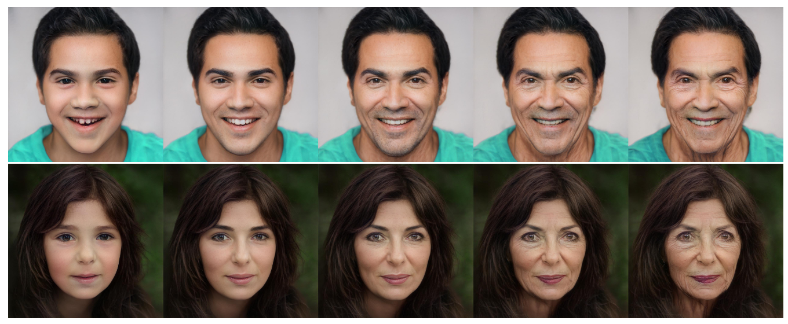

# Face Aging

von *Felix Rösch, Julian Steiner*

## Abstract

Bei Face Aging handelt es sich um die technische Möglichkeit Gesichter von Menschen digital altern zu lassen. Wichtig hierbei ist, dass das zukünftige Aussehen mit natürlichen Alterungseffekten vorhergesagt werden und gleichzeitig die persönlichen Merkmale erhalten bleiben. Neuentwickelte Generative Adversarial Networks (GANs) in verschiedenen Formen erzielten eine bessere Vorhersage der Alterung als herkömmliche Methoden. 

In diesen Report gehen wir auf den aktuellen Stand der Forschung, die Methoden und potentielle Anwendungen ein. Zusätzlich zu dieser schriftlichen Ausarbeitung wurde ein Fachvortrag und eine Code-Präsentation erarbeitet.

Im Fachvortrag gehen wir detaillierter auf das Paper ["PFA-GAN: Progressive Face Aging With Generative Adversarial Network"][1] und dessen Generative Adversarial Network zum Thema Face Aging ein. Die Code-Demonstration greift diesen Vortrag auf und implementiert das neuronale Netz in einem Jupyter Notebook.

## Einleitung / Motivation

!!! info "Definition"

    Gesichtsalterung (Face Aging), auch bekannt als Alterssynthese (Age Synthesis) und Altersprogression (Age Progression), wird als ästhetische Darstellung eines Gesichtsbildes mit natürlichen Alterungs- und Verjüngungseffekten auf das einzelne Gesicht definiert.


    *[Fu Y, Guo G, Huang TS][2]*

Anwendung finden diese Methoden zum Beispiel in den Bereichen der Unterhaltung, sozialer Sicherheit, altersübergreifenden Gesichtserkennung, Forensik und Medizin.

Mögliche Anwendungsbeispiele sind zum einen Applikationen, die das Gesicht einer Person mit einem bestimmten Lebensstil vorhersagen. Solche Anwendungen können zum Beispiel dazu genutzt werden, um Personen mit einen übermäßigen Alkohol- und Nikotinkonsum die Auswirkungen aufzuzeigen um damit den Konsum zu verringern. Des Weiteren können solche Technologien helfen den Menschenhandel zu bekämpfen und Familien wieder zusammenführen, denn das menschliche Gesicht durchläuft von der Kindheit bis zum Erwachsenenalter eine deutliche körperliche Veränderung. Deswegen ist es zehn bis 15 Jahre nach der Entführung schwierig, ein verlorenes Kind wiederzuerkennen.

Die traditionellen Alterungsmethoden basieren meist auf der mechanischen Modellierung von Falten, Haaren, Textur und Gesichtsausdruck oder nutzen viele Daten, um Prototypen als Altersmuster zu konstruieren. Neue Deep Learning Methoden erzielten große Erfolge bei dem Thema Face Aging. Durch das Training zum Erlernen spezifischer Altersmuster und Zuordnungen zwischen Eingabegesichtern und Zielaltersbezeichnungen können Deep-Learning-Methoden Gesichter einer bestimmten Altersgruppe direkt generieren. Grob können die verschiedenen Methoden in drei Kategorien eingeteilt werden:

1. Physikalische modellbasierte Methoden
2. Prototypbasierte Methoden
3. Deep Generative Networks (Tiefe generative Netzwerke)

Obwohl sich mit Deep-Learning-Methoden die Altersmuster leicht erlernen lassen, können sie in der gewünschten Altersgruppe keine zufriedenstellenden Ergebnisse erzielen. Die altersgruppenbasierte Synthese teilt den Langzeitverlauf in mehrere unabhängige Gruppen auf und fügt Identitätserhaltung zwischen Eingabe und Ausgabe hinzu. Jedoch werden die fortschreitende Änderung des Altersmuster und Identitätserhaltung zwischen den synthetisierten Bildern ignoriert. Um diese Probleme zu lösen wurden verschiedene Arten von Deep-Learning-Methoden entwickelt.

In den folgenden Kapiteln werden wir die Herausforderungen bei der Erstellung der Datensätze und der Entwicklung solcher neuronalen Netzwerke in ihren verschiedenen Methoden genauer beleuchten.

## Stand der Forschung

### Datensätze

In diesem Abschnitt wollen wir die wichtigsten aktuell verfügbaren und verwendeten Datensätze für das Thema Face Aging vorstellen. Diese Datensätze wurden hauptsächlich in den Papern verwendet, die im Kapitel Methoden genauer vorgestellt werden. Bei MORPH und CACD handelt es sich dabei um die meistverwendeten Datensätze.

#### MORPH

Im Jahr 2006 gab es nur drei öffentlich zugängliche, bekannte Datenbanken, die Doppelbilder einer Person in verschiedenen Altersstufen enthielten. [MORPH][21], [FERET][22] und [FG-NET][23].

MORPH war zu diesem Zeitpunkt die einzige dieser drei Datenbanken, die die ethnische Zugehörigkeit, die Größe, das Gewicht und das Geschlecht der Probanden erfasste. Diese Eigenschaften sind für das Verständnis der Veränderung des Aussehens des menschlichen Gesichts im Alter von entscheidender Bedeutung. Zusätzlich beinhaltete diese Datenbank den größten Satz öffentlich verfügbarer Bilder von Personen über einen längeren Zeitraum, von einigen Monaten bis zu einer Zeitspanne von mehreren Jahrzehnten. Bei den damaligen Methoden war diese Eigenschaft Voraussetzung für die Erstellung eines erfolgreichen Modells.

Seitdem wird der Datensatz ständig weiterentwickelt. Aktuell gibt es den Datensatz der University of North Carolina Wilmington in drei unterschiedliche Varianten: Dem MORPH Commercial Set, MORPH Academic Set und die MORPH Longitudinal Database. Um den Datensatz zu erhalten, muss die Universität persönlich kontaktiert werden. Anschließend wird eine Lizenz ausgestellt und Zugriff auf die Daten gewährt. Weitere Informationen finden Sie auf dieser [Website](https://uncw.edu/myuncw/research/innovation-commercialization/technology-portfolio/morph).

<figure markdown>
  { width="800" }
  <figcaption>Beispiel Bilder MORPH Datensatz</figcaption>
</figure>

#### Cross-Age Celebrity Dataset (CACD)

Der [CACD][24] Datensatz beinhaltet über 160.000 Bilder von über 2.000 berühmten Persönlichkeiten. Diese Bilder stammen aus dem Internet und wurden automatisch über Suchmaschinen gesammelt und gespeichert. Dabei dienten die Namen der Personen und das Jahr (2004-2013) als Schlüsselwörter. Das Alter einer Person wurde bestimmt, indem das Geburtsjahr der Person von dem Jahr subtrahiert wurde, indem das Foto aufgenommen wurde. Zusätzliche zu den Bildern gibt es einen Metadatensatz im MATLAB-Format, welcher wichtige Informationen zu den Bildern beinhaltet. Hierbei handelt es sich z.B. um den Namen und das Alter der Person. 

<figure markdown>
  { width="600" }
  <figcaption>Beispiel Bilder CACD Datensatz</figcaption>
</figure>

Der Datensatz und die Metadaten können auf der [Homepage][24] heruntergeladen werden.

#### FG-NET

Eingeführt wurde der Datensatz FG-NET mit dem Paper [Toward automatic simulation of aging effects on face images][25]. Insgesamt beinhaltet er über 1.000 Bilder von 82 Personen. Es wird beim Alter eine Spanne von 0 bis 69 Jahren und ein Altersunterschied von bis zu 45 Jahren abgedeckt. Der Datensatz auf dieser [Webseite][23] verfügbar.

#### IMDB-WIKI

Im [IMDB-WIKI][26] Datensatz wurden eine große Sammlung von Bildern und Metadten von Berühmtheiten zusammengestellt. Hier sammelten die Ersteller automatisch das Geburtsdatum, den Namen, das Geschlecht und alle Bilder der 100.000 beliebtesten Schauspieler auf der IMDb-Website. Zusätzlich wurden zu diesen Personen alle Profilbilder von Personenseiten aus Wikipedia mit denselben Metadaten automatische gesammelt. Entfernt wurden die Bilder, die keinen Zeitstempel hatten. Das reale Alter der Person auf einem Bild wurde durch das Geburtsdatum und den Zeitstempel des Bildes errechnet. Der Datensatz beinhaltet über 460.000 Gesichtsbilder von mehr als 20.000 Prominenten aus IMDb und mehr als 62.000 Bilder aus Wikipedia. Insgesamt umfasst er über 520.000 Bilder.

<figure markdown>
  { width="600" }
  <figcaption>Beispiel Bilder IMDB-WIKI Datensatz</figcaption>
</figure>

Auf der [Webseite][26] des Datensatzes können die Bilder und Metadaten in verschiedensten Varianten heruntergeladen werden. Auch bereits vortrainierte Gewichte zu implementierten Modellen sind hier zu finden.

### Generative Adversarial Networks (GANS)

Mit der folgenden Abbildung wollen wir die Entwicklung der GAN-Methoden darstellen, die wir für dieses Projekt betrachtet haben. Die Zeitreihe stellt die jeweiligen Paper mit dem Jahr der Veröffentlich dar.

<figure markdown>
  { width="600" }
  <figcaption>Entwicklung GAN Methoden</figcaption>
</figure>

## Methoden

### Physikalische modellbasierte Methoden

Physikalische, modellbasierte Methoden befassen sich mit dem Entwurf eines komplexen Modells zur Nachahmung des Gesichtsaussehens und zur Simulation von Alterungsmechanismen in Bezug auf Haare, Muskeln und Haut bei Erwachsenen und mit der Anwendung spezifischer Transformationen auf eine Reihe von Orientierungspunkten oder statistischer Parameter zur Modellierung altersbedingter Formveränderungen bei Kindern. Für diese Methode muss jedoch ein parametrisches Modell erstellt werden, und es werden viele Gesichter derselben Identitäten in verschiedenen Altersstufen benötigt, was rechenintensiv und schwer zu erfassen ist.

### Prototypbasierte Methoden

Die prototypenbasierten Methoden verwenden ein nichtparametrisches Modell. Die Gesichter sollten zunächst in Gruppen nach verschiedenen Altersgruppen eingeteilt werden. Das durchschnittliche Gesicht jeder Altersgruppe wird als Prototyp und Altersmuster einer bestimmten Altersgruppe bezeichnet. Im Paper [Personalized Age Progression with Aging Dictionary][12] hat das Autorenteam eine auf Wörterbüchern basierende Alterssynthesemethode vorgeschlagen. [Yang et al.][13] haben mit Hilfe der Hidden Factor Analysis eine gemeinsame spärliche Darstellung eingeführt. Diese vorgeschlagenen Alterungsmethoden modellieren getrennt die stabilen personenabhängigen Eigenschaften über einen relativ langen Zeitraum und die altersabhängigen Informationen, die sich im Laufe der Zeit allmählich ändern. Da das Altersmuster jedoch aus dem Durchschnittsgesicht gewonnen wird, tendieren prototypbasierte Methoden dazu die identitätsgebenden Merkmale eines speziellen Gesichtes zu verlieren.

### Deep Generative Networks

Die beiden obengenannten Ansätze erfordern jedoch häufig die Erstellung von Alterungssequenzen derselben Person mit einem breiten Altersspektrum, deren Erfassung sehr schwierig und kostspielig ist. Generative Adversarial Networks (GANs) benötigen keine gepaarten Bilder von Gesichtern und erzielen dabei eine bessere Alterungsleistung als diese Methoden.

Bei den nachfolgend vorgestellten Methoden gehen wir ganz grob auf das jeweilige Paper ein. Diese wurden verlinkt und sind auch in der Literaturliste zu finden.

#### Generative Adversarial Networks (GANs)

Generative Adversarial Networks sind tiefe neuronale Netzwerke. Sie nutzen unbeaufsichtigtes maschinelles Lernen um Daten zu generieren. Eingeführt wurden solche Netze 2014 in einem [Paper][3] von Ian Goodfellow, Yoshua Bengio, and Aaron Courville.

Ein solches neuronales Netzwerk besteht aus zwei weiteren Netzwerken. Einem Generator Netzwerk und einem Discriminator Netzwerk. Durch mehrere Zyklen von Generierung und Diskriminierung neuer Inhalte trainieren sich beide Netzwerke gegenseitig und versuchen gleichzeitig, sich gegenseitig zu überlisten. Das Ziel solcher Netze ist es, Datenpunkte zu generieren, die einigen Datenpunkten im Trainingssatz so stark ähneln, dass sie vom Discriminator Netz nicht mehr als KI-generiert erkannt werden.

##### PyTorch Example

In diesem kurzen Code-Beispiel wollen wir eine einfache Implementierung eines Generative Adversarial Networks mit dem PyTorch-Framework zeigen. Den kompletten Code inklusive dem Laden der Daten und dem Trainieren findet ihr in der [GIT Repository](https://github.com/julian-steiner-ai/face-aging) unter dem Kapitel `01_GAN`. 

!!! Note

    Wichtig ist hier noch zu nennen, dass diese Implementierung noch nicht den Aspekt Face Aging berücksichtigt. Mit diesem GAN können nur Gesichter anhand des Trainingdatensatzes generiert werden. Ohne Bedingungen etc.

Wir starten mit der Implementierung der Generator-Netzwerks. Hierbei erben wir von der `nn.Module` Klasse. Dies ist die Basisklasse für alle neuronalen Netzwerke in PyTorch. 

In der `_init_network` Methode definieren wir die einzelnen Schichten des jeweiligen neuronalen Netzwerks. Hierzu fügen wir die einzelnen Klassen der Liste mit dem Namen `layer` hinzu. Anschließend übergeben wir diese an einen `Sequential`-Container. Dieser ermöglicht einen einfachen Aufruf der `forward()`-Methode, da dieser die Ausgaben einer Schicht mit den Eingaben des nachfolgenden Moduls automatisch miteinander "verkettet". Schließlich wird die Ausgabe des letzten Moduls zurückgegeben. 

```python
class Generator(nn.Module):
    """
    Generator.
    """
    def __init__(self, z_dim, n_feature_maps, n_channels):
        super(Generator, self).__init__()

        self.z_dim = z_dim
        self.n_feature_maps = n_feature_maps
        self.n_channels = n_channels

        self._init_network()

    def _init_network(self):
        layer = []

        # input is Z, going into a convolution
        layer.append(nn.ConvTranspose2d(
            in_channels=self.z_dim,
            out_channels=self.n_feature_maps * 8,
            kernel_size=4,
            stride=1,
            padding=0,
            bias=False
        ))

        layer.append(nn.BatchNorm2d(self.n_feature_maps * 8))
        layer.append(nn.ReLU(True))

        # state size. ``(ngf*8) x 4 x 4``
        layer.append(nn.ConvTranspose2d(
            in_channels=self.n_feature_maps * 8,
            out_channels=self.n_feature_maps * 4,
            kernel_size=4,
            stride=2,
            padding=1,
            bias=False
        ))

        layer.append(nn.BatchNorm2d(self.n_feature_maps * 4))
        layer.append(nn.ReLU(True))

        # state size. ``(ngf*4) x 8 x 8``
        layer.append(nn.ConvTranspose2d(
            in_channels=self.n_feature_maps * 4,
            out_channels=self.n_feature_maps * 2,
            kernel_size=4,
            stride=2,
            padding=1,
            bias=False
        ))

        layer.append(nn.BatchNorm2d(self.n_feature_maps * 2))
        layer.append(nn.ReLU(True))

        # state size. ``(ngf*2) x 16 x 16``
        layer.append(nn.ConvTranspose2d(
            in_channels=self.n_feature_maps * 2,
            out_channels=self.n_feature_maps,
            kernel_size=4,
            stride=2,
            padding=1,
            bias=False
        ))

        layer.append(nn.BatchNorm2d(self.n_feature_maps))
        layer.append(nn.ReLU(True))

        # state size. ``(ngf) x 32 x 32``
        layer.append(nn.ConvTranspose2d(
            in_channels=self.n_feature_maps,
            out_channels=self.n_channels,
            kernel_size=4,
            stride=2,
            padding=1,
            bias=False
        ))

        layer.append(nn.Tanh())

        self.main = nn.Sequential(*layer)

    def forward(self, x):
        """
        Forward operation for the generator network.
        """
        return self.main(x)
```

Mit der nächsten Klasse implementieren wir das Diskriminator-Netzwerk. Das vorgehen ist identisch mit dem des Generator-Netzwerks von oben.

```python
class Discriminator(nn.Module):
    """
    Discriminator.
    """
    def __init__(self, n_channels, n_feature_maps):
        super(Discriminator, self).__init__()

        self.n_channels = n_channels
        self.n_feature_maps = n_feature_maps

        self._init_network()

    def _init_network(self):
        layers = []

        # input is ``(nc) x 64 x 64``
        layers.append(nn.Conv2d(
            self.n_channels,
            self.n_feature_maps,
            4,
            2,
            1,
            bias=False
        ))

        layers.append(nn.LeakyReLU(0.2, inplace=True))

        # state size. ``(ndf) x 32 x 32``
        layers.append(nn.Conv2d(
            self.n_feature_maps,
            self.n_feature_maps * 2,
            4,
            2,
            1,
            bias=False
        ))
        layers.append(nn.BatchNorm2d(self.n_feature_maps * 2))
        layers.append(nn.LeakyReLU(0.2, inplace=True))

        # state size. ``(ndf*2) x 16 x 16``
        layers.append(nn.Conv2d(
            self.n_feature_maps * 2,
            self.n_feature_maps * 4,
            4,
            2,
            1,
            bias=False
        ))
        layers.append(nn.BatchNorm2d(self.n_feature_maps * 4))
        layers.append(nn.LeakyReLU(0.2, inplace=True))

        # state size. ``(ndf*4) x 8 x 8``
        layers.append(nn.Conv2d(
            self.n_feature_maps * 4,
            self.n_feature_maps * 8,
            4,
            2,
            1,
            bias=False
        ))
        layers.append(nn.BatchNorm2d(self.n_feature_maps * 8))
        layers.append(nn.LeakyReLU(0.2, inplace=True))

        # state size. ``(ndf*8) x 4 x 4``
        layers.append(nn.Conv2d(
            self.n_feature_maps * 8,
            1,
            4,
            1,
            0,
            bias=False
        ))
        layers.append(nn.Sigmoid())

        self.main = nn.Sequential(*layers)

    def forward(self, x):
        """
        Forward Operation.
        """
        return self.main(x)
```

##### Fazit

Verschiedene Varianten der GAN-basierten Methode können im Bereich Face Aging die plausibelsten und realistischsten Bilder erzeugen, die aufgrund des Alters nur schwer von echten Daten zu unterscheiden sind. Allerdings nutzen sie die sequentiellen Daten nicht vollständig aus. Diese Methoden können die Übergangsmuster, die als Korrelationen der Gesichtsmerkmale zwischen verschiedenen Altersgruppen für eine Person definiert sind, nicht explizit berücksichtigen. Daher sind ihre Ergebnisse meist nicht in der Lage, die Gesichtsidentität beizubehalten oder die Übergangsregeln zwischen verschiedenen Altersgruppen zu berücksichtigen.

Um diese Probleme zu lösen und den Alterungsprozess von Personen mit Hilfe von GANs noch detaillierter und realistischer darzustellen, wurden verschiedene Variationen von diesen Netzwerken entwickelt.

#### Conditional Generative Adversiral Networks

Ebenfalls im Jahr 2014 führten die Autoren Mehdi Mirza und Simon Osindero das [Conditional Generative Adversarial Network][28] ein. Bei einem nicht-konditionierten GAN gibt es keine Kontrolle über die Modi der erzeugten Daten. Durch die Konditionierung des Modells auf zusätzliche Informationen ist es jedoch möglich, den Datengenerierungsprozess zu steuern. Eine solche Konditionierung könnte auf Klassenlabels, auf einem Teil der Daten für Inpainting oder sogar auf Daten aus verschiedenen Modalitäten basieren. 

GANs können zu einem konditionalen Modell (conditional GAN) erweitert werden, wenn sowohl der Generator als auch der Diskriminator durch eine zusätzliche Information konditioniert werden. Die Konditionierung kann durchgeführt werden, indem die Information sowohl in den Diskriminator als auch in den Generator als zusätzliche Eingabeschicht eingespeist wird.

<figure markdown>
  { width="400" }
  <figcaption>Conditional Adversarial Net</figcaption>
</figure>

Die Ergebnisse des Papers demonstrierten das Potenzial von solchen Netzwerken.  

#### Face Aging with Conditional Generative Adversarial Networks

Auch mit dem nächsten Paper - ["Face Aging with Conditional Generative Adversarial Networks"][5] -, aus dem Jahr 2017, wurde versucht, die Probleme mit dem Verlust der Identität der ursprünglichen Person in modifizierten Bildern zu minimieren. Daher konzentriert sich diese Studie auf die identitätserhaltende Gesichtsalterung. Dafür entwickelten die Autoren das Age-cGAN (Age Conditional Generative Adversarial Network). Es sollte das erste GAN sein, das qualitativ hochwertige synthetische Bilder innerhalb der geforderten Alterskategorien erzeugt. Zusätzlich schlug das Team einen neuartigen Ansatz zur Optimierung latenter Vektoren vor, der es Age-cGAN ermöglichte, ein eingegebenes Gesichtsbild zu rekonstruieren, ohne die Identität der ursprünglichen Person zu verändern.

Ein Conditional GAN (cGAN) erweitert das GAN-Modell und ermöglicht die Erzeugung von Bildern mit bestimmten Bedingungen (Attributen). Diese Bedingungen können jede beliebige Information beinhalten, die sich auf das Zielgesichtsbild bezieht. Zum Beispiel Beleuchtungsniveau, Gesichtshaltung oder Gesichtsattribute. Die bedingte Information wird dabei in den Eingang des Generators und in die erste Faltungsschicht (Convolution Layer) von dem Discriminator Netzwerk injiziert.

Conditional GANs verfügen herkömmlicherweise nicht über einen expliziten Mechanismus zur inversen Abbildung eines Eingangsbildes $x$ mit Attributen $y$ auf einen latenten Vektor $z$, der für die Bildrekonstruktion notwendig ist. Die Autoren umgehen dieses Problem, indem ein Encoder $E$ trainiert wird. Bei diesen handelt es sich um ein neuronales Netz, das die inverse Abbildung annähert. Dieser erzeugt anfängliche latente Approximationen, die gut genug sind, um als Initalisierungen für den Optimierungsalgorithmus zu dienen. Das Team nutzt einen neuartigen "identitätserhaltenden Ansatz" (Identity-Preserving) zur Optimierung latenter Vektoren. Hierbei lautet der Grundgedanke folgendermaßen: Bei einem neuronalen Netz zur Gesichtserkennung (Face Recognition), das in der Lage ist, die Identität einer Person in einem eingegebenen Gesichtsbild zu erkennen, kann der Unterschied zwischen den Identiäten in den ursprünglichen und rekonstruiertern Bildern als euklidischer Abstand zwischen den entsprechenenden Einbettungen ausgedrückt werden. Daher sollte die Minimierung dieses Abstands die Erhaltung der Identität im rekonstruierten Bild verbessern.

<figure markdown>
  { width="800" }
  <figcaption>Verwendete Methode. (a) Approximative Gesichtsrekonstruktion mit Age-cGAN (b) Wechseln der Altersbedingung am Eingang des Generators G, um die Gesichtsalterung durchzuführen.</figcaption>
</figure>

In der folgenden Abbildung werden Beispiele für die Rekonstruktion und Alterung von Gesichtern dargestellt. 

- (a) Zeigt die originalen Testbilder
- (b) Zeigt die rekonstruierten Bilder
- (c) Zeigt die rekonstruierten Bilder, die inklusive den "pixelweisen" und "identitätserhaltenden" Methoden generiert wurden
- (d) Zeigt die rekonstruierten Bilder, die unter Verwendung der identitätserhaltenden Approximationen und konditioniert auf die jeweilige Alterskategorie (eine pro Spalte) generiert wurden

<figure markdown>
  { width="800" }
  <figcaption>Beispiele von generierten Bildern druch das Age-c-GAN</figcaption>
</figure>

Die Autoren kamen zu dem Schluss, dass die Gesichtsrekonstruktion mit ihrer Methode weiter verbessert werden kann, indem "pixelweise" (pixelwise) und "identitätserhaltende" (Identity-Preserving) Ansätze in einem Optimizerungsziel kombiniert werden.

#### Face Aging with Contextual Generative Adversarial Networks

Im Jahr 2018 veröffentlichten eine Autorengruppe um Liu et. al. ein Paper mit dem Titel ["Face Aging with Contextual Generative Adversarial Nets"][4]. Im Gegensatz zu traditionellen GANs, die nur die reale Datenverteilung jedes einzelnen Alters modellieren, konzentrierte sich das Team auf die altersübergreifenden Korrelationen höherer Ordnung, die die Ergebnisse der Gesichtsalterung attraktiver machen sollten. Um dies zu realisieren, schlugen die Autoren die Umsetzung der Gesichtsalterung mittels eines "Contextual Generative Adversarial Networks (C-GANs)" vor.

<figure markdown>
  { width="400" }
  <figcaption>Vorgeschlagener C-GANs-Algorithmus für die Gesichtsalterung.</figcaption>
</figure>

Conextual-GANs bestehen aus drei neuronalen Netzwerken. Um sicherzustellen, dass die erzeugten Bilder echt wirken, werden zwei diskriminierende Netzwerke verwendet, um die Verteilung jeder einzelnen Altersgruppe sowie die Übergangspaare von zwei benachbarten Gruppen zu modellieren. Das altersdiskriminierende Netz (Age Discriminative Network) hilft bei der Erzeugung von Bildern, die von den echten nicht zu unterscheiden sind. Das bedingte Transformationsnetzwerk (Conditional Transformation Network) transformiert das Gesicht der Eingabe in das gewünschte Alter. Das diskriminierende Netz für Übergangsmuster (Transition Pattern Discriminative Network) reguliert die erzeugten Bilder, damit sie den den Alterungsregeln entsprechen.

<figure markdown>
  { width="400" }
  <figcaption>Struktur des vorgeschlagenen C-GANs.</figcaption>
</figure>

In der nächsten Abbildung werden die generierten Gesichter qualitativ verglichen mit der Grundwahrheit dargestellt. In jedem Triplett sind das erste und dritte Bild die Grundwahrheiten, jeweils in Altersgruppe 1 und Altersgruppe 2, während das zweite Bild das generierte Alterungsergebnis ist.

<figure markdown>
  { width="800" }
  <figcaption>Ergebnisse Contextual GANs</figcaption>
</figure>

#### Face Aging With Identity-Preserved Conditional Generative Adversarial Networks

In diesem [Paper][7], welches 2018 veröffentlicht wurde, schlug das Autorenteam ein Identity-Preserved Conditional Generative Adversarial Network (IPCGAN) - zu Deutsch: identitätserhaltendes bedingtes generatives adversariales Netzwerk - für die Gesichtsalterung vor. Dieses besteht aus drei Modulen. Einem Conditional Generative Adversarial Network (CGAN), einem identitätserhaltenden (Identity-Preserved) Modul und einem Altersklassifikator.

Als Eingabe für den Generator im IPCGAN wird ein Eingabebild und eine Zielaltersklasse verwendet. Es wird versucht ein Gesicht mit dem Alter in der Zielaltersklasse zu erzeugen. Das generierte Gesicht soll sich nicht von realen Gesichtern in der Zielaltersgruppe unterscheiden. Um die Identitätsinformationen zu erhalten, wird ein Wahrnehmungsverlust (Perceptual Loss) eingeführt und um zu garantieren, dass die synthetisierten Gesichter in die Zielaltersgruppe fallen, werden die erzeugten gealterten Gesichter an einen vortrainiertern Alterklassifikator übergeben und ein Altersklassifikationsverlust hinzugefügt.   

<figure markdown>
  { width="600" }
  <figcaption>Struktur des vorgeschlagenen IPCGAN.</figcaption>
</figure>

Das folgende Bild zeigt ein generiertes Beispielbild des IPCGAN Ansatzes.

<figure markdown>
  { width="600" }
  <figcaption>Generiertes Beispiel des IPCGAN</figcaption>
</figure>

#### Learning Face Age Progression: A Pyramid Architecture of GANs

2019 veröffentlichten die Autoren Yang et. al. ein Paper mit dem Titel ["Learning Face Age Progression: A Pyramid Architecture of GANs"][8], in dem ein neuartiger Ansatz zur Alterung von Gesichtern vorgeschlagen wurde. Hierbei werden die Vorteile von Generative Adversarial Networks (GAN) bei  der Synthese visuell plausibler Bilder mit Vorwissen über die menschliche Alterung verbunden. Die Autoren versprechen, dass ihr Modell im Vergleich zu bestehenden Methoden in der Literatur besser in der Lage ist, die beiden kritischen Anforderungen bei der Altersentwicklung zu erfüllen, d.h. Identitätsbeständigkeit und Alterungsgenauigkeit.

In dieser Methode nimmt der Convolutional Neural Network (CNN) basierte Generator junge Gesichter als Input und lernt eine Zuordnung zu einem Bereich, der älteren Gesichtern entspricht. Um Alterungseffekte zu erzielen und gleichzeitig personenspezifische Informationen beizubehalten, wird ein zusammengesetzter Loss verwendet.

<figure markdown>
  { width="600" }
  <figcaption>Framework der vorgeschlagenen Methode der Altersprogression.</figcaption>
</figure>

Beispiele für die Ergebnisse der Altersentwicklung sind in der nächsten Abbildung zu sehen. Es werden visuell plausible und überzeugende Alterungseffekte erzielt, obwohl die Beispiele eine breite Palette von Personen in Bezug auf Ethnie, Geschlecht, Pose, Make-up und Ausdruck abdecken.

<figure markdown>
  { width="800" }
  <figcaption>Alterungseffekte, die für die CACD (die ersten beiden Zeilen) und MORPH (die letzten beiden Zeilen) Datensätze für 12 verschiedene Personen generiert wurden.</figcaption>
</figure>

#### Triple-GAN: Progressive Face Aging with Triple Translation Loss

Mit dem Triple-GAN aus dem Jahr 2020 wollten die Autoren die Probleme bei der Gesichtsalterung mittels Deep-Learning-Methoden lösen. Konkret wollten sie die nicht zufriedenstellenden Ergebnisse in der gewünschten Altersgruppe, die Ignorierung der fortschreitenden Veränderung der Altersmuster und die Identitätserhalutng im synthetisierten Bild lösen. Dazu erforschten sie, wie man verschiedene Altersmuster gleichzeitig übersetzen kann, um mehrere Trainingsphasen für kontradiktorisches Lernen zu erhalten. Das Discriminator-Netzwerk wurde so angepasst, dass es nicht nur auf der Ebene von echt und falsch unterscheidet, sondern auch effiziente Zuordnungen zwischen Mustern und Bezeichnungen erstellt, indem verschiedene Altersmuster gemeinsam erlernt wurden. Um die Altersbeziehungen zwischen den verschiedenen Altersgruppen zu modellieren, wurde die Leistung des Generators verbessert und zusätzlich eine dreifache Überstzung (Triple-Translation) hinzugefügt. Diese hilft dabei, das synthetisierte Gesicht eines bestimmten Alters in ein anderes Alter zu übersetzern. 

<figure markdown>
  { width="400" }
  <figcaption>Pipeline für die dreifache Überstzung (Triple Translation)</figcaption>
</figure>

Durch die Verwendung eines dreifachen Übersetzungsverlust (Triple Translation Loss) werden verschiedene synthetisierte Gesichter der gleichen Zielaltersgruppe gezwungen, hohe Ähnlichkeit aufzuweisen. So kann die Übersetzung von Altersmustern korreliert werden, um progressive und kontinuierliche Veränderungen in der Gesichtsalterung besser zu simulieren.

Das Framework der Autoren beinhaltet vier Komponenten:

1. Generator Netzwerk
2. Pre-Trained Identity-Preserved Netzwerk
3. Pre-Trained Age Classification Netzwerk
4. Discriminator Netzwerk

<figure markdown>
  { width="400" }
  <figcaption>Framework des vorgeschlagenen Triple-GAN für Gesichtsalterung</figcaption>
</figure>

Die Ergebnisse des Triple-GANs in der folgenden Abbildung zeigen, dass die generiertern Bilder einen offensichtlichen Alterungseffekt und eine gut erhaltene Identität vorweisen können.

<figure markdown>
  { width="800" }
  <figcaption>Ergebnisse Triple-GAN</figcaption>
</figure>

#### Only a Matter of Style: Age Transformation Using a Style-Based Regression Model

Mit dem Paper [Only a Matter of Style: Age Transformation Using a Style-Based Regression Model][9] stellten die Autoren eine Implementierung namens SAM -Style-based Age Manipulation - vor. Hierbei versuchten sie die gewünschte Altersveränderung zu erfassen und gleichzeitig die Identität zu bewahren. Die Gesichtsalterung wurde dabei durch eine Bild-zu-Bild Übersetzung (Image-to-Image Translation) versucht gelöst zu werden. Zu dieser Technik gehören auch die Conditional GANs, die wir weiter oben bereits erwähnt haben. In der Forschungsarbeit wird ein vortrainierter (pre-trained) StyleGAN-Generator mit einer Encoder-Architektur kombiniert. Der Encoder hat die Aufgabe, ein Gesichtsbild als Eingabe direkt in eine Reihe von Stilvektoren zu kodieren, die der gewünschten Altersveränderung unterliegen. Diese Vektoren werden anschließend an StyleGAN übergeben, um das Ausgangsbild zu erzeugen, das die gewünschte Altersveränderung darstellt. Der Encoder wird bei der Generierung durch ein vortrainiertes Alterregressionsnetzwerk während des Trainingsprozesses als zusätzliche Einschränkung angeleitet. SAM betrachtet die menschliche Alterung also als ein Regressionsproblem auf das gewünschte Zielalter hin.

<figure markdown>
  { width="600" }
  <figcaption>Architektur des SAM Netzwerks</figcaption>
</figure>

<figure markdown>
  { width="600" }
  <figcaption>Mit SAM erzeugte Alterungsergebnisse</figcaption>
</figure>

Die Ergebnisse dieser Methode werden durch die Style-Repräsentation bestimmt. D.h. sie ist auf Bilder beschränkt, die genau in den latenten Raum von StyleGAN eingebettet werden können. Die Modellierung von Gesichtern, die außerhalb des StyleGAN-Bereichs liegen, kann daher eine Herausforderung darstellen. Ebenso kann es durch die Einbettung eines Bildes in eine Reihe von Vektoren schwieriger werden, die Eingangsmerkmale wie den Bildhintergrund originalgetreu zu erhalten. In den Evaluierungen wurde gezeigt, dass die vorgeschlagene Methode das Alter und andere Merkmale wie Haarfarbe und Frisur erfolgreich voneinander trennt. Allerdings ändern sich solche Attribute natürlich mit dem Alter. Um diese Veränderungen zu modellieren, wurden daher zwei Bearbeitungstechniken zur Kontrolle globaler Veränderungen (z. B. Haarfarbe) und lokaler Veränderungen (z. B. das Vorhandensein von Brillen und Gesichtsbehaarung) vorgeschlagen. Die Erfassung komplexerer Veränderungen, wie z. B. zurückweichende Haarlinien und Veränderungen der Hautfarbe, ist mit diesert Methode aber nach wie vor eine Herausforderung.

#### PFA-GAN: Progressive Face Aging With Generative Adversarial Network

Die Autoren von diesem [Paper][1] nutzen die Tatsache, dass Gesichter im Laufe der Zeit fortlaufend altern und modellieren den Alterungsprozess im Gesicht daher in einer progressiven Weise mit ihrem neuen progressive Face-Aging-Framework, das auf einem GAN basiert (Progressive Face Aging with Generative Adversarial Network - PFA-GAN). Dieses besteht aus mehreren kleinen Generator-Subnetzwerken, die sich jeweils nur  mit spezifischen Alterungseffekten zwischen zwei angrenzenden Altersgruppen befassen. Der Hauptunterschied zu anderen GAN-basierten Methoden besteht darin, dass das PFA-GAN die Subnetze gleichzeitig trainiert. Frühere GAN-Varianten trainierten verschiedene Netzwerke unabhängig voneinander. 

Die Autoren heben dabei die Bedeutung der folgenden vier Aspekte für eine progressive Modellierung der Gesichtsalterung hervor:

1. Konzentration auf die Modellierung von Gesichtsalterungseffekten zwischen zwei angrenzenden Altersgruppen
2. Fortlaufende Alterungsergebnisse durch das durchgängige Trainieren der progressiven Gesichtsalterung
3. Verbesserung der Alterungsglätte durch eine ordinale Beziehung zwischen den Altersgruppen
4. Die Leistung der Cross-Age-Verifizierung kann verbessert werden

Die folgende Abbildung zeigt, dass das $i$-te Teilnetzwerk $G_i$ dazu dient, Gesichter von der Altersgruppe $i$ zur Gruppe $i + 1$ zu altern.

<figure markdown>
  { width="800" }
  <figcaption>Der vorgeschlagene PFA-GAN für die Gesichtsalterung mit 4 Altersgruppen</figcaption>
</figure>

Der progressive Alterungsrahmen von der Ausgangsaltersgruppe bis zur Zielaltersgruppe $t$ lässt sich wie folgt formulieren:

$$X_t = \overline{G}_{t-1} \circ \overline{G}_{t-2} \circ \dots \circ \overline{G}_{s}(X_s)$$

In den Generator-Netzwerken werden zusätzlich [Residual-Skip-Verbindung][32] genutzt. Diese verhindern, dass die exakte Kopie des Gesichtes des Eingabebilds über mehrere Subnetze hinweg gespeichert wird. Durch die Einführung der Skip-Verbindung kann die Zielaltersgruppe leicht in eine Sequenz von binären Gattern umgewandelt werden, die den Alterungsfluss steuern. 

Die Veränderungen von der Altersgruppe $i$ zu $i + 1$ lässt sich mathematisch wie folgt beschreiben:

$$ X_{t+1} = \overline{G}_{i}(X_i) = X_i + \lambda_i G_i (X_i) $$

Somit besteht ein Generator-Subnetzwerk aus einer Resudial-Skip-Verbindung, einem binären Gatter und dem Netzwerk an sich. Bei $\lambda_i \in \{0,1\}$ handelt es sich um das binäre Gatter, welches kontrolliert ob das Subnetzwerke $G_i$ in den Alterungsprozess zum jeweiligen Zielalter mit einbezogen wird.

Mit dem vorgeschlagenen Framework lässt sich die Altersprogression, z.B. von der Altersgruppe 1 bis 4 wie in der obigen Abbildung dargestellt, wie folgt ausdrücken:


$$
\begin{equation}
X_4 = X_3 + \underbrace{\lambda_3 G_3(X_3)}_\text{Alterseffekte Gruppe 3 bis 4} \\
= X_2 + \underbrace{\lambda_2 G_2(X_2) + \lambda_3 G_3(X_3)}_\text{Alterseffekte Gruppe 2 bis 4}
\end{equation} \\
= X_1 + \underbrace{\lambda_1 G_1(X_1) + \lambda_2 G_2(X_2) + \lambda_3 G_3(X_3)}_\text{Alterseffekte Gruppe 1 bis 4}
$$

Wenn jetzt die Alterung von Gruppe 2 nach Gruppe vorhergesagt werden soll, so reduziert sich die obige Gleichung auf $X_3 = X_2 + G_2(X_2)$. Der Vektor für $\lambda$ für diese Generierung lautet folgendermaßen $\begin{pmatrix}0 & 1 & 0\end{pmatrix}$ und somit werden die Subnetze $G_1$ und $G_3$ bei der Berechnung außenvorgelassen.

Schließlich können wir den Alterungsprozess vom einem Eingabe-Gesicht $X_s$ von einer gegebenen Altersgruppe $s$ hin zu einer Zielaltersgruppe $t$ wie folgt formulieren:

$$X_t = G(X_s, \lambda_{s:t})$$

$G = \overline{G}_{N-1} \circ \overline{G}_{N-2} \circ \dots \circ \overline{G}_{1}$ beschreibt das progressive Gesichtsalterungsnetzwerk. $\lambda_{s:t}$ kontrolliert den Alterungsprozess.

Zusätzlich zum Generator und Diskriminator Netzwerk, die Hauptbestandteile von GANs sind, wird im PFA-GAN noch ein weiteres Netzwerk verwendet. Hierbei handelt es sich um ein Altersschätzungsnetzwerk (Age Estimation Network). Es dient dazu, die Gesichtsaltersverteilung für eine verbesserte Altersgenauigkeit besser zu charakterisieren. In früheren Arbeiten wurde in der Regel entweder die Alterklassifikation oder die Altersregression verwendet, um zu überprüfen ob das erzeugte Gesicht zur Zielaltersgruppe gehört. In dieser Implementierung verwendeten die Autoren den [Deep Expectation (DEX)][33] Ansatz. Das Altersschätzungsnetzwerk wurde vortrainiert und die erzielten Gewichte eingefroren. Es reguliert den Generator für eine verbesserte Alterungsgenauigkeit.

Die folgende Abbildung zeigt die komplette Architektur des vorgeschlagenen PFA-GANs.

<figure markdown>
  { width="600" }
  <figcaption>Das GAN Framework für das PFA-GAN</figcaption>
</figure>

Bei diesem Ansatz werden verschiedene Losses (Verlustberechnungen) kombiniert, um die folgenden Anforderungen für die Gesichtsalterung berücksichtigen:

1. Adversarial Loss zielt darauf ab, qualitativ hochwertige, gealterte Gesichter zu erzeugen, die nicht von echten zu unterscheiden sind
2. Der Verlust der Altersschätzung soll die Alterungsgenauigkeit verbessern
3. Der Verlust der Identitätskonsistenz zielt darauf ab, die gleiche Identität zu bewahren

Bei einem jungen Gesicht $X_s$ aus der Altersgruppe $s$ ist das Ergebnis von $G$ von $s$ zu einer alten Altersgruppe $t$ $G(X_s, \lambda_{s:t})$. Im Kontext von GANs der kleinsten Quadrate ist der gegnerische Verlust für den Generator $G$ somit definiert als:

$$L_{\text{adv}} = \frac{1}{2} \mathbb{E}_{X_{s}} [D([G(X_s,\lambda_{s:t});C_t]) - 1]^2$$

Der Altersschätzverlust zwischen dem geschätzten Alter $\hat{y}$ und dem Zielalter $y$ für den Generator $G$ ist definiert als:

$$L_{\text{age}} = \mathbb{E}_{X_{s}} [ || y - \hat{y} ||_2 + l(A(X)W, c_t) ]$$

$W \in \mathbb{R}^{101 \times N}$ bezeichnet die letzte vollständig verbundene Schicht für das Altersgruppenklassifizierungsnetzwerks und $l$ ist der Verlust der Kreuzentropie für die Altersgruppenlkassifizierung.

Um die identitätsbezogenen Informationen des Gesichts zu bewahren und die identitätsirrelevanten Informationen wie den Hintergrund unverändert zu lassen, wird ein gemischter Identitätskonsistenzverlust zwischen dem Eingabegesicht und dem generierten Gesicht verwendet. Hierzu zählen:

- ein pixelweiser Verlust (pixel-wise loss)
- ein Verlust für die strukturelle Ähnlichkeit ([Structural Similarity (SSIM) loss][34])
- ein Feature-Level Loss

Diese drei sind wie folgt definiert:

$$L_{\text{pix}} = \mathbb{E}_{X_{s}} | G(X_s, \lambda_{s:t}) - X_s |$$

$$L_{\text{ssim}} = \mathbb{E}_{X_{s}} [ 1- \text{SSIM}(G(X_s, \lambda_{s:t}), X_s]$$

$$L_{\text{fea}} = \mathbb{E}_{X_{s}} || \phi(G(X_s, \lambda_{s:t})) - \phi(X_s) ||_{F}^2 $$

Schließlich kann der Identitätskonsistenz Verslust (Identity Consistency Loss) für das Generator-Netzwerk definiert werden als:

$$L_{\text{fea}} = (1 - \alpha_{\text{ssim}}) * L_{\text{pix}} + \alpha_{\text{ssim}} * L_{\text{ssim}} + \alpha_{\text{fea}} * L_{\text{fea}}$$

$\alpha_{\text{ssim}}$ und $\alpha_{\text{fea}}$ sind Hyperparameter, die dazu dienen die Balance zwischen den drei Verlusten zu kontrollieren.

Der finale Verlust für den Generator ergibt sich aus der Zusammensetzung aller einzelnen Verlustberechnungen:

$$L_G = \lambda_{\text{adv}} L_{\text{adv}} + \lambda_{\text{age}} L_{\text{age}} + \lambda_{\text{ide}} L_{\text{ide}}$$

Die einzelnen $\lambda$ dienen ebenfalls wieder als Hyperparameter.

Die folgende Darstellung zeigt Beispielergebnisse zur Gesichtsalterung und -verjüngung durch Anwendung des PFA-GANs auf drei externe Datensätze:

- [FG-NET][23]
- [CelebA][35]
- [IMDB-WIKI][26]
 
Die roten Kästschen kennzeichenen die Einbagebilder.

<figure markdown>
  { width="800" }
  <figcaption>Generierte Gesichter durch das PFA-GAN</figcaption>
</figure>

Trotz qualitativer und quantitativer Überlegenheit des PFA-GANs gegenüber vorhergehenden Methoden, bestehen auch einige Einschränkungen:

- Die Haupteinschränkung der GAN-basierten Methoden besteht im Vergleich zu cGAN-basierten Methoden darin, dass die Netzwerke als Eingabe die Alterskennzeichnung der Quelle benötigen
- Das PFA-GAN muss ein zweites, umgekehrtes Modell für die Gesichtsverjüngung trainieren, währed andere Methoden das gleiche Netzwerk für Alterung und Verjüngung nutzen können
- mit mehr Altersgruppen oder einer kleinen Zeitspanne in jeder Altersgruppe wird es bei der Gesichtsalterung schwieriger, ein Gesichtsalterungsmodell zu trainieren, und die Muster zwischen zwei benachbarten Altersgruppen werden weniger klar, was fast alle Methoden gleichermaßen vor Herausforderungen stellt

## Anwendungen

Die meisten Anwendungen findet man aktuell im Bereich der Unterhaltung. Man findet unzählige Apps für das Smartphone, sowohl für iOS als auch für Android, welche ein älteres Bild einer Person generieren lassen.

### Smokerface App

Aber auch sinnvollere Anwendungen wurden schon umgesetzt. In der Studie [A Face-Aging App for Smoking Cessation in a Waiting Room Setting: Pilot Study in an HIV Outpatient Clinic][29] wurde eine Face-Aging App zur Intervention und Raucherentwöhnung entwickelt. Hintergrund zu dieser Studie war, dass die Einführung von Technologien zur Raucherentwöhnung in ambulanten Wartezimmern eine wirksame Strategie für eine Veränderung sein kann, die das Potenzial hat, fast alle Patienten die einen Gesundheitsdienstleister aufsuchen, zu erreichen, ohne dass der Arzt vorher tätig werden muss. Das Ziel der Studie war es, eine Intervention zur Raucherentwöhnung zu entwickeln, die Patienten während Wartezeiten passiv einer Tablet-basierten App mit Gesichtsveränderung und öffentlichem Morphing aussetzt. Diese Intervention wurde in einem Wartezimmer einer HIV-Ambulanz getestet und die Wahrnehmung dieser Intervention unter rauchenden und nicht rauchenden HIV-Patienten gemessen. Dabei entwickelte das Team eine Kioskversion der dreidimensionalen Gesichtsalterungs-App Smokerface, die dem Benutzer zeigt, wie sein Gesicht mit oder ohne Zigarettenrauchen in 1 bis 15 Jahren aussehen würde. Es wurde ein Tablet mit der App auf einem Tisch in der Mitte des Wartezimmers platziert, verbunden mit einem großen Monitor, der an einer gegenüberliegenden Wand angebracht war. Ein Forscher notierte alle Patienten, die den Warteraum nutzten. Wenn ein Patient die App nicht innerhalb von 30 Sekunden nach Betreten nutzte, forderte der Forscher ihn auf, dies zu tun. Die Nutzer wurden danach gebeten, einen Fragebogen auszufüllen. Die Studie kam zum Schluss, dass eine im Wartezimmer implementierte Face-Aging-App eine neuartige Möglichkeit bietet, Patienten, die einen Gesundheitsdienstleister aufsuchen, dazu zu motivieren, mit dem Rauchen aufzuhören, die Raucherentwöhnung bei ihrem nächsten Termin anzusprechen und dadurch die ärztlich verordnete Raucherentwöhnung zu fördern.

Nachfolgend der Link um die App auf dem eigenen Gerät zu testen:

- [Android](https://play.google.com/store/apps/details?id=com.agt.smokerface&hl=de)
- [iOS](https://apps.apple.com/de/app/smokerface/id946861642)

### Sunface - UV-Selfie

In einer weiteren Studie mit dem Titel [Effect of a Face-Aging Mobile App-Based Intervention on Skin Cancer Protection Behavior in Secondary Schools in Brazil: A Cluster-Randomized Clinical Trial][30] wurde untersucht, wie sich eine kostenlose mobile Gesichtsalterungs-App mit den Namen Sunface auf das Hautkrebsschutzverhalten von Jugendlichen auswirkt. Da der Kontakt mit UV-Strahlung in jungen Jahren ein wichtiger Risikofaktor für die Entstehung von Melanomen ist, ist die Reduzierung der UV-Exposition bei Kindern und Jugendlichen von größter Bedeutung. Das primäre Ziel der Studie war der Unterschied in der täglichen Verwendung von Sonnenschutzmitteln bei der Nachbeobachtung nach 6 Monaten. Zu den sekundären Zielen gehörten der Unterschied bei der täglichen Verwendung von Sonnenschutzmitteln nach 3 Monaten Nachbeobachtung, mindestens eine Selbstuntersuchung der Haut innerhalb von 6 Monaten und mindestens eine Bräunungssitzung in den vorangegangenen 30 Tagen. Alle Analysen wurden im Voraus festgelegt und basierten auf der Absicht, die Studie zu behandeln. Clustereffekte wurden berücksichtigt. Die Ergebnisse dieser Studie deuten darauf hin, dass Interventionen auf der Grundlage von Apps zur Gesichtsalterung das Hautkrebsschutzverhalten brasilianischer Jugendlicher verbessern können.

Auch diese App kann selbst getestet werden:

- [Android](https://play.google.com/store/apps/details?id=com.agt.sunface&hl=de)
- [iOS](https://apps.apple.com/de/app/sunface-uv-selfie/id1226606410?l=en)

### AprilAge Inc.

Auch das Unternehmen [AprilAge][31] entwickelt Gesichts- und Körpervisualisierungssoftware für verschiedene Unternehmen, die Menschen dazu bewegen und motivieren sollen, riskante Lebensgewohnheiten zu ändern, die zu chronischen Krankheiten und hohen Behandlungskosten führen. Die Software zeigt den Einfluss von Rauchen, erhöhter Sonnenbestrahlung und Übergewicht auf den Alterungsprozess des Gesichtes.

## Fazit

Generative Adversarial Networks in verschiedenen Implementierungen lösten die herkömmlichen Methoden, physikalisch-modellbasierte und prototypbasierte, ab. Mit den neuen neuronalen Netzwerken benötigte man nicht mehr die große Menge an kostspielig zu erfassenden Datensätze. Der datengetriebene Ansatz konnte mit den Alterungsverläufen besser umgehen.

Im Zuge der Forschung in anderen Bereichen, z.B. Face Recognition, wurden verschiedene Datensätze weiterentwickelt und neu erstellt. Diese können problemlos für das Thema Face Aging verwendet werden. 

Seit der Einführung der GANs im Jahr 2014 wurden unterschiedliche Implementierungen auf deren Basis umgesetzt. Sie versuchten Bilder zu generieren, welche die Identität der Person bei der Alterung erhalten sollen. Dazu wurden verschiedene Techniken verwendet. Die generierten Ergebnisse der neuen neuronalen Netzwerke auf den Testdaten waren kaum von echten Bildern zu unterscheiden. Trotzdem wird die Erzeugung qualitativ hochwertiger Bilder bei extremen Posen, anspruchsvollen Ausdrücken und/oder Accessoires in Bildern unabhängig von den Trainings- oder Testdaten erschwert.

Theoretische Bereiche der Anwendung gibt es zahlreiche. Wirklich viele Anwendungen findet man im Bereich der Unterhaltung. In verschiedenen Apps wird Face Aging als lustiger Filter angeboten, um Freunden das ältere Ich als kleiner Scherz für Zwischendurch zu zeigen. Zwei Studien und eine Firma mit Anwendungen im Bereich der Medizin haben wir im Report vorgestellt. Weitere Applikationen z.B. bei der Hilfe der Bekämpfung des Menschenhandels wären wünschenswert.

Die Forschung auf diesem Gebiet bleibt spannend. Neuartige Methoden im Bereich des maschinellen Lernens könnten die Generierung qualitativ hochwertiger Bilder für die Gesichtsalterung weiterhin verbessern. 

## Weiterführendes Material

### Demo

Hier der Link zum [GIT Repository](https://github.com/julian-steiner-ai/face-aging)

## Literaturliste

### Datensätze
- [K. Ricanek and T. Tesafaye, "MORPH: a longitudinal image database of normal adult age-progression," 7th International Conference on Automatic Face and Gesture Recognition (FGR06), Southampton, UK, 2006, pp. 341-345, doi: 10.1109/FGR.2006.78.][21]
- [P. J. Phillips, Hyeonjoon Moon, S. A. Rizvi and P. J. Rauss, "The FERET evaluation methodology for face-recognition algorithms," in IEEE Transactions on Pattern Analysis and Machine Intelligence, vol. 22, no. 10, pp. 1090-1104, Oct. 2000, doi: 10.1109/34.879790.][22]
- [FG-NET dataset by Yanwei Fu][23]
- [Bor-Chun Chen, , Chu-Song Chen, and Winston H. Hsu. "Cross-Age Reference Coding for Age-Invariant Face Recognition and Retrieval." . In Proceedings of the European Conference on Computer Vision (ECCV).2014.][24]
- [A. Lanitis, C. J. Taylor and T. F. Cootes, "Toward automatic simulation of aging effects on face images," in IEEE Transactions on Pattern Analysis and Machine Intelligence, vol. 24, no. 4, pp. 442-455, April 2002, doi: 10.1109/34.993553.][25]
- [IMDB-WIKI – 500k+ face images with age and gender labels][26]
- [Gary B. Huang, , Manu Ramesh, Tamara Berg, and Erik Learned-Miller. 2007. "Labeled Faces in the Wild: A Database for Studying Face Recognition in Unconstrained Environments." University of Massachusetts, Amherst, Invalid Date 2007.][27]

### Physikalische modellbasierte Methoden
- [J. Suo, S. -C. Zhu, S. Shan and X. Chen, "A Compositional and Dynamic Model for Face Aging," in IEEE Transactions on Pattern Analysis and Machine Intelligence, vol. 32, no. 3, pp. 385-401, March 2010, doi: 10.1109/TPAMI.2009.39.][14]
- [Tsai, MH., Liao, YK. & Lin, IC. Human face aging with guided prediction and detail synthesis. Multimed Tools Appl 72, 801–824 (2014). https://doi.org/10.1007/s11042-013-1399-7][15]
- [Todd, James T., Leonard S. Mark, Robert E. Shaw, and John B. Pittenger. “The Perception of Human Growth.” Scientific American 242, no. 2 (1980): 132–45. http://www.jstor.org/stable/24966262.][16]
- [Suo, J., Chen, X., Shan, S., Gao, W., & Dai, Q. (2012). A concatenational graph evolution aging model. IEEE transactions on pattern analysis and machine intelligence, 34(11), 2083–2096. https://doi.org/10.1109/TPAMI.2012.22][17]
- [Douglas DeCarlo, Dimitris Metaxas, and Matthew Stone. 1998. An anthropometric face model using variational techniques. Proceedings of the 25th annual conference on Computer graphics and interactive techniques. Association for Computing Machinery, New York, NY, USA, 67–74. https://doi.org/10.1145/280814.280823][18]
- [N. Ramanathan and R. Chellappa, "Modeling Age Progression in Young Faces," 2006 IEEE Computer Society Conference on Computer Vision and Pattern Recognition (CVPR'06), New York, NY, USA, 2006, pp. 387-394, doi: 10.1109/CVPR.2006.187.][19]
- [A. Lanitis, C. J. Taylor and T. F. Cootes, "Toward automatic simulation of aging effects on face images," in IEEE Transactions on Pattern Analysis and Machine Intelligence, vol. 24, no. 4, pp. 442-455, April 2002, doi: 10.1109/34.993553.][20]

### Prototypbasierte Methoden

- [I. Kemelmacher-Shlizerman, S. Suwajanakorn and S. M. Seitz, "Illumination-Aware Age Progression," 2014 IEEE Conference on Computer Vision and Pattern Recognition, Columbus, OH, USA, 2014, pp. 3334-3341, doi: 10.1109/CVPR.2014.426.][10]
- [B. Tiddeman, M. Burt and D. Perrett, "Prototyping and transforming facial textures for perception research," in IEEE Computer Graphics and Applications, vol. 21, no. 5, pp. 42-50, July-Aug. 2001, doi: 10.1109/38.946630.][11]
- [Xiangbo Shu, , Jinhui Tang, Hanjiang Lai, Luoqi Liu, and Shuicheng Yan. "Personalized Age Progression with Aging Dictionary." (2015).][12]
- [H. Yang, D. Huang, Y. Wang, H. Wang and Y. Tang, "Face Aging Effect Simulation Using Hidden Factor Analysis Joint Sparse Representation," in IEEE Transactions on Image Processing, vol. 25, no. 6, pp. 2493-2507, June 2016, doi: 10.1109/TIP.2016.2547587.][13]

### Deep Generative Networks

- [Zhizhong Huang, , Shouzhen Chen, Junping Zhang, and Hongming Shan. "PFA-GAN: Progressive Face Aging With Generative Adversarial Network".IEEE Transactions on Information Forensics and Security 16 (2021): 2031–2045.][1]
- [Fu Y, Guo G, Huang TS. Age synthesis and estimation via faces: a survey. IEEE Trans Pattern Anal Mach Intell. 2010 Nov;32(11):1955-76. doi: 10.1109/TPAMI.2010.36. PMID: 20847387.][2]
- [Ian J. Goodfellow, , Jean Pouget-Abadie, Mehdi Mirza, Bing Xu, David Warde-Farley, Sherjil Ozair, Aaron Courville, and Yoshua Bengio. "Generative Adversarial Networks." (2014).][3]
- [Si Liu, , Yao Sun, Defa Zhu, Renda Bao, Wei Wang, Xiangbo Shu, and Shuicheng Yan. "Face Aging with Contextual Generative Adversarial Nets." (2018).][4]
- [Grigory Antipov, , Moez Baccouche, and Jean-Luc Dugelay. "Face Aging With Conditional Generative Adversarial Networks." (2017). ][5]
- [H. Fang, W. Deng, Y. Zhong and J. Hu, "Triple-GAN: Progressive Face Aging with Triple Translation Loss," 2020 IEEE/CVF Conference on Computer Vision and Pattern Recognition Workshops (CVPRW), Seattle, WA, USA, 2020, pp. 3500-3509, doi: 10.1109/CVPRW50498.2020.00410.][6]
- [X. Tang, Z. Wang, W. Luo and S. Gao, "Face Aging with Identity-Preserved Conditional Generative Adversarial Networks," 2018 IEEE/CVF Conference on Computer Vision and Pattern Recognition, Salt Lake City, UT, USA, 2018, pp. 7939-7947, doi: 10.1109/CVPR.2018.00828.][7]
- [Hongyu Yang, , Di Huang, Yunhong Wang, and Anil K. Jain. "Learning Face Age Progression: A Pyramid Architecture of GANs." (2019). ][8]
- [Yuval Alaluf, , Or Patashnik, and Daniel Cohen-Or. "Only a Matter of Style: Age Transformation Using a Style-Based Regression Model." (2021). ][9]
- [Mehdi Mirza, , and Simon Osindero. "Conditional Generative Adversarial Nets." (2014).][28]
- [Kaiming He, , Xiangyu Zhang, Shaoqing Ren, and Jian Sun. "Deep Residual Learning for Image Recognition." (2015).][32]
- [Rothe, R., Timofte, R. & Van Gool, L. Deep Expectation of Real and Apparent Age from a Single Image Without Facial Landmarks. Int J Comput Vis 126, 144–157 (2018). https://doi.org/10.1007/s11263-016-0940-3][33]
- [Zhou Wang, A. C. Bovik, H. R. Sheikh and E. P. Simoncelli, "Image quality assessment: from error visibility to structural similarity," in IEEE Transactions on Image Processing, vol. 13, no. 4, pp. 600-612, April 2004, doi: 10.1109/TIP.2003.819861.][34]
- [Z. Liu, P. Luo, X. Wang and X. Tang, "Deep Learning Face Attributes in the Wild," 2015 IEEE International Conference on Computer Vision (ICCV), Santiago, Chile, 2015, pp. 3730-3738, doi: 10.1109/ICCV.2015.425.][35]

### Anwendungen
- [Brinker, T. J., Brieske, C. M., Esser, S., Klode, J., Mons, U., Batra, A., Rüther, T., Seeger, W., Enk, A. H., von Kalle, C., Berking, C., Heppt, M. V., Gatzka, M. V., Bernardes-Souza, B., Schlenk, R. F., & Schadendorf, D. (2018). A Face-Aging App for Smoking Cessation in a Waiting Room Setting: Pilot Study in an HIV Outpatient Clinic. Journal of medical Internet research, 20(8), e10976. https://doi.org/10.2196/10976][29]
- [Brinker, T. J., Faria, B. L., de Faria, O. M., Klode, J., Schadendorf, D., Utikal, J. S., Mons, U., Krieghoff-Henning, E., Lisboa, O. C., Oliveira, A. C. C., Lino, H. A., & Bernardes-Souza, B. (2020). Effect of a Face-Aging Mobile App-Based Intervention on Skin Cancer Protection Behavior in Secondary Schools in Brazil: A Cluster-Randomized Clinical Trial. JAMA dermatology, 156(7), 737–745. https://doi.org/10.1001/jamadermatol.2020.0511][30]
- [AprilAge - Face Aging and Body Visualization Software][31]

[1]: https://arxiv.org/abs/2012.03459
[2]: https://ieeexplore.ieee.org/document/5406526
[3]: https://arxiv.org/abs/1406.2661
[4]: https://arxiv.org/abs/1802.00237
[5]: https://arxiv.org/abs/1702.01983
[6]: https://ieeexplore.ieee.org/document/9151060
[7]: https://ieeexplore.ieee.org/document/8578926
[8]: https://arxiv.org/abs/1711.10352
[9]: https://arxiv.org/abs/2102.02754
[10]: https://ieeexplore.ieee.org/document/6909822
[11]: https://ieeexplore.ieee.org/document/946630
[12]: https://arxiv.org/abs/1510.06503
[13]: https://ieeexplore.ieee.org/document/7442560
[14]: https://ieeexplore.ieee.org/document/4782970
[15]: https://link.springer.com/article/10.1007/s11042-013-1399-7
[16]: https://www.jstor.org/stable/24966262
[17]: https://pubmed.ncbi.nlm.nih.gov/22997125/
[18]: https://dl.acm.org/doi/10.1145/280814.280823
[19]: https://ieeexplore.ieee.org/document/1640784
[20]: https://ieeexplore.ieee.org/document/993553
[21]: https://ieeexplore.ieee.org/document/1613043
[22]: https://ieeexplore.ieee.org/document/879790
[23]: https://yanweifu.github.io/FG_NET_data/
[24]: https://bcsiriuschen.github.io/CARC/
[25]: https://ieeexplore.ieee.org/document/993553
[26]: https://data.vision.ee.ethz.ch/cvl/rrothe/imdb-wiki/
[27]: https://vis-www.cs.umass.edu/lfw/
[28]: https://arxiv.org/abs/1411.1784
[29]: https://pubmed.ncbi.nlm.nih.gov/30111525/
[30]: https://pubmed.ncbi.nlm.nih.gov/32374352/
[31]: https://aprilage.com/
[32]: https://arxiv.org/abs/1512.03385
[33]: https://link.springer.com/article/10.1007/s11263-016-0940-3
[34]: https://ieeexplore.ieee.org/document/1284395
[35]: https://ieeexplore.ieee.org/document/7410782
