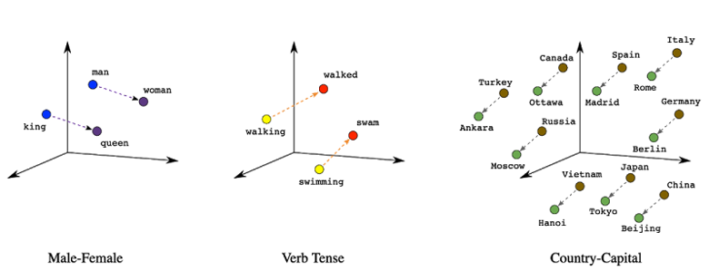
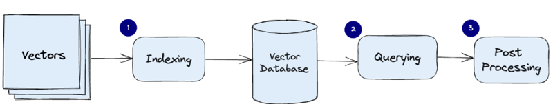
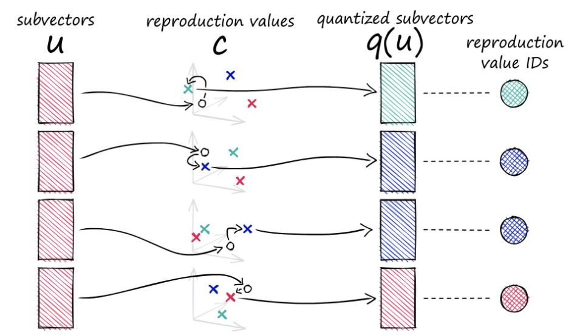
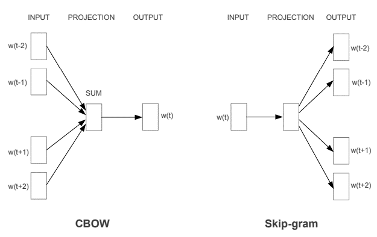
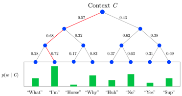
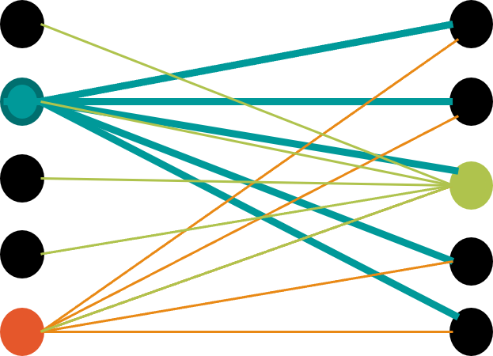
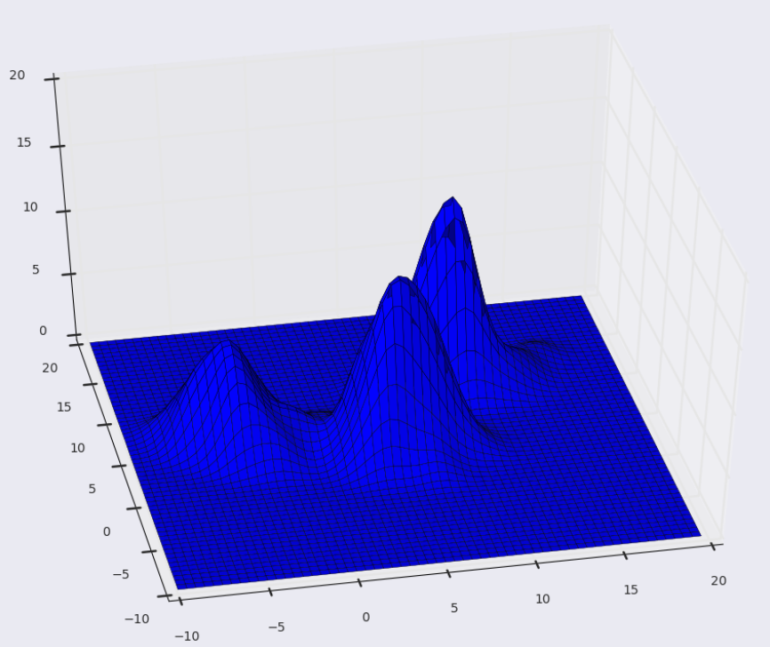

# Large Language Models
von *Richard Kelnhofer, Nick Thomas und Daniel Stoffel*

## Abstract

## 1 Einleitung / Motivation

## 2 Stand der Forschung

## 3 Methoden

In diesem Abschnitt werden verschiedene wichtige Konzepte und Techniken im Bereich des Natural Language Processing (NLP) behandelt. Es wird auf die grundlegenden Bausteinen des Transformer-Modells eingegangen, das eine Revolution in der NLP-Forschung und -Anwendung darstellt. Der Transformer ist die Grundlage für viele fortschrittliche Modelle, einschließlich BERT (Bidirectional Encoder Representations from Transformers) und GPT (Generative Pre-Training). Neben der Beschreibung der Architektur und Funktionsweise von Transformer, BERT und GPT werden auch wichtige Aspekte wie Tokenisierung, Embeddings, Positional Encoding und Fine-Tuning behandelt. Des Weiteren werden Konzepte wie Meta-Learning und Benchmarking erläutert, die zur Weiterentwicklung und Evaluierung von NLP-Motdellen beiragen. Somit wird ein umfassender Überblick über die aktuellen Schlüsselkonzepten und Techniken im Bereich des NLP gegeben.

### 3.1 Daten
---

Die Daten sind das Herzstück der moderen Sprachverarbeitung. Es wird sehr viel in diese Richtung geforscht, um immer bessere Vektorrepräsentationen für Wörter zu finden. Diese Vektorrepräsentationen werden auch Embeddings genannt. Sie sind die Grundlage für die meisten NLP-Modelle. In diesem Abschnitt werden die wichtigsten Konzepte und Techniken zur Erstellung von Embeddings behandelt. Angefangen bei der Tokenisierung, die den Text in einzelne Tokens aufteilt, bis hin zu den Embeddings, die die Wörter in einen Vektorraum abbilden.

#### 3.1.1 Tokenisierung

In der Literatur gibt es sehr viele Tokenisierungstechniken. Hier werden nur ein paar davon näher betrachtet. Den Anfang machen die regelbasierten Tokenizer, deren Regeln von Menschen erstellt werden. Typische Tokenisierungsregeln sind: 

- Trennung an Satzzeichen
- Trennung an Leerzeichen
- Trennung an Sonderzeichen

Ein Beispiel für einen regelbasierten Tokenizer ist der [Penn Treebank Tokenizer](https://www.nltk.org/_modules/nltk/tokenize/treebank.html). Dieser Tokenizer ist in der Lage, die Tokens eines Textes zu extrahieren. Dabei werden die Tokens an Leerzeichen, Satzzeichen und Sonderzeichen getrennt. Im Kern verwendet er reguläre Ausdrücke, um die Tokens zu extrahieren. Weitergehend kann man auch auf Klein- und Großschreibung achten und diese Regeln in den Tokenizer einbauen. Zusätzlich kann man auch Lemmatizer und Stemmer verwenden, um die Tokens zu normalisieren.

```python
from nltk.tokenize import TreebankWordTokenizer

tokenizer = TreebankWordTokenizer()
text = "I can't wait to visit the U.S. next year."
tokens = tokenizer.tokenize(text)
print(tokens)
```

```python
['I', 'ca', "n't", 'wait', 'to', 'visit', 'the', 'U.S.', 'next', 'year', '.']
```

Das Ergebnis eines Tokenizers ist ein **Vokabular**, aus dem durch Embeddingalgorithmen Vektoren für Sprachmodelle entstehen. Dieses Vokabular ist das Fundament auf dem die Embeddings aufbauen. Es ist wichtig, dass das Vokabular möglichst groß ist, um eine gute Repräsentation der Sprache zu erreichen. Ein großes Vokabular hat aber auch Nachteile. Es ist sehr rechenintensiv und benötigt viel Speicher. Deshalb wird das Vokabular meistens auf die 30.000 häufigsten Wörter beschränkt. Jedoch gibt es auch Modelle mit weitaus größerem Vokabular. Zusätzlich muss das Vokabular nicht nur aus reinen Wörter bestehen. Was Regeln nicht erreichen, ist eine sinnvolle Trennung des Wortes ``U.S.``. Regeln verstehen die Semantik hinter Abkürzungen nicht. Deshalb genügen reine regelbasierte Tokenizer nicht mehr.

Ein weiteres Vorgehen, um ein sinnvolles Vokabular zu erzeugen ist [Byte-Pair-Encoding](). Bevor man BPE verwenden, muss man seine Texte normalisieren. Auf diesen normalisierten Text wird ein Pre-Tokenizer angewendet, um Tokens zu generiern. Danach wird das Vokabular erstellt. Dieses Vokabular besteht aus den einzelnen Zeichen des Textes. Anschließend wird das Vokabular durchlaufen und die häufigsten Zeichenpaare gesucht. Diese werden dann zu einem neuen Zeichen zusammengefasst. Dieser Vorgang wird so oft wiederholt, bis das Vokabular die gewünschte Größe erreicht hat. Das Ergebnis ist ein Vokabular, das aus Zeichen und Zeichenpaaren besteht. Dieses Vokabular wird dann verwendet, um die Tokens zu generieren. 

```python
from tokenizers import Tokenizer, models, pre_tokenizers, decoders, trainers

# Initialize the BPE tokenizer
tokenizer = Tokenizer(models.BPE())

# Create and configure the trainer
trainer = trainers.BpeTrainer(vocab_size=10000, special_tokens=["<s>", "<pad>", "</s>", "<unk>"])

# Train the tokenizer on your text data
tokenizer.train(["path/to/your/text/file.txt"], trainer)

# Encode a sentence using the trained tokenizer
sentence = "Hello, how are you?"
encoded_sentence = tokenizer.encode(sentence)

# Get the tokenized representation
tokens = encoded_sentence.tokens
print(tokens)

```

#### 3.1.2 Subword Tokenization

Hier werden [WordPiece](https://huggingface.co/docs/tokenizers/v0.13.3/en/api/models#tokenizers.models.BPE), [Unigram](https://huggingface.co/docs/tokenizers/v0.13.3/en/api/models#tokenizers.models.WordPiece) und [SentencePiece](https://github.com/google/sentencepiece) vorgestellt. Diese Tokenizer sind sehr ähnlich zu BPE. Dennoch erstellen alle 4 Verfahren andere Vokabelsets. WordPiece ist ein Tokenisierungsalgorithmus, der ursprünglich von Google für das NLP-Modell BERT (Bidirectional Encoder Representations from Transformers) entwickelt wurde. Es ist ein statistisches Verfahren, das auf der Idee basiert, häufige Zeichenfolgen von Zeichen in einem Textkorpus zu identifizieren und sie zu einem neuen Wort zusammenzufassen. WordPiece überprüft, ob es sinvoll ist, k Zeichen zu einem neuen Zeichen zusammenzufassen. Dieser Vorgang wird so oft wiederholt, bis das Vokabular die gewünschte Größe erreicht hat.

$$
max_{w \in V} \frac{count(\sum\limits_1^k w_k)}{\prod\limits_1^k count(w_k)}
$$

Das Unigram Vorgehen ist aus einem bestehenden Vokabular, unnötiges zu entfernen. Um das "Unnötige" zu bestimmen, berechnet Unigram den gesamten loss über das Vokabular mit dem Log-Likelihood. Das Vokabular wird dann so lange verkleinert, bis die gewünschte Größe erreicht ist.

$$
 Loss = -\sum\limits_{w \in V} log(P(w))
$$

Zu Letzt wird noch SentencePiece vorgestellt. Dieser Tokenizer ist ein weiteres Verfahren, um Subwords zu generieren. Es ist ein statistisches Verfahren, das auf der Idee basiert, häufige Zeichenfolgen in einem Textkorpus zu identifizieren und sie zu einem neuen Wort zusammenzufassen. Dabei basiert SentencePiece auf BPE, WordPiece, Unigram und vielen anderen.

```python
from tokenizers import Tokenizer, models, pre_tokenizers, decoders, trainers

# Initialize the WordPiece tokenizer
tokenizer = Tokenizer(models.WordPiece())

# Initialize the Unigram tokenizer
tokenizer = Tokenizer(models.Unigram())
```	

```python
import sentencepiece as spm

# Train SentencePiece tokenizer
spm.SentencePieceTrainer.train(input='input.txt', model_prefix='spm_model', vocab_size=1000)

# Load trained SentencePiece tokenizer
tokenizer = spm.SentencePieceProcessor()
tokenizer.load('spm_model.model')
```


#### 3.1.3 Embeddings

In diesem Abschnitt werden die Idee, die Speicherung und verschiedene Algorithmen und Modelle vorgestellt, durch die Embeddings erzeugt werden können. Embeddings sind der weitere Schritt in der Datenverarbeitung nach dem Erstellen des Vokabulars durch Tokenizer. Das Ziel ist es die Wörter in eine Computer verständliche Form zu bringen. Dies wird erreicht, indem die Wörter in einen Vektor umgewandelt werden. Dieser Vektor zeigt die Beziehungen zwischen einzelnen Wörtern an.

Die Hauptidee hinter Embeddings ist, dass ähnliche Wörter ähnliche Vektoren haben, wodurch diese im n-dimensonalen Raum näher zusammen liegen.
> “An embedding is a way of representing data as points in n-dimensional space so that similar data points cluster together.” 



Um bei einen Embedding herauszufinden, wie ähnlich sich zwei Wortvektoren sind, wird der Cosinus-Abstand, euklidische Abstand oder das Skalarprodukt verwendet. Die Ergebnis des Skalarprodukts ist ein skalarer Wert. Wenn das Skalarprodukt von a · b einen Wert nahe der Null hat, sind die Vektoren senkrecht zueinander und haben somit keine Korrelation. Wenn das Skalarprodukt positiv ist, sind die Vektoren ähnlich oder parallel, während ein negatives Skalarprodukt auf eine entgegengesetzte oder divergierende Ausrichtung der Vektoren hinweist. 

$$ a \cdot b = a_1 * b_1 + ... + a_n * b_n $$

Die Aussagekraft des euklidischen Abstandes ist besser als die des Skalarproduktes. Als Ergebnis kommt ein skalarer Wertraus, der die Distanz zwischen den Vektoren angibt. Je kleiner der Wert, desto ähnlicher sind die Vektoren. Jedoch wird der Wert durch die Komponenten der Vektor stark beeinflusst. An sich wird der Differenzenvektor von a und b berechnet, an dem die euklidische Norm verwendet wird. Die euklidische Norm ist die Länge eines Vektors.

Den Abstand zweier Vektoren darf man für das Ähnlichkeitsmaß nutzen, da folgende Gleichungen erfüllt sind:
- Kommutativgesetz: $ ||x, y|| = ||y, x|| $
- Hilbert Norm: $ ||x|| = \sqrt{x \cdot x} $
- Cauchy-Schwarz-Ungleichung: $ |x \cdot y| \leq ||x|| * ||y|| $
- Homogenität: $ ||\alpha * x|| = |\alpha| * ||x|| $
- Nichtnegativität: $ ||x|| \geq 0 $

$$ d(a,b) = ||a - b||_2 = \sqrt{\prod\limits_k^n (a_k - b_k)^2} $$

Das wichtigste Maß für die Entscheidung über Ähnlichkeit ist die Cosinus-Ähnlichkeit. Sie ist definiert als der Kosinus des Winkels zwischen den beiden Vektoren, somit liegen die Werte zwischen -1 und 1, wobei 1 für perfekte Ähnlichkeit steht.

$$ cos(\theta) = \frac{a \cdot b}{||a||_2 * ||b||_2} $$

Die Berechnung der Ähnlichkeit, hilft nicht nur beim trainieren von Sprachmodellen, sonderen ist auch ein effizienter Weg Vektoren zu speichern. Für die Speicherung werden **Vektor Datenbanken** verwendet. Hierbei unterscheident man in eine reine Indeximplementierung wie [FAISS](https://www.pinecone.io/learn/faiss/) oder ein Datenbankmanagement System wie [Pinecone](https://www.pinecone.io/). Je nach Anwendungszweck muss entschieden werden, ob Geschwiningkeit oder Sicherheit wichtiger ist.
Ein Vektor-Datenbankmanagesystem liefert die gängigen Werkzeuge, um die Speicherung von Vektoren zu verwalten. Dazu gehören die folgenden Funktionen:
- Data Management: Speichern, Abrufen, Löschen und Aktualisieren von Vektoren
- Indexing: Erstellen von Indizes für die Suche
- Metadata Management: Speichern von Metadaten zu Vektoren
- Scalability & Integration: Skalierung und Integration in bestehende Systeme
- Real-Time updates: Echtzeit-Updates von Vektoren
- Backups & Collection: Backups und Sammlungen von Vektoren(Window-Functions)
- Security & access control: Sicherheit und Zugriffskontrolle

Ein Index hat vieles davon nicht. Dementsprechend muss man sicher sehr sicher sein, falls man die Indeximplementierung wählt. Andernfalls werden einzelne Funktionen selbst implementiert, was zu einem Mehraufwand führt.



Vektoren werden durch Algorithmen wie *Product Quantinization*, *Locality Sensitive Hashing* oder *Hierarchical Navigable Small World* in einen Index umgewandelt. Dieser Index landet mit dem dazugehörigen Originalvektor in der Vektor Datenbank. Beim Querying wird der Query-Vektor in den Index umgewandelt und mit den Indexvektoren verglichen. Die Ergebnisse werden dann zurückgegeben. Schließlich kommt es zum Postprocessing, bei dem die Ergebnisse gefiltert und / oder geordnet werden. Somit kommt es zu einer Neubewertung aller Ergebnisse und das beste Ergebnis wird zurückgegeben.

Product Quantization ist eine Technik, die in der Vektorquantisierung verwendet wird, um hochdimensionale Vektoren durch eine kleinere Menge von Prototypvektoren zu repräsentieren und somit zu komprimieren. Das Ziel von Product Quantization besteht darin, den Speicherbedarf hochdimensionaler Vektoren zu reduzieren, während ihre wesentlichen Merkmale erhalten bleiben. Somit wird der originale Vektor in mehrere Subvektoren aufgeteilt, die einzeln quantisiert werden. Die Quantisierung wird durch *centroids* durchgeführt. Das sind Vektoren (*reproduction values*), die sich in einem Subraum befinden, wo die Komponenten der Subvektoren ihre nächsten Nachbarn suchen, indem diese k-nearest-neighbours (kNN) verwenden. Folglich wird auf das naheste reproduction value gemappt, um den Vektor zu repräsentieren.



Jetzt wo das sicher der Vektoren klargestellt ist, kann man anfangen Embeddings zu berechnen. Der bekannteste Ansatz ist *Word2Vec*. Hierzu gibt es zwei Architekturen: *Continuous Bag of Words* und *Skip-Gram*. Beide Architekturen sind neural network language models. Das Ziel ist es, die Wahrscheinlichkeit eines Wortes zu berechnen, das auf ein anderes Wort folgt. Die Architektur des CBOW-Modells und des Skip-Gram-Modells ist in der folgenden Abbildung dargestellt.



Das Ziel des CBOW ist es, ein Wort innerhalb eines Kontextes vorherzusagen, während das Ziel des Skip-Grams die Vorhersage desKontextes um ein Wort ist. Beide verwenden ein hidden layer ohne Aktivierungsfunktion. Folglich findet eine Projektion statt, indem das Skalarprodukt von Eingabevektor und Gewichtsmatrix gebildet wird. Schließlich wird in der Ausgabe Schicht ein hierachischer Softmax verwendet. Er nutzt einen binären Baum, um die Wahrscheinlichkeit eines Wortes zu berechnen. Anstatt alle Wörter im Vokabular zu berücksichtigen, wird der hierarchische Softmax die Wahrscheinlichkeit schrittweise berechnen, indem er den Baum durchläuft. Dieser Baum organisiert die Wörter hierarchisch, wobei häufigere Wörter näher an der Wurzel und seltenere Wörter weiter unten im Baum platziert werden. Indem der hierarchische Softmax den binären Baum verwendet, kann er die Anzahl der Berechnungen reduzieren, da er nur einen Teil des Baums durchlaufen muss, um die Wahrscheinlichkeit eines bestimmten Wortes zu bestimmen. Dies führt zu einer beschleunigten Vorhersagephase und ermöglicht die effiziente Verarbeitung großer Vokabulare. Zum Vallidieren der Ausgaben wird One-Hot-Encoding verwendet.



Zum Trainieren wird sub sampling als auch negative sampling verwendet. Sub sampling überprüft von vorne weg, ob ein Wort in das Context Fenster aufgenommen wird oder nicht. Ein Context Fenster entsteht, um ein betrachtetes Wort und seine direkten Nachbarn. Die Wahrscheinlichkeit, dass ein Wort in das Context Fenster aufgenommen wird, ist umgekehrt proportional zu seiner Häufigkeit. 

$$ P(w_i) = (\sqrt{\frac{z(w_i)}{0.001}} + 1) * \frac{0.001}{z(w_i)} $$

Negative sampling ist eine Technik, die die Trainingszeit verkürzt, indem sie nur eine kleine Anzahl von negativen Beispielen und das positive Beispiel auswählt, um die Gewichte zu aktualisieren. Bei einer großen Anzahl von Perzeptronen in der Eingabeschicht kann das Training lange dauern, wenn man alle Gewichte anpasssen muss, obwohl man nur pro Wort anpasst. Die Anzahl der negativen Beispiele ist ein Hyperparameter, der die Genauigkeit und die Trainingszeit beeinflusst. Die Formel für die Berechnung der Wahrscheinlichkeit eines negativen Beispiels ist wie folgt:

$$ P(w_i) = \frac{z(w_i)^{3/4}}{\sum_{j=0}^{n} z(w_j)^{3/4}} $$



Die Erweiterung von Word2Vec ist Fasttext, das von Facebook 2017 veröffentlicht wurde. Es berücktsichtigt die Morphologie von Wörtern. Im Gegensatz zu Word2Vec, das Wörter als diskrete Einheiten betrachtet, betrachtet Fasttext Wörter als eine Reihe von Zeichen oder n-Grammen. Somit wird es robuster gegen unbekannte Wörter. Das Resultat ist eine "Tasche" von verschiedenen n-Grammen zu einem Wort. Dies hat zur Folge, dass eine geteilte Repräsentation über Wörtern entsteht und somit die Repräsentation von seltenen Wörtern verbessert wird. Die Vorhersage, basiert auf eine Score-Funktion, die die Summe der Vektoren der n-Gramme des Wortes ist. Die Score-Funktion ist wie folgt definiert:

$$ s(w, c) = \sum\limits_{g \in G_w} z_g^T * v_c $$

- G ist die Menge der n-Gramme zu einem Wort w
- z ist der Vektor eines n-Gramms
- v ist der Vektor des zugehörigen Kontexts

Es können auch Language Models für Embeddings verwendet werden. Ein Beispiel ist *GloVe*. Es verwendet eine Matrix, um die Beziehung zwischen Wörtern zu erfassen. Hierbei wird betrachtet wie oft Wörter miteinander in einem Kontext auftauchen. Mit der SVG (Singularwertzelegung) wird die ursprüngliche Matrix in kleiner Matrizen geteilt. Dabei werden die Wortembeddings erzeugt.
Dennoch werden Embeddings auch mit Transformer Modellen wie Bert und GPT erstellt. Diese werden in den nächsten Kapitel genauer betrachtet. Doch ein weiteres Modell ist interessant: *ELMO*(Embeddings from Language Models). ELMO basiert auf einem didirektionalen LSTM. Das hat den Vorteil, dass Sequenzen von beiden Richtungen durchgegangen werden können. 

$$ h_t^L = BiLSTM(x_t, h_{t-1}^L) $$

LSTMs können durch ihre Zellen und rekusiver Natur für Sequenzverarbeitung verwendet werden. Die Zellen sind in der Lage, Informationen über einen längeren Zeitraum zu speichern und diese zu filtern. Die rekursive Natur eines LSTM kommt daher, dass es eine Verbesserung des RNNs ist. Das wichtigste für die Embeddinggenerierung ist es, dass die resultierenden Embeddings kontextabhängig sind. Die LSTM-Zellen liefern den Kontext, indem sie die vorherigen Ausgaben berücksichtigen. Ein weiterer Vorteil einer LSTM-Architektur ist es, dass pro Zelle über den Hidden State eine Vektorrepräsentation entsteht. Diese Vektorrepräsentationen werden für die Embeddinggenerierung verwendet. Somit glit für die linke Seite: $ h_{k, j}^{LM^{\rightarrow}} $ für $ t_{k+1} $ und für die rechte Seite gilt: $ h_{k, j}^{LM^{\leftarrow}} $ für $ t_{k} $.

Um diese Vektorrepräsentationen zu erzeugen, muss ELMO trainiert werden. Dies geschieht, indem die Wahrscheinlichkeit für das Vorkommen eines Wortes innerhalb einer Sequenz maximiert wird und die aufkommenden Fehler minimiert werden. Die Wahrscheinlichkeit wird wie folgt berechnet:

$$ max(
    \sum\limits_{k=1}^{K} 
        log P(t_k | t_1, ..., t_{k-1}; \theta_x, \theta_{LSTM}^{\rightarrow}, \theta_s) + 
        log P(t_t | t_{k+1}, ..., t_K; \theta_x, \theta_{LSTM}^{\leftarrow }, \theta_s))
$$

Anhand der Gleichung sieht man genau, dass die Sequenzen von beiden Richtungen durchgegangen werden. Um die Wahrscheinlichkeit für das Vorkommen eines Wortes innerhalb einer Sequenz zu berechnen, wird in der Bedingung jeweils die linke oder rechte Seite verwendet. Zusätzlich werden noch die zugehörigen Gewichtsmatrizen $\theta_x, \theta_{LSTM}^{\rightarrow}, \theta_{LSTM}^{\leftarrow }, \theta_s$ in die Wahrscheinlichkeitsberechnung mit rein gerechnet. Schließlich kann jedes Token als eine Menge von Vektorrepräsentaion dargestellt werden. Die Größer einer solchen Menge ist abhängig von der Anzahl der LSTM-Zellen, wodruch sich folgende Gleichung ergibt: $ size(R_t) = 2 * L + 1 $, wobei L die Anzahl der LSTM-Zellen ist. Somit lässt sich jedes Token als eine Menge von Vektorrepräsentationen darstellen.

$$ R_t = \{x_k^{LM}, h_{k, j}^{LM^{\rightarrow}}, h_{k, j}^{LM^{\leftarrow}} | j = 1, ... , L\} $$

Zu guter letzt muss man noch mutli-sense embeddings betrachten. Hier versucht man die Mehrdeutigkeit von Wörtern abzubilden. Mögliche Ansätze sind:
- Sense2Vec
- ELMO + Clustering
- Transformer

Speziell benutzt man clustering Methoden, um die Mehrdeutigkeit von Wörtern abzubilden. Hierbei werden die Embeddings von Wörtern in Cluster unterteilt, wobei pro Cluster ein neue Repräsentation des Wortes entsteht. Um dies zu erreichen, werden cluster Algorithmen benötigt, die mit hochdimensonalen Vektoren umgehen können. Beispiele sind: K-Means, DBSCAN, Mean-Shift, Affinity Propagation, Spectral Clustering, Hierarchical Clustering, Gaussian Mixture Models und noch viele mehr. Im folgenden werden die Algorithmen K-Means und Mean-Shift genauer betrachtet.

K-Means ist ein iterativer Algorithmus, der versucht die Daten in k Cluster zu unterteilen. Hierbei wird die Distanz zwischen den Datenpunkten und den Clusterzentren minimiert. Die Clusterzentren werden durch den Mittelwert der Datenpunkte gebildet. Der Algorithmus funktioniert wie folgt:

1. Wähle k zufällige Punkte als Clusterzentren
2. Berechne die Distanz zwischen den Datenpunkten und den Clusterzentren
3. Weise jeden Datenpunkt dem nächstgelegenen Clusterzentrum zu
4. Berechne die neuen Clusterzentren
5. Wiederhole Schritt 2 bis 4, bis sich die Clusterzentren konvergieren

Der Algorithmus ist einfach zu implementieren und schnell in der Ausführung. Doch er hat auch Nachteile. Zum einen muss die Anzahl der Cluster k bekannt sein. Zum anderen ist der Algorithmus anfällig für Ausreißer, was zu falschen Clusterzentren führen kann.

Mean-Shift ist ein iterativer Algorithmus, der auf der Idee basiert, dass Datenpunkte zur lokalen Dichtemaxima tendieren. Er kann verwendet werden, um natürliche Cluster in Daten zu finden, ohne die Anzahl der Cluster im Voraus zu kennen. Somit benötig man einen Kernel, den man vorab initialisieren muss. Meistens wird hierfür der Gauß-Kernel verwendet. $ K(x) = \frac{1}{\sqrt{2\pi\sigma^2}}e^{-\frac{x^2}{2\sigma^2}} $. Danach kann die Suche nach den lokalen Dichtemaxima beginnen. Der Algorithmus funktioniert wie folgt:

1. Wähle einen Datenpunkt als Startpunkt
2. Berechne den Kreis mit Radius r um den Startpunkt
3. Berechne den Schwerpunkt der Datenpunkte innerhalb des Kreises
4. Setze den Schwerpunkt als neuen Mittelpunkt
5. Wiederhole Schritt 2 bis 4, bis sich die Mittelpunkte konvergieren

Somit wird der Mittelpunkt immer näher an das lokale Dichtemaxima herangeführt, da die Datenpunkte innherhalb des Kreises immer mehr werden sollen. Diese Eingenschaft des Algorithmus wird auch als hill climbing bezeichnet.



Ein Vorteil von Mean-Shift-Clustering ist, dass es automatisch die Anzahl der Cluster bestimmt, da die Cluster durch die lokalen Maxima der Datenpunktdichte definiert werden. Der Algorithmus ist auch robust gegenüber Rauschen und kann Cluster mit komplexen Formen erfassen. Allerdings kann die Performance des Algorithmus bei großen Datensätzen beeinträchtigt sein, da er eine hohe Rechenleistung erfordert, um die Dichte in einem hochdimensionalen Raum zu berechnen.


### 3.2 Transformer
---

#### 3.2.1 Positional Encoding
#### 3.2.2 Aechitektur
#### 3.2.3 Self-Attention
#### 3.2.4 Cross-Attention
#### 3.2.5 Masked Attention
#### 3.2.6 Multi-Head Attention
#### 3.2.7 Feed Forward Network
#### 3.2.8 Residual Connections
#### 3.2.9 Layer Normalization
#### 3.2.10 Dropout & Optimizer
#### 3.2.11 Output Layer

### 3.3 BERT
---

#### 3.3.1 Architektur
#### 3.3.2 Masked Language Model
#### 3.3.3 Next Sentence Prediction
#### 3.3.4 Pre-Training
#### 3.3.5 Fine-Tuning


### 3.4 Fine-Tuning
---

#### 3.4.1 Aufgaben
#### 3.4.2 Overfitting


### 3.5 Generative Pre-Training
---

#### 3.5.1 Architektur
#### 3.5.2 Pre-Training
#### 3.5.3 Fine-Tuning
#### 3.5.4 Reward Model
#### 3.5.5 Reinforcement Learning


### 3.6 Meta-Learning
---

#### 3.6.1 Zero-Shot Learning
#### 3.6.2 One-Shot Learning
#### 3.6.3 Few-Shot Learning


### 3.7 Benchmarking
---


## 4 Anwendungen

## 5 Fazit

## 6 Weiterführendes Material

### 6.1 Podcast
[Der Campus Talk – Silicon Forest – Folge 3](https://der-campustalk-der-thd.letscast.fm/episode/der-campus-talk-silicon-forest-folge-3)

### 6.2 Talk
Hier einfach Youtube oder THD System embedden.

### 6.3 Demo
Link zur Code Demonstration: 

Link zum Repository: <?>

## 7 Literaturliste
[1] Acheampong, Francisca Adoma, Henry Nunoo-Mensah, und Wenyu Chen. „Transformer Models for Text-Based Emotion Detection: A Review of BERT-Based Approaches“. Artificial Intelligence Review 54, Nr. 8 (1. Dezember 2021): 5789–5829. https://doi.org/10.1007/s10462-021-09958-2.

[2] Bojanowski, Piotr, Edouard Grave, Armand Joulin, und Tomas Mikolov. „Enriching Word Vectors with Subword Information“. arXiv, 19. Juni 2017. http://arxiv.org/abs/1607.04606.

[3] Brants, Thorsten, Ashok C Popat, Peng Xu, Franz J Och, und Jeffrey Dean. „Large Language Models in Machine Translation“, o. J.

[3] Brown, Tom B., Benjamin Mann, Nick Ryder, Melanie Subbiah, Jared Kaplan, Prafulla Dhariwal, Arvind Neelakantan, u. a. „Language Models are Few-Shot Learners“. arXiv, 22. Juli 2020. http://arxiv.org/abs/2005.14165.

[4] Carlini, Nicholas, Florian Tramèr, Eric Wallace, Matthew Jagielski, Ariel Herbert-Voss, Katherine Lee, Adam Roberts, u. a. „Extracting Training Data from Large Language Models“, o. J. https://www.usenix.org/system/files/sec21-carlini-extracting.pdf.

[5] DeepMind x UCL | Deep Learning Lectures | 6/12 | Sequences and Recurrent Networks, 2020. https://www.youtube.com/watch?v=87kLfzmYBy8.

[6] DeepMind x UCL | Deep Learning Lectures | 7/12 |  Deep Learning for Natural Language Processing, 2020. https://www.youtube.com/watch?v=8zAP2qWAsKg.

[7] Devlin, Jacob, Ming-Wei Chang, Kenton Lee, und Kristina Toutanova. „BERT: Pre-training of Deep Bidirectional Transformers for Language Understanding“. arXiv, 24. Mai 2019. http://arxiv.org/abs/1810.04805.

[8] Domingos, Pedro. „A Few Useful Things to Know about Machine Learning“. Communications of the ACM 55, Nr. 10 (Oktober 2012): 78–87. https://doi.org/10.1145/2347736.2347755.

[9] Floridi, Luciano. „AI as Agency Without Intelligence: On ChatGPT, Large Language Models, and Other Generative Models“. Philosophy & Technology 36, Nr. 1 (10. März 2023): 15. https://doi.org/10.1007/s13347-023-00621-y.

[10] google. „Classify Text with BERT | Text“. TensorFlow. Zugegriffen 1. April 2023. https://www.tensorflow.org/text/tutorials/classify_text_with_bert.

[11] Hassan, Abdalraouf, und Ausif Mahmood. „Efficient Deep Learning Model for Text Classification Based on Recurrent and Convolutional Layers“. In 2017 16th IEEE International Conference on Machine Learning and Applications (ICMLA), 1108–13, 2017. https://doi.org/10.1109/ICMLA.2017.00009.

[12] Holtzman, Ari, Jan Buys, Li Du, Maxwell Forbes, und Yejin Choi. „The Curious Case of Neural Text Degeneration“. arXiv, 14. Februar 2020. http://arxiv.org/abs/1904.09751.

[13] Kaplan, Jared, Sam McCandlish, Tom Henighan, Tom B. Brown, Benjamin Chess, Rewon Child, Scott Gray, Alec Radford, Jeffrey Wu, und Dario Amodei. „Scaling Laws for Neural Language Models“. arXiv, 22. Januar 2020. http://arxiv.org/abs/2001.08361.

[14] Kim, Sang-Bum, Kyoung-Soo Han, Hae-Chang Rim, und Sung-Hyon Myaeng. „Some Effective Techniques for Naive Bayes Text Classification“. Knowledge and Data Engineering, IEEE Transactions on 18 (1. Dezember 2006): 1457–66. https://doi.org/10.1109/TKDE.2006.180.

[15] lbayad, Maha, Laurent Besacier, und Jakob Verbeek. „Pervasive Attention: 2D Convolutional Neural Networks for Sequence-to-Sequence Prediction“. arXiv, 1. November 2018. https://doi.org/10.48550/arXiv.1808.03867.

[16] Luitse, Dieuwertje, und Wiebke Denkena. „The great Transformer: Examining the role of large language models in the political economy of AI“. Big Data & Society 8, Nr. 2 (1. Juli 2021): 20539517211047736. https://doi.org/10.1177/20539517211047734.

[17] Liu, Pengfei, Xipeng Qiu, und Xuanjing Huang. „Recurrent Neural Network for Text Classification with Multi-Task Learning“. arXiv, 17. Mai 2016. https://doi.org/10.48550/arXiv.1605.05101.

[18] Liu, Shengzhong, Franck Le, Supriyo Chakraborty, und Tarek Abdelzaher. „On Exploring Attention-based Explanation for Transformer Models in Text Classification“. In 2021 IEEE International Conference on Big Data (Big Data), 1193–1203, 2021. https://doi.org/10.1109/BigData52589.2021.9671639.

[19] Manyika, James. „An Overview of Bard: An Early Experiment with Generative AI“, o. J. https://ai.google/static/documents/google-about-bard.pdf.

[20] McCallum, Andrew, und Kamal Nigam. „A Comparison of Event Models for Naive Bayes Text Classification“, o. J. http://www.cs.cmu.edu/~dgovinda/pdf/multinomial-aaaiws98.pdf.

[21] McCoy, R. Thomas, Ellie Pavlick, und Tal Linzen. „Right for the Wrong Reasons: Diagnosing Syntactic Heuristics in Natural Language Inference“. arXiv, 24. Juni 2019. http://arxiv.org/abs/1902.01007.

[22] Merity, Stephen, Nitish Shirish Keskar, und Richard Socher. „Regularizing and Optimizing LSTM Language Models“. arXiv, 7. August 2017. https://doi.org/10.48550/arXiv.1708.02182.

[23] Mikolov, Tomáš, Anoop Deoras, Daniel Povey, Lukáš Burget, und Jan Černocký. „Strategies for training large scale neural network language models“. In 2011 IEEE Workshop on Automatic Speech Recognition & Understanding, 196–201, 2011. https://doi.org/10.1109/ASRU.2011.6163930.

[24] Min, Bonan, Hayley Ross, Elior Sulem, Amir Pouran Ben Veyseh, Thien Huu Nguyen, Oscar Sainz, Eneko Agirre, Ilana Heinz, und Dan Roth. „Recent Advances in Natural Language Processing via Large Pre-Trained Language Models: A Survey“. arXiv, 1. November 2021. http://arxiv.org/abs/2111.01243.

[25] OpenAI. „GPT-4 Technical Report“. arXiv, 27. März 2023. https://doi.org/10.48550/arXiv.2303.08774.

[26] Ouyang, Long, Jeff Wu, Xu Jiang, Diogo Almeida, Carroll L. Wainwright, Pamela Mishkin, Chong Zhang, u. a. „Training language models to follow instructions with human feedback“. arXiv, 4. März 2022. http://arxiv.org/abs/2203.02155.

[27] Peters, Matthew E., Mark Neumann, Mohit Iyyer, Matt Gardner, Christopher Clark, Kenton Lee, und Luke Zettlemoyer. „Deep contextualized word representations“. arXiv, 22. März 2018. http://arxiv.org/abs/1802.05365.

[28] Radford, Alec, Karthik Narasimhan, Tim Salimans, und Ilya Sutskever. „Improving Language Understanding by Generative Pre-Training“, o. J. https://s3-us-west-2.amazonaws.com/openai-assets/research-covers/language-unsupervised/language_understanding_paper.pdf.

[29] Rei, Marek. „Semi-supervised Multitask Learning for Sequence Labeling“. arXiv, 24. April 2017. http://arxiv.org/abs/1704.07156.

[30] Shin, Andrew, Masato Ishii, und Takuya Narihira. „Perspectives and Prospects on Transformer Architecture for Cross-Modal Tasks with Language and Vision“. International Journal of Computer Vision 130, Nr. 2 (1. Februar 2022): 435–54. https://doi.org/10.1007/s11263-021-01547-8.

[31] Sidorov, Grigori, Francisco Castillo, Efstathios Stamatatos, Alexander Gelbukh, und Liliana Chanona-Hernández. „Syntactic N-grams as machine learning features for natural language processing“. Expert Systems with Applications: An International Journal 41 (1. Februar 2014): 853–60. https://doi.org/10.1016/j.eswa.2013.08.015.

[32] Sundermeyer, Martin, Ralf Schlüter, und Hermann Ney. „LSTM Neural Networks for Language Modeling“. In Interspeech 2012, 194–97. ISCA, 2012. https://doi.org/10.21437/Interspeech.2012-65.

[33] TensorFlow. „Neural Machine Translation with a Transformer and Keras | Text“. TensorFlow. Zugegriffen 1. April 2023. https://www.tensorflow.org/text/tutorials/transformer.

[34] TensorFlow. „Text Classification with an RNN | TensorFlow“. Zugegriffen 1. April 2023. https://www.tensorflow.org/text/tutorials/text_classification_rnn.

[35] Thoppilan, Romal, Daniel De Freitas, Jamie Hall, Noam Shazeer, Apoorv Kulshreshtha, Heng-Tze Cheng, Alicia Jin, u. a. „LaMDA: Language Models for Dialog Applications“. arXiv, 10. Februar 2022. http://arxiv.org/abs/2201.08239.

[36] Topal, M Onat, Anil Bas, und Imke van Heerden. „Exploring Transformers in Natural Language Generation: GPT, BERT, and XLNet“, o. J. https://arxiv.org/abs/2102.08036.

[37] Tunstall, Lewis, Leandro von Werra, und Thomas Wolf. Natural Language Processing with Transformers. O’Reilly Media, Inc., 2022.

[38] Vaswani, Ashish, Noam Shazeer, Niki Parmar, akob Uszkoreit, Llion Jones, Aidan N. Gomez, Łukasz Kaiser, und Illia Polosukhin. „Transformer: A Novel Neural Network Architecture for Language Understanding“, 31. August 2017. https://ai.googleblog.com/2017/08/transformer-novel-neural-network.html.

[39] Vaswani, Ashish, Noam Shazeer, Niki Parmar, Jakob Uszkoreit, Llion Jones, Aidan N Gomez, Łukasz Kaiser, und Illia Polosukhin. „Attention is All you Need“. In Advances in Neural Information Processing Systems, Bd. 30. Curran Associates, Inc., 2017. https://proceedings.neurips.cc/paper_files/paper/2017/hash/3f5ee243547dee91fbd053c1c4a845aa-Abstract.html.

[40] Yan, Xueming, Zhihang Fang, und Yaochu Jin. „Augmented Transformers with Adaptive n-grams Embedding for Multilingual Scene Text Recognition“. arXiv, 27. Februar 2023. http://arxiv.org/abs/2302.14261.

[41] Zhou, Chunting, Chonglin Sun, Zhiyuan Liu, und Francis C. M. Lau. „A C-LSTM Neural Network for Text Classification“. arXiv, 30. November 2015. http://arxiv.org/abs/1511.08630.

[42] Zhu, Q., und J. Luo. „Generative Pre-Trained Transformer for Design Concept Generation: An Exploration“. Proceedings of the Design Society 2 (Mai 2022): 1825–34. https://doi.org/10.1017/pds.2022.185.