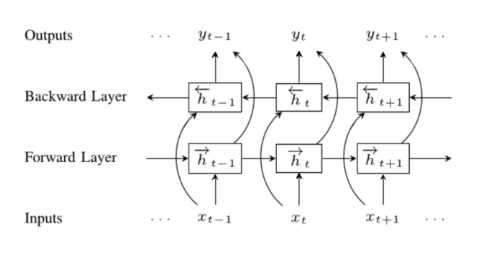
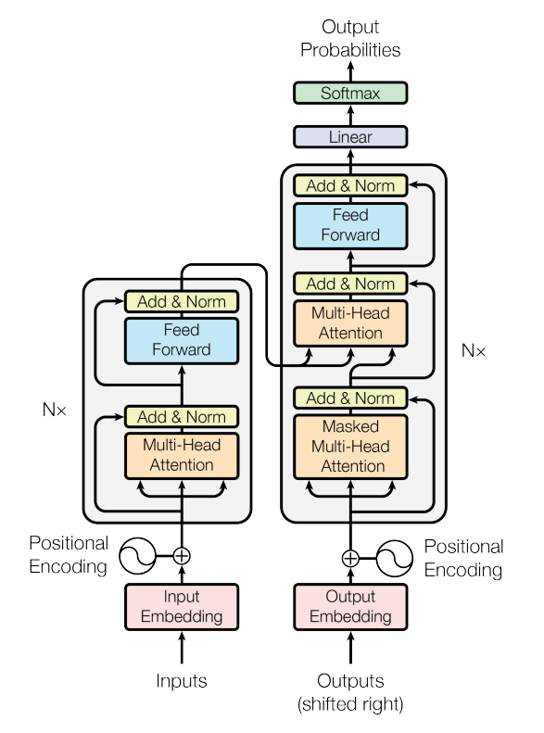

# Large Language Models

von _Richard Kelnhofer, Nick Thomas und Daniel Stoffel_

## Abstract

Das Arbeiten ohne Hilfe von ChatGPT, GitHubCopilot, etc. ist inzwischen für viele Menschen nur schwer vorstellbar. Diese Sogenannten LLMs(Large Language Models) haben innerhalb kürzester Zeit nach ihrer Veröffentlichung die Welt im Sturm erobert. Ihre Fähigkeit, Syntax, Zusammenhang und Semantik zu verstehen, macht sie zu unglaublich performanten und unerschöpflichen Assistenten für jeden, der Zugriff auf das Internet hat. Somit wurde in den letzten Jahren eine neue Generation von Assistenzsystemen geboren, welche einen bedeutenden Wert für die Menschheit bieten. Dieser Bericht umfasst drei unterschiedliche Module, welche sich von oberflächlichem Verständnis über detaillierte Informationen bis zur Anwendung strecken.

Der **Podcast** dieses Beitrags versucht Laien, aber auch Informatiker in den Bereich der LLMs einzuführen. Zunächst wird ein kleiner Teaser über die Funktionsweise der unterliegenden Technologien gegeben. Anschließend wird über die Anwendungsgebiete dieser LLMs diskutiert und es wird erläutert, welche Modifikationen ChatGPT besonders machen. Am Ende des Podcasts kommen wir zum Resultat, dass LLMs auch Gefahren bergen und so mit verfälschten Trainingsdaten (absichtlich oder versehentlich) zur Desinformation der Bevölkerung führen könnte. Die Kontrolle und Verantwortung liegt hier bei den Unternehmen, die diese Modelle erschaffen.

Der **Fachvortrag** geht äußerst detailliert auf alle Aspekte der Transformer-Modelle ein, wie z.B. Tokenisierung, Attention-Mechanismen und die generelle Architektur. Am Ende werden des weiteren Key-Features von ChatGPT, wie das Reward-Model ausführlich erläutert.

In der **Code-Demo** wird eine Library namens "LangChain" vorgestellt, welche es einfach macht, Das Wissen von LLMs zu erweitern(oder aktualisieren), mit LLMs komplexe Aufgaben zu lösen, und diese evtl. sogar in Reihe zu schalten. "LangChain" ist in den letzten Jahren zu der bekanntesten Python-Library für das Arbeiten mit LLMs geworden. In der Demo wird die Anwendung einiger Funktionen anhand des Bespiels der Generierung eines Podcast-Scripts gezeigt und hier verwendet um eigene PDFs in die Wissensbasis des Vortrainierten GPT3.5 einführen zu lassen.

## 1 Einleitung / Motivation

Large Language Models(LLMs) sind eine der größten Neuerungen im Bereich der Künstlichen Intelligenz und haben seit ihrer Erscheinung bereits viele Menschen in Angst um ihre Arbeitsplätze versetzt.  Startschuss für diese Flut an LLMs waren die sogenannten "Transformer" Modelle, welche erstmals 2017 von Forschern von Google präsentiert wurden und RNNs(Recurrent Neural Networks) in NLP(Natural Language Processing)-Tasks den Kampf ansagten. Im Gegensatz zu RNNs, welche schwer trainierbar auf große Datenmengen waren, konnten die Transformer problemlos Unmengen an Daten verarbeiten. Sie verfügen ebenso über sogenannte "Attention" und "Self-Attention", welche sie äußerst passend für sequenzielle Probleme macht.

Mit diesen Eigenschaften in ihrer Architektur können Transformer, Wortposition, Wortbedeutung und Satz-Syntax selbst ganz ohne Handbenannte Daten lernen. Dies macht sie trainierbar auf exorbitanten Datenmengen, was ihre Fähigkeiten und Bandbreite ihres Wissens im Vergleich zu herkömmlichen Methoden enorm steigert.

Fast alle modernen LLMs basieren auf genau dieser Transformer-Technologie, erweitern sie aber wie z.B. bei ChatGPT mit handbenannte Daten und sogenannten "Reward-Models", welche dem Transformer Feedback geben können. ChatGPT ist zwar das bekannteste, aber bei weitem nicht das Einzige LLM. Es gibt zahlreiche kreative Anwendungsmöglichkeiten, welche auf Transformer bauen, die wir hier kurz präsentieren möchten.

**AutoGPT** zum Beispiel ist ein Spezielles Modell, welches versucht eine Aufgabe so gut wie möglich zu absolvieren. Das Besondere ist, dass es dabei Google benutzen kann, aber auch Ordner auf dem Computer erstellen kann.

**MiniGPT** ist ein Open-Source ChatBot, welcher "sehen" kann und somit auch mit Bildern arbeiten kann.

Zu guter Letzt gibt es **perplexity.ai**, eine kostenlose KI-Suchmaschine, welche bei ihren Antworten auch die Quellen der Informationen angibt.

Dies sind nur ein Paar Beispiele, für welche Anwendungen LLMs bereits verwendet werden. Ihre Anzahl wird in den kommenden Jahren wohlmöglich explodieren.

## 2 Methoden

In diesem Abschnitt werden verschiedene wichtige Konzepte und Techniken im Bereich des Natural Language Processing (NLP) behandelt. Es wird auf die grundlegenden Bausteinen des Transformer-Modells eingegangen, das eine Revolution in der NLP-Forschung und -Anwendung darstellt. Der Transformer ist die Grundlage für viele fortschrittliche Modelle, einschließlich BERT (Bidirectional Encoder Representations from Transformers) und GPT (Generative Pre-Training). Neben der Beschreibung der Architektur und Funktionsweise von Transformer, BERT und GPT werden auch wichtige Aspekte wie Tokenisierung, Embeddings, Positional Encoding und Fine-Tuning behandelt. Des Weiteren werden Konzepte wie Meta-Learning und Benchmarking erläutert, die zur Weiterentwicklung und Evaluierung von NLP-Motdellen beiragen. Somit wird ein umfassender Überblick über die aktuellen Schlüsselkonzepten und Techniken im Bereich des NLP gegeben.

### 2.1 Daten

---

Daten bilden das Herzstück der modernen Sprachverarbeitung und intensive Forschung wird in diesem Bereich betrieben, um immer fortschrittlichere Vektorrepräsentationen für Wörter zu entwickeln. Diese repräsentativen Vektoren werden auch als **Embeddings** bezeichnet und bilden die Grundlage für die meisten Modelle im Bereich der natürlichen Sprachverarbeitung (NLP). Dieser Abschnitt widmet sich den zentralen Konzepten und Techniken zur Erstellung von Embeddings – angefangen bei der Tokenisierung, die den Text in einzelne Token zerlegt, bis hin zu den Embeddings selbst, welche die Wörter in einem Vektorraum abbilden.

#### 2.1.1 Tokenisierung

In der Literatur gibt es sehr viele Tokenisierungstechniken. Hier werden nur ein paar davon näher betrachtet. Den Anfang machen die regelbasierten Tokenizer, deren Regeln von Menschen erstellt werden. Typische Tokenisierungsregeln sind:

- Trennung an Satzzeichen

- Trennung an Leerzeichen

- Trennung an Sonderzeichen

Ein Beispiel für einen regelbasierten Tokenizer ist der [Penn Treebank Tokenizer](https://www.nltk.org/_modules/nltk/tokenize/treebank.html). Dieser Tokenizer ist in der Lage, die Tokens eines Textes zu extrahieren. Dabei werden die Tokens an Leerzeichen, Satzzeichen und Sonderzeichen getrennt. Im Kern verwendet er reguläre Ausdrücke, um die Tokens zu extrahieren. Weitergehend kann man auch auf Klein- und Großschreibung achten und diese Regeln in den Tokenizer einbauen. Zusätzlich kann man auch Lemmatizer und Stemmer verwenden, um die Tokens zu normalisieren.

```python
from nltk.tokenize import TreebankWordTokenizer

tokenizer = TreebankWordTokenizer()
text = "I can't wait to visit the U.S. next year."
tokens = tokenizer.tokenize(text)
print(tokens)
```

```python
['I', 'ca', "n't", 'wait', 'to', 'visit', 'the', 'U.S.', 'next', 'year', '.']
```

Das Ergebnis eines Tokenizers ist ein **Vokabular**, aus dem durch Embeddingalgorithmen Vektoren für Sprachmodelle entstehen. Dieses Vokabular ist das Fundament auf dem die Embeddings aufbauen. Es ist wichtig, dass das Vokabular möglichst groß ist, um eine gute Repräsentation der Sprache zu erreichen. Ein großes Vokabular hat aber auch Nachteile. Es ist sehr rechenintensiv und benötigt viel Speicher. Deshalb wird das Vokabular meistens auf die 30.000 häufigsten Wörter beschränkt. Jedoch gibt es auch Modelle mit weitaus größerem Vokabular. Zusätzlich muss das Vokabular nicht nur aus reinen Wörter bestehen. Was Regeln nicht erreichen, ist eine sinnvolle Trennung des Wortes `U.S.`. Regeln verstehen die Semantik hinter Abkürzungen nicht. Deshalb genügen reine regelbasierte Tokenizer nicht mehr.

Ein weiteres Vorgehen, um ein sinnvolles Vokabular zu erzeugen ist [Byte-Pair-Encoding](). Bevor man BPE verwenden, muss man seine Texte normalisieren. Auf diesen normalisierten Text wird ein Pre-Tokenizer angewendet, um Tokens zu generiern. Danach wird das Vokabular erstellt. Dieses Vokabular besteht aus den einzelnen Zeichen des Textes. Anschließend wird das Vokabular durchlaufen und die häufigsten Zeichenpaare gesucht. Diese werden dann zu einem neuen Zeichen zusammengefasst. Dieser Vorgang wird so oft wiederholt, bis das Vokabular die gewünschte Größe erreicht hat. Das Ergebnis ist ein Vokabular, das aus Zeichen und Zeichenpaaren besteht. Dieses Vokabular wird dann verwendet, um die Tokens zu generieren.

```python
from tokenizers import Tokenizer, models, pre_tokenizers, decoders, trainers

# Initialize the BPE tokenizer
tokenizer = Tokenizer(models.BPE())

# Create and configure the trainer
trainer = trainers.BpeTrainer(vocab_size=10000, special_tokens=["<s>", "<pad>", "</s>", "<unk>"])

# Train the tokenizer on your text data
tokenizer.train(["path/to/your/text/file.txt"], trainer)

# Encode a sentence using the trained tokenizer
sentence = "Hello, how are you?"
encoded_sentence = tokenizer.encode(sentence)

# Get the tokenized representation
tokens = encoded_sentence.tokens
print(tokens)

```

#### 2.1.2 Subword Tokenization

Hier werden [WordPiece](https://huggingface.co/docs/tokenizers/v0.13.3/en/api/models#tokenizers.models.BPE), [Unigram](https://huggingface.co/docs/tokenizers/v0.13.3/en/api/models#tokenizers.models.WordPiece) und [SentencePiece](https://github.com/google/sentencepiece) vorgestellt. Diese Tokenizer sind sehr ähnlich zu BPE. Dennoch erstellen alle 4 Verfahren andere Vokabelsets. WordPiece ist ein Tokenisierungsalgorithmus, der ursprünglich von Google für das NLP-Modell BERT (Bidirectional Encoder Representations from Transformers) entwickelt wurde. Es ist ein statistisches Verfahren, das auf der Idee basiert, häufige Zeichenfolgen von Zeichen in einem Textkorpus zu identifizieren und sie zu einem neuen Wort zusammenzufassen. WordPiece überprüft, ob es sinvoll ist, k Zeichen zu einem neuen Zeichen zusammenzufassen. Dieser Vorgang wird so oft wiederholt, bis das Vokabular die gewünschte Größe erreicht hat.

$$
max_{w \in V} \frac{count(\sum\limits_1^k w_k)}{\prod\limits_1^k count(w_k)}
$$

Das Unigram Vorgehen ist aus einem bestehenden Vokabular, unnötiges zu entfernen. Um das "Unnötige" zu bestimmen, berechnet Unigram den gesamten loss über das Vokabular mit dem Log-Likelihood. Das Vokabular wird dann so lange verkleinert, bis die gewünschte Größe erreicht ist.

$$
 Loss = -\sum\limits_{w \in V} log(P(w))
$$

Zu Letzt wird noch SentencePiece vorgestellt. Dieser Tokenizer ist ein weiteres Verfahren, um Subwords zu generieren. Es ist ein statistisches Verfahren, das auf der Idee basiert, häufige Zeichenfolgen in einem Textkorpus zu identifizieren und sie zu einem neuen Wort zusammenzufassen. Dabei basiert SentencePiece auf BPE, WordPiece, Unigram und vielen anderen.

```python
from tokenizers import Tokenizer, models, pre_tokenizers, decoders, trainers

# Initialize the WordPiece tokenizer
tokenizer = Tokenizer(models.WordPiece())

# Initialize the Unigram tokenizer
tokenizer = Tokenizer(models.Unigram())
```

```python
import sentencepiece as spm

# Train SentencePiece tokenizer
spm.SentencePieceTrainer.train(input='input.txt', model_prefix='spm_model', vocab_size=1000)

# Load trained SentencePiece tokenizer
tokenizer = spm.SentencePieceProcessor()
tokenizer.load('spm_model.model')
```

#### 2.1.3 Embeddings

In diesem Abschnitt werden die Idee, die Speicherung und verschiedene Algorithmen und Modelle vorgestellt, durch die Embeddings erzeugt werden können. Embeddings sind der weitere Schritt in der Datenverarbeitung nach dem Erstellen des Vokabulars durch Tokenizer. Das Ziel ist es die Wörter in eine Computer verständliche Form zu bringen. Dies wird erreicht, indem die Wörter in einen Vektor umgewandelt werden. Dieser Vektor zeigt die Beziehungen zwischen einzelnen Wörtern an.

!!! info "Definition"

        Die grundlegende Idee hinter Embeddings besteht darin, dass ähnliche Wörter ähnliche Vektoren besitzen, was dazu führt, dass sie im n-dimensionalen Raum räumlich nah beieinander liegen.

> “An embedding is a way of representing data as points in n-dimensional space so that similar data points cluster together.”

<figure markdown>
  { width="400" }
  <figcaption>Fig. Basic Function</figcaption>
</figure>

```python
import numpy as np
from gensim.models import Word2Vec
from tabulate import tabulate

# Define the word list
words = ["I", "love", "coding", "Python", "is", "great", "Machine", "learning", "fascinating"]

# Create a list of sentences
sentences = [["I", "love", "coding"],
             ["Python", "is", "great"],
             ["Machine", "learning", "is", "fascinating"]]

# Train the Word2Vec model
model = Word2Vec(sentences, min_count=1)

# Create a word correlation matrix
correlation_matrix = np.zeros((len(words), len(words)))

# Populate the correlation matrix
for i, word1 in enumerate(words):
    for j, word2 in enumerate(words):
        correlation_matrix[i, j] = model.wv.similarity(word1, word2)

# Create a table with row and column headers
table = [[word] + list(row) for word, row in zip(words, correlation_matrix)]

# Add column headers
table.insert(0, [''] + words)

# Print the table
print(tabulate(table, headers="firstrow", tablefmt="grid"))
```

```python
+-------------+-------------+-------------+-------------+-------------+------------+-------------+------------+-------------+---------------+
|             |           I |        love |      coding |      Python |         is |       great |    Machine |    learning |   fascinating |
+=============+=============+=============+=============+=============+============+=============+============+=============+===============+
| I           |  1          | -0.144546   |  0.00882618 |  0.0605919  |  0.0270575 | -0.0690033  |  0.0749756 |  0.199121   |    0.0336406  |
+-------------+-------------+-------------+-------------+-------------+------------+-------------+------------+-------------+---------------+
| love        | -0.144546   |  1          |  0.0048425  | -0.0577458  |  0.0929172 | -0.028491   | -0.0136798 | -0.00275401 |   -0.115555   |
+-------------+-------------+-------------+-------------+-------------+------------+-------------+------------+-------------+---------------+
| coding      |  0.00882618 |  0.0048425  |  1          |  0.0191523  |  0.0161347 |  0.0347649  |  0.0415774 |  0.145951   |   -0.114107   |
+-------------+-------------+-------------+-------------+-------------+------------+-------------+------------+-------------+---------------+
| Python      |  0.0605919  | -0.0577458  |  0.0191523  |  1          | -0.0598763 |  0.13888    |  0.13149   |  0.0640898  |    0.00939116 |
+-------------+-------------+-------------+-------------+-------------+------------+-------------+------------+-------------+---------------+
| is          |  0.0270575  |  0.0929172  |  0.0161347  | -0.0598763  |  1         | -0.0277504  | -0.111671  | -0.0523467  |   -0.0108392  |
+-------------+-------------+-------------+-------------+-------------+------------+-------------+------------+-------------+---------------+
| great       | -0.0690033  | -0.028491   |  0.0347649  |  0.13888    | -0.0277504 |  1          | -0.0446171 |  0.170189   |    0.00450302 |
+-------------+-------------+-------------+-------------+-------------+------------+-------------+------------+-------------+---------------+
| Machine     |  0.0749756  | -0.0136798  |  0.0415774  |  0.13149    | -0.111671  | -0.0446171  |  1         | -0.0135149  |    0.067976   |
+-------------+-------------+-------------+-------------+-------------+------------+-------------+------------+-------------+---------------+
| learning    |  0.199121   | -0.00275401 |  0.145951   |  0.0640898  | -0.0523467 |  0.170189   | -0.0135149 |  1          |   -0.0236717  |
+-------------+-------------+-------------+-------------+-------------+------------+-------------+------------+-------------+---------------+
| fascinating |  0.0336406  | -0.115555   | -0.114107   |  0.00939116 | -0.0108392 |  0.00450302 |  0.067976  | -0.0236717  |    1          |
+-------------+-------------+-------------+-------------+-------------+------------+-------------+------------+-------------+---------------+
```

```python
# Print the model
print(model)

Output:
Word2Vec<vocab=9, vector_size=100, alpha=0.025>


# Print the word vector for the word "I"
print(model.wv["I"])

Output:
[-9.5785465e-03  8.9431154e-03  4.1650687e-03  9.2347348e-03
  6.6435025e-03  2.9247368e-03  9.8040197e-03 -4.4246409e-03
 -6.8033109e-03  4.2273807e-03  3.7290000e-03 -5.6646108e-03
  9.7047603e-03 -3.5583067e-03  9.5494064e-03  8.3472609e-04
 -6.3384566e-03 -1.9771170e-03 -7.3770545e-03 -2.9795230e-03
  1.0416972e-03  9.4826873e-03  9.3558477e-03 -6.5958775e-03
  3.4751510e-03  2.2755705e-03 -2.4893521e-03 -9.2291720e-03
  1.0271263e-03 -8.1657059e-03  6.3201892e-03 -5.8000805e-03
  5.5354391e-03  9.8337233e-03 -1.6000033e-04  4.5284927e-03
 -1.8094003e-03  7.3607611e-03  3.9400971e-03 -9.0103243e-03
 -2.3985039e-03  3.6287690e-03 -9.9568366e-05 -1.2012708e-03
 -1.0554385e-03 -1.6716016e-03  6.0495257e-04  4.1650953e-03
 -4.2527914e-03 -3.8336217e-03 -5.2816868e-05  2.6935578e-04
 -1.6880632e-04 -4.7855065e-03  4.3134023e-03 -2.1719194e-03
  2.1035396e-03  6.6652300e-04  5.9696771e-03 -6.8423809e-03
 -6.8157101e-03 -4.4762576e-03  9.4358288e-03 -1.5918827e-03
 -9.4292425e-03 -5.4504158e-04 -4.4489228e-03  6.0000787e-03
 -9.5836855e-03  2.8590010e-03 -9.2528323e-03  1.2498009e-03
  5.9991982e-03  7.3973476e-03 -7.6214634e-03 -6.0530235e-03
 -6.8384409e-03 -7.9183402e-03 -9.4990805e-03 -2.1254970e-03
 -8.3593250e-04 -7.2562015e-03  6.7870365e-03  1.1196196e-03
  5.8288667e-03  1.4728665e-03  7.8936579e-04 -7.3681297e-03
 -2.1766580e-03  4.3210792e-03 -5.0853146e-03  1.1307895e-03
  2.8833640e-03 -1.5363609e-03  9.9322954e-03  8.3496347e-03
  2.4156666e-03  7.1182456e-03  5.8914376e-03 -5.5806171e-03]
```

Im einfachsten Fall, liegt ein Wert pro Spalte zwischen 0 und 1. Dieser Wert gibt an, wie stark das Wort mit dem jeweiligen Merkmal korreliert. Wenn der Wert 0 ist, ist die Korrelation zwischen dem Wort und dem Merkmal nicht vorhanden. Wenn der Wert 1 ist, ist die Korrelation zwischen dem Wort und dem Merkmal sehr stark. In der Praxis werden die Werte jedoch nicht immer zwischen 0 und 1 liegen. Die Werte können auch negativ sein oder größer als 1 werden.

Um bei einen Embedding herauszufinden, wie ähnlich sich zwei Wortvektoren sind, wird der Cosinus-Abstand, euklidische Abstand oder das Skalarprodukt verwendet. Die Ergebnis des Skalarprodukts ist ein skalarer Wert. Wenn das Skalarprodukt von a · b einen Wert nahe der Null hat, sind die Vektoren senkrecht zueinander und haben somit keine Korrelation. Wenn das Skalarprodukt positiv ist, sind die Vektoren ähnlich oder parallel, während ein negatives Skalarprodukt auf eine entgegengesetzte oder divergierende Ausrichtung der Vektoren hinweist.

$$ a \cdot b = a_1 * b_1 + ... + a_n * b_n $$

Die Aussagekraft des euklidischen Abstandes ist besser als die des Skalarproduktes. Als Ergebnis kommt ein skalarer Wertraus, der die Distanz zwischen den Vektoren angibt. Je kleiner der Wert, desto ähnlicher sind die Vektoren. Jedoch wird der Wert durch die Komponenten der Vektor stark beeinflusst. An sich wird der Differenzenvektor von a und b berechnet, an dem die euklidische Norm verwendet wird. Die euklidische Norm ist die Länge eines Vektors.

Den Abstand zweier Vektoren darf man für das Ähnlichkeitsmaß nutzen, da folgende Gleichungen erfüllt sind:

- Kommutativgesetz: $ ||x, y|| = ||y, x|| $

- Hilbert Norm: $ ||x|| = \sqrt{x \cdot x} $

- Cauchy-Schwarz-Ungleichung: $ |x \cdot y| \leq ||x|| * ||y|| $

- Homogenität: $ ||\alpha * x|| = |\alpha| * ||x|| $

- Nichtnegativität: $ ||x|| \geq 0 $

$$ d(a,b) = ||a - b||\_2 = \sqrt{\prod\limits_k^n (a_k - b_k)^2} $$

Das wichtigste Maß für die Entscheidung über Ähnlichkeit ist die Cosinus-Ähnlichkeit. Sie ist definiert als der Kosinus des Winkels zwischen den beiden Vektoren, somit liegen die Werte zwischen -1 und 1, wobei 1 für perfekte Ähnlichkeit steht.

$$ cos(\theta) = \frac{a \cdot b}{||a||_2 * ||b||_2} $$

Die Berechnung der Ähnlichkeit, hilft nicht nur beim trainieren von Sprachmodellen, sonderen ist auch ein effizienter Weg Vektoren zu speichern. Für die Speicherung werden **Vektor Datenbanken** verwendet. Hierbei unterscheident man in eine reine Indeximplementierung wie [FAISS](https://www.pinecone.io/learn/faiss/) oder ein Datenbankmanagement System wie [Pinecone](https://www.pinecone.io/). Je nach Anwendungszweck muss entschieden werden, ob Geschwiningkeit oder Sicherheit wichtiger ist.
Ein Vektor-Datenbankmanagesystem liefert die gängigen Werkzeuge, um die Speicherung von Vektoren zu verwalten. Dazu gehören die folgenden Funktionen:

- Data Management: Speichern, Abrufen, Löschen und Aktualisieren von Vektoren

- Indexing: Erstellen von Indizes für die Suche

- Metadata Management: Speichern von Metadaten zu Vektoren

- Scalability & Integration: Skalierung und Integration in bestehende Systeme

- Real-Time updates: Echtzeit-Updates von Vektoren

- Backups & Collection: Backups und Sammlungen von Vektoren(Window-Functions)

- Security & access control: Sicherheit und Zugriffskontrolle

Ein Index hat vieles davon nicht. Dementsprechend muss man sicher sehr sicher sein, falls man die Indeximplementierung wählt. Andernfalls werden einzelne Funktionen selbst implementiert, was zu einem Mehraufwand führt.

<figure markdown>
  { width="400" }
  <figcaption>Fig. Vector Database</figcaption>
</figure>

Vektoren werden durch Algorithmen wie _Product Quantinization_, _Locality Sensitive Hashing_ oder _Hierarchical Navigable Small World_ in einen Index umgewandelt. Dieser Index landet mit dem dazugehörigen Originalvektor in der Vektor Datenbank. Beim Querying wird der Query-Vektor in den Index umgewandelt und mit den Indexvektoren verglichen. Die Ergebnisse werden dann zurückgegeben. Schließlich kommt es zum Postprocessing, bei dem die Ergebnisse gefiltert und / oder geordnet werden. Somit kommt es zu einer Neubewertung aller Ergebnisse und das beste Ergebnis wird zurückgegeben.

Product Quantization ist eine Technik, die in der Vektorquantisierung verwendet wird, um hochdimensionale Vektoren durch eine kleinere Menge von Prototypvektoren zu repräsentieren und somit zu komprimieren. Das Ziel von Product Quantization besteht darin, den Speicherbedarf hochdimensionaler Vektoren zu reduzieren, während ihre wesentlichen Merkmale erhalten bleiben. Somit wird der originale Vektor in mehrere Subvektoren aufgeteilt, die einzeln quantisiert werden. Die Quantisierung wird durch _centroids_ durchgeführt. Das sind Vektoren (_reproduction values_), die sich in einem Subraum befinden, wo die Komponenten der Subvektoren ihre nächsten Nachbarn suchen, indem diese k-nearest-neighbours (kNN) verwenden. Folglich wird auf das naheste reproduction value gemappt, um den Vektor zu repräsentieren.

<figure markdown>
  { width="400" }
  <figcaption>Fig. Product Quantinization</figcaption>
</figure>

Jetzt wo das sicher der Vektoren klargestellt ist, kann man anfangen Embeddings zu berechnen. Der bekannteste Ansatz ist _Word2Vec_. Hierzu gibt es zwei Architekturen: _Continuous Bag of Words_ und _Skip-Gram_. Beide Architekturen sind neural network language models. Das Ziel ist es, die Wahrscheinlichkeit eines Wortes zu berechnen, das auf ein anderes Wort folgt. Die Architektur des CBOW-Modells und des Skip-Gram-Modells ist in der folgenden Abbildung dargestellt.

<figure markdown>
  { width="400" }
  <figcaption>Fig. Word2Vec</figcaption>
</figure>

Das Ziel des CBOW ist es, ein Wort innerhalb eines Kontextes vorherzusagen, während das Ziel des Skip-Grams die Vorhersage desKontextes um ein Wort ist. Beide verwenden ein hidden layer ohne Aktivierungsfunktion. Folglich findet eine Projektion statt, indem das Skalarprodukt von Eingabevektor und Gewichtsmatrix gebildet wird. Schließlich wird in der Ausgabe Schicht ein hierachischer Softmax verwendet. Er nutzt einen binären Baum, um die Wahrscheinlichkeit eines Wortes zu berechnen. Anstatt alle Wörter im Vokabular zu berücksichtigen, wird der hierarchische Softmax die Wahrscheinlichkeit schrittweise berechnen, indem er den Baum durchläuft. Dieser Baum organisiert die Wörter hierarchisch, wobei häufigere Wörter näher an der Wurzel und seltenere Wörter weiter unten im Baum platziert werden. Indem der hierarchische Softmax den binären Baum verwendet, kann er die Anzahl der Berechnungen reduzieren, da er nur einen Teil des Baums durchlaufen muss, um die Wahrscheinlichkeit eines bestimmten Wortes zu bestimmen. Dies führt zu einer beschleunigten Vorhersagephase und ermöglicht die effiziente Verarbeitung großer Vokabulare. Zum Vallidieren der Ausgaben wird One-Hot-Encoding verwendet.

<figure markdown>
  { width="400" }
  <figcaption>Fig. hierachischer Softmax</figcaption>
</figure>

Zum Trainieren wird sub sampling als auch negative sampling verwendet. Sub sampling überprüft von vorne weg, ob ein Wort in das Context Fenster aufgenommen wird oder nicht. Ein Context Fenster entsteht, um ein betrachtetes Wort und seine direkten Nachbarn. Die Wahrscheinlichkeit, dass ein Wort in das Context Fenster aufgenommen wird, ist umgekehrt proportional zu seiner Häufigkeit.

$$ P(w_i) = (\sqrt{\frac{z(w_i)}{0.001}} + 1) * \frac{0.001}{z(w_i)} $$

Negative sampling ist eine Technik, die die Trainingszeit verkürzt, indem sie nur eine kleine Anzahl von negativen Beispielen und das positive Beispiel auswählt, um die Gewichte zu aktualisieren. Bei einer großen Anzahl von Perzeptronen in der Eingabeschicht kann das Training lange dauern, wenn man alle Gewichte anpasssen muss, obwohl man nur pro Wort anpasst. Die Anzahl der negativen Beispiele ist ein Hyperparameter, der die Genauigkeit und die Trainingszeit beeinflusst. Die Formel für die Berechnung der Wahrscheinlichkeit eines negativen Beispiels ist wie folgt:

$$ P(w*i) = \frac{z(w_i)^{3/4}}{\sum_{j=0}^{n} z(w_j)^{3/4}} $$

<figure markdown>
  { width="400" }
  <figcaption>Fig. negative sampling</figcaption>
</figure>

Die Erweiterung von Word2Vec ist Fasttext, das von Facebook 2017 veröffentlicht wurde. Es berücktsichtigt die Morphologie von Wörtern. Im Gegensatz zu Word2Vec, das Wörter als diskrete Einheiten betrachtet, betrachtet Fasttext Wörter als eine Reihe von Zeichen oder n-Grammen. Somit wird es robuster gegen unbekannte Wörter. Das Resultat ist eine "Tasche" von verschiedenen n-Grammen zu einem Wort. Dies hat zur Folge, dass eine geteilte Repräsentation über Wörtern entsteht und somit die Repräsentation von seltenen Wörtern verbessert wird. Die Vorhersage, basiert auf eine Score-Funktion, die die Summe der Vektoren der n-Gramme des Wortes ist. Die Score-Funktion ist wie folgt definiert:

$$ s(w, c) = \sum\limits_{g \in G_w} z_g^T v_c $$

- G ist die Menge der n-Gramme zu einem Wort w

- z ist der Vektor eines n-Gramms

- v ist der Vektor des zugehörigen Kontexts

Es können auch Language Models für Embeddings verwendet werden. Ein Beispiel ist *GloVe*. Es verwendet eine Matrix, um die Beziehung zwischen Wörtern zu erfassen. Hierbei wird betrachtet wie oft Wörter miteinander in einem Kontext auftauchen. Mit der SVG (Singularwertzelegung) wird die ursprüngliche Matrix in kleiner Matrizen geteilt. Dabei werden die Wortembeddings erzeugt.
Dennoch werden Embeddings auch mit Transformer Modellen wie Bert und GPT erstellt. Diese werden in den nächsten Kapitel genauer betrachtet. Doch ein weiteres Modell ist interessant: *ELMo*(Embeddings from Language Models). ELMo basiert auf einem didirektionalen LSTM. Das hat den Vorteil, dass Sequenzen von beiden Richtungen durchgegangen werden können.

$$ ELMo_k^{task} = E(R_k; \theta^{task}) = \gamma^{task}\sum\limits_{j=0}^L s_j^{task} h_{k, j}^{LM} $$

- $\gamma^{task}$ ist ein Skalarparameter, der für jede Aufgabe trainiert wird und den ELMo Vektor skaliert

- $s_j^{task}$ sind softmax-normalisierte Gewichte, die für jede Aufgabe trainiert werden

- $h_{k, j}^{LM}$ ist der j-te hidden LSTM Zustand für das k-te Token

- $R_k$ ist die Repräsentation des k-ten Tokens

- $\theta^{task}$ sind die Parameter der Aufgabe

- $ELMo_k^{task}$ ein einziger Vektor aus der Reduzierung aller Schichten in R

LSTMs können durch ihre Zellen und rekusiver Natur für Sequenzverarbeitung verwendet werden. Die Zellen sind in der Lage, Informationen über einen längeren Zeitraum zu speichern und diese zu filtern. Die rekursive Natur eines LSTM kommt daher, dass es eine Verbesserung des RNNs ist. Das wichtigste für die Embeddinggenerierung ist es, dass die resultierenden Embeddings kontextabhängig sind. Die LSTM-Zellen liefern den Kontext, indem sie die vorherigen Ausgaben berücksichtigen. Ein weiterer Vorteil einer LSTM-Architektur ist es, dass pro Zelle über den Hidden State eine Vektorrepräsentation entsteht. Diese Vektorrepräsentationen werden für die Embeddinggenerierung verwendet. Somit glit für die linke Seite: $\vec{h}_{k, j}^{LM}$ für $t_{k+1}$ und für die rechte Seite gilt: $\overleftarrow{h}_{k, j}^{LM}$ für $t_{k}$.

Um diese Vektorrepräsentationen zu erzeugen, muss ELMo trainiert werden. Dies geschieht, indem die Wahrscheinlichkeit für das Vorkommen eines Wortes innerhalb einer Sequenz maximiert wird und die aufkommenden Fehler minimiert werden. Die Wahrscheinlichkeit wird wie folgt berechnet:

$$ 
max(
    \sum\limits_{k=1}^{K}
        log P(t_k | t_1, ..., t_{k-1}; \theta_x, \vec\theta_{LSTM}, \theta_s) +
        log P(t_t | t_{k+1}, ..., t_K; \theta_x, \overleftarrow{\theta}_{LSTM}, \theta_s))
$$

Anhand der Gleichung sieht man genau, dass die Sequenzen von beiden Richtungen durchgegangen werden. Um die Wahrscheinlichkeit für das Vorkommen eines Wortes innerhalb einer Sequenz zu berechnen, wird in der Bedingung jeweils die linke oder rechte Seite verwendet. Zusätzlich werden noch die zugehörigen Gewichtsmatrizen $\theta_x, \vec\theta_{LSTM}, \overleftarrow{\theta}_{LSTM}, \theta_s$ in die Wahrscheinlichkeitsberechnung mit rein gerechnet. Schließlich kann jedes Token als eine Menge von Vektorrepräsentaion dargestellt werden. Die Größer einer solchen Menge ist abhängig von der Anzahl der LSTM-Zellen, wodruch sich folgende Gleichung ergibt: $size(R_t) = 2 * L + 1$, wobei L die Anzahl der LSTM-Zellen ist. Somit lässt sich jedes Token als eine Menge von Vektorrepräsentationen darstellen.

$$ R_t = \{x_k^{LM}, \vec{h}_{k, j}^{LM}, \overleftarrow{h}_{k, j}^{LM} | j = 1, ... , L\} $$

<figure markdown>
  { width="400" }
  <figcaption>Fig. ELMo</figcaption>
</figure>

Zu guter letzt muss man noch mutli-sense embeddings betrachten. Hier versucht man die Mehrdeutigkeit von Wörtern abzubilden. Mögliche Ansätze sind:

- Sense2Vec

- ELMo + Clustering

- Transformer

Speziell benutzt man clustering Methoden, um die Mehrdeutigkeit von Wörtern abzubilden. Hierbei werden die Embeddings von Wörtern in Cluster unterteilt, wobei pro Cluster ein neue Repräsentation des Wortes entsteht. Um dies zu erreichen, werden cluster Algorithmen benötigt, die mit hochdimensonalen Vektoren umgehen können. Beispiele sind: K-Means, DBSCAN, Mean-Shift, Affinity Propagation, Spectral Clustering, Hierarchical Clustering, Gaussian Mixture Models und noch viele mehr. Im folgenden werden die Algorithmen K-Means und Mean-Shift genauer betrachtet.

K-Means ist ein iterativer Algorithmus, der versucht die Daten in k Cluster zu unterteilen. Hierbei wird die Distanz zwischen den Datenpunkten und den Clusterzentren minimiert. Die Clusterzentren werden durch den Mittelwert der Datenpunkte gebildet. Der Algorithmus funktioniert wie folgt:

1. Wähle k zufällige Punkte als Clusterzentren

2. Berechne die Distanz zwischen den Datenpunkten und den Clusterzentren

3. Weise jeden Datenpunkt dem nächstgelegenen Clusterzentrum zu

4. Berechne die neuen Clusterzentren

5. Wiederhole Schritt 2 bis 4, bis sich die Clusterzentren konvergieren

Der Algorithmus ist einfach zu implementieren und schnell in der Ausführung. Doch er hat auch Nachteile. Zum einen muss die Anzahl der Cluster k bekannt sein. Zum anderen ist der Algorithmus anfällig für Ausreißer, was zu falschen Clusterzentren führen kann.

Mean-Shift ist ein iterativer Algorithmus, der auf der Idee basiert, dass Datenpunkte zur lokalen Dichtemaxima tendieren. Er kann verwendet werden, um natürliche Cluster in Daten zu finden, ohne die Anzahl der Cluster im Voraus zu kennen. Somit benötig man einen Kernel, den man vorab initialisieren muss. Meistens wird hierfür der Gauß-Kernel verwendet. $K(x) = \frac{1}{\sqrt{2\pi\sigma^2}}e^{-\frac{x^2}{2\sigma^2}}$. Danach kann die Suche nach den lokalen Dichtemaxima beginnen. Der Algorithmus funktioniert wie folgt:

1. Wähle einen Datenpunkt als Startpunkt

2. Berechne den Kreis mit Radius r um den Startpunkt

3. Berechne den Schwerpunkt der Datenpunkte innerhalb des Kreises

4. Setze den Schwerpunkt als neuen Mittelpunkt

5. Wiederhole Schritt 2 bis 4, bis sich die Mittelpunkte konvergieren

Somit wird der Mittelpunkt immer näher an das lokale Dichtemaxima herangeführt, da die Datenpunkte innherhalb des Kreises immer mehr werden sollen. Diese Eingenschaft des Algorithmus wird auch als hill climbing bezeichnet.

<figure markdown>
  { width="400" }
  <figcaption>Fig. Mean Shift</figcaption>
</figure>

Ein Vorteil von Mean-Shift-Clustering ist, dass es automatisch die Anzahl der Cluster bestimmt, da die Cluster durch die lokalen Maxima der Datenpunktdichte definiert werden. Der Algorithmus ist auch robust gegenüber Rauschen und kann Cluster mit komplexen Formen erfassen. Allerdings kann die Performance des Algorithmus bei großen Datensätzen beeinträchtigt sein, da er eine hohe Rechenleistung erfordert, um die Dichte in einem hochdimensionalen Raum zu berechnen.


### 2.2 Transformer
---

Der Transformer ist ein fortschrittliches neuronales Netzwerkmodell, das in der natürlichen Sprachverarbeitung (NLP) weit verbreitet ist. Er wurde erstmals 2017 in einem bahnbrechenden Paper namens "Attention is All You Need" vorgestellt. Im Gegensatz zu traditionellen rekurrenten und faltenden Architekturen hat der Transformer in NLP-Aufgaben wie maschineller Übersetzung, Textklassifikation und Spracherkennung für Aufsehen gesorgt. Das Kernkonzept des Transformers ist die Verwendung von Self-Attention-Mechanismen, die es dem Modell ermöglichen, relevante Teile der Eingabe zu identifizieren und deren Beziehungen zu modellieren. Der Transformer nutzt auch andere Techniken wie Positional Encoding, um die Positionsinformationen der Eingabesequenzen zu berücksichtigen, und Multi-Head Attention, um verschiedene Aufmerksamkeitsrepräsentationen zu erfassen. Darüber hinaus umfasst der Transformer Residual Connections und Layer Normalization, um den Trainingsprozess zu stabilisieren, sowie Dropout, um Overfitting zu verhindern. Der Optimizer steuert die Aktualisierung der Modellparameter, während die Ausgabeschicht die Vorhersagen des Modells erzeugt. Insgesamt bietet der Transformer eine effiziente Verarbeitung von Sequenzdaten und ist zu einem grundlegenden Modell in der NLP-Forschung und -Anwendung geworden.

<figure markdown>
  { width="400" }
  <figcaption>Fig. Transformer Architektur</figcaption>
</figure>

#### 2.2.1 Positional Encoding

#### 2.2.2 Aechitektur

#### 2.2.3 Self-Attention

#### 2.2.4 Cross-Attention

#### 2.2.5 Masked Attention

#### 2.2.6 Multi-Head Attention

#### 2.2.7 Feed Forward Network

#### 2.2.8 Residual Connections

#### 2.2.9 Layer Normalization

#### 2.2.10 Dropout & Optimizer

#### 2.2.11 Output Layer

### 2.3 BERT

---

#### 2.3.1 Architektur

#### 2.3.2 Masked Language Model

#### 2.3.3 Next Sentence Prediction

#### 2.3.4 Pre-Training

#### 2.3.5 Fine-Tuning

### 2.4 Fine-Tuning

---

#### 2.4.1 Aufgaben

#### 2.4.2 Overfitting

### 2.5 Generative Pre-Training

---

#### 2.5.1 Architektur

#### 2.5.2 Pre-Training

#### 2.5.3 Fine-Tuning

#### 2.5.4 Reward Model

#### 2.5.5 Reinforcement Learning

### 2.6 Meta-Learning

---

#### 2.6.1 Zero-Shot Learning

#### 2.6.2 One-Shot Learning

#### 2.6.3 Few-Shot Learning

### 2.7 Benchmarking

---

## 3 Anwendungen

### 3.1 Limitationen heutiger Large Language Models

Mit dem Aufstieg von Large Language Model wie OpenAI's ChatGPT erleben wir eine Revolution im Bereich der automatischen Generierung von Inhalten. Aber wie mit jeder Technologie haben auch solch mächtige Modelle Probleme und Limitationen. In diesem Gebiet können wir 2 Hauptprobleme ausmachen.

Das erste bezieht sich auf das sogenannte "Knowledge Cutoff". Wer kennt diese Situation nicht? Man stellt ChatGPT eine Frage und als Antwort bekommt man dann im ersten Abschnitt (auf Deutsch übersetzt): "Nach meinem derzeitigen Wissenstand bis September 2021...". Dieses Problem macht es uns extrem schwer neue Ereignisse zu erfassen, auszuwerten und als Transferwissen in unsere erstellten Inhalte einzubinden.

Im zweiten Problem sehen wir, dass sich dies allerdings nicht nur auf Inhalte, die nach dem letzten Trainingszyklus erstellt wurden, bezieht, sondern auch auf Daten die gar nicht erst in das Trainingsset mit eingeflossen sind. Gehen wir davon aus, dass man zum Beispiel Fragen zu privaten Dokumenten stellen möchte, um entweder einen Überblick zu bekommen oder deren Richtigkeit zu prüfen.
Vielleicht sind Sie Teil einer Firma die mit ihrem neusten Produkt eine Werbekampagne starten möchte und ChatGPT für die beste Ausführung das Fachwissen zu diesem benötigt. Oder Sie möchten auf bestimmte E-Mails automatisch antworten und ausgemachte Termine in Ihren Kalender übertragen.

Die denkbaren Möglichkeiten auf diesem Gebiet sind fast unbegrenzt, dennoch ist dies nicht mit der Implementation des Standardprodukts _ChatGPT_ machbar, oder vielleicht doch?...

### 3.2 Die Lösung: [LangChain](https://python.langchain.com/en/latest/index.html)

Die beschriebenen Limitationen scheinen ein sehr komplexes Problem aufzuwerfen, aber wie so oft wird dadurch nur die Tür für innovative Lösungen aufgemacht. Das ist der Punkt an dem [LangChain](https://python.langchain.com/en/latest/index.html) ins Spiel kommt.

Man kann es sich wie ein Schweizer Taschenmesser vorstellen, dass nur darauf ausgelegt ist, das bauen von Applikationen mit Large Language Models zu vereinfachen. Dabei agiert es wie eine Art _Mittelschicht_ zwischen LLM und anderen Tools.

Mit LangChain ist es uns möglich aufgrund von Nutzeranfragen aktuelle Daten zu googeln, private Dateien auszuwerten, mathematische Formeln zu berechnen, Code zu erstellen und auszuführen und noch vieles mehr.
Diese genannten Punkte sind schon sehr beindruckend, aber das mit Abstand mächtigste Feature, und auch das simpelste, ist dann man die Ausgabe von einer Antwort als Eingabe für den nächsten benutzen kann. Das bedeutet, dass ChatGPT sich selbst Feedback zu den erledigten Aufgaben geben kann und seine aktuelle Lösung darauf basierend verbessern kann. Außerdem kann man selbst festlegen, welche Teile der vorherigen Aufgaben in die neue Eingabe mit eingehen sollen. Eine solch simple Technik is wirklich faszinierend und ihre Möglichkeiten können wir am Projekt [AutoGPT](https://github.com/Significant-Gravitas/Auto-GPT) bewundern.

Mit diesem Gedanken wollen wir jetzt ein Szenario definieren, welches eine Einführung in die erwähnten Möglichkeiten gibt. Ein gutes Beispiel ist die Erstellung eines Podcast Skripts welche die neusten Entwicklungen im Bereich der Large Language Models beleuchten soll. Außerdem wollen wir die Anforderungen, welche in den Vorlesungsskript für diese Aufgabe gegeben worden sind miteinbeziehen.

Diese Aufgabe können wir somit in 3 Schritte unterteilen:

1. Die Anforderungen für den Podcast auf dem Vorlesungsskript extrahieren
2. Nachforschungen zu den aktuellsten Themen in diesem Gebiet recherchieren
3. Mithilfe der Anforderungen und Recherchen unser Podcast Skript generieren

### 3.3 Code Demo: Der allwissende Podcast Schreiber

Um ein möglichst gutes Ergebnis zu erzielen benutzen wir zu erstellen des Skripts ChatGPT, Model _GPT3.5-turbo_. Um Zugriff auf Antworten des Modells in LangChain zu erreichen müssen wir einen sogenannten _API Token_ erstellen und angeben.

> APIs sind häufig zahlungspflichtig. Die genauen Kosten sollte man auf der [OpenAI Website](https://platform.openai.com/) recherchieren.

```python
llm = OpenAI(openai_api_key=openai_api_key, temperature=0.9)
topic = 'Large Language Models'
```

Damit können wir unser `llm` initialisieren und geben mit dem Temperaturwert an, dass wir kreative Antworten erhalten wollen. Außerdem geben wir an, zu welchem Thema ein Podcast erstellt werden soll.

```python
# document loaders
loader = TextLoader(file_path='../documents/VL1-1-processed-eng.txt', encoding='utf-8')
document_content = loader.load()
text_splitter = CharacterTextSplitter(chunk_size=600, chunk_overlap=0)
split_content = text_splitter.split_documents(document_content)

# create embeddings
embeddings = OpenAIEmbeddings(openai_api_key=openai_api_key)
embeddings_search = Chroma.from_documents(split_content, embeddings)
embeddings_search
```

Der nächste Schritt lädt das Vorlesungsskript und die Embeddings. Diese werden dann auf das Dokument angewendet um eine Suche mit ChatGPT möglich zu machen.

```python
# create prompt template to get usable results
prompt_template_text_document = """
Instruction:
- Use the following pieces of context to answer the question at the end.
- If you don't know the answer output: NULL
- Just answer the question without providing any additional information

Context:
    {context}

Question:
    {question}

Answer:
"""

prompt_template_documents = PromptTemplate(template=prompt_template_text_document, input_variables=['context', 'question'])
chain_type_kwargs = {'prompt': prompt_template_documents}

qa = RetrievalQA.from_chain_type(llm=llm, chain_type='stuff', retriever=embeddings_search.as_retriever(), chain_type_kwargs=chain_type_kwargs)

query_topics = f'Which topics should be covered in the podcast about {topic}?'
res_topics = qa.run(query_topics)
```

Um eine effiziente und aussagekräftige Suche zu erstellen ist es wichtig eine gute [`Prompt Template`](https://python.langchain.com/en/latest/modules/prompts/prompt_templates.html) zu benutzen. Diese Struktur orientiert sich an [AutoGPT](https://github.com/Significant-Gravitas/Auto-GPT). Wir definieren unsere Bedinungen, geben den Kontext an, stellen anschließend unsere Frage und speichern die Antwort.
Nachdem wir jetzt unsere Teil-Themen herausgefunden haben, wollen wir zu ihnen und dem Haupttehema eine Internetrecherche durchführen.

```python
tools = load_tools(['serpapi'], llm=llm)
agent = initialize_agent(tools, llm, agent=AgentType.ZERO_SHOT_REACT_DESCRIPTION, verbose=True)

# do a web research for all topics
all_topics = [topic, *formatted_topics]
web_research = []

for topic in all_topics:
    agent_res = agent.run(f"Task: Do a thorough web research about {topic}. Provide at least 3 sentences of information.")
    web_research.append(agent_res)

```

Für dieses Szenario bietet uns LangChain sehr mächtige Konzepte an. Und zwar [Tools](https://python.langchain.com/en/latest/modules/agents/tools.html) und [Agents](https://python.langchain.com/en/latest/modules/agents.html). Mit deren Hilfe kann ChatGPT selbst definieren welche Informationen es für die Recherche benötigt und gegebenenfalls wiederholte Suchanfragen für verwandte und Unterthemen stellen um das best mögliche Ergebnis zu erzielen.

> Für die Nutzung des 'serpapi' tools wird ein weiterer API Key benötigt. Siehe [SerpApi](https://serpapi.com/)

```python
prompt_template_text_script = """
Sub Topics:
  {sub_topics}

Context:
  \"{context}\"

Podcast Participants:
  - Host
  - Expert

Previous Section of the Podcast Script:
  \"{previous_section}\"

Task:
  - Your task is to write a podcast script about \"{topic}\".
  - The Sub Topics refine the main topic and need to be addressed!
  - Use your own knowledge and the one provided in Context if you think it fit the topic.
  - Continue from the previous section and output the new content.
  - If you think you are done output [END]

"""
prompt_template_podcast = PromptTemplate(template=prompt_template_text_script, input_variables=['sub_topics', 'context', 'topic', 'previous_section'])

# generate the podcast script like before just now with the serpapi agent web research
podcast_chain = LLMChain(llm=llm, prompt=prompt_template_podcast)

podcast_script_web = run_repeated_chain(podcast_chain, sub_topics=sub_topics, context=formatted_web_research, topic=topic, previous_section='')
podcast_script_web
```

Mit den gesammelten Informationen ist es uns jetzt möglich den Podcast zu erstellen. Dafür definieren wir uns num wieder einen passenden Prompt. Das besondere an diesem ist allerdings, dass er auf der Grundlage des vorherigen Abschnitts des Podcast Skripts den nächsten erstellt. Jetzt ist die logische Frage: Warum ist das notwendig? Können wir uns nicht einfach das ganze Skript auf einmal erstellen lassen?
Die traurige Antwort auf diese Frage ist leider nein. Das liegt daran, dass _GPT3.5_ ein maximales Eingabe- & Ausgabelimit hat. Dieses liegt bei 4096. Wenn wir also einen längern Podcast erstellen wollen müssen wir in einem iterativen Prozess vorgehen. Das macht die selbst definierte Funktion `run_repeated_chain`. Sie wird so oft ausgeführt bis das Stop Wort `[END]` erreicht wird, oder ein Limit für die maximalen Iterationen (Standardwert: `8`).
Am Ende bekommen wir ein hochwertiges Podcastskript, dessen Erstellung mit LangChain auf triviale Weise möglich war. Selbst an diesem einfachen Beispiel können wir die Macht eines Toolsets sehen, dass LLMs mit anderen Diensten und Pipelines integriert.

### 3.4 Eine Neue Art des Programmierens: Prompt Engineering

Wie wir an dem Code der Demo sehen konnten ist ein integraler Teil immer wieder aufgetaucht: Die spezifische Syntax der `PromptTemplates`. Warum ist dies nun so wichtig? Na weil LLMs einen riesigen Wissensschatz in sich bergen, aber man kann diesen nicht auf optimale Art und Weise nutzen, wenn man nicht dazu in der Lage ist auf die richtige Art und Weise Fragen und Anweisungen zu stellen. Um dieses Problem zu lösen is das neue Gebiet des [Prompt Engineerings](https://de.wikipedia.org/wiki/Prompt_Engineering) entstanden.

Im Kontext von LangChain wird diese Technik nochmal wichtiger. Wie wir schon gesehen haben können wir uns damit Daten von privaten Dateien und aktuelle Berichte aus dem Internet abholen. Diese müssen nun aber in einer definierten und optimierten Weise von ChatGPT ausgewertet werden. Auf Grundlage dessen wird nun eine Aufgabe definiert und eine Richtung vorgegeben. Dies wäre unmöglich ohne die richtigen Prompts zu lösen und würde verschiedenes, sowie unauswertbares Verhalten hervorrufen. Eine Definition eines Ablaufs wäre somit nicht tragbar.

Wenn wir auf unser Beispiel mit dem Podcast Skript zurückgehen sehen wir, dass die Prompts ChatGPT dazu auffordern mehrere Bedingungen zu erfüllen und definieren, wie sie zu erfüllen sind. Wir sehen hier immer wieder die klare Struktur, welche mehrere Anforderungen stellt, denn Kontext angibt und eine Hauptaufgabe enthält.

Natürlich kann sich je nach Themengebiet und Aufgabenanforderung die Form des Prompt verändern. Das Gebiet des _Prompt Engineering_ ist noch sehr jung und vieles ist unbekannt. Man kann immer bessere Eingaben mit viel Testen und innovativen Ideen erreichen. Zum Beispiel wird vermutet, dass das Aussehen der Prompts mit der Struktur der Trainingsdaten korreliert. Außerdem sehen wir, dass die je nach verwendetem LLM die Syntax der Prompts verändert werden muss um bessere Ergebnisse zu erzielen. Allerdings ist im Moment noch nichts mit Sicherheit zu sagen und dies bleibt ein Gebiet aktiver Forschung.

Eines können wir jedoch feststellen, und zwar das dieses Gebiet nicht mehr ein belächelt werden sollte. Um das volle Potential von LLMs auszuschöpfen müssen wir wie mit Google Suchanfragen lernen, wie wir sie am besten stellen können.

Trotzdem möchte hier nochmal gesagt sein, dass die Technik des _Prompt Engineering_ nicht die allgemeinen Limitationen von LLMs überkommen kann.

### 3.5 Open Source Alternativen

Wenn man sich die jetzige Lage von LLM Anbietern anschaut zeichnet sich ein klarer Trend ab. Proprietäre, gigantische Tech-Konzerne wie OpenAI, Microsoft, Google, etc. dominieren den Markt. Vor allem ChatGPT mit den zugrunde liegenden Modellen _GPT3.5-turbo_ und _GPT4_ sind ihrer Konkurrenz meilenweit voraus.

Allerdings sollte man niemals die Macht der _Open Source Community_ unterschätzen. Nach dem Leak des Models _LLaMA_ von Meta ist eine neue Welle von Open Source LLMs entstanden. Diese sind zwar nicht so leistungsstark wie ihre proprietären Pendants, aber sie stellen den Anfang einer Gegenbewegung dar.

Vor allem sticht das _Vicuna-13B_ Model heraus, welches, obwohl es "nur" 13 Milliarden Parameter hat auf 92% der Leistung von _GPT3.5-turbo_ kommt. Dies ist nochmal beindruckender, wenn man bedenkt dass das OpenAI Model 175 Milliarden Parameter besitzt.

<figure markdown>
  
  <figcaption>ChatGPT, Bard, Vicuna13B im Vergleich</figcaption>
</figure>

Allerdings haben die _Open Source_ Varianten große Probleme zu lösen:

1. Trainings Ressourcen
   Wie zu erwarten stellt die Notwendigkeit von exorbitanter Rechenleistung zum Training dieser Modelle ein unglaublich großes Problem für den normalen Programmieren / KI Experten da. Einzelne Personen haben einfach nicht die Möglichkeiten Modelle mit Milliarden über Milliarden Parameter zu trainieren und sind abhängig von guten Willen von Organisationen, was das angeht. Um diese Probleme zu adressieren ist ein sehr interessantes Projekt zum dezentralisierten Training, also jeder Nutzer im Netzwerk trägt einen kleinen Teil dazu bei, aufgetaucht. Wenn Sie mehr wissen wollen geht es hier zum [Petals Projekt](https://github.com/bigscience-workshop/petals).

2. Datensätze
   Bei den Datensätzen haben wir ein ähnliches Problem wie bei den Rechenressourcen. Selbst um die "kleineren" Open Source Modell zu trainieren sind schon Unmengen an Daten notwendig. Natürlich sind auch große öffentlich zugängliche Datensätze vorhanden, diese sind allerdings nicht in Größe und Qualität mit denen der großen Tech-Konzerne zu vergleichen. Findig wie eh und je hat die Community einen cleveren "Workaround" gefunden. Und zwar benutzen die Entwickler ChatGPT zur Erstellung von Trainingsdaten. Diese hat aber das Problem, dass das zu trainierend Modell somit nicht besser als sein Trainer werden kann.

3. Imitieren vs. Verstehen
   Beim Trainieren von Open Source Modellen mit ChatGPT ist den Entwicklern eine Sache immer wieder aufgefallen. Und zwar dass wir exzellente Antworten auf dagewesene Probleme bekommen, aber sobald Probleme, die eine Art von Transferleistung erfordern gelöst werden sollen, die Open Source Modelle kläglich scheitern. Das wurde dann als Schwäche im Trainingsprozess festgemacht und neuere Ansätze fahren nun eine verbesserte Strategie. Sie lassen sich von ChatGPT den logischen Denkverlauf darlegen und lernen diesen in einem mehrschrittigen Prozess. Es hat sich gezeigt, dass selbst bei kleineren Modellen ein signifikanter Leistungsschub erreicht werden kann.

Zusammenfassend ist es wichtig eine wachsende Open Source Community, sowie performante offene Modelle zu haben. Dies fördert Wettbewerb, Privatsphäre und das Aufkommen von kreativen Ideen. Diversität fördert Fortschritt und Fortschritt ist der Inbegriff dieses faszinierenden Gebietes.

## 4 Fazit

## 5 Weiterführendes Material

### 5.1 Podcast

[Der Campus Talk – Silicon Forest – Folge 3](https://der-campustalk-der-thd.letscast.fm/episode/der-campus-talk-silicon-forest-folge-3)

### 5.2 Talk

Hier einfach Youtube oder THD System embedden.

### 5.3 Demo

Link zum Repository: https://github.com/CRY-TeX/demo-ki-seminar

## 6 Literaturliste

[1] Acheampong, Francisca Adoma, Henry Nunoo-Mensah, und Wenyu Chen. „Transformer Models for Text-Based Emotion Detection: A Review of BERT-Based Approaches“. Artificial Intelligence Review 54, Nr. 8 (1. Dezember 2021): 5789–5829. https://doi.org/10.1007/s10462-021-09958-2.

[2] Bojanowski, Piotr, Edouard Grave, Armand Joulin, und Tomas Mikolov. „Enriching Word Vectors with Subword Information“. arXiv, 19. Juni 2017. http://arxiv.org/abs/1607.04606.

[3] Brants, Thorsten, Ashok C Popat, Peng Xu, Franz J Och, und Jeffrey Dean. „Large Language Models in Machine Translation“, o. J.

[3] Brown, Tom B., Benjamin Mann, Nick Ryder, Melanie Subbiah, Jared Kaplan, Prafulla Dhariwal, Arvind Neelakantan, u. a. „Language Models are Few-Shot Learners“. arXiv, 22. Juli 2020. http://arxiv.org/abs/2005.14165.

[4] Carlini, Nicholas, Florian Tramèr, Eric Wallace, Matthew Jagielski, Ariel Herbert-Voss, Katherine Lee, Adam Roberts, u. a. „Extracting Training Data from Large Language Models“, o. J. https://www.usenix.org/system/files/sec21-carlini-extracting.pdf.

[5] DeepMind x UCL | Deep Learning Lectures | 6/12 | Sequences and Recurrent Networks, 2020. https://www.youtube.com/watch?v=87kLfzmYBy8.

[6] DeepMind x UCL | Deep Learning Lectures | 7/12 | Deep Learning for Natural Language Processing, 2020. https://www.youtube.com/watch?v=8zAP2qWAsKg.

[7] Devlin, Jacob, Ming-Wei Chang, Kenton Lee, und Kristina Toutanova. „BERT: Pre-training of Deep Bidirectional Transformers for Language Understanding“. arXiv, 24. Mai 2019. http://arxiv.org/abs/1810.04805.

[8] Domingos, Pedro. „A Few Useful Things to Know about Machine Learning“. Communications of the ACM 55, Nr. 10 (Oktober 2012): 78–87. https://doi.org/10.1145/2347736.2347755.

[9] Floridi, Luciano. „AI as Agency Without Intelligence: On ChatGPT, Large Language Models, and Other Generative Models“. Philosophy & Technology 36, Nr. 1 (10. März 2023): 15. https://doi.org/10.1007/s13347-023-00621-y.

[10] google. „Classify Text with BERT | Text“. TensorFlow. Zugegriffen 1. April 2023. https://www.tensorflow.org/text/tutorials/classify_text_with_bert.

[11] Hassan, Abdalraouf, und Ausif Mahmood. „Efficient Deep Learning Model for Text Classification Based on Recurrent and Convolutional Layers“. In 2017 16th IEEE International Conference on Machine Learning and Applications (ICMLA), 1108–13, 2017. https://doi.org/10.1109/ICMLA.2017.00009.

[12] Holtzman, Ari, Jan Buys, Li Du, Maxwell Forbes, und Yejin Choi. „The Curious Case of Neural Text Degeneration“. arXiv, 14. Februar 2020. http://arxiv.org/abs/1904.09751.

[13] Kaplan, Jared, Sam McCandlish, Tom Henighan, Tom B. Brown, Benjamin Chess, Rewon Child, Scott Gray, Alec Radford, Jeffrey Wu, und Dario Amodei. „Scaling Laws for Neural Language Models“. arXiv, 22. Januar 2020. http://arxiv.org/abs/2001.08361.

[14] Kim, Sang-Bum, Kyoung-Soo Han, Hae-Chang Rim, und Sung-Hyon Myaeng. „Some Effective Techniques for Naive Bayes Text Classification“. Knowledge and Data Engineering, IEEE Transactions on 18 (1. Dezember 2006): 1457–66. https://doi.org/10.1109/TKDE.2006.180.

[15] lbayad, Maha, Laurent Besacier, und Jakob Verbeek. „Pervasive Attention: 2D Convolutional Neural Networks for Sequence-to-Sequence Prediction“. arXiv, 1. November 2018. https://doi.org/10.48550/arXiv.1808.03867.

[16] Luitse, Dieuwertje, und Wiebke Denkena. „The great Transformer: Examining the role of large language models in the political economy of AI“. Big Data & Society 8, Nr. 2 (1. Juli 2021): 20539517211047736. https://doi.org/10.1177/20539517211047734.

[17] Liu, Pengfei, Xipeng Qiu, und Xuanjing Huang. „Recurrent Neural Network for Text Classification with Multi-Task Learning“. arXiv, 17. Mai 2016. https://doi.org/10.48550/arXiv.1605.05101.

[18] Liu, Shengzhong, Franck Le, Supriyo Chakraborty, und Tarek Abdelzaher. „On Exploring Attention-based Explanation for Transformer Models in Text Classification“. In 2021 IEEE International Conference on Big Data (Big Data), 1193–1203, 2021. https://doi.org/10.1109/BigData52589.2021.9671639.

[19] Manyika, James. „An Overview of Bard: An Early Experiment with Generative AI“, o. J. https://ai.google/static/documents/google-about-bard.pdf.

[20] McCallum, Andrew, und Kamal Nigam. „A Comparison of Event Models for Naive Bayes Text Classification“, o. J. http://www.cs.cmu.edu/~dgovinda/pdf/multinomial-aaaiws98.pdf.

[21] McCoy, R. Thomas, Ellie Pavlick, und Tal Linzen. „Right for the Wrong Reasons: Diagnosing Syntactic Heuristics in Natural Language Inference“. arXiv, 24. Juni 2019. http://arxiv.org/abs/1902.01007.

[22] Merity, Stephen, Nitish Shirish Keskar, und Richard Socher. „Regularizing and Optimizing LSTM Language Models“. arXiv, 7. August 2017. https://doi.org/10.48550/arXiv.1708.02182.

[23] Mikolov, Tomáš, Anoop Deoras, Daniel Povey, Lukáš Burget, und Jan Černocký. „Strategies for training large scale neural network language models“. In 2011 IEEE Workshop on Automatic Speech Recognition & Understanding, 196–201, 2011. https://doi.org/10.1109/ASRU.2011.6163930.

[24] Min, Bonan, Hayley Ross, Elior Sulem, Amir Pouran Ben Veyseh, Thien Huu Nguyen, Oscar Sainz, Eneko Agirre, Ilana Heinz, und Dan Roth. „Recent Advances in Natural Language Processing via Large Pre-Trained Language Models: A Survey“. arXiv, 1. November 2021. http://arxiv.org/abs/2111.01243.

[25] OpenAI. „GPT-4 Technical Report“. arXiv, 27. März 2023. https://doi.org/10.48550/arXiv.2303.08774.

[26] Ouyang, Long, Jeff Wu, Xu Jiang, Diogo Almeida, Carroll L. Wainwright, Pamela Mishkin, Chong Zhang, u. a. „Training language models to follow instructions with human feedback“. arXiv, 4. März 2022. http://arxiv.org/abs/2203.02155.

[27] Peters, Matthew E., Mark Neumann, Mohit Iyyer, Matt Gardner, Christopher Clark, Kenton Lee, und Luke Zettlemoyer. „Deep contextualized word representations“. arXiv, 22. März 2018. http://arxiv.org/abs/1802.05365.

[28] Radford, Alec, Karthik Narasimhan, Tim Salimans, und Ilya Sutskever. „Improving Language Understanding by Generative Pre-Training“, o. J. https://s3-us-west-2.amazonaws.com/openai-assets/research-covers/language-unsupervised/language_understanding_paper.pdf.

[29] Rei, Marek. „Semi-supervised Multitask Learning for Sequence Labeling“. arXiv, 24. April 2017. http://arxiv.org/abs/1704.07156.

[30] Shin, Andrew, Masato Ishii, und Takuya Narihira. „Perspectives and Prospects on Transformer Architecture for Cross-Modal Tasks with Language and Vision“. International Journal of Computer Vision 130, Nr. 2 (1. Februar 2022): 435–54. https://doi.org/10.1007/s11263-021-01547-8.

[31] Sidorov, Grigori, Francisco Castillo, Efstathios Stamatatos, Alexander Gelbukh, und Liliana Chanona-Hernández. „Syntactic N-grams as machine learning features for natural language processing“. Expert Systems with Applications: An International Journal 41 (1. Februar 2014): 853–60. https://doi.org/10.1016/j.eswa.2013.08.015.

[32] Sundermeyer, Martin, Ralf Schlüter, und Hermann Ney. „LSTM Neural Networks for Language Modeling“. In Interspeech 2012, 194–97. ISCA, 2012. https://doi.org/10.21437/Interspeech.2012-65.

[33] TensorFlow. „Neural Machine Translation with a Transformer and Keras | Text“. TensorFlow. Zugegriffen 1. April 2023. https://www.tensorflow.org/text/tutorials/transformer.

[34] TensorFlow. „Text Classification with an RNN | TensorFlow“. Zugegriffen 1. April 2023. https://www.tensorflow.org/text/tutorials/text_classification_rnn.

[35] Thoppilan, Romal, Daniel De Freitas, Jamie Hall, Noam Shazeer, Apoorv Kulshreshtha, Heng-Tze Cheng, Alicia Jin, u. a. „LaMDA: Language Models for Dialog Applications“. arXiv, 10. Februar 2022. http://arxiv.org/abs/2201.08239.

[36] Topal, M Onat, Anil Bas, und Imke van Heerden. „Exploring Transformers in Natural Language Generation: GPT, BERT, and XLNet“, o. J. https://arxiv.org/abs/2102.08036.

[37] Tunstall, Lewis, Leandro von Werra, und Thomas Wolf. Natural Language Processing with Transformers. O’Reilly Media, Inc., 2022.

[38] Vaswani, Ashish, Noam Shazeer, Niki Parmar, akob Uszkoreit, Llion Jones, Aidan N. Gomez, Łukasz Kaiser, und Illia Polosukhin. „Transformer: A Novel Neural Network Architecture for Language Understanding“, 31. August 2017. https://ai.googleblog.com/2017/08/transformer-novel-neural-network.html.

[39] Vaswani, Ashish, Noam Shazeer, Niki Parmar, Jakob Uszkoreit, Llion Jones, Aidan N Gomez, Łukasz Kaiser, und Illia Polosukhin. „Attention is All you Need“. In Advances in Neural Information Processing Systems, Bd. 30. Curran Associates, Inc., 2017. https://proceedings.neurips.cc/paper_files/paper/2017/hash/3f5ee243547dee91fbd053c1c4a845aa-Abstract.html.

[40] Yan, Xueming, Zhihang Fang, und Yaochu Jin. „Augmented Transformers with Adaptive n-grams Embedding for Multilingual Scene Text Recognition“. arXiv, 27. Februar 2023. http://arxiv.org/abs/2302.14261.

[41] Zhou, Chunting, Chonglin Sun, Zhiyuan Liu, und Francis C. M. Lau. „A C-LSTM Neural Network for Text Classification“. arXiv, 30. November 2015. http://arxiv.org/abs/1511.08630.

[42] Zhu, Q., und J. Luo. „Generative Pre-Trained Transformer for Design Concept Generation: An Exploration“. Proceedings of the Design Society 2 (Mai 2022): 1825–34. https://doi.org/10.1017/pds.2022.185.
