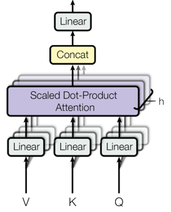

# Large Language Models

von _Richard Kelnhofer, Nick Thomas und Daniel Stoffel_

## Abstract

Das Arbeiten ohne Hilfe von ChatGPT, GitHubCopilot, etc. ist inzwischen für viele Menschen nur schwer vorstellbar. Diese Sogenannten LLMs(Large Language Models) haben innerhalb kürzester Zeit nach ihrer Veröffentlichung die Welt im Sturm erobert. Ihre Fähigkeit, Syntax, Zusammenhang und Semantik zu verstehen, macht sie zu unglaublich performanten und unerschöpflichen Assistenten für jeden, der Zugriff auf das Internet hat. Somit wurde in den letzten Jahren eine neue Generation von Assistenzsystemen geboren, welche einen bedeutenden Wert für die Menschheit bieten. Dieser Bericht umfasst drei unterschiedliche Module, welche sich von oberflächlichem Verständnis über detaillierte Informationen bis zur Anwendung strecken.

Der **Podcast** dieses Beitrags versucht Laien, aber auch Informatiker in den Bereich der LLMs einzuführen. Zunächst wird ein kleiner Teaser über die Funktionsweise der unterliegenden Technologien gegeben. Anschließend wird über die Anwendungsgebiete dieser LLMs diskutiert und es wird erläutert, welche Modifikationen ChatGPT besonders machen. Am Ende des Podcasts kommen wir zum Resultat, dass LLMs auch Gefahren bergen und so mit verfälschten Trainingsdaten (absichtlich oder versehentlich) zur Desinformation der Bevölkerung führen könnte. Die Kontrolle und Verantwortung liegt hier bei den Unternehmen, die diese Modelle erschaffen.

Der **Fachvortrag** geht äußerst detailliert auf alle Aspekte der Transformer-Modelle ein, wie z.B. Tokenisierung, Attention-Mechanismen und die generelle Architektur. Am Ende werden des weiteren Key-Features von ChatGPT, wie das Reward-Model ausführlich erläutert.

In der **Code-Demo** wird eine Library namens "LangChain" vorgestellt, welche es einfach macht, Das Wissen von LLMs zu erweitern(oder aktualisieren), mit LLMs komplexe Aufgaben zu lösen, und diese evtl. sogar in Reihe zu schalten. "LangChain" ist in den letzten Jahren zu der bekanntesten Python-Library für das Arbeiten mit LLMs geworden. In der Demo wird die Anwendung einiger Funktionen anhand des Bespiels der Generierung eines Podcast-Scripts gezeigt und hier verwendet um eigene PDFs in die Wissensbasis des Vortrainierten GPT3.5 einführen zu lassen.

## 1 Einleitung / Motivation

Large Language Models(LLMs) sind eine der größten Neuerungen im Bereich der Künstlichen Intelligenz und haben seit ihrer Erscheinung bereits viele Menschen in Angst um ihre Arbeitsplätze versetzt.  Startschuss für diese Flut an LLMs waren die sogenannten "Transformer" Modelle, welche erstmals 2017 von Forschern von Google präsentiert wurden und RNNs(Recurrent Neural Networks) in NLP(Natural Language Processing)-Tasks den Kampf ansagten. Im Gegensatz zu RNNs, welche schwer trainierbar auf große Datenmengen waren, konnten die Transformer problemlos Unmengen an Daten verarbeiten. Sie verfügen ebenso über sogenannte "Attention" und "Self-Attention", welche sie äußerst passend für sequenzielle Probleme macht.

Mit diesen Eigenschaften in ihrer Architektur können Transformer, Wortposition, Wortbedeutung und Satz-Syntax selbst ganz ohne Handbenannte Daten lernen. Dies macht sie trainierbar auf exorbitanten Datenmengen, was ihre Fähigkeiten und Bandbreite ihres Wissens im Vergleich zu herkömmlichen Methoden enorm steigert.

Fast alle modernen LLMs basieren auf genau dieser Transformer-Technologie, erweitern sie aber wie z.B. bei ChatGPT mit handbenannte Daten und sogenannten "Reward-Models", welche dem Transformer Feedback geben können. ChatGPT ist zwar das bekannteste, aber bei weitem nicht das Einzige LLM. Es gibt zahlreiche kreative Anwendungsmöglichkeiten, welche auf Transformer bauen, die wir hier kurz präsentieren möchten.

**AutoGPT** zum Beispiel ist ein Spezielles Modell, welches versucht eine Aufgabe so gut wie möglich zu absolvieren. Das Besondere ist, dass es dabei Google benutzen kann, aber auch Ordner auf dem Computer erstellen kann.

**MiniGPT** ist ein Open-Source ChatBot, welcher "sehen" kann und somit auch mit Bildern arbeiten kann.

Zu guter Letzt gibt es **perplexity.ai**, eine kostenlose KI-Suchmaschine, welche bei ihren Antworten auch die Quellen der Informationen angibt.

Dies sind nur ein Paar Beispiele, für welche Anwendungen LLMs bereits verwendet werden. Ihre Anzahl wird in den kommenden Jahren wohlmöglich explodieren.

## 2 Methoden

In diesem Abschnitt werden verschiedene wichtige Konzepte und Techniken im Bereich des Natural Language Processing (NLP) behandelt. Es wird auf die grundlegenden Bausteinen des Transformer-Modells eingegangen, das eine Revolution in der NLP-Forschung und -Anwendung darstellt. Der Transformer ist die Grundlage für viele fortschrittliche Modelle, einschließlich BERT (Bidirectional Encoder Representations from Transformers) und GPT (Generative Pre-Training). Neben der Beschreibung der Architektur und Funktionsweise von Transformer, BERT und GPT werden auch wichtige Aspekte wie Tokenisierung, Embeddings, Positional Encoding und Fine-Tuning behandelt. Des Weiteren werden Konzepte wie Meta-Learning und Benchmarking erläutert, die zur Weiterentwicklung und Evaluierung von NLP-Motdellen beiragen. Somit wird ein umfassender Überblick über die aktuellen Schlüsselkonzepten und Techniken im Bereich des NLP gegeben.

### 2.1 Daten

---

Daten bilden das Herzstück der modernen Sprachverarbeitung und intensive Forschung wird in diesem Bereich betrieben, um immer fortschrittlichere Vektorrepräsentationen für Wörter zu entwickeln. Diese repräsentativen Vektoren werden auch als **Embeddings** bezeichnet und bilden die Grundlage für die meisten Modelle im Bereich der natürlichen Sprachverarbeitung (NLP). Dieser Abschnitt widmet sich den zentralen Konzepten und Techniken zur Erstellung von Embeddings – angefangen bei der Tokenisierung, die den Text in einzelne Token zerlegt, bis hin zu den Embeddings selbst, welche die Wörter in einem Vektorraum abbilden.

#### 2.1.1 Tokenisierung

In der Literatur gibt es sehr viele Tokenisierungstechniken. Hier werden nur ein paar davon näher betrachtet. Den Anfang machen die regelbasierten Tokenizer, deren Regeln von Menschen erstellt werden. Typische Tokenisierungsregeln sind:

- Trennung an Satzzeichen

- Trennung an Leerzeichen

- Trennung an Sonderzeichen

Ein Beispiel für einen regelbasierten Tokenizer ist der [Penn Treebank Tokenizer](https://www.nltk.org/_modules/nltk/tokenize/treebank.html). Dieser Tokenizer ist in der Lage, die Tokens eines Textes zu extrahieren. Dabei werden die Tokens an Leerzeichen, Satzzeichen und Sonderzeichen getrennt. Im Kern verwendet er reguläre Ausdrücke, um die Tokens zu extrahieren. Weitergehend kann man auch auf Klein- und Großschreibung achten und diese Regeln in den Tokenizer einbauen. Zusätzlich kann man auch Lemmatizer und Stemmer verwenden, um die Tokens zu normalisieren.

```python
from nltk.tokenize import TreebankWordTokenizer

tokenizer = TreebankWordTokenizer()
text = "I can't wait to visit the U.S. next year."
tokens = tokenizer.tokenize(text)
print(tokens)
```

```python
['I', 'ca', "n't", 'wait', 'to', 'visit', 'the', 'U.S.', 'next', 'year', '.']
```

Das Ergebnis eines Tokenizers ist ein **Vokabular**, aus dem durch Embeddingalgorithmen Vektoren für Sprachmodelle entstehen. Dieses Vokabular ist das Fundament auf dem die Embeddings aufbauen. Es ist wichtig, dass das Vokabular möglichst groß ist, um eine gute Repräsentation der Sprache zu erreichen. Ein großes Vokabular hat aber auch Nachteile. Es ist sehr rechenintensiv und benötigt viel Speicher. Deshalb wird das Vokabular meistens auf die 30.000 häufigsten Wörter beschränkt. Jedoch gibt es auch Modelle mit weitaus größerem Vokabular. Zusätzlich muss das Vokabular nicht nur aus reinen Wörter bestehen. Was Regeln nicht erreichen, ist eine sinnvolle Trennung des Wortes `U.S.`. Regeln verstehen die Semantik hinter Abkürzungen nicht. Deshalb genügen reine regelbasierte Tokenizer nicht mehr.

Ein weiteres Vorgehen, um ein sinnvolles Vokabular zu erzeugen ist [Byte-Pair-Encoding](). Bevor man BPE verwenden, muss man seine Texte normalisieren. Auf diesen normalisierten Text wird ein Pre-Tokenizer angewendet, um Tokens zu generiern. Danach wird das Vokabular erstellt. Dieses Vokabular besteht aus den einzelnen Zeichen des Textes. Anschließend wird das Vokabular durchlaufen und die häufigsten Zeichenpaare gesucht. Diese werden dann zu einem neuen Zeichen zusammengefasst. Dieser Vorgang wird so oft wiederholt, bis das Vokabular die gewünschte Größe erreicht hat. Das Ergebnis ist ein Vokabular, das aus Zeichen und Zeichenpaaren besteht. Dieses Vokabular wird dann verwendet, um die Tokens zu generieren.

```python
from tokenizers import Tokenizer, models, pre_tokenizers, decoders, trainers

# Initialize the BPE tokenizer
tokenizer = Tokenizer(models.BPE())

# Create and configure the trainer
trainer = trainers.BpeTrainer(vocab_size=10000, special_tokens=["<s>", "<pad>", "</s>", "<unk>"])

# Train the tokenizer on your text data
tokenizer.train(["path/to/your/text/file.txt"], trainer)

# Encode a sentence using the trained tokenizer
sentence = "Hello, how are you?"
encoded_sentence = tokenizer.encode(sentence)

# Get the tokenized representation
tokens = encoded_sentence.tokens
print(tokens)

```

#### 2.1.2 Subword Tokenization

Hier werden [WordPiece](https://huggingface.co/docs/tokenizers/v0.13.3/en/api/models#tokenizers.models.BPE), [Unigram](https://huggingface.co/docs/tokenizers/v0.13.3/en/api/models#tokenizers.models.WordPiece) und [SentencePiece](https://github.com/google/sentencepiece) vorgestellt. Diese Tokenizer sind sehr ähnlich zu BPE. Dennoch erstellen alle 4 Verfahren andere Vokabelsets. WordPiece ist ein Tokenisierungsalgorithmus, der ursprünglich von Google für das NLP-Modell BERT (Bidirectional Encoder Representations from Transformers) entwickelt wurde. Es ist ein statistisches Verfahren, das auf der Idee basiert, häufige Zeichenfolgen von Zeichen in einem Textkorpus zu identifizieren und sie zu einem neuen Wort zusammenzufassen. WordPiece überprüft, ob es sinvoll ist, k Zeichen zu einem neuen Zeichen zusammenzufassen. Dieser Vorgang wird so oft wiederholt, bis das Vokabular die gewünschte Größe erreicht hat.

$$
max_{w \in V} \frac{count(\sum\limits_1^k w_k)}{\prod\limits_1^k count(w_k)}
$$

Das Unigram Vorgehen ist aus einem bestehenden Vokabular, unnötiges zu entfernen. Um das "Unnötige" zu bestimmen, berechnet Unigram den gesamten loss über das Vokabular mit dem Log-Likelihood. Das Vokabular wird dann so lange verkleinert, bis die gewünschte Größe erreicht ist.

$$
 Loss = -\sum\limits_{w \in V} log(P(w))
$$

Zu Letzt wird noch SentencePiece vorgestellt. Dieser Tokenizer ist ein weiteres Verfahren, um Subwords zu generieren. Es ist ein statistisches Verfahren, das auf der Idee basiert, häufige Zeichenfolgen in einem Textkorpus zu identifizieren und sie zu einem neuen Wort zusammenzufassen. Dabei basiert SentencePiece auf BPE, WordPiece, Unigram und vielen anderen.

```python
from tokenizers import Tokenizer, models, pre_tokenizers, decoders, trainers

# Initialize the WordPiece tokenizer
tokenizer = Tokenizer(models.WordPiece())

# Initialize the Unigram tokenizer
tokenizer = Tokenizer(models.Unigram())
```

```python
import sentencepiece as spm

# Train SentencePiece tokenizer
spm.SentencePieceTrainer.train(input='input.txt', model_prefix='spm_model', vocab_size=1000)

# Load trained SentencePiece tokenizer
tokenizer = spm.SentencePieceProcessor()
tokenizer.load('spm_model.model')
```

#### 2.1.3 Embeddings

In diesem Abschnitt werden die Idee, die Speicherung und verschiedene Algorithmen und Modelle vorgestellt, durch die Embeddings erzeugt werden können. Embeddings sind der weitere Schritt in der Datenverarbeitung nach dem Erstellen des Vokabulars durch Tokenizer. Das Ziel ist es die Wörter in eine Computer verständliche Form zu bringen. Dies wird erreicht, indem die Wörter in einen Vektor umgewandelt werden. Dieser Vektor zeigt die Beziehungen zwischen einzelnen Wörtern an.

!!! info "Definition"

        Die grundlegende Idee hinter Embeddings besteht darin, dass ähnliche Wörter ähnliche Vektoren besitzen, was dazu führt, dass sie im n-dimensionalen Raum räumlich nah beieinander liegen.

> “An embedding is a way of representing data as points in n-dimensional space so that similar data points cluster together.”

<figure markdown>
  { width="400" }
  <figcaption>Fig. Basic Function</figcaption>
</figure>

```python
import numpy as np
from gensim.models import Word2Vec
from tabulate import tabulate

# Define the word list
words = ["I", "love", "coding", "Python", "is", "great", "Machine", "learning", "fascinating"]

# Create a list of sentences
sentences = [["I", "love", "coding"],
             ["Python", "is", "great"],
             ["Machine", "learning", "is", "fascinating"]]

# Train the Word2Vec model
model = Word2Vec(sentences, min_count=1)

# Create a word correlation matrix
correlation_matrix = np.zeros((len(words), len(words)))

# Populate the correlation matrix
for i, word1 in enumerate(words):
    for j, word2 in enumerate(words):
        correlation_matrix[i, j] = model.wv.similarity(word1, word2)

# Create a table with row and column headers
table = [[word] + list(row) for word, row in zip(words, correlation_matrix)]

# Add column headers
table.insert(0, [''] + words)

# Print the table
print(tabulate(table, headers="firstrow", tablefmt="grid"))
```

```python
+-------------+-------------+-------------+-------------+-------------+------------+-------------+------------+-------------+---------------+
|             |           I |        love |      coding |      Python |         is |       great |    Machine |    learning |   fascinating |
+=============+=============+=============+=============+=============+============+=============+============+=============+===============+
| I           |  1          | -0.144546   |  0.00882618 |  0.0605919  |  0.0270575 | -0.0690033  |  0.0749756 |  0.199121   |    0.0336406  |
+-------------+-------------+-------------+-------------+-------------+------------+-------------+------------+-------------+---------------+
| love        | -0.144546   |  1          |  0.0048425  | -0.0577458  |  0.0929172 | -0.028491   | -0.0136798 | -0.00275401 |   -0.115555   |
+-------------+-------------+-------------+-------------+-------------+------------+-------------+------------+-------------+---------------+
| coding      |  0.00882618 |  0.0048425  |  1          |  0.0191523  |  0.0161347 |  0.0347649  |  0.0415774 |  0.145951   |   -0.114107   |
+-------------+-------------+-------------+-------------+-------------+------------+-------------+------------+-------------+---------------+
| Python      |  0.0605919  | -0.0577458  |  0.0191523  |  1          | -0.0598763 |  0.13888    |  0.13149   |  0.0640898  |    0.00939116 |
+-------------+-------------+-------------+-------------+-------------+------------+-------------+------------+-------------+---------------+
| is          |  0.0270575  |  0.0929172  |  0.0161347  | -0.0598763  |  1         | -0.0277504  | -0.111671  | -0.0523467  |   -0.0108392  |
+-------------+-------------+-------------+-------------+-------------+------------+-------------+------------+-------------+---------------+
| great       | -0.0690033  | -0.028491   |  0.0347649  |  0.13888    | -0.0277504 |  1          | -0.0446171 |  0.170189   |    0.00450302 |
+-------------+-------------+-------------+-------------+-------------+------------+-------------+------------+-------------+---------------+
| Machine     |  0.0749756  | -0.0136798  |  0.0415774  |  0.13149    | -0.111671  | -0.0446171  |  1         | -0.0135149  |    0.067976   |
+-------------+-------------+-------------+-------------+-------------+------------+-------------+------------+-------------+---------------+
| learning    |  0.199121   | -0.00275401 |  0.145951   |  0.0640898  | -0.0523467 |  0.170189   | -0.0135149 |  1          |   -0.0236717  |
+-------------+-------------+-------------+-------------+-------------+------------+-------------+------------+-------------+---------------+
| fascinating |  0.0336406  | -0.115555   | -0.114107   |  0.00939116 | -0.0108392 |  0.00450302 |  0.067976  | -0.0236717  |    1          |
+-------------+-------------+-------------+-------------+-------------+------------+-------------+------------+-------------+---------------+
```

```python
# Print the model
print(model)

Output:
Word2Vec<vocab=9, vector_size=100, alpha=0.025>


# Print the word vector for the word "I"
print(model.wv["I"])

Output:
[-9.5785465e-03  8.9431154e-03  4.1650687e-03  9.2347348e-03
  6.6435025e-03  2.9247368e-03  9.8040197e-03 -4.4246409e-03
 -6.8033109e-03  4.2273807e-03  3.7290000e-03 -5.6646108e-03
  9.7047603e-03 -3.5583067e-03  9.5494064e-03  8.3472609e-04
 -6.3384566e-03 -1.9771170e-03 -7.3770545e-03 -2.9795230e-03
  1.0416972e-03  9.4826873e-03  9.3558477e-03 -6.5958775e-03
  3.4751510e-03  2.2755705e-03 -2.4893521e-03 -9.2291720e-03
  1.0271263e-03 -8.1657059e-03  6.3201892e-03 -5.8000805e-03
  5.5354391e-03  9.8337233e-03 -1.6000033e-04  4.5284927e-03
 -1.8094003e-03  7.3607611e-03  3.9400971e-03 -9.0103243e-03
 -2.3985039e-03  3.6287690e-03 -9.9568366e-05 -1.2012708e-03
 -1.0554385e-03 -1.6716016e-03  6.0495257e-04  4.1650953e-03
 -4.2527914e-03 -3.8336217e-03 -5.2816868e-05  2.6935578e-04
 -1.6880632e-04 -4.7855065e-03  4.3134023e-03 -2.1719194e-03
  2.1035396e-03  6.6652300e-04  5.9696771e-03 -6.8423809e-03
 -6.8157101e-03 -4.4762576e-03  9.4358288e-03 -1.5918827e-03
 -9.4292425e-03 -5.4504158e-04 -4.4489228e-03  6.0000787e-03
 -9.5836855e-03  2.8590010e-03 -9.2528323e-03  1.2498009e-03
  5.9991982e-03  7.3973476e-03 -7.6214634e-03 -6.0530235e-03
 -6.8384409e-03 -7.9183402e-03 -9.4990805e-03 -2.1254970e-03
 -8.3593250e-04 -7.2562015e-03  6.7870365e-03  1.1196196e-03
  5.8288667e-03  1.4728665e-03  7.8936579e-04 -7.3681297e-03
 -2.1766580e-03  4.3210792e-03 -5.0853146e-03  1.1307895e-03
  2.8833640e-03 -1.5363609e-03  9.9322954e-03  8.3496347e-03
  2.4156666e-03  7.1182456e-03  5.8914376e-03 -5.5806171e-03]
```

Im einfachsten Fall, liegt ein Wert pro Spalte zwischen 0 und 1. Dieser Wert gibt an, wie stark das Wort mit dem jeweiligen Merkmal korreliert. Wenn der Wert 0 ist, ist die Korrelation zwischen dem Wort und dem Merkmal nicht vorhanden. Wenn der Wert 1 ist, ist die Korrelation zwischen dem Wort und dem Merkmal sehr stark. In der Praxis werden die Werte jedoch nicht immer zwischen 0 und 1 liegen. Die Werte können auch negativ sein oder größer als 1 werden.

Um bei einen Embedding herauszufinden, wie ähnlich sich zwei Wortvektoren sind, wird der Cosinus-Abstand, euklidische Abstand oder das Skalarprodukt verwendet. Die Ergebnis des Skalarprodukts ist ein skalarer Wert. Wenn das Skalarprodukt von a · b einen Wert nahe der Null hat, sind die Vektoren senkrecht zueinander und haben somit keine Korrelation. Wenn das Skalarprodukt positiv ist, sind die Vektoren ähnlich oder parallel, während ein negatives Skalarprodukt auf eine entgegengesetzte oder divergierende Ausrichtung der Vektoren hinweist.

$$ a \cdot b = a_1 * b_1 + ... + a_n * b_n $$

Die Aussagekraft des euklidischen Abstandes ist besser als die des Skalarproduktes. Als Ergebnis kommt ein skalarer Wertraus, der die Distanz zwischen den Vektoren angibt. Je kleiner der Wert, desto ähnlicher sind die Vektoren. Jedoch wird der Wert durch die Komponenten der Vektor stark beeinflusst. An sich wird der Differenzenvektor von a und b berechnet, an dem die euklidische Norm verwendet wird. Die euklidische Norm ist die Länge eines Vektors.

Den Abstand zweier Vektoren darf man für das Ähnlichkeitsmaß nutzen, da folgende Gleichungen erfüllt sind:

- Kommutativgesetz: $ ||x, y|| = ||y, x|| $

- Hilbert Norm: $ ||x|| = \sqrt{x \cdot x} $

- Cauchy-Schwarz-Ungleichung: $ |x \cdot y| \leq ||x|| * ||y|| $

- Homogenität: $ ||\alpha * x|| = |\alpha| * ||x|| $

- Nichtnegativität: $ ||x|| \geq 0 $

$$ d(a,b) = ||a - b||\_2 = \sqrt{\prod\limits_k^n (a_k - b_k)^2} $$

Das wichtigste Maß für die Entscheidung über Ähnlichkeit ist die Cosinus-Ähnlichkeit. Sie ist definiert als der Kosinus des Winkels zwischen den beiden Vektoren, somit liegen die Werte zwischen -1 und 1, wobei 1 für perfekte Ähnlichkeit steht.

$$ cos(\theta) = \frac{a \cdot b}{||a||_2 * ||b||_2} $$

Die Berechnung der Ähnlichkeit, hilft nicht nur beim trainieren von Sprachmodellen, sonderen ist auch ein effizienter Weg Vektoren zu speichern. Für die Speicherung werden **Vektor Datenbanken** verwendet. Hierbei unterscheident man in eine reine Indeximplementierung wie [FAISS](https://www.pinecone.io/learn/faiss/) oder ein Datenbankmanagement System wie [Pinecone](https://www.pinecone.io/). Je nach Anwendungszweck muss entschieden werden, ob Geschwiningkeit oder Sicherheit wichtiger ist.
Ein Vektor-Datenbankmanagesystem liefert die gängigen Werkzeuge, um die Speicherung von Vektoren zu verwalten. Dazu gehören die folgenden Funktionen:

- Data Management: Speichern, Abrufen, Löschen und Aktualisieren von Vektoren

- Indexing: Erstellen von Indizes für die Suche

- Metadata Management: Speichern von Metadaten zu Vektoren

- Scalability & Integration: Skalierung und Integration in bestehende Systeme

- Real-Time updates: Echtzeit-Updates von Vektoren

- Backups & Collection: Backups und Sammlungen von Vektoren(Window-Functions)

- Security & access control: Sicherheit und Zugriffskontrolle

Ein Index hat vieles davon nicht. Dementsprechend muss man sicher sehr sicher sein, falls man die Indeximplementierung wählt. Andernfalls werden einzelne Funktionen selbst implementiert, was zu einem Mehraufwand führt.

<figure markdown>
  { width="400" }
  <figcaption>Fig. Vector Database</figcaption>
</figure>

Vektoren werden durch Algorithmen wie _Product Quantinization_, _Locality Sensitive Hashing_ oder _Hierarchical Navigable Small World_ in einen Index umgewandelt. Dieser Index landet mit dem dazugehörigen Originalvektor in der Vektor Datenbank. Beim Querying wird der Query-Vektor in den Index umgewandelt und mit den Indexvektoren verglichen. Die Ergebnisse werden dann zurückgegeben. Schließlich kommt es zum Postprocessing, bei dem die Ergebnisse gefiltert und / oder geordnet werden. Somit kommt es zu einer Neubewertung aller Ergebnisse und das beste Ergebnis wird zurückgegeben.

Product Quantization ist eine Technik, die in der Vektorquantisierung verwendet wird, um hochdimensionale Vektoren durch eine kleinere Menge von Prototypvektoren zu repräsentieren und somit zu komprimieren. Das Ziel von Product Quantization besteht darin, den Speicherbedarf hochdimensionaler Vektoren zu reduzieren, während ihre wesentlichen Merkmale erhalten bleiben. Somit wird der originale Vektor in mehrere Subvektoren aufgeteilt, die einzeln quantisiert werden. Die Quantisierung wird durch _centroids_ durchgeführt. Das sind Vektoren (_reproduction values_), die sich in einem Subraum befinden, wo die Komponenten der Subvektoren ihre nächsten Nachbarn suchen, indem diese k-nearest-neighbours (kNN) verwenden. Folglich wird auf das naheste reproduction value gemappt, um den Vektor zu repräsentieren.

<figure markdown>
  { width="400" }
  <figcaption>Fig. Product Quantinization</figcaption>
</figure>

Jetzt wo das sicher der Vektoren klargestellt ist, kann man anfangen Embeddings zu berechnen. Der bekannteste Ansatz ist _Word2Vec_. Hierzu gibt es zwei Architekturen: _Continuous Bag of Words_ und _Skip-Gram_. Beide Architekturen sind neural network language models. Das Ziel ist es, die Wahrscheinlichkeit eines Wortes zu berechnen, das auf ein anderes Wort folgt. Die Architektur des CBOW-Modells und des Skip-Gram-Modells ist in der folgenden Abbildung dargestellt.

<figure markdown>
  { width="400" }
  <figcaption>Fig. Word2Vec</figcaption>
</figure>

Das Ziel des CBOW ist es, ein Wort innerhalb eines Kontextes vorherzusagen, während das Ziel des Skip-Grams die Vorhersage desKontextes um ein Wort ist. Beide verwenden ein hidden layer ohne Aktivierungsfunktion. Folglich findet eine Projektion statt, indem das Skalarprodukt von Eingabevektor und Gewichtsmatrix gebildet wird. Schließlich wird in der Ausgabe Schicht ein hierachischer Softmax verwendet. Er nutzt einen binären Baum, um die Wahrscheinlichkeit eines Wortes zu berechnen. Anstatt alle Wörter im Vokabular zu berücksichtigen, wird der hierarchische Softmax die Wahrscheinlichkeit schrittweise berechnen, indem er den Baum durchläuft. Dieser Baum organisiert die Wörter hierarchisch, wobei häufigere Wörter näher an der Wurzel und seltenere Wörter weiter unten im Baum platziert werden. Indem der hierarchische Softmax den binären Baum verwendet, kann er die Anzahl der Berechnungen reduzieren, da er nur einen Teil des Baums durchlaufen muss, um die Wahrscheinlichkeit eines bestimmten Wortes zu bestimmen. Dies führt zu einer beschleunigten Vorhersagephase und ermöglicht die effiziente Verarbeitung großer Vokabulare. Zum Vallidieren der Ausgaben wird One-Hot-Encoding verwendet.

<figure markdown>
  { width="400" }
  <figcaption>Fig. hierachischer Softmax</figcaption>
</figure>

Zum Trainieren wird sub sampling als auch negative sampling verwendet. Sub sampling überprüft von vorne weg, ob ein Wort in das Context Fenster aufgenommen wird oder nicht. Ein Context Fenster entsteht, um ein betrachtetes Wort und seine direkten Nachbarn. Die Wahrscheinlichkeit, dass ein Wort in das Context Fenster aufgenommen wird, ist umgekehrt proportional zu seiner Häufigkeit.

$$ P(w_i) = (\sqrt{\frac{z(w_i)}{0.001}} + 1) * \frac{0.001}{z(w_i)} $$

Negative sampling ist eine Technik, die die Trainingszeit verkürzt, indem sie nur eine kleine Anzahl von negativen Beispielen und das positive Beispiel auswählt, um die Gewichte zu aktualisieren. Bei einer großen Anzahl von Perzeptronen in der Eingabeschicht kann das Training lange dauern, wenn man alle Gewichte anpasssen muss, obwohl man nur pro Wort anpasst. Die Anzahl der negativen Beispiele ist ein Hyperparameter, der die Genauigkeit und die Trainingszeit beeinflusst. Die Formel für die Berechnung der Wahrscheinlichkeit eines negativen Beispiels ist wie folgt:

$$ P(w*i) = \frac{z(w_i)^{3/4}}{\sum_{j=0}^{n} z(w_j)^{3/4}} $$

<figure markdown>
  { width="400" }
  <figcaption>Fig. negative sampling</figcaption>
</figure>

Die Erweiterung von Word2Vec ist Fasttext, das von Facebook 2017 veröffentlicht wurde. Es berücktsichtigt die Morphologie von Wörtern. Im Gegensatz zu Word2Vec, das Wörter als diskrete Einheiten betrachtet, betrachtet Fasttext Wörter als eine Reihe von Zeichen oder n-Grammen. Somit wird es robuster gegen unbekannte Wörter. Das Resultat ist eine "Tasche" von verschiedenen n-Grammen zu einem Wort. Dies hat zur Folge, dass eine geteilte Repräsentation über Wörtern entsteht und somit die Repräsentation von seltenen Wörtern verbessert wird. Die Vorhersage, basiert auf eine Score-Funktion, die die Summe der Vektoren der n-Gramme des Wortes ist. Die Score-Funktion ist wie folgt definiert:

$$ s(w, c) = \sum\limits_{g \in G_w} z_g^T v_c $$

- G ist die Menge der n-Gramme zu einem Wort w

- z ist der Vektor eines n-Gramms

- v ist der Vektor des zugehörigen Kontexts

Es können auch Language Models für Embeddings verwendet werden. Ein Beispiel ist *GloVe*. Es verwendet eine Matrix, um die Beziehung zwischen Wörtern zu erfassen. Hierbei wird betrachtet wie oft Wörter miteinander in einem Kontext auftauchen. Mit der SVG (Singularwertzelegung) wird die ursprüngliche Matrix in kleiner Matrizen geteilt. Dabei werden die Wortembeddings erzeugt.
Dennoch werden Embeddings auch mit Transformer Modellen wie Bert und GPT erstellt. Diese werden in den nächsten Kapitel genauer betrachtet. Doch ein weiteres Modell ist interessant: *ELMo*(Embeddings from Language Models). ELMo basiert auf einem didirektionalen LSTM. Das hat den Vorteil, dass Sequenzen von beiden Richtungen durchgegangen werden können.

$$ ELMo_k^{task} = E(R_k; \theta^{task}) = \gamma^{task}\sum\limits_{j=0}^L s_j^{task} h_{k, j}^{LM} $$

- $\gamma^{task}$ ist ein Skalarparameter, der für jede Aufgabe trainiert wird und den ELMo Vektor skaliert

- $s_j^{task}$ sind softmax-normalisierte Gewichte, die für jede Aufgabe trainiert werden

- $h_{k, j}^{LM}$ ist der j-te hidden LSTM Zustand für das k-te Token

- $R_k$ ist die Repräsentation des k-ten Tokens

- $\theta^{task}$ sind die Parameter der Aufgabe

- $ELMo_k^{task}$ ein einziger Vektor aus der Reduzierung aller Schichten in R

LSTMs können durch ihre Zellen und rekusiver Natur für Sequenzverarbeitung verwendet werden. Die Zellen sind in der Lage, Informationen über einen längeren Zeitraum zu speichern und diese zu filtern. Die rekursive Natur eines LSTM kommt daher, dass es eine Verbesserung des RNNs ist. Das wichtigste für die Embeddinggenerierung ist es, dass die resultierenden Embeddings kontextabhängig sind. Die LSTM-Zellen liefern den Kontext, indem sie die vorherigen Ausgaben berücksichtigen. Ein weiterer Vorteil einer LSTM-Architektur ist es, dass pro Zelle über den Hidden State eine Vektorrepräsentation entsteht. Diese Vektorrepräsentationen werden für die Embeddinggenerierung verwendet. Somit glit für die linke Seite: $\vec{h}_{k, j}^{LM}$ für $t_{k+1}$ und für die rechte Seite gilt: $\overleftarrow{h}_{k, j}^{LM}$ für $t_{k}$.

Um diese Vektorrepräsentationen zu erzeugen, muss ELMo trainiert werden. Dies geschieht, indem die Wahrscheinlichkeit für das Vorkommen eines Wortes innerhalb einer Sequenz maximiert wird und die aufkommenden Fehler minimiert werden. Die Wahrscheinlichkeit wird wie folgt berechnet:

$$ 
max(
    \sum\limits_{k=1}^{K}
        log P(t_k | t_1, ..., t_{k-1}; \theta_x, \vec\theta_{LSTM}, \theta_s) +
        log P(t_t | t_{k+1}, ..., t_K; \theta_x, \overleftarrow{\theta}_{LSTM}, \theta_s))
$$

Anhand der Gleichung sieht man genau, dass die Sequenzen von beiden Richtungen durchgegangen werden. Um die Wahrscheinlichkeit für das Vorkommen eines Wortes innerhalb einer Sequenz zu berechnen, wird in der Bedingung jeweils die linke oder rechte Seite verwendet. Zusätzlich werden noch die zugehörigen Gewichtsmatrizen $\theta_x, \vec\theta_{LSTM}, \overleftarrow{\theta}_{LSTM}, \theta_s$ in die Wahrscheinlichkeitsberechnung mit rein gerechnet. Schließlich kann jedes Token als eine Menge von Vektorrepräsentaion dargestellt werden. Die Größer einer solchen Menge ist abhängig von der Anzahl der LSTM-Zellen, wodruch sich folgende Gleichung ergibt: $size(R_t) = 2 * L + 1$, wobei L die Anzahl der LSTM-Zellen ist. Somit lässt sich jedes Token als eine Menge von Vektorrepräsentationen darstellen.

$$ R_t = \{x_k^{LM}, \vec{h}_{k, j}^{LM}, \overleftarrow{h}_{k, j}^{LM} | j = 1, ... , L\} $$

<figure markdown>
  { width="400" }
  <figcaption>Fig. ELMo</figcaption>
</figure>

Zu guter letzt muss man noch mutli-sense embeddings betrachten. Hier versucht man die Mehrdeutigkeit von Wörtern abzubilden. Mögliche Ansätze sind:

- Sense2Vec

- ELMo + Clustering

- Transformer

Speziell benutzt man clustering Methoden, um die Mehrdeutigkeit von Wörtern abzubilden. Hierbei werden die Embeddings von Wörtern in Cluster unterteilt, wobei pro Cluster ein neue Repräsentation des Wortes entsteht. Um dies zu erreichen, werden cluster Algorithmen benötigt, die mit hochdimensonalen Vektoren umgehen können. Beispiele sind: K-Means, DBSCAN, Mean-Shift, Affinity Propagation, Spectral Clustering, Hierarchical Clustering, Gaussian Mixture Models und noch viele mehr. Im folgenden werden die Algorithmen K-Means und Mean-Shift genauer betrachtet.

K-Means ist ein iterativer Algorithmus, der versucht die Daten in k Cluster zu unterteilen. Hierbei wird die Distanz zwischen den Datenpunkten und den Clusterzentren minimiert. Die Clusterzentren werden durch den Mittelwert der Datenpunkte gebildet. Der Algorithmus funktioniert wie folgt:

1. Wähle k zufällige Punkte als Clusterzentren

2. Berechne die Distanz zwischen den Datenpunkten und den Clusterzentren

3. Weise jeden Datenpunkt dem nächstgelegenen Clusterzentrum zu

4. Berechne die neuen Clusterzentren

5. Wiederhole Schritt 2 bis 4, bis sich die Clusterzentren konvergieren

Der Algorithmus ist einfach zu implementieren und schnell in der Ausführung. Doch er hat auch Nachteile. Zum einen muss die Anzahl der Cluster k bekannt sein. Zum anderen ist der Algorithmus anfällig für Ausreißer, was zu falschen Clusterzentren führen kann.

Mean-Shift ist ein iterativer Algorithmus, der auf der Idee basiert, dass Datenpunkte zur lokalen Dichtemaxima tendieren. Er kann verwendet werden, um natürliche Cluster in Daten zu finden, ohne die Anzahl der Cluster im Voraus zu kennen. Somit benötig man einen Kernel, den man vorab initialisieren muss. Meistens wird hierfür der Gauß-Kernel verwendet. $K(x) = \frac{1}{\sqrt{2\pi\sigma^2}}e^{-\frac{x^2}{2\sigma^2}}$. Danach kann die Suche nach den lokalen Dichtemaxima beginnen. Der Algorithmus funktioniert wie folgt:

1. Wähle einen Datenpunkt als Startpunkt

2. Berechne den Kreis mit Radius r um den Startpunkt

3. Berechne den Schwerpunkt der Datenpunkte innerhalb des Kreises

4. Setze den Schwerpunkt als neuen Mittelpunkt

5. Wiederhole Schritt 2 bis 4, bis sich die Mittelpunkte konvergieren

Somit wird der Mittelpunkt immer näher an das lokale Dichtemaxima herangeführt, da die Datenpunkte innherhalb des Kreises immer mehr werden sollen. Diese Eingenschaft des Algorithmus wird auch als hill climbing bezeichnet.

<figure markdown>
  { width="400" }
  <figcaption>Fig. Mean Shift</figcaption>
</figure>

Ein Vorteil von Mean-Shift-Clustering ist, dass es automatisch die Anzahl der Cluster bestimmt, da die Cluster durch die lokalen Maxima der Datenpunktdichte definiert werden. Der Algorithmus ist auch robust gegenüber Rauschen und kann Cluster mit komplexen Formen erfassen. Allerdings kann die Performance des Algorithmus bei großen Datensätzen beeinträchtigt sein, da er eine hohe Rechenleistung erfordert, um die Dichte in einem hochdimensionalen Raum zu berechnen.


### 2.2 Transformer
---

Der Transformer ist ein fortschrittliches neuronales Netzwerkmodell, das in der natürlichen Sprachverarbeitung (NLP) weit verbreitet ist. Er wurde erstmals 2017 in einem bahnbrechenden Paper namens "Attention is All You Need" vorgestellt. Im Gegensatz zu traditionellen rekurrenten und faltenden Architekturen hat der Transformer in NLP-Aufgaben wie maschineller Übersetzung, Textklassifikation und Spracherkennung für Aufsehen gesorgt. Das Kernkonzept des Transformers ist die Verwendung von Self-Attention-Mechanismen, die es dem Modell ermöglichen, relevante Teile der Eingabe zu identifizieren und deren Beziehungen zu modellieren. Der Transformer nutzt auch andere Techniken wie Positional Encoding, um die Positionsinformationen der Eingabesequenzen zu berücksichtigen, und Multi-Head Attention, um verschiedene Aufmerksamkeitsrepräsentationen zu erfassen. Darüber hinaus umfasst der Transformer Residual Connections und Layer Normalization, um den Trainingsprozess zu stabilisieren, sowie Dropout, um Overfitting zu verhindern. Der Optimizer steuert die Aktualisierung der Modellparameter, während die Ausgabeschicht die Vorhersagen des Modells erzeugt. Insgesamt bietet der Transformer eine effiziente Verarbeitung von Sequenzdaten und ist zu einem grundlegenden Modell in der NLP-Forschung und -Anwendung geworden.

<figure markdown>
  { width="400" }
  <figcaption>Fig. Transformer Architektur</figcaption>
</figure>

!!! info "Wichtig"

        Die Transformer Architektur ist die **state of the art** Architektur für NLP Aufgaben.

#### 2.2.1 Positional Encoding

Positional Encoding wird verwendet, um die Positionsinformationen der Eingabesequenzen in den Wortembeddings zu berücksichtigen. Da der Transformer keine rekurrenten oder faltenden Schichten enthält, müssen die Positionsinformationen explizit in das Modell integriert werden. Das Positional Encoding wird den Wortembeddings hinzugefügt und ermöglicht es dem Transformer, die relative Position der Wörter in der Eingabesequenz zu berücksichtigen.

Es besteht aus Sinus- und Kosinus-Funktionen mit unterschiedlichen Frequenzen und Phasen. Die Idee dahinter ist, dass die Kombination dieser Funktionen eine eindeutige Repräsentation für jede Position in der Sequenz erzeugt. Das Positional Encoding wird dann elementweise zu den Wortembeddings addiert, um die Information über die Positionen in den Gesamtvektor einzufügen.

Die Formel für das Positional Encoding lautet:

$$ PE_{(pos, 2i)} = \sin (\frac{pos}{10000^{2i/d_{\text{model}}}})$$

$$ PE_{(pos, 2i+1)} = \cos (\frac{pos}{10000^{2i/d_{\text{model}}}}) $$

Hierbei steht $pos$ für die Position in der Sequenz, $i$ für die Dimension des Wortembeddings und $d_{\text{model}}$ für die Größe des Wortembeddings. Das Positional Encoding hat die gleiche Dimension wie die Wortembeddings, sodass es direkt zu ihnen addiert werden kann.

<figure markdown>
  { width="400" }
  <figcaption>Fig. positional encoding</figcaption>
</figure>

Durch schafft man es, dass die Position von Wörtern in unterschiedlichen Satzlängen gleich repräsentiert werden. Den sowohl $i$ als auch $d_{\text{model}}$ sind konstant, sodass die Positionsinformationen von einzelnen Wörtern an der gleichen Stelle nicht von der Länge der Eingabesequenz abhängen.

<figure markdown>
  { width="400" }
  <figcaption>Fig. positional encoding Tabelle: (i, pos) </figcaption>
</figure>

Durch die Verwendung des Positional Encoding kann der Transformer die Positionsinformationen der Wörter berücksichtigen, ohne dass hierfür rekurrente oder faltende Schichten benötigt werden. Dies ermöglicht dem Modell, sowohl die Bedeutung der Wörter als auch ihre Position in der Sequenz zu erfassen und komplexe Zusammenhänge zwischen ihnen zu erlernen, die auf längere Sequenzen verallgemeinert werden können. Dadurch könnte das Modell effektiv Eingabesequenzen unterschiedlicher Längen verarbeiten.
Vereinfacht lässt es sich so darstellen:

$$ pe_{k} = \frac{1}{10000^{2k/d_{\text{model}}}} $$

$$\begin{bmatrix}
e_0  \\
e_1  \\
e_2  \\
e_3  \\
...  \\
e_n  \\
\end{bmatrix}_{d_n \times 1} + \begin{bmatrix}
\sin(pe_1 * 1) \\ 
\cos(pe_1 * 1) \\ 
\sin(pe_2 * 1) \\ 
\cos(pe_2 * 1) \\
... \\ 
\sin(pe_{n/2} * 1) \\ 
\cos(pe_{n/2} * 1) \\
\end{bmatrix}_{d_n \times 1}$$

#### 2.2.2 Architektur

Der Encoder schafft ein Verständnis für die Eingabesequenz, indem er die Embeddings durch mehrere hintereinandere kommende _Attenttion_ und _fully connected feed forward_ Schichten verarbeitet. Ein Encoder-Schicht besteht aus einer _multi-head self attention_ und einem _fully connected feed forward network_. Diese beiden werden Subschichten genannt. Zwishcen den Subschichten gibt es _residual connections_ und _layer normalization_, um das Netzwerk zu stabilisieren und die Trainingszeit zu verkürzen. Die Aufgabe des Encoders ist es, eine Repräsentation der Eingabesequenz zu erzeugen, wo die Bedeutung der Wörter, ihre Position in der Sequenz, Merkmale und globale Abhängigkeiten berücksichtigt werden, damit der Decoder die Ausgabe erzeugen kann.

<figure markdown>
  { width="400" }
  <figcaption>Fig. Encoder - Layer </figcaption>
</figure>

Der Decoder generiert die Ausgabe des Transformer Modelles. Eine Schicht des Decoders besteht aus einer _masked multi-head attention_ gefolgt von einer _mulit-head cross-attention_ und schließlich einem _fully connected feed forward network_. Diese drei Schichten sind die Subschichten einer Decoder-Schicht. Die _masked multi-head attention_ Schicht ist eine _multi-head attention_ Schicht, die eine Maske verwendet, um die Aufmerksamkeit auf die zukünftigen Wörter zu beschränken. Die _multi-head cross-attention_ Schicht verwendet die Ausgabe der _masked multi-head attention_ Schicht als Query und die Ausgabe des Encoders als Key und Value. Die Berechnung der _masked attention_ gleicht der, der _self attention_. Somit wird dem Decoder ermöglicht, die Ausgabe des Encoders zu verwenden, um die Bedeutung der Wörter in der Eingabesequenz zu verstehen und die Ausgabe zu erzeugen. Die _fully connected feed forward network_ Schicht ist die gleiche wie im Encoder. Der Decoder verwendet auch _residual connections_ und _layer normalization_ zwischen den Subschichten, um das Modell weiter zu stabilisieren.

<figure markdown>
  { width="500" }
  <figcaption>Fig. Decoder - Layer </figcaption>
</figure>

Attention ist ein zentrales Konzept in Transformer-Modellen und ermöglicht es dem Modell, sich auf relevante Teile der Eingabesequenz zu konzentrieren oder relevante Informationen zu extrahieren. Der Sinn von Attention besteht darin, die Verbindungen und Abhängigkeiten zwischen verschiedenen Teilen der Eingabesequenz zu erfassen und diese Informationen in der Modellverarbeitung zu berücksichtigen. Die Attention kann in verschiedene Typen unterteilt werden, die in den folgenden Abschnitten beschrieben werden.

<figure markdown>
  { width="600" }
  <figcaption>Fig. Attention Typen </figcaption>
</figure>

#### 2.2.3 Self-Attention

Self-attention wird auch als _intra_ oder __scaled dot product__ attention bezeichnet. Wie der Name schon vorwegnimmt, geht es darum verschiedenste Vektoren durch das Skalarprodukt zu verrechnen, um die Relevanz zwischen einzelnen Positionen zu berechnen. Somit wird jeder Vektor in einen Query, Key und Valuevektor zerlegt, wobei die Dimension dieser drei Vektoren kleiner ist als zum Originalvektor. Um Query, Key und Value Vektoren zu erhalten, muss man den Original Vektor mit drei spezifischen Gewichtsmatrizen multiplizieren.

$$Q = XW^Q; K = XW^K; V = XW^V$$

Die Gewichtsmatrizen werden während des Trainings gelernt. Die Dimension der Gewichtsmatrizen ist $d_{\text{model}} \times d_k$ für $W^Q$ und $W^K$ und $d_{\text{model}} \times d_v$ für $W^V$. Die Dimension des Originalvektors wird als $d_{\text{model}}$ bezeichnet und $d_k$ als auch $d_v$ sind die Dimensionen der Query, Key und Value Vektoren.

<figure markdown>
  { width="200" }
  <figcaption>Fig. Self-Attention </figcaption>
</figure>

Als erstes wird das Skalarprodukt zwischen den Query und Key Vektoren berechnet. Das Skalarprodukt wird durch die Division mit $\sqrt{d_k}$ skaliert. Die Skalierung ist wichtig, da sie bei der Berechnung der Aufmerksamkeitsgewichte hilft, die Varianz der Werte zu reduzieren und die Stabilität der Gradienten zu verbessern. Danach folgt die Anwendung der Softmax Funktion, um die Summe aller positiven Wert auf 1 bringen und damit das Ergebnis zu normalisieren. Schließlich werden alle Value Vektoren mit dem Softmax Ergebnis multipliziert, um wichtige Informationen zu verstärken und unwichtige Informationen zu unterdrücken. Das Ergebnis ist die Summe aller gewichteten Value Vektoren. Die Self-Attention Formel kann wie folgt dargestellt werden, wenn man die Matrixmultiplikationen berücksichtigt:

$$\text{Attention}(Q, K, V) = \text{softmax}(\frac{QK^T}{\sqrt{d_k}})V$$

Das Ergebnis der self-attention wird dann angepasst durch _residual connections_ und _layer normalization_, was dann in das _feed forward network_ eingespeist wird.

#### 2.2.4 Cross-Attention

Cross-attention wird auch als _inter_ attention bezeichnet. Die Brechnung ist gleich der, der self-attention, wobei die Query Vektoren aus dem Decoder kommen und die Key und Value Vektoren aus dem Encoder. Die cross-attention Formel kann wie folgt dargestellt werden:

$$\text{Attention}(Q_D, K_E, V_E) = \text{softmax}(\frac{Q_DK_E^T}{\sqrt{d_k}})V_E$$

Der Zweck der Cross-Attention besteht darin, dem Decoder Kontextinformationen zu liefern, die auf den Inhalten der Eingabesequenz basieren. Dadurch kann der Decoder relevante Informationen aus der Eingabe extrahieren und sie in den Generierungsprozess der Ausgabe einbeziehen. Dies ermöglicht dem Modell eine bessere Berücksichtigung der globalen Zusammenhänge und Kontexte während der Generierung und verbessert die Leistungsfähigkeit des Modells insgesamt.

#### 2.2.5 Masked Attention

Die Idee der Masked Attention ist es, die Aufmerksamkeit auf zukünftige Tokens zu beschränken. Dies wird erreicht, indem die Repräsentation der zukünftigen Tokens auf $-\infty$ gesetzt werden. Dadurch wird die Softmax Funktion dazu gezwungen, die Aufmerksamkeitsgewichte der zukünftigen Tokens auf 0 zu setzen. Die Masked Attention Formel kann wie folgt dargestellt werden:

$$\text{Attention}(Q, K, V) = \text{softmax}(\frac{QK^TM}{\sqrt{d_k}})V$$

Die Maskierung in der maskierten Aufmerksamkeit besteht aus einer Matrix, die $-\infty$ für zukünftige Positionen und Einsen für aktuelle Positionen enthält. Diese Matrix wird auf die Aufmerksamkeitsgewichte angewendet, um sicherzustellen, dass das Modell nur auf bereits generierte Teile der Ausgabe zugreift. Eine gängige Methode für die Maskierung ist die Dreiecksmatrix. Ein Beispiel dafür:

$$M = \begin{bmatrix}
1 & -\infty & -\infty & -\infty & -\infty \\
1 & 1       & -\infty & -\infty & -\infty \\
1 & 1       & 1       & -\infty & -\infty \\
1 & 1       & 1       & 1       & -\infty \\
1 & 1       & 1       & 1       & 1       \\
\end{bmatrix}$$

#### 2.2.6 Multi-Head Attention

Die Multihead Attention ist ein Schlüsselelement in Transformer-Modellen und ermöglicht es dem Modell, mehrere Aufmerksamkeitsgewichtungen gleichzeitig zu berechnen und verschiedene Aspekte der Eingabesequenz zu erfassen. Sie besteht aus mehreren parallelen Aufmerksamkeitsköpfen, die unabhängig voneinander arbeiten. Jeder Aufmerksamkeitskopf hat seine eigenen Parametermatrizen für Query (Q), Key (K) und Value (V). Diese Matrizen werden verwendet, um die Aufmerksamkeitsgewichte für jede Position in der Eingabesequenz zu berechnen. Damit wird erreicht, dass sich das Transformer Modell auf verschiedene Aspekte der Eingabesequenz konzentrieren kann. Die Multihead Attention Formel kann wie folgt dargestellt werden:

$$\text{MultiHead}(Q, K, V) = \text{Concat}(\text{head}_1, ..., \text{head}_h)W^O$$

$$\text{head}_i = \text{Attention}(QW_i^Q, KW_i^K, VW_i^V)$$

Beim Zusammenfügen der verschiedenen _attention heads_ darf kein Durchschnitt gebildet werden, ansonsten würden Informationen verloren gehen, die zuvor berechnet wurden. Deshalb werden die _attention heads_ konkateniert. Schließlich muss die Dimensonalität der konkatenierten _attention heads_ reduziert werden, damit die Dimensionen mit der Dimension der Eingabeschicht des feed forward network übereinstimmen. Dies wird durch die Matrix $W^O$ erreicht.

<figure markdown>
  { width="200" }
  <figcaption>Fig. Multi-head Attention </figcaption>
</figure>

An dieser Stelle ist es wichtig zu erwähnen, dass die Multihead Attention nicht nur für die self-attention verwendet wird, sondern auch für die cross-attention und die masked attention. Dank der hohen Parallelität, kann das Sprachverstehen im Transformer auf mehreren unterschiedlich tiefen Ebenen stattfinden.

#### 2.2.7 Feed Forward Network

Das _Feed Forward Network_ (FFN) besteht aus zwei linearen Transformationen mit einer ReLU Aktivierungsfunktion dazwischen. Das Ziel des FFNs ist es, die Aufmerksamkeitsrepräsentationen zu verfeinern und weitere komplexe Zusammenhänge über die Nicht-Linearität zu erfassen. Die Nicht-Linearität wird durch die Verwendung von Aktivierungsfunktionen wie ReLU erreicht. Die Formel für das FFN kann wie folgt dargestellt werden:

$$\text{FFN}(x) = \text{max}(0, xW_1 + b_1)W_2 + b_2$$

Es wären neben der ReLU Aktivierungsfunktion auch andere Aktivierungsfunktionen möglich, wie z.B. GELU oder ELU. Die ReLU Aktivierungsfunktion ist jedoch die am häufigsten verwendete Aktivierungsfunktion in der Praxis. Die ReLU Aktivierungsfunktion ist definiert als: $f(x) = \text{max}(0, x)$ und ist somit effektiv und einfach umzusetzen. GELU - _Gaussian Error Linear Unit_ - eine Variante der ReLU Aktivierungsfunktion ist. Sie wird auch als die geglättete ReLU-Funktion bezeichnet. Die GELU Aktivierungsfunktion ist definiert als: $f(x) = x\Phi(x)$, wobei $\Phi(x)$ die kumulative Verteilungsfunktion der Standardnormalverteilung ist und lautet daher: $\Phi(x) = \frac{1 + \text{erf}(x / \sqrt{2})}{2}$ mit $\text{erf}(z) = \frac{2}{\sqrt{\Pi}} * \int_{0}^{z} e^{-t^2} dt$. Die GELU Aktivierungsfunktion ist eine stetige Funktion, weshalb sie differenzierbar ist und mit negativen Zahlen subtiler verfährt, wodurch - je nach Aufgabe - eine bessere Anpassung des Modelles stattfindet. Die ELU-Funktion - _Exponential Linear Unit_ - ist eine weitere Aktivierungsfunktion und ist definiert als: $f(x) = x$ für $x > 0$ und $f(x) = \alpha(e^x - 1)$ für $x \leq 0$, wobei $\alpha$ eine Konstante ist. Die ELU Aktivierungsfunktion ist eine stetige Funktion, die den gleichen Gedanken verfolgt wie die ReLU-Funktion. Jede dieser Funktionen kann eine Verbesserung des Modells bewirken, somit muss man diese der Aufgabe entsprechend auswählen. Die GELU-Funktion ist sehr gut bei der Verarbeitung von Texten wie zum Beispiel bei der Übersetzung von Texten. Die ELU-Funktion wiederum löst das Problem der toten Neuronen, die bei der Verwendung der ReLU-Funktion auftreten können. Die ELU-Funktion ist jedoch nicht so effizient wie die ReLU-Funktion, da sie exponentielle Funktionen verwendet. 

$$\text{ReLU}(x) = \begin{cases} x & \text{if } x > 0 \\ x & \text{if } x \leq 0 \end{cases}$$

$$\text{GELU}(x) = x\Phi(x)$$

$$\text{ELU}(x) = \begin{cases} x & \text{if } x > 0 \\ \alpha(e^x - 1) & \text{if } x \leq 0 \end{cases}$$

<figure markdown>
  { width="500" }
  <figcaption>Fig. Aktivierungsfunktionen </figcaption>
</figure>

#### 2.2.8 Residual Connections

Mit den Residual Connections wird die Performance des Transformer Modells verbessert, indem gegen das Problem des __Vanishing Gradients__ vorgegangen wird. Sie sind eine Art von Skip Connections, die es ermöglichen, die Informationen aus den vorherigen Schichten zu erhalten. Dabei wird die Ausgabe der vorherigen Schicht mit der Ausgabe der aktuellen Schicht addiert. Die Residual Connections werden wie folgt definiert:

$$\text{LayerNorm}(x + \text{Sublayer}(x))$$

Diese werden pro Sublayer einmal angewendet und tragen somit zur Stabilisierung des Netzes bei, sowie zur Verbesserung der Erkennung von komplexen Datenmuster.

#### 2.2.9 Layer Normalization

Die Layer Normalization ist eine Technik, die es ermöglicht, die Aktivierungen der vorherigen Schicht zu normalisieren um den Mittelwert von 0 mit der Standardabweichung von 1. Daraus folgt, dass die eizelnen Werte weniger streuen und somit die Aktivierungen der vorherigen Schicht weniger variieren. Die Layer Normalization wird wie folgt definiert:

$$\text{LayerNorm}(x) = \alpha \frac{x - \mu}{\sqrt{\sigma^2 + \epsilon}} + \beta$$

- x die Eingabeaktivierungen der Schicht

- $\mu$ ist der Durchschnitt der Aktivierungen über die Merkmalsdimension

- $\sigma$ ist die Varianz der Aktivierungen über die Merkmalsdimension

- $\epsilon$ ist ein kleiner Wert zur Stabilität, um eine Division durch Null zu verhindern

- $\alpha$ ist der skalare Parameter zur Skalierung der normalisierten Aktivierung

- $\beta$ ist der skalare Parameter zur Verschiebung der normalisierten Aktivierung

Die Layer Normalization wird pro Schicht angewendet und trägt somit zur Stabilisierung des Netzes bei, da ähnlich große Gradientenschritte vollzogen werden und die einzelnen Wert nicht mehr zustark voneinander variieren.

<figure markdown>
  { width="500" }
  <figcaption>Fig. Feature Dimension </figcaption>
</figure>

#### 2.2.10 Dropout & Optimizer

_Dropout_ ist eine Regularisierungstechnik, die versucht zufällig Perzeptronen aka Neuronen zu deaktivieren, um die Generalisierung des Modells zu verbessern. Dies wird erreicht, indem die Gewichte der deaktivierten Neuronen auf 0 gesetzt werden. Die Dropout Rate ist ein Hyperparameter, der die Wahrscheinlichkeit bestimmt, mit der ein Neuron deaktiviert wird. Er liegt zwischen $0.1$ und $0.5$. Es wird eingesetzt, um das Problem des Overfittings zu vermeiden. Dropout lässt sich wie folgt definieren: $\frac{EM}{1-p}$, dabei sind _E_ die Aktivierungen oder Werte der vorherigen Schicht, _M_ eine binäre Maske mit derselben Form wie die Eingabe, die zufällig auf 0 oder 1 gesetzt wird und _p_ die Wahrscheinlichkeit, dass eine Aktivierung deaktiviert wird. Die Binärmaske _M_ wird immer wieder neu generiert und ist somit nicht statisch. 

$$M = \begin{cases} 1 & \text{if } \text{Bernoulli}(p) == 1 \\ 0 & \text{if } \text{Bernoulli}(p) == 0 \end{cases} $$

Der _Adam Optimizer_ - Adaptive Momentum - ist ein Optimierungsalgorithmus, der die Lernrate für jedes Gewicht individuell anpasst. Er wird verwendet, um die Lernrate $\alpha$ anzupassen, sodass das globale Minimum schnellst möglich erreicht wird. Der Adam Optimizer ist eine Kombination aus dem Momentum und der adaptiven Anpassung der Lernrate. Er nutzt die Konzepte der Impulserhaltung des _Stochastic Gradient Descent_ und das des _RMSProp_. Der Adam Optimizer wird wie folgt definiert:

$$\theta_{t+1} = \theta_t - \frac{\alpha}{\sqrt{\hat{v}_t} + \epsilon} \hat{m}_t$$

- $\theta_t$ sind die Gewichte des Netzes

- $\hat{v}_t$ ist die geschätzte Varianz des Gradienten: $\hat{v}_t = \beta_2 v_{t-1} + (1 - \beta_2)g_t^2$

- $\hat{m}_t$ ist der geschätzte Mittelwert des Gradienten: $\hat{m}_t = \beta_1 m_{t-1} + (1 - \beta_1)g_t$

- $\beta_1$ und $\beta_2$ sind die Exponentialfaktoren für den Mittelwert und die Varianz

- $\epsilon$ ist ein kleiner Wert zur Stabilität, um eine Division durch Null zu verhindern

<figure markdown>
  { width="500" }
  <figcaption>Fig. Gradient Descent </figcaption>
</figure>

#### 2.2.11 Output Layer

Die Ausgabe des Transformers ist ein Vektor, der die Wahrscheinlichkeit für jedes Token im Vokabular angibt. Somit wird nur das nächste Token vorrausgesagt und dann sequentiel folgend der Rest. Die Wahrscheinlichkeit wird mit der Softmax Funktion berechnet. Die Softmax Funktion wird wie folgt definiert:

$$\text{softmax}(z_{ij}) = \frac{e^{z_{ij}}}{\sum_{j=1}^{L} e^{z_{ij}}}$$

- $z_{ij}$ ist die Aktivierung an der Position $i$ und $j$ innerhalb einer Ausgabematrix

- $L$ ist die Anzahl der Feautures

Die Softmax Funktion wird pro Zeile angewendet und somit wird die Summe der Wahrscheinlichkeiten pro Zeile 1 ergeben.

<figure markdown>
  { width="400" }
  <figcaption>Fig. Softmax </figcaption>
</figure>

### 2.3 BERT

---

Bert, vollständig bekannt als _Bidirectional Encoder Representations from Transformers_, ist ein Transformer-Modell, das auf der Encoder-Struktur basiert. Es zählt zur Kategorie der Autoencoder-Modelle und ist darauf spezialisiert, Benutzereingaben zu verstehen und zu verarbeiten.

<figure markdown>
  { width="600" }
  <figcaption>Fig. Bert </figcaption>
</figure>

#### 2.3.1 Architektur

BERT - _Bidirectional Encoder Representations from Transformers_ - ist ein Modell für maschinelles Lernen, das Kontextinformationen berücksichtigt, indem es die umgebenden Wörter verwendet, was in der traditionellen Tranformerarchitektur nicht der Fall ist. BERT verwendet eine Kombination aus Masked Language Model (MLM) und Next Sentence Prediction (NSP) Aufgaben, um den Kontext zu erfassen.

<figure markdown>
  { width="600" }
  <figcaption>Fig. Kontext </figcaption>
</figure>

Die Basisarchitektur von BERT besteht aus einem Stapel von 12 Encoder-Layern. Jeder Encoder-Layer setzt sich aus einer Multi-Head Attention-Schicht und einer Feed Forward-Schicht zusammen, die ihre Verarbeitung der Eingabesquenz an das nächste Layer weitergeben. Für die Multi-Head Attention wird eine Aufteilung in 12 _attention heads_ vorgenommen. Jeder Attention-Head fokussiert sich auf unterschiedliche Aspekte des Kontexts und erfasst verschiedene Beziehungen zwischen den Wörtern. Diese Vielfalt an Attention-Heads ermöglicht es BERT, verschiedene Arten von Abhängigkeiten und Zusammenhängen in der Benutzereingabe zu berücksichtigen. Die Größe der Embeddings, die BERT verwendet, beträgt 768. Das bedeutet, dass jedes Token in der Eingabe in einem Vektorraum mit einer Dimension von 768 repräsentiert wird.

<figure markdown>
  { width="400" }
  <figcaption>Fig. Architektur </figcaption>
</figure>

Bevor die Eingabe an den Encoder weitergegeben wird, wird sie durch einen Tokenizer in einzelne Token aufgeteilt. Diese Tokens werden dann in Embeddings umgewandelt, die die semantische Bedeutung der Wörter repräsentieren. Zusätzlich werden Positionsinformationen hinzugefügt, um die Reihenfolge und Zugehörigkeit der Wörter im Satz zu kodieren. Dies ist notwendig, da der Transformer-Algorithmus, auf dem BERT basiert, parallele Strukturen verwendet und die Positionsinformationen helfen, den Kontext korrekt zu erfassen.

Die Ausgabe des Encoders wird schließlich durch einen Softmax-Layer in Token-Wahrscheinlichkeiten umgewandelt. Diese Wahrscheinlichkeiten geben an, wie wahrscheinlich es ist, dass jedes Token an einer bestimmten Position im Satz auftritt.

<figure markdown>
  { width="600" }
  <figcaption>Fig. Encoding </figcaption>
</figure>

Bert verwendet einen WordPiece-Tokenizer, der die Eingabesätze in einzelne Tokens aufteilt. Jede Sequenz beginnt mit einem speziellen Token [CLS], gefolgt von den Tokens des ersten Satzes, dann einem Trennungs-Token [SEP], und schließlich den Tokens des zweiten Satzes, wieder gefolgt von einem Trennungs-Token [SEP].

Der Tokenizer kann auch Subword-Aufteilung durchführen, wobei ein Token mit dem #-Zeichen gekennzeichnet wird, um anzuzeigen, dass es in mehrere Subtokens aufgeteilt wurde. Dies ermöglicht eine flexiblere Darstellung von Wörtern, insbesondere bei seltenen oder unbekannten Wörtern.

Das Vokabular von Bert besteht insgesamt aus 30.000 Tokens, die zur Kodierung von Wörtern verwendet werden können. Jedes Token wird in einem Token-Embedding repräsentiert, das die semantische Bedeutung des Tokens erfasst. Zusätzlich gibt es ein Segment-Embedding, das die Zugehörigkeit eines Tokens zu einem bestimmten Satz angibt. Dadurch kann Bert zwischen den beiden Sätzen unterscheiden und den Kontext richtig erfassen. Schließlich gibt es ein Position-Embedding, das die Position jedes Tokens im Satz angibt. Dies ist wichtig, da der Transformer-Algorithmus parallele Strukturen verwendet und die Positionsinformationen helfen, den Kontext korrekt zu kodieren.

Zusammen bilden das Token-Embedding, das Segment-Embedding und das Position-Embedding das Gesamt-Embedding für die Eingabe von Bert. Dieses Embedding erfasst die Beziehungen zwischen den Tokens, die Zugehörigkeit zu verschiedenen Sätzen und die Position in den Sätzen, was zur präzisen Modellierung des Kontexts beiträgt.

#### 2.3.2 Masked Language Model

Beim _Masked Language Modeling_ (MLM) in BERT wird versucht, maskierte Wörter in der Eingabesequenz vorherzusagen, um dem Modell ein grundlegendes Sprachverständnis zu ermöglichen. Dieser Prozess wird durchgeführt, indem etwa 15% der Tokens in der Eingabesequenz zufällig durch das [MASK]-Token ersetzt werden. Das Modell versucht dann, das ursprüngliche Token anhand einer Wahrscheinlichkeitsverteilung des Vokabulars zu bestimmen. Durch das Maskieren und Vorhersagen von Wörtern wird das Modell dazu angeleitet, den Kontext und die Beziehungen zwischen den Wörtern zu verstehen. Indem es den umgebenden Kontext verwendet, um die maskierten Tokens zu rekonstruieren, entwickelt das Modell ein Verständnis für die Bedeutung und Struktur von Sätzen. Die Wahrscheinlichkeiten für die vorhergesagten Wörter basieren auf einer Verteilung über das Vokabular, die durch den Softmax-Layer im BERT-Modell berechnet wird. Das Modell gibt Wahrscheinlichkeiten für jedes mögliche Token im Vokabular aus, und das wahrscheinlichste Token wird als Vorhersage für das maskierte Token genommen.

<figure markdown>
  { width="600" }
  <figcaption>Fig. Masked Language Model </figcaption>
</figure>

#### 2.3.3 Next Sentence Prediction

Bei der _Next Sentence Prediction_ (NSP) geht es darum, dass BERT versucht, zu bestimmen, ob ein Satz A auf einen Satz B folgt. Dieser Ansatz ermöglicht es BERT, das Verständnis für den Zusammenhang zwischen Sätzen zu erlernen. Während des Trainings wird eine Aufteilung von 50/50 verwendet, bei der BERT sowohl positive als auch negative Beispiele für die NSP-Aufgabe erhält. Positive Beispiele bestehen aus aufeinanderfolgenden Sätzen, während negative Beispiele aus zufällig ausgewählten Sätzen bestehen, die nicht in einem direkten Zusammenhang stehen. Durch diese Aufteilung wird BERT dazu angeleitet, die Beziehungen zwischen Sätzen zu verstehen und zu lernen, ob ein Satz auf den vorherigen folgt oder nicht. Dies trägt dazu bei, dass BERT ein umfassendes Verständnis des Kontexts und der Abhängigkeiten zwischen Sätzen entwickelt.

<figure markdown>
  { width="600" }
  <figcaption>Fig. Next Sentence Prediction </figcaption>
</figure>

Die Entscheidung, ob zwei Sätze aufeinander folgen, wird über die Sigmoid-Funktion getroffen. Der Klassifikator besteht in der Regel aus einem Fully Connected Layer, gefolgt von einer Sigmoid-Aktivierungsfunktion. Das Fully Connected Layer nimmt die Ausgabe des BERT-Modells und projiziert sie auf eine einzige Ausgabedimension. Diese Ausgabedimension wird dann der Sigmoid-Funktion übergeben, die eine Wahrscheinlichkeit zwischen 0 und 1 erzeugt.

$$ \sigma(W_{NSP} \cdot [CLS]_{NSP} + b_{NSP}) $$

Hierbei stellt $\sigma$ die Sigmoid-Funktion dar, $W_{\text{NSP}}$ sind die Gewichte des Fully Connected Layers für die NSP-Aufgabe und $b_{\text{NSP}}$ ist der Bias-Term. $[CLS]_{NSP}$ ist das Embedding des [CLS]-Tokens, das als Eingabe für den Klassifikator verwendet wird. Es beinhaltet die wichtigsten Informationen über die ganze Sequenz, wodurch es in der Lage es ist, die NSP-Aufgabe zu lösen.

#### 2.3.4 Pre-Training

Während des Trainings von BERT wird die Ausgabe des Modells für das _Masked Language Modeling_ (MLM) mit One-Hot-kodierten Vektoren validiert, während die Ausgabe für die _Next Sentence Prediction_ (NSP) mit einem Binärwert validiert wird. Das Modell wird mithilfe des _Cross-Entropy Loss_ trainiert, wobei die Wahrscheinlichkeitsverteilung der Vorhersagen mit den tatsächlichen Werten verglichen wird. Der Loss wird nur bei den maskierten Tokens verwendet, um Trainingszeit zu sparen.

$$ L_i = -\sum_{j=1}^{V} y_{ij} \log(\hat{y}_{ij}) $$

Dabei steht $y_{ij}$ für den tatsächlichen Wert des Labels und $\hat{y}_{ij}$ für die vorhergesagte Wahrscheinlichkeit des Modells für die jeweilige Klasse oder Kategorie. Der Loss wird für jedes Token oder jeden Satz berechnet und aggregiert. Das Pre-Training von BERT wird mit einer Batch-Größe von 256 und einer Lernrate von $1e-4$, die mit dem  _Adam Optimizer_ angepasst wird, durchgeführt. Dabei werden Cloud-TPUv3-Ressourcen verwendet.

#### 2.3.5 Fine-Tuning

<figure markdown>
  { width="600" }
  <figcaption>Fig. Fine tuning Bert </figcaption>
</figure>

Nach dem Pre-Training kann BERT für spezifische Aufgaben durch sogenanntes Fine-Tuning weiter optimiert werden. Das initiale BERT-Modell wird dabei als Ausgangspunkt verwendet, da es bereits auf das grundlegende Sprachverständnis trainiert ist. Beim Fine-Tuning werden die Parameter des vortrainierten Modells an die spezifische Aufgabe angepasst, indem bestimmte Teile des Modells mit einem Aufgabendatensatz neu trainiert werden.

Die Ausgabe eines feinabgestimmten BERT-Modells variiert je nach Aufgabe und erfordert die Identifizierung der relevanten Sequenzteile. Dieser Prozess unterscheidet sich von Aufgabe zu Aufgabe. Nehmen wir als Beispiel eine Frage-Antwort-Aufgabe, bei der die Antwort auf eine gestellte Frage gefunden werden soll. In diesem Fall befinden sich die relevanten Informationen, die die Antwort enthalten, hinter dem ersten [SEP]-Token in der Sequenz. Das bedeutet, dass die Tokens nach dem [SEP]-Token die Antwort repräsentieren. Bei der Textklassifikation hingegen wird die Ausgabe des Modells durch das erste [SEP]-Token dargestellt, da es die Klassifikation des Textes widerspiegelt. Hierbei ist das erste [SEP]-Token das entscheidende Element, um die Kategorie oder Klasse des Textes zu identifizieren. Die genaue Identifizierung der relevanten Sequenzteile kann je nach Aufgabe unterschiedlich sein und erfordert eine Aufgaben-spezifische Behandlung der Modellausgabe.


### 2.4 Fine-Tuning
---

Das Fine-Tuning-Prozess besteht darin, das vorhandene Wissen und die Sprachrepräsentationen, die im Pre-Training gelernt wurden, auf die spezifische Aufgabe anzuwenden. Hierbei werden die Gewichte des Modells aktualisiert, um die Leistung auf der spezifischen Aufgabe zu verbessern. Während des Fine-Tuning können verschiedene Schichten oder Komponenten des Modells, wie die oberen Schichten des Modells oder der Klassifikator, angepasst werden, während tiefere schichten des Modells fixiert / gefroren bleiben. Hierbei ist zu beachten, dass in den tieferen Schichten die Fähigkeit des Modelles steckt, Sprache zu verstehen, während in den oberen Schichten die Aufgabe spezifisch gelernt wird. Das Fine-Tuning kann mit einem kleineren Datensatz als der des initialen Trainings durchgeführt werden, da das Modell bereits ein grundlegendes Sprachverständnis hat. Dies ermöglicht es, dass das Modell mit nur wenigen Trainingsbeispielen gute Ergebnisse erzielt.

#### 2.4.1 Aufgaben

<figure markdown>
  { width="600" }
  <figcaption>Fig. FT-Aufgaben </figcaption>
</figure>

Die Trainingsstrategie für Sprachmodelle wie BERT besteht darin, zunächst ein allgemeines Sprachverständnis zu erlernen und anschließend spezifische Aufgaben mithilfe von Labeldaten zu trainieren. Die Aufgaben, auf die ein Sprachmodell feinabgestimmt werden kann, sind vielfältig und abhängig von den spezifischen Anforderungen und Zielen. Beispiele für solche Aufgaben können in der Abbildung _FT-Aufgaben_ gefunden werden, die verschiedene Anwendungsbereiche wie Textklassifikation, Named Entity Recognition, Sentimentanalyse und vieles mehr umfasst.

#### 2.4.2 Overfitting

<figure markdown>
  { width="400" }
  <figcaption>Fig. Overfitting </figcaption>
</figure>

Beim fine tuning kann es zu einem Overfitting kommen, wenn das Modell zu stark auf die Trainingsdaten angepasst wird und die Fähigkeit verliert, auf neue Daten zu generalisieren. Dies kann durch die Verwendung von Regularisierungsstrategien verhindert werden. Einige dieser Techniken sind: 

- Dropout
- Early Stopping
- $L_1 / L_2$ Regularisierung
- Verteilungsanpassung

Dropout ist eine Technik, bei der zufällig ausgewählte Neuronen während des Trainings deaktiviert werden, um zu verhindern, dass das Modell zu stark auf die Trainingsdaten angepasst wird. Early Stopping ist eine Technik, bei der das Training gestoppt wird, wenn die Leistung des Modells auf den Validierungsdaten nicht mehr verbessert wird. Dies verhindert, dass das Modell zu stark auf die Trainingsdaten angepasst wird. $L_1 / L_2$ Regularisierung ist eine Technik, bei der die Gewichte des Modells mit einem Strafterm belegt werden, um zu verhindern, dass das Modell zu stark auf die Trainingsdaten angepasst wird. Folglich werden die Gewichtungen geglättet und das Modell ist stabiler gegen Unbekanntes, Rauschen und Ausreißer. Dies dient dazu, dass der Verlustfunktionswert erhöht wird, wenn die Gewichte des Modells zu groß werden. Die $L_1 / L_2$ Regularisierung wird durch die folgenden Gleichungen definiert: $L_1 = \sum_{i=1}^{n} |w_i|$ und $L_2 = \sum_{i=1}^{n} w_i^2$, wobei zu beachten ist, dass der Loss auch auf dem Bias berechnet werden muss. Schließlich addiert man den Loss der $L_1 / L_2$ Regularisierung mit dem Loss der Daten, um den Gesamtloss zu erhalten.

$$ regularization\_loss = L_1 + L_2 $$

$$ L = data\_loss + regularization\_loss $$

Das Ziel der Verteilungsanpassung besteht darin, sicherzustellen, dass die Verteilung der Daten, auf die das feinabgestimmte Modell trainiert wird, ähnlich oder vergleichbar mit der Verteilung des ursprünglichen Trainingsdatensatzes ist. Es geht darum, eine konsistente Verteilung der Daten beizubehalten, um sicherzustellen, dass das Modell auf ähnliche Beispiele und Muster trifft wie während des ursprünglichen Trainings. Es darf nicht vergessen werden, dass die Daten des fine-tuned Modelles gebündelt sind und die des pre-trained Modelles gestreut sind.

### 2.5 Generative Pre-Training

---

Generative Pre-Training, kurz GPT, ist eine Architektur, die auf der Decoder-Seite von Transformers basiert. GPT zählt zu den sogenannten _auto-regressiven Modellen_. Seine herausragende Fähigkeit liegt in der Generierung von Texten, wie das aktuelle GPT-4-Modell beeindruckend demonstriert.

<figure markdown>
  { width="800" }
  <figcaption>Fig. CHAT - GPT </figcaption>
</figure>

Im Folgenden werden wir über die drei grundlegenden Säulen von GPT sprechen, die es zu einem beeindruckenden Sprachmodell machen: Pre-Training + Fine-Tuning, Reward Model und Reinforcement Learning. Diese drei Säulen bilden die Grundlage für das Training des Modells, um Texte zu generieren und weitere NLP-Aufgaben zu meistern. 

Die erste Säule ist das Pre-Training + Fine-Tuning. Beim Pre-Training wird das GPT-Modell auf einer riesigen Menge an Textdaten trainiert. Hierbei wird dem Modell beigebracht, Sprachstrukturen, Zusammenhänge und Semantik zu verstehen. Dabei wird ein sogenanntes _unsupervised Learning_ verwendet, bei dem das Modell keine explizite Zielvorgabe erhält, sondern selbstständig Muster und Regelmäßigkeiten im Text erkennt und generalisiert. Das Pre-Training erfolgt normalerweise auf einer großen Textsammlung, wie beispielsweise dem gesamten Internet. Nach dem Pre-Training folgt das Fine-Tuning, bei dem das Modell auf eine spezifische Aufgabe oder Domäne angepasst wird. Hierbei werden Textdaten verwendet, die durch Labeler vorbereitet werden, um das Modell auf spezifische Kontexte, Stile und Vorgaben einzustellen.

Die zweite Säule ist das Reward Model. Um das Modell auf bestimmte Ziele oder Präferenzen auszurichten, wird ein sogenanntes Reward Model verwendet. Das Reward Model bewertet die Qualität der generierten Texte anhand vorgegebener Kriterien wie Kohärenz, Relevanz, Grammatik oder anderen domänenspezifischen Merkmalen. Das Modell wird dann durch Reinforcement Learning darauf trainiert, die jeweiligen NLP-Aufgaben zu meistern, die ein höheres Belohnungssignal vom Reward Model erhalten. Dadurch kann das Modell lernen den gewünschten Kriterien besser entsprechen.

Das Reinforcement Learning ermöglicht es dem Modell, aus Erfahrung zu lernen und seine Textgenerierung kontinuierlich zu verfeinern. Indem es auf das Feedback des Reward Models reagiert und seine Strategien entsprechend anpasst, kann das Modell immer bessere Texte erzeugen, die den Anforderungen und Zielen gerecht werden.

#### 2.5.1 Architektur / Pre-Training

<figure markdown>
  { width="400" }
  <figcaption>Fig. Decoder-Layout </figcaption>
</figure>

Wie schon erwähnt, basiert GPT auf dem Decoder Teil des originalen Transformermodelles. Dementsprechend benötigt es, wie auch das Transformermodell, eine Eingabe, die aus einer Sequenz von Token besteht, welche durch ein Embedding-Layer in einen Vektor umgewandelt wird. Dieser Vektor bekommt zusätzlich über das positional Encoding Informationen über die Position der einzelnen Tokens. Schließlich wird der Eingabevektor durch mehrere Decoderschichten verarbeitet. 

$$ h_0 = UW_e + W_p $$

- $U$ ist der Context Vektor: $U = (u_{-k}, ... , u_{-1})$ bei einem Corpus von $C = {u_1, ... , u_n}$

- $k$ ist die Größe des Kontextes

- $W_e$ ist die Embeddingmatrix der Tokens

- $W_p$ ist die _positional encoding_ Matrix

Diese Gleichung makiert den Startpunkt von GPT, in welcher die Initialisierungsschritte des GPT-Modells dargestellt werden. Der Vektor $h_0$ repräsentiert den Anfangszustand des Modells, der durch eine lineare Transformation von zwei Eingabevektoren erzeugt wird. Schließlich wandern die Eingaben durch die Transformerblöcke.

$$ h_i = TransformerBlock(h_{i-1}) \forall{i} \in [1, n]$$

Damit wird durch die ganzen Schichten des GPT-Modelles iteriert. Die Ausgabe des letzten Transformerblocks wird dann durch eine lineare Transformation in die Wahrscheinlichkeitsverteilung der nächsten Token umgewandelt.

$$ P(u) = \text{softmax}(h_nW_e^T) $$

Die Ausgabeformell basiert auf dem Hintergrund, dass die Wahrscheinlichkeit von einem Token $u$ abhängt, welche Tokens im aktuellen Kontex vorausgehen. Die Wahrscheinlichkeit von $u$ ist also abhängig von der Wahrscheinlichkeit der vorherigen Tokens und der Parameter des Modells. 

$$P(u_i | u_{i-k}, ... , u_{i-1}; \theta)$$

Das Modelle optimiert somit die Wahrscheinlichkeit $L_1(C) = \sum_i \log P(u_i | u_{i-k}, ... , u_{i-1}; \theta)$. Die Optimierung erfolgt durch das _unsupervised Learning_ mit dem Ziel, die Wahrscheinlichkeit der nächsten Token zu maximieren.

Um bessere und natürlichere Ergebnisse zu erhalten, werden zukünftige GPT-Modelle mit _sample_ Algorithmen erweitert, damit die Ausgaben im Wortlaut varrieren und nicht immer die gleichen Texte generiert werden.

1. __Top-K-Verfahren__: Die Wahrscheinlichkeiten der Tokens werden sortiert und _k_ Tokens mit der höchsten Wahrscheinlichkeit werden ausgewählt. Von denen wird dann zufällig ein Token ausgewählt, welches dann als nächstes Token verwendet wird.

2. __Nucleus__: Dieses Verfahren funktioniert ähnlich zu Top-K, jedoch wird hier nicht eine feste Anzahl von Tokens ausgewählt, sondern die Tokens werden solange ausgewählt, bis die Summe der Wahrscheinlichkeiten der ausgewählten Tokens einen bestimmten Wert überschreitet. Dieser Wert wird als _p_ bezeichnet und ist ein Hyperparameter des Modells.

3. __Temperature__: Dieses Verfahren wird verwendet, um die Wahrscheinlichkeiten der Tokens zu verändern. Die Wahrscheinlichkeiten werden durch die Temperatur _T_ geteilt. Je höher die Temperatur, desto höher ist die Wahrscheinlichkeit, dass ein Token mit einer niedrigen Wahrscheinlichkeit ausgewählt wird. Bei einer niedrigen Temperatur werden die Wahrscheinlichkeiten der Tokens erhöht, die bereits eine hohe Wahrscheinlichkeit haben. Die Formell hierfür lautet: $\text{softmax}(z_i) = \frac{e^{z_i/T}}{\sum_j e^{z_j/T}}$

4. __Greedy-Verfahren__: Dieses Verfahren wählt immer das Token mit der höchsten Wahrscheinlichkeit aus.

5. __Beam Search__: Dieses Verfahren wählt die _k_ wahrscheinlichsten Tokens aus und erzeugt für jedes Token eine neue Sequenz. Diese Sequenzen werden dann wiederum durch die Wahrscheinlichkeiten der nächsten Tokens erweitert. Dieser Vorgang wird solange wiederholt, bis die Sequenzen eine bestimmte Länge - _beam size_ - erreicht haben. Die Sequenz mit der höchsten Wahrscheinlichkeit wird dann als Ausgabe verwendet.

Aktuell verwendet OpenAI das nucleus-Verfahren und das Temperaturverfahren, um die Textgenerierung zu verbessern.

#### 2.5.2 Fine-Tuning

Im Fine-Tuning muss das Modelle verschiedene Aufgaben erkennen können und diese dann lösen. Dafür wird das Modell mit einem Datensatz trainiert, der aus einer großen Menge von Texten besteht, die mit den jeweiligen Aufgaben verknüpft sind. Die Aufgaben können beispielsweise darin bestehen, dass das Modell Texte vervollständigen, Fragen beantworten oder Texte klassifizieren muss.
Foglich gibt es ein Label $y$ und ein zugehörige Sequenz an Tokens $x^1, \dots , x^m$. Um die Wahrscheinlichkeit für das Label $y$ zu berechnen, werden die Aktivierungen des Modelles und die Ausgabematrix benötigt.

$$ P(y|x^1, \dots , x^m) = \text{softmax}(h_l^mW_y) $$

Somit ergibt sich ein neues Ziel, das optimiert werden muss, um die Parameter optimal einzustellen: $L_2(D) = \sum_{(x,y) \in D} \log P(y|x^1, \dots , x^m)$. Die Optimierung erfolgt durch das _supervised Learning_ mit dem Ziel, die Wahrscheinlichkeit des Labels $y$ zu maximieren.

Insgesamt kann man das pre-trained Sprachmodell beim fine-tuning mitverwenden, damit die Generalisierung verbessert wird und die Konvergenz beschleunigt wird.

$$ L_3(D) = L_2(D) + \lambda L_1(D) $$

#### 2.5.3 Reward Model

Das Reward Model basiert auf dem Likert-Scale, der verwendet wird, um die menschlichen Bewertungen der Plausibilität der GPT-Ausgaben zu erfassen. Hierbei werden die generierten Texte von einem Menschen auf einer Skala von 1 bis 7 bewertet. Diese Skala ermöglicht es, die Qualität und die Plausibilität der Texte abzubilden, wobei eine höhere Zahl eine bessere Bewertung darstellt. Zusätzlich zur Likert-Skala wird der Mensch auch dazu aufgefordert, ja-nein Fragen zu beantworten, um zu erklären, warum er die bestimmte Bewertung abgegeben hat. Dieses zusätzliche Feedback ermöglicht es, Einblicke in die Entscheidungsfindung des Bewerters zu erhalten und zu verstehen, welche spezifischen Aspekte des Textes zur Bewertung beigetragen haben. Auf Grundlage dieser menschlichen Bewertungen entsteht ein umfangreicher Datensatz, der verwendet wird, um ein kleineres GPT-Modell zu trainieren. Dieses kleinere Modell besitzt in der Regel rund 6 Milliarden Parameter und wird speziell für die Aufgabe der Textbewertung eingesetzt. Das trainierte kleinere GPT-Modell wird anschließend eingesetzt, um die Ausgaben des großen GPT-Modells zu bewerten. Es analysiert die generierten Texte und weist ihnen eine Bewertung zu, die auf den erlernten Kriterien basiert. Diese Bewertung dient dann als Rückmeldung für das große GPT-Modell, um seine Textgenerierung kontinuierlich zu verbessern. Indem das kleinere GPT-Modell die Textausgaben des großen Modells bewertet, wird ein iterativer Feedback-Loop geschaffen. Das große Modell kann durch das erhaltene Feedback lernen und seine Textgenerierungsfähigkeiten entsprechend optimieren, um qualitativ hochwertigere und plausiblere Texte zu erzeugen.

$$ loss(\theta) = - \frac{1}{\binom{K}{2}} E_{(x, y_w, y_l) \sim D}[\log(\sigma(r_{\theta}(x, y_w) - r_{\theta}(x, y_l)))] $$

- $D$: Datensatz mit den menschlichen Bewertungen
- $K$: Anzahl der Antworten von GPT-Modell
- $x$: Eingabesquenz
- $y_w$: präfferierte Ausgabe von GPT
- $y_l$: Ausgabe von GPT
- $r_{\theta}$: Skalar zum Reward-Modell zu den Parametern $\theta$
- $\sigma$: Sigmoid-Funktion

Die Hauptidee ist, wenn die präferierte Ausgabe $y_w$ eine höhere Bewertung als die Ausgabe $y_l$ erhält, dann wird der Verlust minimiert. Wenn die Ausgabe $y_l$ eine höhere Bewertung als die präferierte Ausgabe $y_w$ erhält, dann wird der Verlust maximiert. Die Sigmoid-Funktion wird verwendet, um die Wahrscheinlichkeit zu berechnen, dass die präferierte Ausgabe $y_w$ eine höhere Bewertung als die Ausgabe $y_l$ erhält. Die Sigmoid-Funktion ist definiert als $\sigma(x) = \frac{1}{1 + e^{-x}}$. Die Sigmoid-Funktion ist eine monoton steigende Funktion, die Werte zwischen 0 und 1 zurückgibt. Wenn die Differenz zwischen den Bewertungen $r_{\theta}(x, y_w)$ und $r_{\theta}(x, y_l)$ groß ist, dann ist die Wahrscheinlichkeit, dass die präferierte Ausgabe $y_w$ eine höhere Bewertung als die Ausgabe $y_l$ erhält, nahe 1. Wenn die Differenz zwischen den Bewertungen $r_{\theta}(x, y_w)$ und $r_{\theta}(x, y_l)$ klein ist, dann ist die Wahrscheinlichkeit, dass die präferierte Ausgabe $y_w$ eine höhere Bewertung als die Ausgabe $y_l$ erhält, nahe 0. Der Logarithmus steigert das Verhalten der Sigmoidfunktion ins negative und ermöglicht die Berechnung des Verlustes, da er für kleine Werte nahe 0 nach $- \infty$ anstrebt und bei 1 seine Nullstelle hat.

<figure markdown>
  { width="600" }
  <figcaption>Fig. Reward Model with Sigmoid & Logarithm </figcaption>
</figure>


#### 2.5.4 Reinforcement Learning

<figure markdown>
  { width="800" }
  <figcaption>Fig. Reinforcement Learning </figcaption>
</figure>

Reinforcement Learning (RL) ist eine Methode des maschinellen Lernens, bei der ein Agent in einer Umgebung agiert und durch Interaktion mit dieser Umgebung lernen kann, welche Aktionen zu belohnenden Ergebnissen führen. Das Ziel des RL besteht darin, eine optimale Handlungsstrategie zu erlernen, um maximale Belohnungen zu erhalten. Der RL-Prozess besteht aus mehreren Iterationen, in denen der Agent versucht, seine Handlungsstrategie zu verbessern. Dies geschieht durch das Lernen aus Erfahrung, indem der Agent wiederholt Aktionen ausführt, den Zustand der Umgebung wahrnimmt und Belohnungen erhält. Der Agent verwendet dann Algorithmen des maschinellen Lernens, um eine Strategie zu entwickeln, die die erwarteten Belohnungen maximiert.

Dieser Prozess baut auf folgenden Gleichungen auf:

_Markov Decision Process (MDP)_:

Gleichungen                                                   | Symbole
-----------                                                   | --------
$M = (S, A, P, R, \gamma)$                                    | $S$: Zustandsraum  
Markov Chain: $P_a(s, s')= \frac{P(s', s, a)}{P(s, a)}$       | $A$: Aktionen   
$R: (S × A)$                                                  | $P$: Übergangsfunktion
$\pi: S \to A$                                                | $R$: Belohnungsfunktion
$E_{\pi, p}[\sum_{t=0}^{\infty} \gamma^t R(s_t, \pi(s_t))]$   | $\gamma$: Diskontierungsfaktor
$0 \le \gamma \le 1$                                          | $\pi$: Strategie des Agenten


_Wertefunktion_:

Kalkuliert den erwarteten kumulativen Gewinn einer Aktion in einem Zustand

Gleichungen                                                                           | Symbole
-----------                                                                           | --------
$V^{\pi}(s_t) = E_{\pi, p}[\sum_{k=0}^{\infty} \gamma^k R(s_{t+k}, \pi(s_{t+k}))]$    | $V^{\pi}(s_t)$: Wertefunktion	
$Q^{\pi}(s_t, a_t) = R(s_t, a_t) + V^{\pi}(s_t)_{k=1}$                                | $Q^{\pi}(s_t, a_t)$: Aktionenwertefunktion


_Bellman Gleichung_:

Gleichungen                                                                             | Symbole
-----------                                                                             | --------
$V^{\pi}(s_t) = E_{\pi, p}[R(s_t, \pi(s_t)) + \gamma V^{\pi}(s_{t+1})]$                 | $V^{\pi}(s_t)$: Wertefunktion
$Q^{\pi}(s_t, a_t) = E_{\pi, p}[R(s_t, a_t) + \gamma Q^{\pi}(s_{t+1}, \pi(s_{t+1}))]$   | $Q^{\pi}(s_t, a_t)$: Aktionenwertefunktion
$\pi^*(s) = \text{argmax}_{a \in A}(\max_{\pi}Q^{\pi}(s, a))$                                 | $\pi^*$: otimale Strategie des Agenten


_Policy_:

Die Policy ist die Strategie des Agenten, die angibt, welche Aktionen in einem bestimmten Zustand ausgeführt werden sollen. Die Policy kann deterministisch oder stochastisch sein.

Gleichungen                                                   | Symbole
-----------                                                   | --------
$\pi_{k+1}(s) = \text{argmax}_aQ^{\pi_k}(s, a)$               | $\pi(s_t)$: Policy

Aus diesen vier Grundgleichungen entstehen folgende Algorithmen:

- Die Hauptidee des _Q-Learning_ besteht darin, mithilfe einer Q-Funktion die optimale Handlungsstrategie eines Agenten in einer Umgebung zu erlernen. Die Q-Funktion gibt den erwarteten Nutzen (Q-Wert) einer Aktion in einem gegebenen Zustand an. Durch das Lernen und Aktualisieren der Q-Werte während des Lernprozesses kann der Agent die beste Aktion in jedem Zustand auswählen und so die Gesamtbelohnung maximieren.

- _Deep Q - Learning_ (DQL) ist eine Erweiterung des klassischen Q-Learning-Algorithmus, der tiefe neuronale Netzwerke verwendet, um komplexe Zustandsräume zu modellieren und eine optimale Handlungsstrategie zu erlernen. Durch die Integration von Deep Learning-Techniken ermöglicht DQL den Agenten, in hochdimensionalen Umgebungen mit großen Zustands- und Aktionsräumen effektiv zu operieren.

- _REINFORCE_ ist ein Algorithmus des Reinforcement Learning, der zur Lösung von Aufgaben des verstärkenden Lernens eingesetzt wird. Er basiert auf der Idee, Richtlinien (Policies) zu erlernen, die einem Agenten ermöglichen, eine optimale Handlungsstrategie in einer gegebenen Umgebung zu entwickeln. Der REINFORCE-Algorithmus verwendet Monte Carlo-Sampling, um die Richtlinie zu verbessern, indem er die Gesamtbelohnung der durchgeführten Aktionen maximiert.

- __Proximal Policy Optimization (PPO)__ wird in den GPT-Nachfolgern verwendet. PPO zielt darauf ab, die Vorzüge von Policy Gradient-Methoden und Trust Region Policy Optimization (TRPO) zu kombinieren, um ein effizientes und stabiles Lernen zu ermöglichen und bestmögliche Policies für den Agenten zu finden.

Allgemein ist PPO eine _stochastic gradient ascent_ Methode, um das bestmögliche Ergebnis zu erreichen. Dabei wird die optimale Policy mit einem Gradientenverfahren gesucht, indem eine Policy zu einem Zeitpunkt $t$ mit der Vorteilsfunktion an dieser Stelle verrechnet wird. Die Standardformel hierfür ist:

$$ \hat{g} = \frac{1}{T} \sum_{t=1}^{T} \nabla_{\theta} \log \pi_{\theta}(a_t|s_t) A^{\pi_{\theta}}(s_t, a_t) $$

Um die Policy zu verbessern, wird ein sogenanntes _surrogate objective_ verwendet. Dieses ist eine Funktion, die die Policy verbessert, ohne sie zu stark zu verändern. Es basiert auf dem Ansatz der _trust region_, der die Änderung der Policy begrenzt, indem er die Divergenz zwischen der alten und der neuen Policy begrenzt. Dies wird erreicht, indem die Veränderungen der Policy mit einem Faktor $\epsilon$ geklippt werden. Die Verlustfunktion, die für dieses Ziel verwendet wird, lautet:

$$ L^{CLIP}(\theta) = \hat{E}_t [min(r_t(\theta) \hat{A}_t, clip(r_t(\theta), 1 - \epsilon, 1 + \epsilon) \hat{A}_t)]; $$

$$ r_t(\theta)=\frac{\pi_{\theta}(a_t, s_t)}{\pi_{\theta_{old}}(a_t, s_t)} $$

Hierbei steht $\theta$ für die Parameter der Policy, $E_t$ repräsentiert die erwartete Wertung über den Zeitpunkt $t$, $r_t(\theta)$ ist das Verhältnis zwischen den Wahrscheinlichkeiten der aktuellen Policy und der alten Policy für eine bestimmte Aktion im Zustand $s_t$, $A_t$ ist der Vorteil (Advantage) der Aktion und clip ist eine Funktion, die den Wert $r_t(\theta)$ innerhalb eines bestimmten Intervalls einschränkt.

Die Verlustfunktion $L_clip(\theta)$ vergleicht die Aktionen der aktuellen Policy mit denen der alten Policy und berücksichtigt dabei den Vorteil der Aktionen. Sie sorgt dafür, dass die Änderungen der Policy begrenzt bleiben und die Divergenz zwischen der alten und der neuen Policy kontrolliert wird. Die Klippfunktion im Ausdruck $\text{clip}(r_t(\theta), 1 - \epsilon, 1 + \epsilon)$ stellt sicher, dass das Verhältnis $r_t(\theta)$ innerhalb des Intervalls $[1 - \epsilon, 1 + \epsilon]$ bleibt.

Durch die Verwendung dieses _surrogate objectives_ in Kombination mit der _trust region_ wird sichergestellt, dass die Policy allmählich verbessert wird, ohne dass sie zu stark von der alten Policy abweicht. Dies trägt zur Stabilität des Lernprozesses bei und ermöglicht eine kontrollierte Anpassung der Policy, um bessere Ergebnisse zu erzielen.

Bei der PPO-Funktion von GPT wird die Verlustfunktion $L^{CLIP}(\theta)$ mit einem Faktor $\lambda$ gewichtet, um die Veränderung der Policy zu begrenzen. Die PPO - Funktion lautet:

$$ \text{objective}(\phi) = E_{(x, y) \sim D_{\phi}^{RL}} [r_{\theta}(x, y) - \beta \log(\pi_{\phi}^{RL}(y | x) / \pi^{SFT}(y | x))] + \gamma * E_{x \sim D_{pretrain}} [ log(\pi_{\phi}^{RL}(x))] $$

- $E$: Erwartungswert

- $x, y$: Eingabe- und Ausgabedatenpaare

- $D_{\phi}^{RL}$: Datenverteilung, die durch die RL-Policy $\pi^{RL}$ bestimmt wird

- $r_{\theta}(x, y)$: Rückgabewert (Reward) für das Datenpaar $(x, y)$ unter den aktuellen Parametern $\theta$

- $\beta$: Ein Gewichtungsfaktor für die Regularisierung des Rewards

- $\pi_{\phi}^{RL}(y | x)$: Wahrscheinlichkeit der Ausgabe y gegeben der Eingabe x unter der RL-Policy $\pi^{RL}$ mit den Parametern $\phi$

- $\pi^{SFT}(y | x)$: Wahrscheinlichkeit der Ausgabe y gegeben der Eingabe x von dem fine-tuning-Modell

- $\gamma$: Ein Gewichtungsfaktor für den Pretraining-Term (normal $\gamma=0$ für PPO)

- $D{pretrain}$: Datenverteilung für das Pretraining

- $\pi_{\phi}^{RL}(x)$: Wahrscheinlichkeit der Eingabe x unter der RL-Policy $\pi^{RL}$ mit den Parametern $\phi$

<figure markdown>
  { width="600" }
  <figcaption>Fig. GPT full learning cycle </figcaption>
</figure>

### 2.6 Meta-Learning
---

Meta-Learning ist ein Ansatz im maschinellen Lernen, bei dem Modelle trainiert werden, um aus Erfahrungen zu lernen und dieses Wissen auf neue, ähnliche Aufgaben anzuwenden. Es ermöglicht schnelles und effizientes Lernen mit begrenzten Trainingsdaten und Anpassung an neue Situationen. Es gibt viel versschiedene Arten von Meta-Learning, wie z.B. Zero-Shot Learning, One-Shot Learning und Few-Shot Learning. Andere Ansätze beinhalten einen _Meta Learner_, der schwächere Modelle rauswirft und die Anpassungsfähigkeiten der restlichen Modelle zu verbessern. Im folgenden wird auf die _shot-learning Ansätze_ eingegangen.

Ziel der Shot-Learning Methoden ist es das Modell robuster gegen Unbekanntes machen, indem neue Klassen, Beziehungen oder Embeddings hinzugefügt werden. Das Modell soll in der Lage sein, neue Klassen zu erkennen, die es noch nie gesehen hat und mit ihnen umgehenzu können. Es werden keine Parameterupdates durchgeführt während der Inferenzzeit (Vorhersagen).

#### 2.6.1 Zero-Shot Learning

<figure markdown>
  { width="400" }
  <figcaption>Fig. Zero-Shot Learning </figcaption>
</figure>

Das Zero-Shot Learning wird als unfair angesehen, da der Transformer nur durch die Aufgabenbeschreibung für einen Input die richtige Antwort vorhersagen muss. Folglich muss das Modell die Aufgabenbeschreibung verstehen und die richtige Antwort vorhersagen.

#### 2.6.2 One-Shot Learning

<figure markdown>
  { width="400" }
  <figcaption>Fig. One-Shot Learning </figcaption>
</figure>

Beim One-Shot Learning wird das Modell mit einem zusätzlichen Beispiel zu der Zero-Shot Methode trainiert und muss dann die richtige Antwort vorhersagen. Das Modell soll in der Lage sein, die Beziehung zwischen Beispiel, Aufgabe und der Antwort zu verstehen.

#### 2.6.3 Few-Shot Learning

<figure markdown>
  { width="400" }
  <figcaption>Fig. Few-Shot Learning </figcaption>
</figure>

Das Few-Shot Learning ist eine Erweiterung des One-Shot Learning, indem mehrere Beispiele zu der Aufgabe hinzugefügt werden. Es wird vorgeschlage zwischen 10 und 100 Beispiele zu verwenden.

### 2.7 Benchmarking

---
<figure markdown>
  { width="600" }
  <figcaption>Fig. Benchmarks </figcaption>
</figure>

#### 2.7.1 GLUE

GLUE steht für _General Language Understanding Evaluation_ und ist ein Benchmark-Datensatz für die Evaluation von Modellen zur Sprachverarbeitung und zum Textverständnis. Der Datensatz besteht aus 9 verschiedenen Aufgaben, die jeweils eine andere Art von Sprachverständnis erfordern. Die Aufgaben sind wie folgt:

1. **CoLA** - _Corpus of Linguistic Acceptability_: Aufgabe zur binären Klassifikation, bei der die Akzeptanz grammatischer Sätze bestimmt werden soll.

2. **SST-2** - _Stanford Sentiment Treebank_: Aufgabe zur binären Klassifikation, bei der die Sentiment-Klassifizierung von Sätzen gefordert wird.

3. **MRPC** - _Microsoft Research Paraphrase Corpus_: Aufgabe zur Bestimmung der semantischen Ähnlichkeit zwischen Sätzen durch die Erkennung von Paraphrasen.

4. **QQP** - _Quora Question Pairs_: Aufgabe zur Erkennung von Paraphrasen, bei der die Ähnlichkeit von Fragepaaren beurteilt werden soll.

5. **STS-B** - _Semantic Textual Similarity Benchmark_: Aufgabe zur Berechnung der semantischen Ähnlichkeit zwischen Sätzen anhand von kontinuierlichen Wertungen.

6. **MNLI** - _Multi-Genre Natural Language Inference_: Aufgabe zur Überprüfung der Textual Entailment-Fähigkeiten, bei der die logische Beziehung zwischen Satzpaaren bestimmt werden soll.

7. **QNLI** - _Question Natural Language Inference_: Aufgabe zur Textual Entailment-Bestimmung basierend auf Fragen und Antworttexten.

8. **RTE** - _Recognizing Textual Entailment_: Aufgabe zur Bestimmung der Textual Entailment-Beziehung zwischen Sätzen.

9. **WNLI** - _Winograd Schema Challenge_: Aufgabe zur maschinellen Resolution von referenziellen Ausdrücken in einer Frage-Antwort-Form.

#### 2.7.2 SuperGLUE

SuperGLUE steht für "Super General Language Understanding Evaluation" und ist eine Weiterentwicklung des GLUE-Benchmarks. Während GLUE neun Aufgaben zur Bewertung von Modellen zur Sprachverarbeitung umfasst, erweitert SuperGLUE den Benchmark um zusätzliche und anspruchsvollere Aufgaben, um die Leistung von Modellen für Sprachverständnis und Textverarbeitung weiter zu testen. SuperGLUE umfasst insgesamt acht Aufgaben, die komplexere Sprachverständnisfähigkeiten erfordern. Die Aufgaben sind:

1. **BoolQ** - _Boolean Questions_: Aufgabe zur Beantwortung von Ja/Nein-Fragen auf der Grundlage eines gegebenen Kontexts.

2. **CB** - _CommitmentBank_: Aufgabe zur Bestimmung der semantischen Implikation zwischen zwei Sätzen.

3. **COPA** - _Choice of Plausible Alternatives_: Aufgabe zur Kausalitätsbeurteilung, bei der aus zwei möglichen Ursachen die plausiblere ausgewählt werden soll.

4. **MultiRC** - _Multi-Sentence Reading Comprehension_: Aufgabe zum Leseverständnis mehrerer Sätze, bei der mehrere Fragen zu einem gegebenen Text beantwortet werden müssen.

5. **ReCoRD** - _Reading Comprehension with Commonsense Reasoning Dataset_: Aufgabe zum Leseverständnis mit "Commonsense" -Reasoning, bei der fehlende Informationen in einem gegebenen Text ergänzt werden müssen.

6. **RTE** - _Recognizing Textual Entailment_: Ähnlich wie im GLUE-Benchmark ist diese Aufgabe darauf ausgerichtet, die Textual Entailment-Beziehung zwischen Sätzen zu bestimmen.

7. **WiC** - _Word-in-Context_: Aufgabe zur Beurteilung der Bedeutung eines Wortes in verschiedenen Kontexten.

8. **WSC** - _Winograd Schema Challenge_: Ähnlich wie im GLUE-Benchmark ist dies eine Aufgabe zur maschinellen Resolution von referenziellen Ausdrücken in einer Frage-Antwort-Form.

#### 2.7.3 SQuAD

SQuAD steht für "Stanford Question Answering Dataset" und ist ein bekannter Benchmark-Datensatz für maschinelles Lesen und Frage-Antwort-Aufgaben. Der SQuAD-Datensatz besteht aus einer umfangreichen Sammlung von Frage-Antwort-Paaren, die auf Textpassagen aus Wikipedia-Artikeln basieren. Die Besonderheit von SQuAD besteht darin, dass die Fragen im Kontext des Textes gestellt werden, d.h., die Antworten auf die Fragen können direkt aus dem gegebenen Text extrahiert werden, ohne externe Quellen zu konsultieren. Dies macht SQuAD zu einer herausfordernden Aufgabe für maschinelles Lesen und Textverständnis.

#### 2.7.4 Modelle

<figure markdown>
  { width="600" }
  <figcaption>Fig. Modelle </figcaption>
</figure>


## 3 Anwendungen

### 3.1 Limitationen heutiger Large Language Models

Mit dem Aufstieg von Large Language Model wie OpenAI's ChatGPT erleben wir eine Revolution im Bereich der automatischen Generierung von Inhalten. Aber wie mit jeder Technologie haben auch solch mächtige Modelle Probleme und Limitationen. In diesem Gebiet können wir 2 Hauptprobleme ausmachen.

Das erste bezieht sich auf das sogenannte "Knowledge Cutoff". Wer kennt diese Situation nicht? Man stellt ChatGPT eine Frage und als Antwort bekommt man dann im ersten Abschnitt (auf Deutsch übersetzt): "Nach meinem derzeitigen Wissenstand bis September 2021...". Dieses Problem macht es uns extrem schwer neue Ereignisse zu erfassen, auszuwerten und als Transferwissen in unsere erstellten Inhalte einzubinden.

Im zweiten Problem sehen wir, dass sich dies allerdings nicht nur auf Inhalte, die nach dem letzten Trainingszyklus erstellt wurden, bezieht, sondern auch auf Daten die gar nicht erst in das Trainingsset mit eingeflossen sind. Gehen wir davon aus, dass man zum Beispiel Fragen zu privaten Dokumenten stellen möchte, um entweder einen Überblick zu bekommen oder deren Richtigkeit zu prüfen.
Vielleicht sind Sie Teil einer Firma die mit ihrem neusten Produkt eine Werbekampagne starten möchte und ChatGPT für die beste Ausführung das Fachwissen zu diesem benötigt. Oder Sie möchten auf bestimmte E-Mails automatisch antworten und ausgemachte Termine in Ihren Kalender übertragen.

Die denkbaren Möglichkeiten auf diesem Gebiet sind fast unbegrenzt, dennoch ist dies nicht mit der Implementation des Standardprodukts _ChatGPT_ machbar, oder vielleicht doch?...

### 3.2 Die Lösung: [LangChain](https://python.langchain.com/en/latest/index.html)

Die beschriebenen Limitationen scheinen ein sehr komplexes Problem aufzuwerfen, aber wie so oft wird dadurch nur die Tür für innovative Lösungen aufgemacht. Das ist der Punkt an dem [LangChain](https://python.langchain.com/en/latest/index.html) ins Spiel kommt.

Man kann es sich wie ein Schweizer Taschenmesser vorstellen, dass nur darauf ausgelegt ist, das bauen von Applikationen mit Large Language Models zu vereinfachen. Dabei agiert es wie eine Art _Mittelschicht_ zwischen LLM und anderen Tools.

Mit LangChain ist es uns möglich aufgrund von Nutzeranfragen aktuelle Daten zu googeln, private Dateien auszuwerten, mathematische Formeln zu berechnen, Code zu erstellen und auszuführen und noch vieles mehr.
Diese genannten Punkte sind schon sehr beindruckend, aber das mit Abstand mächtigste Feature, und auch das simpelste, ist dann man die Ausgabe von einer Antwort als Eingabe für den nächsten benutzen kann. Das bedeutet, dass ChatGPT sich selbst Feedback zu den erledigten Aufgaben geben kann und seine aktuelle Lösung darauf basierend verbessern kann. Außerdem kann man selbst festlegen, welche Teile der vorherigen Aufgaben in die neue Eingabe mit eingehen sollen. Eine solch simple Technik is wirklich faszinierend und ihre Möglichkeiten können wir am Projekt [AutoGPT](https://github.com/Significant-Gravitas/Auto-GPT) bewundern.

Mit diesem Gedanken wollen wir jetzt ein Szenario definieren, welches eine Einführung in die erwähnten Möglichkeiten gibt. Ein gutes Beispiel ist die Erstellung eines Podcast Skripts welche die neusten Entwicklungen im Bereich der Large Language Models beleuchten soll. Außerdem wollen wir die Anforderungen, welche in den Vorlesungsskript für diese Aufgabe gegeben worden sind miteinbeziehen.

Diese Aufgabe können wir somit in 3 Schritte unterteilen:

1. Die Anforderungen für den Podcast auf dem Vorlesungsskript extrahieren
2. Nachforschungen zu den aktuellsten Themen in diesem Gebiet recherchieren
3. Mithilfe der Anforderungen und Recherchen unser Podcast Skript generieren

### 3.3 Code Demo: Der allwissende Podcast Schreiber

Um ein möglichst gutes Ergebnis zu erzielen benutzen wir zu erstellen des Skripts ChatGPT, Model _GPT3.5-turbo_. Um Zugriff auf Antworten des Modells in LangChain zu erreichen müssen wir einen sogenannten _API Token_ erstellen und angeben.

> APIs sind häufig zahlungspflichtig. Die genauen Kosten sollte man auf der [OpenAI Website](https://platform.openai.com/) recherchieren.

```python
llm = OpenAI(openai_api_key=openai_api_key, temperature=0.9)
topic = 'Large Language Models'
```

Damit können wir unser `llm` initialisieren und geben mit dem Temperaturwert an, dass wir kreative Antworten erhalten wollen. Außerdem geben wir an, zu welchem Thema ein Podcast erstellt werden soll.

```python
# document loaders
loader = TextLoader(file_path='../documents/VL1-1-processed-eng.txt', encoding='utf-8')
document_content = loader.load()
text_splitter = CharacterTextSplitter(chunk_size=600, chunk_overlap=0)
split_content = text_splitter.split_documents(document_content)

# create embeddings
embeddings = OpenAIEmbeddings(openai_api_key=openai_api_key)
embeddings_search = Chroma.from_documents(split_content, embeddings)
embeddings_search
```

Der nächste Schritt lädt das Vorlesungsskript und die Embeddings. Diese werden dann auf das Dokument angewendet um eine Suche mit ChatGPT möglich zu machen.

```python
# create prompt template to get usable results
prompt_template_text_document = """
Instruction:
- Use the following pieces of context to answer the question at the end.
- If you don't know the answer output: NULL
- Just answer the question without providing any additional information

Context:
    {context}

Question:
    {question}

Answer:
"""

prompt_template_documents = PromptTemplate(template=prompt_template_text_document, input_variables=['context', 'question'])
chain_type_kwargs = {'prompt': prompt_template_documents}

qa = RetrievalQA.from_chain_type(llm=llm, chain_type='stuff', retriever=embeddings_search.as_retriever(), chain_type_kwargs=chain_type_kwargs)

query_topics = f'Which topics should be covered in the podcast about {topic}?'
res_topics = qa.run(query_topics)
```

Um eine effiziente und aussagekräftige Suche zu erstellen ist es wichtig eine gute [`Prompt Template`](https://python.langchain.com/en/latest/modules/prompts/prompt_templates.html) zu benutzen. Diese Struktur orientiert sich an [AutoGPT](https://github.com/Significant-Gravitas/Auto-GPT). Wir definieren unsere Bedinungen, geben den Kontext an, stellen anschließend unsere Frage und speichern die Antwort.
Nachdem wir jetzt unsere Teil-Themen herausgefunden haben, wollen wir zu ihnen und dem Haupttehema eine Internetrecherche durchführen.

```python
tools = load_tools(['serpapi'], llm=llm)
agent = initialize_agent(tools, llm, agent=AgentType.ZERO_SHOT_REACT_DESCRIPTION, verbose=True)

# do a web research for all topics
all_topics = [topic, *formatted_topics]
web_research = []

for topic in all_topics:
    agent_res = agent.run(f"Task: Do a thorough web research about {topic}. Provide at least 3 sentences of information.")
    web_research.append(agent_res)

```

Für dieses Szenario bietet uns LangChain sehr mächtige Konzepte an. Und zwar [Tools](https://python.langchain.com/en/latest/modules/agents/tools.html) und [Agents](https://python.langchain.com/en/latest/modules/agents.html). Mit deren Hilfe kann ChatGPT selbst definieren welche Informationen es für die Recherche benötigt und gegebenenfalls wiederholte Suchanfragen für verwandte und Unterthemen stellen um das best mögliche Ergebnis zu erzielen.

> Für die Nutzung des 'serpapi' tools wird ein weiterer API Key benötigt. Siehe [SerpApi](https://serpapi.com/)

```python
prompt_template_text_script = """
Sub Topics:
  {sub_topics}

Context:
  \"{context}\"

Podcast Participants:
  - Host
  - Expert

Previous Section of the Podcast Script:
  \"{previous_section}\"

Task:
  - Your task is to write a podcast script about \"{topic}\".
  - The Sub Topics refine the main topic and need to be addressed!
  - Use your own knowledge and the one provided in Context if you think it fit the topic.
  - Continue from the previous section and output the new content.
  - If you think you are done output [END]

"""
prompt_template_podcast = PromptTemplate(template=prompt_template_text_script, input_variables=['sub_topics', 'context', 'topic', 'previous_section'])

# generate the podcast script like before just now with the serpapi agent web research
podcast_chain = LLMChain(llm=llm, prompt=prompt_template_podcast)

podcast_script_web = run_repeated_chain(podcast_chain, sub_topics=sub_topics, context=formatted_web_research, topic=topic, previous_section='')
podcast_script_web
```

Mit den gesammelten Informationen ist es uns jetzt möglich den Podcast zu erstellen. Dafür definieren wir uns num wieder einen passenden Prompt. Das besondere an diesem ist allerdings, dass er auf der Grundlage des vorherigen Abschnitts des Podcast Skripts den nächsten erstellt. Jetzt ist die logische Frage: Warum ist das notwendig? Können wir uns nicht einfach das ganze Skript auf einmal erstellen lassen?
Die traurige Antwort auf diese Frage ist leider nein. Das liegt daran, dass _GPT3.5_ ein maximales Eingabe- & Ausgabelimit hat. Dieses liegt bei 4096. Wenn wir also einen längern Podcast erstellen wollen müssen wir in einem iterativen Prozess vorgehen. Das macht die selbst definierte Funktion `run_repeated_chain`. Sie wird so oft ausgeführt bis das Stop Wort `[END]` erreicht wird, oder ein Limit für die maximalen Iterationen (Standardwert: `8`).
Am Ende bekommen wir ein hochwertiges Podcastskript, dessen Erstellung mit LangChain auf triviale Weise möglich war. Selbst an diesem einfachen Beispiel können wir die Macht eines Toolsets sehen, dass LLMs mit anderen Diensten und Pipelines integriert.

### 3.4 Eine Neue Art des Programmierens: Prompt Engineering

Wie wir an dem Code der Demo sehen konnten ist ein integraler Teil immer wieder aufgetaucht: Die spezifische Syntax der `PromptTemplates`. Warum ist dies nun so wichtig? Na weil LLMs einen riesigen Wissensschatz in sich bergen, aber man kann diesen nicht auf optimale Art und Weise nutzen, wenn man nicht dazu in der Lage ist auf die richtige Art und Weise Fragen und Anweisungen zu stellen. Um dieses Problem zu lösen is das neue Gebiet des [Prompt Engineerings](https://de.wikipedia.org/wiki/Prompt_Engineering) entstanden.

Im Kontext von LangChain wird diese Technik nochmal wichtiger. Wie wir schon gesehen haben können wir uns damit Daten von privaten Dateien und aktuelle Berichte aus dem Internet abholen. Diese müssen nun aber in einer definierten und optimierten Weise von ChatGPT ausgewertet werden. Auf Grundlage dessen wird nun eine Aufgabe definiert und eine Richtung vorgegeben. Dies wäre unmöglich ohne die richtigen Prompts zu lösen und würde verschiedenes, sowie unauswertbares Verhalten hervorrufen. Eine Definition eines Ablaufs wäre somit nicht tragbar.

Wenn wir auf unser Beispiel mit dem Podcast Skript zurückgehen sehen wir, dass die Prompts ChatGPT dazu auffordern mehrere Bedingungen zu erfüllen und definieren, wie sie zu erfüllen sind. Wir sehen hier immer wieder die klare Struktur, welche mehrere Anforderungen stellt, denn Kontext angibt und eine Hauptaufgabe enthält.

Natürlich kann sich je nach Themengebiet und Aufgabenanforderung die Form des Prompt verändern. Das Gebiet des _Prompt Engineering_ ist noch sehr jung und vieles ist unbekannt. Man kann immer bessere Eingaben mit viel Testen und innovativen Ideen erreichen. Zum Beispiel wird vermutet, dass das Aussehen der Prompts mit der Struktur der Trainingsdaten korreliert. Außerdem sehen wir, dass die je nach verwendetem LLM die Syntax der Prompts verändert werden muss um bessere Ergebnisse zu erzielen. Allerdings ist im Moment noch nichts mit Sicherheit zu sagen und dies bleibt ein Gebiet aktiver Forschung.

Eines können wir jedoch feststellen, und zwar das dieses Gebiet nicht mehr ein belächelt werden sollte. Um das volle Potential von LLMs auszuschöpfen müssen wir wie mit Google Suchanfragen lernen, wie wir sie am besten stellen können.

Trotzdem möchte hier nochmal gesagt sein, dass die Technik des _Prompt Engineering_ nicht die allgemeinen Limitationen von LLMs überkommen kann.

### 3.5 Open Source Alternativen

Wenn man sich die jetzige Lage von LLM Anbietern anschaut zeichnet sich ein klarer Trend ab. Proprietäre, gigantische Tech-Konzerne wie OpenAI, Microsoft, Google, etc. dominieren den Markt. Vor allem ChatGPT mit den zugrunde liegenden Modellen _GPT3.5-turbo_ und _GPT4_ sind ihrer Konkurrenz meilenweit voraus.

Allerdings sollte man niemals die Macht der _Open Source Community_ unterschätzen. Nach dem Leak des Models _LLaMA_ von Meta ist eine neue Welle von Open Source LLMs entstanden. Diese sind zwar nicht so leistungsstark wie ihre proprietären Pendants, aber sie stellen den Anfang einer Gegenbewegung dar.

Vor allem sticht das _Vicuna-13B_ Model heraus, welches, obwohl es "nur" 13 Milliarden Parameter hat auf 92% der Leistung von _GPT3.5-turbo_ kommt. Dies ist nochmal beindruckender, wenn man bedenkt dass das OpenAI Model 175 Milliarden Parameter besitzt.

<figure markdown>
  
  <figcaption>ChatGPT, Bard, Vicuna13B im Vergleich</figcaption>
</figure>

Allerdings haben die _Open Source_ Varianten große Probleme zu lösen:

1. Trainings Ressourcen
   Wie zu erwarten stellt die Notwendigkeit von exorbitanter Rechenleistung zum Training dieser Modelle ein unglaublich großes Problem für den normalen Programmieren / KI Experten da. Einzelne Personen haben einfach nicht die Möglichkeiten Modelle mit Milliarden über Milliarden Parameter zu trainieren und sind abhängig von guten Willen von Organisationen, was das angeht. Um diese Probleme zu adressieren ist ein sehr interessantes Projekt zum dezentralisierten Training, also jeder Nutzer im Netzwerk trägt einen kleinen Teil dazu bei, aufgetaucht. Wenn Sie mehr wissen wollen geht es hier zum [Petals Projekt](https://github.com/bigscience-workshop/petals).

2. Datensätze
   Bei den Datensätzen haben wir ein ähnliches Problem wie bei den Rechenressourcen. Selbst um die "kleineren" Open Source Modell zu trainieren sind schon Unmengen an Daten notwendig. Natürlich sind auch große öffentlich zugängliche Datensätze vorhanden, diese sind allerdings nicht in Größe und Qualität mit denen der großen Tech-Konzerne zu vergleichen. Findig wie eh und je hat die Community einen cleveren "Workaround" gefunden. Und zwar benutzen die Entwickler ChatGPT zur Erstellung von Trainingsdaten. Diese hat aber das Problem, dass das zu trainierend Modell somit nicht besser als sein Trainer werden kann.

3. Imitieren vs. Verstehen
   Beim Trainieren von Open Source Modellen mit ChatGPT ist den Entwicklern eine Sache immer wieder aufgefallen. Und zwar dass wir exzellente Antworten auf dagewesene Probleme bekommen, aber sobald Probleme, die eine Art von Transferleistung erfordern gelöst werden sollen, die Open Source Modelle kläglich scheitern. Das wurde dann als Schwäche im Trainingsprozess festgemacht und neuere Ansätze fahren nun eine verbesserte Strategie. Sie lassen sich von ChatGPT den logischen Denkverlauf darlegen und lernen diesen in einem mehrschrittigen Prozess. Es hat sich gezeigt, dass selbst bei kleineren Modellen ein signifikanter Leistungsschub erreicht werden kann.

Zusammenfassend ist es wichtig eine wachsende Open Source Community, sowie performante offene Modelle zu haben. Dies fördert Wettbewerb, Privatsphäre und das Aufkommen von kreativen Ideen. Diversität fördert Fortschritt und Fortschritt ist der Inbegriff dieses faszinierenden Gebietes.

## 4 Fazit

__Leistungsstarke Sprachverarbeitung__: LLMs wie GPT-4 oder Bard sind äußerst leistungsfähige Modelle, die eine breite Palette von sprachlichen Aufgaben bewältigen können. Sie können Texte generieren, Fragen beantworten, Übersetzungen liefern, Dialoge führen und vieles mehr. Ihre Fähigkeiten haben sich in den letzten Jahren erheblich verbessert und sie können mittlerweile oft erstaunlich menschenähnliche Antworten liefern. Das hat sie zu einem der vielversprechendsten Bereiche der KI-Forschung gemacht und deren Einsatzmöglichkeiten sind noch lange nicht ausgeschöpft.

__Kreative Textgenerierung__: LLMs haben gezeigt, dass sie in der Lage sind, kreativen Text zu generieren, wie Gedichte, Geschichten oder Songtexte. Sie können auf der Grundlage des ihnen gegebenen Kontextes innovative und unterhaltsame Inhalte erstellen. Dies hat das Interesse von Künstlern, Schriftstellern und Kreativen geweckt, die LLMs als Werkzeug zur Inspiration und Unterstützung nutzen können. Auch Google ist auf diesen Zug aufgesprungen und verfolgt das Ziel, dass Menschen sich zukünftig nur noch für die wichtigsten Aufgaben konzentrieren müssen, während die Maschinen den Rest erledigen.

__Herausforderungen der Ethik und Verantwortung__: Mit der Macht der LLMs kommen auch ethische und verantwortungsvolle Bedenken. LLMs lernen aus großen Mengen an Textdaten und spiegeln daher die Vorurteile und Verzerrungen wider, die in diesen Daten enthalten sind. Dies kann zu ungewollter Diskriminierung, Fehlinformationen oder der Verbreitung von Hassrede führen. Die Forschung und Entwicklung von LLMs erfordert daher eine bewusste Auseinandersetzung mit diesen Fragen und die Implementierung von Mechanismen zur Vermeidung von Missbrauch.

__Datenschutz und Sicherheit__: Der Betrieb von LLMs erfordert große Mengen an Daten, um gute Leistungen zu erzielen. Dies stellt eine Herausforderung für den Datenschutz dar, insbesondere wenn sensible Informationen in die Modelle eingegeben werden. Der Schutz der Privatsphäre und die Gewährleistung der Datensicherheit müssen bei der Verwendung von LLMs berücksichtigt werden, um Missbrauch oder Datenlecks zu vermeiden.

__Chancen und Potenziale__: Trotz der Herausforderungen bieten LLMs auch viele Chancen und Potenziale. Sie können beispielsweise in Bildungssystemen eingesetzt werden, um personalisierte Lerninhalte bereitzustellen oder bei der Automatisierung von Kundeninteraktionen in Unternehmen helfen. LLMs könnten auch bei der Bewältigung komplexer Probleme wie der medizinischen Diagnose oder der Entwicklung neuer Materialien unterstützen. Darüber hinaus können LLMs durch ihre beeindruckende Fähigkeit zur Textgenerierung auch kreative Prozesse in der Softwareentwicklung unterstützen. Sie können Code generieren, der von professionellen Entwicklern weiterverarbeitet werden kann, wodurch diese sich auf den Kern der Aufgabe konzentrieren können. Dies stellt nur ein konkretes Beispiel von vielen dar, wie LLMs die Arbeit von Menschen unterstützen können, ohne sie zu ersetzen.

!!! summary "Fazit"

      LLMs sind eine der spannendsten und vielversprechendsten Technologien der letzten Jahre. Sie haben das Potential die Art und Weise wie wir mit Computern interagieren zu revolutionieren. Allerdings sind sie noch nicht perfekt und haben ihre Limitationen. Diese sind aber nicht unüberwindbar und mit der Zeit werden sie immer besser werden. Es ist wichtig sich mit dieser Technologie auseinanderzusetzen und sie zu verstehen, denn sie wird in Zukunft immer bedeutender werden.

## 5 Weiterführendes Material

### 5.1 Podcast

Hier einfach den Podcast embedden.
[Der Campus Talk – Silicon Forest – Folge 3](https://der-campustalk-der-thd.letscast.fm/episode/der-campus-talk-silicon-forest-folge-3)

### 5.2 Talk

Hier einfach Youtube oder THD System embedden.

### 5.3 Demo

Link zum Repository: [demo-ki-seminar](https://github.com/CRY-TeX/demo-ki-seminar)

## 6 Literaturliste

Acheampong, Francisca Adoma, Henry Nunoo-Mensah, und Wenyu Chen. „Transformer Models for Text-Based Emotion Detection: A Review of BERT-Based Approaches“. Artificial Intelligence Review 54, Nr. 8 (1. Dezember 2021): 5789–5829. https://doi.org/10.1007/s10462-021-09958-2.

Alammar, Jay. „The Illustrated Transformer“. Zugegriffen 18. Juni 2023. http://jalammar.github.io/illustrated-transformer/.

Amirhossein Kazemnejad. „Transformer Architecture: The Positional Encoding - Amirhossein Kazemnejad’s Blog“. Zugegriffen 18. Juni 2023. https://kazemnejad.com/blog/transformer_architecture_positional_encoding/.

Bojanowski, Piotr, Edouard Grave, Armand Joulin, und Tomas Mikolov. „Enriching Word Vectors with Subword Information“. arXiv, 19. Juni 2017. http://arxiv.org/abs/1607.04606.

Brants, Thorsten, Ashok C Popat, Peng Xu, Franz J Och, und Jeffrey Dean. „Large Language Models in Machine Translation“, o. J.

Brown, Tom B., Benjamin Mann, Nick Ryder, Melanie Subbiah, Jared Kaplan, Prafulla Dhariwal, Arvind Neelakantan, u. a. „Language Models are Few-Shot Learners“. arXiv, 22. Juli 2020. http://arxiv.org/abs/2005.14165.

Carlini, Nicholas, Florian Tramèr, Eric Wallace, Matthew Jagielski, Ariel Herbert-Voss, Katherine Lee, Adam Roberts, u. a. „Extracting Training Data from Large Language Models“, o. J. https://www.usenix.org/system/files/sec21-carlini-extracting.pdf.

DeepMind x UCL | Deep Learning Lectures | 6/12 | Sequences and Recurrent Networks, 2020. https://www.youtube.com/watch?v=87kLfzmYBy8.

DeepMind x UCL | Deep Learning Lectures | 7/12 | Deep Learning for Natural Language Processing, 2020. https://www.youtube.com/watch?v=8zAP2qWAsKg.

Devlin, Jacob, Ming-Wei Chang, Kenton Lee, und Kristina Toutanova. „BERT: Pre-training of Deep Bidirectional Transformers for Language Understanding“. arXiv, 24. Mai 2019. http://arxiv.org/abs/1810.04805.

Domingos, Pedro. „A Few Useful Things to Know about Machine Learning“. Communications of the ACM 55, Nr. 10 (Oktober 2012): 78–87. https://doi.org/10.1145/2347736.2347755.

Floridi, Luciano. „AI as Agency Without Intelligence: On ChatGPT, Large Language Models, and Other Generative Models“. Philosophy & Technology 36, Nr. 1 (10. März 2023): 15. https://doi.org/10.1007/s13347-023-00621-y.

google. „Classify Text with BERT | Text“. TensorFlow. Zugegriffen 1. April 2023. https://www.tensorflow.org/text/tutorials/classify_text_with_bert.

Hassan, Abdalraouf, und Ausif Mahmood. „Efficient Deep Learning Model for Text Classification Based on Recurrent and Convolutional Layers“. In 2017 16th IEEE International Conference on Machine Learning and Applications (ICMLA), 1108–13, 2017. https://doi.org/10.1109/ICMLA.2017.00009.

Holtzman, Ari, Jan Buys, Li Du, Maxwell Forbes, und Yejin Choi. „The Curious Case of Neural Text Degeneration“. arXiv, 14. Februar 2020. http://arxiv.org/abs/1904.09751.

Kaplan, Jared, Sam McCandlish, Tom Henighan, Tom B. Brown, Benjamin Chess, Rewon Child, Scott Gray, Alec Radford, Jeffrey Wu, und Dario Amodei. „Scaling Laws for Neural Language Models“. arXiv, 22. Januar 2020. http://arxiv.org/abs/2001.08361.

Kim, Sang-Bum, Kyoung-Soo Han, Hae-Chang Rim, und Sung-Hyon Myaeng. „Some Effective Techniques for Naive Bayes Text Classification“. Knowledge and Data Engineering, IEEE Transactions on 18 (1. Dezember 2006): 1457–66. https://doi.org/10.1109/TKDE.2006.180.

lbayad, Maha, Laurent Besacier, und Jakob Verbeek. „Pervasive Attention: 2D Convolutional Neural Networks for Sequence-to-Sequence Prediction“. arXiv, 1. November 2018. https://doi.org/10.48550/arXiv.1808.03867.

Luitse, Dieuwertje, und Wiebke Denkena. „The great Transformer: Examining the role of large language models in the political economy of AI“. Big Data & Society 8, Nr. 2 (1. Juli 2021): 20539517211047736. https://doi.org/10.1177/20539517211047734.

Liu, Pengfei, Xipeng Qiu, und Xuanjing Huang. „Recurrent Neural Network for Text Classification with Multi-Task Learning“. arXiv, 17. Mai 2016. https://doi.org/10.48550/arXiv.1605.05101.

Liu, Shengzhong, Franck Le, Supriyo Chakraborty, und Tarek Abdelzaher. „On Exploring Attention-based Explanation for Transformer Models in Text Classification“. In 2021 IEEE International Conference on Big Data (Big Data), 1193–1203, 2021. https://doi.org/10.1109/BigData52589.2021.9671639.

Manyika, James. „An Overview of Bard: An Early Experiment with Generative AI“, o. J. https://ai.google/static/documents/google-about-bard.pdf.

McCallum, Andrew, und Kamal Nigam. „A Comparison of Event Models for Naive Bayes Text Classification“, o. J. http://www.cs.cmu.edu/~dgovinda/pdf/multinomial-aaaiws98.pdf.

McCoy, R. Thomas, Ellie Pavlick, und Tal Linzen. „Right for the Wrong Reasons: Diagnosing Syntactic Heuristics in Natural Language Inference“. arXiv, 24. Juni 2019. http://arxiv.org/abs/1902.01007.

Merity, Stephen, Nitish Shirish Keskar, und Richard Socher. „Regularizing and Optimizing LSTM Language Models“. arXiv, 7. August 2017. https://doi.org/10.48550/arXiv.1708.02182.

Mikolov, Tomáš, Anoop Deoras, Daniel Povey, Lukáš Burget, und Jan Černocký. „Strategies for training large scale neural network language models“. In 2011 IEEE Workshop on Automatic Speech Recognition & Understanding, 196–201, 2011. https://doi.org/10.1109/ASRU.2011.6163930.

Min, Bonan, Hayley Ross, Elior Sulem, Amir Pouran Ben Veyseh, Thien Huu Nguyen, Oscar Sainz, Eneko Agirre, Ilana Heinz, und Dan Roth. „Recent Advances in Natural Language Processing via Large Pre-Trained Language Models: A Survey“. arXiv, 1. November 2021. http://arxiv.org/abs/2111.01243.

OpenAI. „GPT-4 Technical Report“. arXiv, 27. März 2023. https://doi.org/10.48550/arXiv.2303.08774.

Ouyang, Long, Jeff Wu, Xu Jiang, Diogo Almeida, Carroll L. Wainwright, Pamela Mishkin, Chong Zhang, u. a. „Training language models to follow instructions with human feedback“. arXiv, 4. März 2022. http://arxiv.org/abs/2203.02155.

Peters, Matthew E., Mark Neumann, Mohit Iyyer, Matt Gardner, Christopher Clark, Kenton Lee, und Luke Zettlemoyer. „Deep contextualized word representations“. arXiv, 22. März 2018. http://arxiv.org/abs/1802.05365.

Radford, Alec, Karthik Narasimhan, Tim Salimans, und Ilya Sutskever. „Improving Language Understanding by Generative Pre-Training“, o. J. https://s3-us-west-2.amazonaws.com/openai-assets/research-covers/language-unsupervised/language_understanding_paper.pdf.

Rei, Marek. „Semi-supervised Multitask Learning for Sequence Labeling“. arXiv, 24. April 2017. http://arxiv.org/abs/1704.07156.

Shin, Andrew, Masato Ishii, und Takuya Narihira. „Perspectives and Prospects on Transformer Architecture for Cross-Modal Tasks with Language and Vision“. International Journal of Computer Vision 130, Nr. 2 (1. Februar 2022): 435–54. https://doi.org/10.1007/s11263-021-01547-8.

Sidorov, Grigori, Francisco Castillo, Efstathios Stamatatos, Alexander Gelbukh, und Liliana Chanona-Hernández. „Syntactic N-grams as machine learning features for natural language processing“. Expert Systems with Applications: An International Journal 41 (1. Februar 2014): 853–60. https://doi.org/10.1016/j.eswa.2013.08.015.

Sundermeyer, Martin, Ralf Schlüter, und Hermann Ney. „LSTM Neural Networks for Language Modeling“. In Interspeech 2012, 194–97. ISCA, 2012. https://doi.org/10.21437/Interspeech.2012-65.

TensorFlow. „Neural Machine Translation with a Transformer and Keras | Text“. TensorFlow. Zugegriffen 1. April 2023. https://www.tensorflow.org/text/tutorials/transformer.

TensorFlow. „Text Classification with an RNN | TensorFlow“. Zugegriffen 1. April 2023. https://www.tensorflow.org/text/tutorials/text_classification_rnn.

Thoppilan, Romal, Daniel De Freitas, Jamie Hall, Noam Shazeer, Apoorv Kulshreshtha, Heng-Tze Cheng, Alicia Jin, u. a. „LaMDA: Language Models for Dialog Applications“. arXiv, 10. Februar 2022. http://arxiv.org/abs/2201.08239.

Topal, M Onat, Anil Bas, und Imke van Heerden. „Exploring Transformers in Natural Language Generation: GPT, BERT, and XLNet“, o. J. https://arxiv.org/abs/2102.08036.

Tunstall, Lewis, Leandro von Werra, und Thomas Wolf. Natural Language Processing with Transformers. O’Reilly Media, Inc., 2022.

Vaswani, Ashish, Noam Shazeer, Niki Parmar, akob Uszkoreit, Llion Jones, Aidan N. Gomez, Łukasz Kaiser, und Illia Polosukhin. „Transformer: A Novel Neural Network Architecture for Language Understanding“, 31. August 2017. https://ai.googleblog.com/2017/08/transformer-novel-neural-network.html.

Vaswani, Ashish, Noam Shazeer, Niki Parmar, Jakob Uszkoreit, Llion Jones, Aidan N Gomez, Łukasz Kaiser, und Illia Polosukhin. „Attention is All you Need“. In Advances in Neural Information Processing Systems, Bd. 30. Curran Associates, Inc., 2017. https://proceedings.neurips.cc/paper_files/paper/2017/hash/3f5ee243547dee91fbd053c1c4a845aa-Abstract.html.

Yan, Xueming, Zhihang Fang, und Yaochu Jin. „Augmented Transformers with Adaptive n-grams Embedding for Multilingual Scene Text Recognition“. arXiv, 27. Februar 2023. http://arxiv.org/abs/2302.14261.

Zhou, Chunting, Chonglin Sun, Zhiyuan Liu, und Francis C. M. Lau. „A C-LSTM Neural Network for Text Classification“. arXiv, 30. November 2015. http://arxiv.org/abs/1511.08630.

Zhu, Q., und J. Luo. „Generative Pre-Trained Transformer for Design Concept Generation: An Exploration“. Proceedings of the Design Society 2 (Mai 2022): 1825–34. https://doi.org/10.1017/pds.2022.185.
