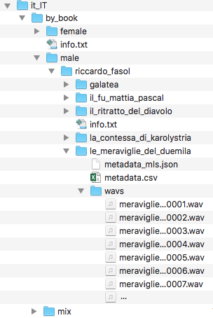

# Spracherkennung
von *Amir Amuri, Stefan Hagemann und Florian Hagemann*

## Abstract

Sprachverarbeitung ist heutzutage allgegenwärtig und die meisten Menschen sind bewusst oder unbewusst schon damit in Berührung gekommen. Sei es als Teil eines Sprachassistenten in einem Smartphone, in einem Auto oder in einem Smart Home, oder in einer Diktier App. Aufgrund der Präsenz des Themas in der Gesellschaft wurde in dieser Arbeit ein Podcast aufgenommen, ein Fachvortrag und eine Code-Demonstration zum Thema Spracherkennung im Rahmen der Vorlesung Seminar aktuelle Themen der KI bei Prof. Dr. Wahl ausgearbeitet und gehalten. Der Folgende Text ist eine schriftliche Ausarbeitung davon.

Der Podcast behandelt das Thema Spracherkennung und präsentiert Erkenntnisse eines Experten. Es werden Fragen zur Funktionsweise der Umwandlung von gesprochener Sprache in Computersprache, der Zuhörfähigkeit von Sprachassistenten, der Verantwortlichkeit bei fehlerhaften Bestellungen, dem Lernpotenzial von Künstlicher Intelligenz, der Entwicklung der Spracherkennung und zukünftigen Veränderungen diskutiert. Die Möglichkeit der Emotionserkennung in der Sprache und potenzielle Anwendungen werden ebenfalls beleuchtet. Datenschutz und ethische Aspekte werden betont. Der Podcast endet mit einem Ausblick auf kommende Entwicklungen und Vorfreude auf weitere spannende Themen.

Der Fachvortrag beschäftigt sich hauptsächlich mit der Entwicklung von Spracherkennung über die Zeit und welche Rolle Deep Learning dabei gespielt hat. Dabei werden verschiedene Ansätze grob erklärt oder deren idee beschrieben. Zudem wird eine State of the Art Architektur, der Speech Transformer, genauer vorgestellt und erklärt.

In der Code-Demonstration ist viel über das Preprocessing von Daten und deren Aufbereitung zu sehen und wie zwei verschiedene Ansätze trainiert werden können. Dabei ist einer davon klassisch und der andere ein Deep Learning Ansatz.

## 1 Einleitung / Motivation

Es gibt keine offizielle allgemein anerkannte Definition von Spracherkennung. Eine Definition, die die wesentlichen Punkte zur Beschreibung von Spracherkennung gut zusammenfässt ist von ibm:

!!! info "Definition"

    Speech recognition, also known as automatic speech recognition (ASR), computer speech recognition, or speech-to-text, is a capability which enables a program to process human speech into a written format.

Wie sich aus der Definition erkennen lässt hat Spracherkennung viele Anwendungen. Überall dort, wo ein Computer oder eine Maschiene Die Sprache eines Menschen als akustisches Signal verstehen und verarbeiten muss kommt Spracherkennung zum Einsatz. In jedem Sprachassistenten, ob dieser in einem Handy, in einem Computer, in einem Auto oder in einem Smart Home ist, findet sich Spracherkennung als teil der Software wieder. Aber auch in Apps die Diktiertes in Text umwandeln sollen kommt es zum Einsatz. Da die Anwendungsgebiete von Spracherkennung so weitläufig sind, ist die Bedeutung des Themas und das Interesse daran klar.

Im Laufe der Zeit wurden verschieden Methoden angewandt um Spracherkennung zu betreiben. Dabei gibt es sowhol klassische Methoden, welche mit mathematischen oder statistischen Modellen arbeiten, und moderne Ansätze mit Deep Learning Methoden, welche mit neuronalen Netzen, die verschiedenen Architekturen haben, arbeiten.

Im nächsten Abschnitt wird der Schwerpunkt des Fachvortrages behandelt. Ziel ist es, einen Überblick über die Entwicklung von Spracherkennung im Laufe der Zeit zu geben, indem wichtige und interessante Ansätze, Produkte oder Vorschläge aufgezählt oder erklärt werden.

## 2 Geschichte der Spracherkennung

### 1950er und 1960er

In den 1950er Jahren wurden die ersten Spracherkennungssysteme erfunden. Damals waren die Systeme allerdings wesentlich schlechter als die, welche wir heutzutage aus bekannten Sprachassisten wie Siri oder Alexa kennen. Die ersten Systeme waren darauf fokussiert Zahlen zu erkennen.

1952 wurde von Bell Laboratories das "Audrey" System erfunden. Das "Audrey" System konnte nur einzelne Zahlen erkennen, die von einer Stimme gesprochen worden sind. Der Grund dafür, warum nur die gesprochenen Zahlen von einer einzigen Stimme erkannt werden konnten war, dass dafür template matching verwendet wurde.

!!! info "Definition"

    Template matching is the process of moving the template over the entire image and calculating the similarity between the template and the covered window on the image.

Im Fall der Spracherkennung ist beim template matching das Bild zum Beispiel ein Spektogramm.

1962 wurde von IBM "Shoebox" vorgestellt. Das System konnte 16 englische Wörter verstehen und darauf antworten. Die Spracherkennung hat funktioniert, indem Merkmale aus dem Input extrahiert und mit abgespeicherten Verglichen wurden. So wurde bestimmt welches Wort gesagt wurde.

<figure markdown>
  
  <figcaption>Fig. 1 Shoebox</figcaption>
</figure>

1966 wurde Linear Predictive Coding (LPC) vorgeschlagen. Linear Predictive Coding ist ein Verfahren zur Reduktion der Datenmenge. Es basiert auf der Annahme, dass Sprachsignale viele wiederholende Muster enthalten, die durch eine Vorhersagemethode erfasst werden können. Der Vorteil von diesem Ansatz ist, dass durch die Reduktion der Datenmenge eine effizientere Verarbeitung und Übertragung von Sprache möglich ist.

1968 wurde Dynamic Time Warping (DTW) erfunden. Mit Dynamic Time Warping kann man die Ähnlichkeit zwischen zwei zeitlichen Signalen, die sich in Geschwindigkeit und / oder Zeitachse unterscheiden messen. Dadurch können zum Beispiel auch langsamer oder schneller ausgesprochene Wörter als in der abgespeicherten Vorlage erkannt werden. 

Außerdem wurde zu dieser Zeit die Mathematik des Hidden Markov Models formuliert, welche aber erst später in der Spracherkennung zum Einsatz kam.

### 1970er

In den 1970er Jahren wurden Fortschritte in der Spracherkennung vor allem aufgrund des Speech Understanding Research (SUR) Programs von der Defense Advanced Research Project Agency (DARPA) von 1971 bis 1976 gemacht. Ziel des Programs war es, Fortschritte in der automatischen Spracherkennung und Sprachverständnisforschung zu erzielen.

Durch das Program ist unter anderem das "Harpy" System von der Carnegie-Mellon Universität entstanden. Das System konnte über 1000 Wörter verstehen, was ungefähr dem Vokabular eines drei Jährigem gleicht. "Harpy" war der Versuch die besten Merkmale des Hearsy-I Systems, welches ein regelbasiertes System war, und des DRAGON Systems, welches eine Markov Kette verwendete zu kombinieren. Es hatte ein State Transition Network mit 15000 states. In dem State Transition Network sind alle möglichen Pfade durch die endliche Anzahl an states dargestellt, wie zum Beispiel alle möglichen Wörter oder Sätze. Zudem waren Regeln zu Wortgrenzen und Grammatik implementiert. Durch diesen Ansatz konnte "Harpy" die für das SUR vorgesehenen Ziele, nämlich über 90 % eines Satzes aus einem Lexikon mit 1000 Wörtern verstehen zu können, erfüllen.

<figure markdown>
  { width="400" }
  <figcaption>Fig. 2 Harpy</figcaption>
</figure>

### 1980er

Der bedeutenste Fortschritt in den 1980er Jahren war die Verwendung von Hidden Markov Models für Spracherkennung. Zwar waren diese schon vorher bekannt, fanden aber erst jetzt Anwendung.

1986 wurde das SPHINX System von der Carnegie-Melln Universität entwickelt. Es gibt noch weitere Versionen und Verbesserungen davon, aber die erste Version verwendete ein Hidden Markov Model.

Ein Hidden Markov Model ist ein Modell, bei dem der zugrunde liegende Prozess eine Markov-Kette ist, aber die Zustände nicht direkt beobachtbar sind. Stattdessen werden beobachtbare Ereignisse oder Symbole (z. B. Wörter, Phoneme oder akustische Merkmale) erzeugt, die mit bestimmten Wahrscheinlichkeiten zu den zugrunde liegenden versteckten Zuständen gehören. Die versteckten Zustände sind nicht direkt sichtbar und werden als "versteckt" bezeichnet.

Eine Markov-Kette ist ein Modell, bei dem ein System eine Reihe von diskreten Zuständen durchläuft und sich von einem Zustand zum nächsten gemäß einer bestimmten Übergangswahrscheinlichkeit bewegt. Jeder Zustand ist direkt beobachtbar, und die Wahrscheinlichkeiten für die Zustandsübergänge sind bekannt.

Der Unterschied zwischen einer Markov Kette und einem Hidden Markov Model ist, dass eine Markov-Kette die Wahrscheinlichkeiten der Zustandsübergänge direkt modelliert, während ein Hidden Markov Model zusätzlich die Wahrscheinlichkeiten der beobachteten Ereignisse in Bezug auf die versteckten Zustände modelliert.

### 1990er

In den 1990er Jahren wurde die Spracherkennung vor allem aufgrund von Verbesserungen am persönlichen Computer vorangetrieben, da dadurch die Kommerzialisierung von Spracherkennungsssoftware möglich wurde. Durch die Erfindung von schnelleren Prozessoren konnten jetzt auch privat Personen Spracherkennungsssoftware nutzen. Neben der Kommerzialisierung, beschäftigte man sich zu dieser Zeit auch mit der Robustheit von Modellen.

1990 wurde zum Beispiel eine Diktiersoftware namens Dragon Dictate herausgebracht.

1993 hat Apple "Speakable Items", eine Sprachsteuerung für Apple Geräte herausgebracht. Hier wurden nur bestimmte bekannte Befehle durch Wortlisten und Mustererkennung erkannt.

1999 wurde das BellSouth Voice Portal herausgebracht. Das BellSouth Voice Portal hat den Benutzern ermöglicht sprachgesteuerte Dienste und Informationen, wie zum Beispiel die Wettervorhersage, über das Telefon zu bekommen.

### 2000er

Von 2002 bis 2004 gab es ein weiteres Programm der Defense Advanced Research Project Agency (DARPA) namens Effective Affordable Reusable Speech-to-Text (EARS). Durch dieses Programm wurde die Sammlung des Switchboard-Telefonkorpus, welcher 260 Stunden aufgezeichneter Gespräche von über 500 Sprechern enthält, finanziert.

2007 wurde GOOG-411, ein telefonischer Informationsdienst herausgebracht. Die Aufnahmen von GOOG-411 haben wertvolle Daten geliefert, die Google geholfen haben ihre Spracherkennungssysteme zu verbessern.

2007 wurde erstmals ein Long Short Term Memory (LSTM) mit Connectionist Temporal Classification (CTC) trainiert das angefangen hat klassische Ansätze in manchen Aufgaben zu übertreffen.

<figure markdown>
  { width="400" }
  <figcaption>Fig. 3 Connectionist Temporal Classification</figcaption>
</figure>

Connectionist Temporal Classification ist ein System um ein rekurrentes Neuronales Netz zu trainieren. Dabei ist der Output des Neuronalen Netzes eine Wahrscheinlichkeitsmatrix, welche für jeden Zeitpunkt t die Wahrscheinlichkeit für jedes vorher definiertes Zeichen angibt. Anschließend wird durch einen Algorithmus der Pfad berechnet, der am Ende die höchste Wahrscheinlichkeit hat. Die Ausgabesequenz, am Beispiel von Fig. 3, wäre dann "aaa-b". Alle Buchstaben die Mehrmals hintereinander vorkommen werden zusammengefasst zu einem Buchstaben. Dabei ist zu beachten, dass es ein Platzhalter Symbol gibt welches dazu dient auch den selben Buchstaben mehrmals hintereinander zu erkennen, in diesem Beispiel durch ein "-" dargestellt. Somit ist die Ausgabe dann der richtige Output "ab".

2008 wurde von Google die Voice Search App für Smartphones von Apple herausgebracht. Da es Spracherkennung für Smartphones gab, konnte Google Daten von mehreren Milliarden Suchen sammeln.

2009 wurde ein deep feedforward neural network für acoustic modeling hergenommen. Der Ansatz für Acoustic modeling besteht darin ein feedforward neural network zu verwenden, um zu bestimmen, wie gut die jeweiligen states des Hidden Markov Models zu den einzelnen Inputs passen. Das neuronale Netz nimmt mehrere Ausschnitte von Koeffizienten des akustischen Inputs, die diesen repräsentieren und erzeugt als Ausgabe Wahrscheinlichkeiten für die Zustände des Hidden Markov Models.

### 2010er

2014 gab es den ersten Versuch für ein end-to-end automatic speechrecognition (ASR) system mit einem RNN-CTC Modell von Google.

Ein end-to-end ASR System ist ein Spracherkennungssystem, das den gesamten Prozess der Spracherkennung von der Audioeingabe bis zur Textausgabe abdeckt, ohne den Einsatz traditioneller separater Komponenten wie Sprachmerkmalsextraktion, Ausrichtung oder Sprachmodellierung.

2015 wurde Googles Spracherkennung durch ein CTC trainiertes LSTM sehr verbessert und wurde dann auch für Google Voice für alle mit einem Smartphone verfügbar.

2016 wurder das erste Aufmerksamkeitsbasierte automatic speechrecognition Model vorgeschlagen. Das Modell "Listen, Attend und Spell" (LAS) hört die akustischen Signale, achtet auf verschiedene Teile des Signals und gibt das Transkript einen Buchstaben nach dem anderen aus. Es besteht aus zwei Teilen, einem Listener und einem Speller. Der Listener ist ein Encoder recurrent neural network, genauer gesagt ein pyramidal Bidirectional Long Short Term Memory (BLSTM). Der Listener extrahiert Merkmale aus den akustische Signalen. Der Output des Listners dient als Eingabe für den Speller. Der Speller ist Aufmerksamkeitsbasierter Zeichen Decoder, genauer gesagt ein Long Short Term Memory (LSTM) der eine Wahrschenilichkeitsmatrix als Output hat.

<figure markdown>
  { width="400" }
  <figcaption>Fig. 4 "Listen, Attend, Spell"</figcaption>
</figure>

Aufmerksamkeits basierte Modelle können im Gegensatz zu den Ansätzen mit Connectionist Temporal Classification oder Hidden Markov Models alle Teile eines Spracherkennungssystems lernen. Dadurch spart man sich den Speicherplatz für ein großes language model, wodurch dieser Ansatz gut für Anwendungen mit limitiertem Speicherplatz geeignet ist. Ende 2016 haben diese Modelle die Ansätze mit Connectionist Temproal Classification schon übertroffen.

2017 errreichten Forscher von Microsoft einen historischen Meilenstein im Bezug auf menschliche Parität bei der Transkription von Telefongesprächen. Das Modell war besser als vier proffessionelle Transkriptoren (Menschen).

Zudem wurde 2017 im Paper "Attention is all you need" die erste Transformer Architektur vorgestellt. Diese war aber noch nicht für Spracherkennung gedacht, sondern für machine translation.

2018 wurde dann die Speech Transformer Architektur im Paper Speech-Transformer: A No-Recurrence Sequence-to-Sequence Model for Speech Recognition vorgestellt. Diese Archtektur ist eine Erweiterung der ursprünglichen transformer Architektur für Spracherkennung.

In 2019 bis Anfang der 2020er erreichten Transformer dann state of the Art Ergebisse.

## 3 Deep Learning und Spracherkennung

Es gibt viele verschiedene Definitionen für Deep Learning, aber keine allgemein offiziell anerkannte Definition. Zwei Definitionen, welche die wesentlichen Punkte gut zusammenfassen sind Folgende:

!!! info "Definition von ibm"

    Deep Learning ist ein Teil des  maschinellen Lernens, bei dem es sich im Wesentlichen um ein neuronales Netz mit drei oder mehr Schichten handelt.

!!! info "Definition von oxford languages"

    A type of machine learning based on artificial neural networks in which multiple layers of processing are used to extract progressively higher level features from data.

Zusammengefasst ist Deep Learning ein Teil des maschinellen Lernens, bei dem man ein neuronales Netz mit mindestens 3 Schichten hat.

Deep Learning wurde in der Spracherkennung erst 2009 wirklich relevant, wurde aber schon früher für die Spracherkennung erforscht. Sowohl normale als auch deep Neuronal networks konnten nicht mit einem Hidden Markov Model mithalten, da es einige Probleme gab.

Ein Problem, war der diminishing gradient. Je weiter im Netz bei der Backpropagation zurück gerechnet wird,  um so kleiner wird der Gradient und "verschwindet" irgendwann. Das Problem hierbei ist, dass somit in den Schichten weiter hinten im Netz wenig bis keine Anpassungen mehr gemacht werden können und somit gewisse Datenzusammenhänge nicht erfasst werden können. Das tritt vor allem bei Aktivierungsfunktionen auf, die den Gradienten eher dämpfen. Ein gutes Beispiel dafür ist die Sigmoid Funktion. Ein weiteres Problem war die schwache zeitliche Korrelationsstruktur in neuronalen Netzen. Zudem fehlten damals noch große Trainingsdatensätze und Rechenleistung.

Als die Probleme nach und nach gelöst worden sind konnte durch Deep Learng große Fortschritte in der Spracherkennung erreicht werden. Die Ansätze sind mittlerweile so gut, dass diese mit mehreren menschlichen Transkriptoren mithalten können und sind heute State of the Art.

## 4 Speech Transformer Architektur

In diesem Abschnitt wird die Speech Transformer Architektur aus dem Paper Speech-Transformer: A No-Recurrence Sequence-to-Sequence Model for Speech Recognition erklärt. Der Grund, warum genau diese Architektur genauer erklärt wird ist, dass es viele Abänderungen und Verbesserungen gibt die auf dieser Architektur aufbauen. Ziel ist es zu verstehen wie der Speech Transformer aufgebaut ist und funktioniert, um dann Abänderungen die darauf aufbauen leichter und schneller zu verstehen.

<figure markdown>
  { width="400" }
  <figcaption>Fig. 5 Speechtransformer</figcaption>
</figure>

Die Speechtransformer Architektur besteht aus zwei Teilen, einem Encoder und einem Decoder.

Der Encoder hat als Input ein Spektogramm. Am Anfang des Encoders sind drei Convolutional Layer mit einem 3x3 Kernel und Stride 2. Anschließend ist hier ein Block frei in dem optional zusätzliche Module eingefügt werden können. In dem Paper werden drei Beispiel genannt, wobei das interessanteste ein 2D Attention Mechanismus ist.

<figure markdown>
  { width="400" }
  <figcaption>Fig. 6 2D Attention Mechanismus</figcaption>
</figure>

Bei dem vorgeschlagenen Mechanismus werden zunächst drei convolutional networks auf den Input angewendet um daraus die Repräsentationen für Querries, Keys, und Values zu bekommen. Danach gibt es zwei Arten von Attention. Beides sind Scaled Dot-Product Attentions, jedoch ist die Erste für den zeitlichen Aspekt und die Zweite für den frequency Aspekt zuständig. Am Ende werden die ouputs zusammengefügt und in ein weiteres convolutional network gegeben.

Nach dem zusätzlichen optionalen Block wird eine linear Transformationen auf den flachgemachten feature map durchgeführt und mit dem positional encoding addiert. Positional Encoding ermöglicht dem Modell auf relative Positionen zu achten.

<figure markdown>
  { width="400" }
  <figcaption>Fig. 7 Formel für das Berechnen des positional encoding</figcaption>
</figure>

Das Ergebnis der Summe durchläuft anschließend N Encoder Blöcke. Ein Encoder Block besteht aus einem Multi-Head-Attention Layer gefolgt von einem feedforward neuronal network. Zudem sind nach jedem Layer Layer Normalisationen eingebaut und es gibt residual connections.

Multi-Head-Attention besteht aus mehreren Scaled Dot-Products.

<figure markdown>
  { width="400" }
  <figcaption>Fig. 8 Multi-Head-Attention</figcaption>
</figure>

Ein Scaled Dot-Product wird wie folgt berechnet:

<figure markdown>
  { width="300" }
  <figcaption>Fig. 8 Scaled Dot-Product</figcaption>
</figure>

Der Decoder hat die bisher generierte Ziel Sequenz als input. Als Erstes wird ein Zeichen Embedding angewandt um Wörter, Buchstaben oder Zeichen im Vektorraum darzustellen. Das Ergebnis wird zu einem positional encoding addiert, das genau wie bei dem Encoder berechnet wird. Das Ergebnis der Summe durläuft dann N Decoder Blöcke.

Ein Decoder Block besteht aus drei Teilen, einem masked Multi-Head-Attention Layer, einem Multi-Head-Attention Layer und einem feedforward neural network. nach jedem Layer gibt es wie beim Encoder auch Layer Normalsations und residual connections. Eine masked Multi-Head-Attention stellt sicher, dass die Vorhersagen für position j nur auf den outputs basiert die bis position j-1 gehen. Außerdem nimmt das Multi-Head-Attention Layer die Values und Keys von dem Output des Encoders, und die Querries aus dem eigenen Block.

Nach den Decoder Blöcken werden die outputs durch eine lineare Projektion und die anschließende Softmax Funktion in die Wahrscheinlichkeiten der Ausgangsklassen umgewandelt.

## 5 Anwendung

### Code-Demo
#### Dataset
##### Data Ingestion
In dieser Code-Demo werde ich über das Sammeln von Daten für Spracherkennung, Preprocessing und die Anwendung von zwei verschiedenen Models reden.
Der hier erwähnte Datensatz wird später nicht zum Training genutzt, sondern dient nur als Beispiel, da das Training zu "computationally expensive" war.


Am Anfang eines jeden Machine Learning Projekts steht das Sammeln von Daten.
Auch in dieser Code-Demo wird mit dem Sammeln von Daten begonnen. 
Die erste Phase hierfür ist die sogenannte Data Integration.
Diese Phase umfasst den Prozess des Sammelns und Importierens von Daten aus verschiedenen Quellen in ein System zur weiteren Verarbeitung oder Analyse.
In diesem Fall wurden mehrere verschiedene Datensätze aus dem Internet heruntergeladen.
Eine alternative wäre die Daten aus der realen Welt selbst zu machen, was allerdings für eine Privatperson sehr schwierig ist.

Hier werden zwei Beispiele der verwendeten Datensätze gezeigt:

Einerseits der Datensatz von Thorsten Müller, ein Datensatz der von einer Privatperson der Öffentlichkeit zur Verfügung gestellt wurde:


Und andererseits der sehr bekannte Common Voice Datensatz von Mozilla: 


##### Data Transformation

Die nächste Phase ist die der Data Transformation.
Diese ist der Prozess der Umwandlung von Daten von einem Format oder einer Struktur in ein anderes, um die Datenanalyse zu erleichtern.

Die zuvor heruntergeladenen waren ursprünglich in vielen verschiedenen Formaten/Strukturen vorhanden:
* Ordnerstruktur + .csv
* Json
* .tsv / .csv

Diese verschiedenen Strukturen werden in diesem Schritt in ein einheitliches Format, in diesem Fall ein .csv-file pro Datensatz mit gleicher Struktur, gebracht

Nicht nur die Struktur, sondern auch die enthaltenen Informationen der Datensätze unterscheiden sich.
Die Hauptinformationen, die wirklich für das Training benötigt werden, sind jedoch immer vorhanden.
In diesem Fall sind das:
  * "sentence": Der Satz, der in der Audio-Datei gesprochen wird.
  * "path": Der Pfad zur Audio-Datei

Allerdings sind in diesen Datensätzen auch andere Informationen, die nicht direkt für das Training erforderlich sind enthalten.
  * Geschlecht
  * Akzent
  * Alter
  * Sprecher ID
  * source (original-Dataset)

Obwohl diese Daten weder für das Training notwendig, noch in allen Datensätzen vorhanden sind, sollten diese nicht "weggeworfen" werden, da diese für die Evaluation des Models, Identifikation von Fehlern, oder Analysierung des Aufbaus des Aufbaus des finalen Datensatzes sehr nützlich sein können.

Ausserdem wurde die Größe der Audio-Datei als Spalte hinzugefügt, um die Erstellung von Sub-datasets mit bestimmter Größe zu erleichtern.


### Beispiel der Umformung eines Datensets
Hier wird als Beispiel der Code zur Umformung eines Datensatzes vorgeführt.

Die Import-Statements sind:
* pandas: Arbeit mit Datensätzen
* numpy: verschiedene optimierte numerische Operationen
* os/shutil: verschiedene Operationen mit Dateien
* tqdm: für Progressbars
  
``` python
import pandas as pd
import numpy as np
import os
import shutil
from tqdm.notebook import tqdm
```

Hier werden die Ordner definiert, in welche die transformierten Daten kommen:

``` python
clips_dest_dir = "../presentation_folders/new_dataset/clips/caito"
df_dest_dir = "../presentation_folders/new_dataset/dfs/caito"
if not os.path.exists(clips_dest_dir):
    os.mkdir(clips_dest_dir)
if not os.path.exists(df_dest_dir):
    os.mkdir(df_dest_dir)
```

Dies ist ein Screenshot, wie die Struktur dieses Datensatzes aussieht:



In diesem Code wird durch die Ordnerstruktur iteriert um die dort enthaltenen Informationen in ein .csv-file zu schreiben:

``` python
df = pd.DataFrame(columns=["speaker_id", "path", "sentence","gender","age","accents"])

start_dir = "../presentation_folders/datasets/de_DE/by_book"

for gender in os.listdir(start_dir):
gender_dir = os.path.join(start_dir, gender)
if not os.path.isdir(gender_dir):
    continue
for speaker in os.listdir(gender_dir):
    speaker_dir = os.path.join(gender_dir, speaker)
    if not os.path.isdir(speaker_dir):
        continue
    for recording_session in os.listdir(speaker_dir):
        session_dir = os.path.join(speaker_dir, recording_session)
        if not os.path.isdir(session_dir):
            continue
        session_df=pd.read_table(os.path.join(session_dir, "metadata.csv"),sep="|",header=None)
        session_df=session_df.rename(columns={0:"path",1:"raw_sentence",2:"sentence"})
        session_df=session_df.drop(columns=["raw_sentence"])
        session_df.path = session_df.path.astype(str) + ".wav"
        
        session_df["speaker_id"] = [speaker for i in range(len(session_df))]
        session_df["gender"] = [gender for i in range(len(session_df))]
        session_df["age"] = [np.NaN for i in range(len(session_df))]
        session_df["accents"] = [np.NaN for i in range(len(session_df))]
        
        df = pd.concat([df,session_df]).reset_index(drop=True)
        
        print(f"gender: {gender}, speaker: {speaker}, recording session: {recording_session}")
        
        
        for file in tqdm(list(session_df["path"][:int(len(session_df)/10)])):
            src_path = os.path.join(session_dir, "wavs", file)
            dest_path = os.path.join(clips_dest_dir, file)
            shutil.copy(src_path, dest_path)
                

df.to_csv(os.path.join(df_dest_dir, "caito.csv"))
```
#### Data Integration

Der nächste Punkt ist die Data Integration. Hier werden die Daten in einen Datensatz zusammengefasst.
In diesem Fall ist dies sehr einfach, da wir einfach nur csv-files der selben Struktur zusammenfügen müssen.

Nun werden verschiedene Informationen über den fertigen Datensatz dargestellt und analysiert:
``` python
df=pd.read_csv("../complete_dataset/complete_size_df_woindex.csv")
``` 

Hier wird die NaN-Ratio der verschiedenen Columns angegeben:
``` python
df.sample(n=5,random_state=42)
print("NaN-Ratio\n")
for col in df.columns:
    print(f"{col}: {df[col].notna().sum()/len(df)*100:.1f}%")
```

Hier wird die Anzahl der verschiedenen Sprecher und Akzente gezeigt:
``` python
print(df["speaker_id"].nunique())
print(df["accents"].nunique())
```

In diesem Code-Snippet wird die Verteilung des Geschlechts im Datensatz gezeigt:
``` python
df["gender"].value_counts()
```
#### Preprocessing

Um die Audio-Dateien in eine Form zu bringen die für Machine Learning Models verarbeitbar, gibt es viele verschiedene Preprocessing-Methoden. 
Hier werden zwei dieser Preprocessing-Methoden genauer angeschaut.
Die erste Methode die wir uns anschauen wollen, ist das Spektogram.
Dieses ist eine visuelle Darstellung des Spektrums des Signals über die Zeit.
In dieser Repräsentation gehen fast keine Daten verloren, was einerseits dazu führt, dass diese Methode sehr flexibel ist, wenn es darum geht für welchen Anwendungszweck sie verwendet werden kann, andererseits aber auch das Problem mit sich bringt, dass diese größere Menge von Daten im Vergleich zu anderen Methoden eine längere Trainingszeit mit sich zieht.

Hier kommt zum Beispiel MFCC ins Spiel. Diese Methode hat im Endeffekt eine viel kleinere Datenmenge und ist stark auf Spracherkennung spezialisiert. Ausserdem ahmt diese Methode das menschliche Gehör nach, wodurch diese Aspekte der Datenreduktion aber auch der Spezialisierung auf Spracherkennung entstehen.


Um diese Methoden in Python zu nutzen wird hier die library "librosa" verwendet.
``` python
import matplotlib.pyplot as plt
import librosa
import librosa.display
import numpy as np
```

Hier wird die zu verarbeitenden Audiodatei geladen.
``` python
audio_file = "aufnahmen/english_audio.wav"
y, sr = librosa.load(audio_file)
```

In diesem Code-Snippet wird ein Spektogram der Audio-Datei geplottet.
``` python
plt.figure(figsize=(14, 5))
D = librosa.amplitude_to_db(np.abs(librosa.stft(y)), ref=np.max)
librosa.display.specshow(D, sr=sr, x_axis='time', y_axis='log')
plt.colorbar(format='%+2.0f dB')
plt.title('Spectrogram')
plt.show()
```

In diesem Code-Snippet wird das MFCC der Audio-Datei gezeigt.
``` python
mfccs = librosa.feature.mfcc(y=y, sr=sr, n_mfcc=13)
plt.figure(figsize=(14, 5))
librosa.display.specshow(mfccs, sr=sr, x_axis='time')
plt.colorbar()
plt.title('MFCC')
plt.show()
mfccs
```
#### 1.Model: Gaussian HMM 

Kommen wir nun zu den Modellen.
Das erste Modell über das wir sprechen werden ist GHMM.

Ein HMM ist ein statistisches Modell, das hilft, "unsichtbare" Zustände basierend auf beobachtbaren Daten zu schätzen. (z.B.: Wettervorhersage basierend auf menschlichem Verhalten, Textanalyse basierend auf Wortsequenzen etc.)

Ausserdem nutzt das GHMM die Gausssche Normalverteilung.


In dem folgenden Beispiel wird ein HMM auf ein Nummern-Dataset trainiert, da die ursprüngliche Idee, das deutsche Dataset in Wörter aufzuteilen, nicht umgesetzt werden konnte.
``` python
import os

import numpy as np
from hmmlearn import hmm

import librosa
from python_speech_features import mfcc
import scipy.io.wavfile as wav
import random as rd
```

Hier wird die Klasse HMMTrainer definiert, welche für das trainieren und auswerten der Daten verwantwortlich ist.
``` python
class HMMTrainer(object):
    def __init__(self,model_name, n_components=4, cov_type='diag', n_iter=1000):
        self.model_name = model_name
        self.n_components = n_components
        self.cov_type = cov_type
        self.n_iter = n_iter

        self.model = hmm.GaussianHMM(n_components=self.n_components, 
                covariance_type=self.cov_type, n_iter=self.n_iter)

    def train(self, X):
        np.seterr(all='ignore')
        self.model.fit(X)

    def get_score(self, input_data):
        return self.model.score(input_data)
```
In diesem Code-Snippet werden die Ordner der verschiedenen Nummern definiert:
``` python
input_folder='../models/HMM/digit_recordings'
word_folders = [f for f in os.listdir(input_folder) if not f.startswith(".")]
```
``` python
word_folders
```

Hier werden die Audio-Dateien in MFCCs umgewandelt und für weitere Verarbeitung gespeichert:
``` python
import warnings
warnings.filterwarnings("ignore")
lens = {}
training_data = {}
for dirname in word_folders:
    X = []
    ltt=[]
    subfolder = os.path.join(input_folder, dirname)
    for filename in [x for x in os.listdir(subfolder) if x.endswith('.wav')][:-1]:
        filepath = os.path.join(subfolder, filename)
        sampling_freq, audio = librosa.load(filepath)            
        mfcc_features = mfcc(sampling_freq, audio)[:,:13]
        X.append(mfcc_features)
            
    training_data[dirname] = X
```

So sehen die Daten aus:
``` python
training_data["0"]
```


``` python
hmm_models = []
for label in training_data.keys():
    rd.shuffle(training_data[label])
    X = np.concatenate(training_data[label][:-5], axis=0)
    print(X.dtype)
    print('X.shape =', X.shape)
    hmm_trainer = HMMTrainer(label)
    hmm_trainer.train(X)
    hmm_models.append(hmm_trainer)
    hmm_trainer = None
```

Training der Modelle (ein Model pro Wort):
``` python
results = []
for label in training_data.keys():
  d_results =[]
  for i in range(5):
    mfcc_features=training_data[label][-i]
    
    scores=[]
    for model in hmm_models:
        score = model.get_score(mfcc_features)
        scores.append(score)
    index=np.array(scores).argmax()
    results.append(1 if (label==(hmm_models[index].model_name)) else 0)
    d_results.append(1 if (label==(hmm_models[index].model_name)) else 0)
  print(label, sum(d_results)/len(d_results))
print(sum(results)/len(results))
```

#### 2.Model: Wav2vec

Das Wav2vec ist ein End-to-End-Model, das von Facebook AI 2019 entwickelt wurde und die Transformer-Architektur, die im vorherigen Teil schon erklärt wurde, nutzt. Es lernt also direkt aus Daten ohne eine manuelle Extraktion von Merkmalen aus der Audio (zB. via MFCC oder Spektogram zu benötigen). Es lernt sogar hauptsächlich aus unmakrkierten Rohdaten, was das ursprüngliche Trainieren, wenn man von der riesigen Datenmenge, die es benötigt, absieht, einfacher macht.
Es hat eine sehr gute Performance auf dem TIMIT-Datensatz, welcher normalerweise für Evaluationen von Speech-to-Text Systemen genutzt wird.


Zuerst müssen die entsprechenden libraries und der Tokenizer und das Model geladen werden.
``` python
import torch
import torchaudio
from transformers import Wav2Vec2ForCTC, Wav2Vec2Tokenizer
```
``` python
tokenizer = Wav2Vec2Tokenizer.from_pretrained("facebook/wav2vec2-base-960h")
model = Wav2Vec2ForCTC.from_pretrained("facebook/wav2vec2-base-960h")
```

Hier wird eine im vorhinein aufgenommene Audiodatei geladen.
``` python
path = "aufnahmen/english_audio.wav"
speech, rate = torchaudio.load(path)
```

Diese geladene Audidatei wird wird nun in das richtige Format gebracht.
``` python
if speech.shape[0] > 1:
    speech = speech[0]

if rate != 16000:
    resampler = torchaudio.transforms.Resample(orig_freq=rate, new_freq=16000)
    speech = resampler(speech)

speech = speech.squeeze()
```

Zuletzt wird der Text dieses Audifiles predictet und ausgegeben.
``` python
input_values = tokenizer(speech, return_tensors="pt").input_values

with torch.no_grad():
    logits = model(input_values).logits

predicted_ids = torch.argmax(logits, dim=-1)
transcription = tokenizer.batch_decode(predicted_ids)[0]

print(transcription)
```

## 6 Weiterführendes Material

### Podcast
[Der Campus Talk – Silicon Forest – Folge XX]()

### Podcast Transkript

**Moderator**:
Hallo zusammen und willkommen zu einer neuen Ausgabe vom THD-Podcast, schön, dass Sie wieder eingeschaltet haben.
Jeder von uns hat doch bestimmt schon einmal Alexa, Siri oder den Google Assistant genutzt oder getestet. Doch haben Sie sich eigentlich mal Gedanken darüber gemacht, wie uns diese Geräte überhaupt verstehen?
Um diese und weitere Fragen zu klären, haben wir heute einen Experten zu Gast.

Herr Amuri studiert momentan Künstliche Intelligenz im sechsten Semester. Dort hat er bereits einige Aufgaben zur Spracherkennung lösen müssen und hat sich kürzlich auf diesen Themenbereich spezialisiert.

Herr Amuri, vielen Dank, dass Sie da sind.


**Experte**:
Hallo, es freut mich sehr, dabei sein zu dürfen. 


**Moderator**:
Sagen Sie mir doch mal, wo kommt Spracherkennung überall vor?


**Experte**:
Im Grunde, gibt es überall Spracherkennung, wo aus Gesprochenem für
eine Maschine lesbaren Text entsteht.
Bedeutet im Umkehrschluss, dass Spracherkennung vom sogenannten
“Speech-To-Text”, also gesprochenes Wort zu Text, bis hin zu einer Alexa reicht, die
das Wort “Alexa” selbst erkennen kann.


**Moderator**: 
Ah verstehe! 
Also wenn Google Übersetzer mir einen Text vorliest, ist das keine Spracherkennung? Aber wenn ich was sage und es in Text umgewandelt wird, dann schon.

Dann ist aber meine Frage, wie funktioniert denn Spracherkennung bzw. wie wird das Gesprochene in Computersprache umgewandelt?


**Experte**:
Ja, genau. Es verwechseln leider viele, dass die Definition von Spracherkennung an
sich leider keine Gleichung ist, wie man sie aus dem Matheunterricht kennt, sondern
als  Regel zu sehen ist.

Genau unterscheiden tun wir ja, wie die Sprache zustande kommt, beziehungsweise
meinen wir mit Spracherkennung auch wirklich die gesprochene Sprache. 
Der Prozess selbst beginnt deshalb auch mit der Aufnahme eines Sprachsignals,
beziehungsweise der gesprochenen Worte, wie diese Mikrofone hier vor uns es auch
tun.
Diese Aufnahmen werden dann in kleine Stücke aufgeteilt und anschließend nach
Faktoren wie die Tonhöhe, Frequenz und die Dauer der jeweiligen Töne analysiert.
Diese Merkmale werden dann anschließend in einem Sprachmodell verwendet, um
die Wörter und Sätze zu erkennen, die gesprochen wurden.
Das Ganze wird dann so oft wiederholt, bis es möglichst gut  erkannt
wird. Das kann man sich als Wahrscheinlichkeit vorstellen: Wenn wir eine Münze
werfen und unser Ziel “Kopf” ist, dann werfen wir immer wieder, bis endlich
Kopf oben liegt. 
Dabei gibt es  bestimmte Wurftechniken, wie wir “Kopf” erzwingen können.
Letztendlich erlernt das Sprachmodell selbstständig und teilweise mit 
Unterstützung diese Wurftechniken. Nach dem jetzigen Stand wird
es in keinem Fall immer das richtige Ergebnis haben, dafür aber sehr oft.


**Moderator**:
Ah interessant. Das heißt also, dass Alexa selbst keine Spracherkennung ist, aber
wenn Alexa mich versteht und das verarbeitet, dann schon?


**Experte**:
Genau.


**Moderator**:
Verstehe.
Wir wussten ja natürlich, dass wir dich einladen und haben deshalb unsere Zuhörerschaft um Fragen für dich gebeten.
Die Erste passt sogar gut zum jetzigen Thema
lorelei8977, 24 Jahre alt fragt:
Sprachassistenten wie Alexa können uns ja auf unseren Wortlaut gehorchen. Nun ist meine Frage, hören uns Sprachassistenten immer zu?


**Experte**:
Danke Lorelei für diese wirklich sehr interessante Frage.
Sprachassistenten hören uns generell per se nicht zu. Man kann es sich wie ein
kleines Baby vorstellen: Ein Baby versteht ja auch keine wirkliche Sprache bis
auf einzelne Schlüsselwörter, die es immer wieder hört. Sowas wie Spielplatz,
Milch oder auch seinen oder ihren Namen. So ähnlich ist es auch bei
Sprachassistenten.
Diese hören einem generell zu, jedoch verstehen sie einen nicht bzw. verstehen sie
nur spezifische Wörter, wie zum Beispiel bei Alexa das jeweilige Aktivierungswort.
Das bedeutet, an sich hören sie uns immer zu, da es anders leider nicht
funktionieren würde. Jedoch verstehen sie uns nicht, bis zu dem Zeitpunkt, wo wir
das Aktivierungswort sagen.

Im Falle Alexa ist auch wichtig anzumerken, dass die Hardware, also das Gerät, was
möglicherweise bei ihnen in der Wohnung steht, nur das Können besitzt, sein
Aktivierungswort zu erkennen.
Also wenn man zum Beispiel Alexa fragt: “Alexa, wie ist das Wetter”, fängt das
Gerät an, die Anfrage aufzunehmen. Das bedeutet, dass diese Aufnahme danach 
an Amazon gesendet wird.
Aus diesem Grund muss es immer mit dem Internet verbunden sein.
Die Aufnahme selbst gelangt an einen sicheren Ort innerhalb Amazon. 
Hier ist zu berücksichtigen, dass auch Amazon an Datenschutzrichtlinien gebunden
ist und Sicherheitsvorkehrungen besitzen.
Ob die Aufnahmen auch gespeichert werden dürfen, kann jeder in den
Alexa-Einstellung selbst entscheiden, standardmäßig ist das aktiviert.


**Moderator**:
Oh, das ist sehr interessant. Also hören uns die kleinen Helferlein immer zu,
aber verstehen uns nicht, bevor wir Ihren Namen sagen. 


**Experte**:
Genau, hierzu ist aber auch anzumerken, dass es ohne diese Aufnahme gar nicht so
leicht wäre, alle Funktionen der Alexa in diesem kleinen Gerät zu lagern.
Die meisten Sprachassistenten funktionieren auf eine ähnliche Art und Weise und
deswegen ist das Aufnehmen der Stimme momentan nicht wegdenkbar.


**Moderator**:
Alles klar, vielen Dank für die Anmerkung.
Ich würde dann direkt mit der nächsten Frage vom 
AktienKarl79 weitermachen, 44 Jahre alt:
“Wenn ich was per Spracherkennung bestelle, es aber etwas falsch erkennt und
damit falsch bestellt, wer ist dann Schuld?”


**Experte**:
Also erstmal vorab, ich kann und darf keine rechtlichen Ratschläge geben, da
ich kein Experte in diesem Gebiet bin.
Generell ist die Frage aber anhand Alexa beantwortbar: Wenn ich nun
Alexa den Befehl gebe, mir einen Taschenrechner zu bestellen also “Alexa, bestelle
mir ein Taschenrechner”, wird sie mir den erstbesten Taschenrechner in den
Einkaufswagen legen, welcher dann meistens ein Amazon Choice Produkt
ist.
Anschließend wird sie mir den Produktnamen vorlesen, manchmal inklusive 
einer Kurzbeschreibung und mich am Ende des Satzes fragen, ob sie das Produkt
direkt kaufen soll.
Bedeutet, dass man normalerweise immer die Möglichkeit hat, die Bestellung zu
überprüfen, bevor sie tatsächlich abgeschlossen wird.
Also wird vermutlich die Schuld immer beim Kunden liegen.
Hier kann man aber beachten, dass es innerhalb der EU eine Widerrufsfrist von
mindestens 14 Tage für Online-Einkäufe gibt und man sich deshalb nicht viele
Gedanken machen muss.


**Moderator**:
Ich wusste garnicht, dass Alexa auch für mich bestellen kann. Es ist aber sehr
gut zu wissen, dass mir so etwas nicht aus Versehen passieren kann.
Und hier gleich die nächste Frage:

KarlKloßbrühe, 16 Jahre alt fragt:
*“Lernt eine KI, die Spracherkennung benutzt, von dem was ich sage?”*


**Experte**:
Ah, das ist eine gute Frage.
Ja, Künstliche Intelligenz kann von uns lernen. 
Aber ob Sie das tut, wenn wir mit ihr sprechen, hängt von der Art der KI ab und wie
sie entwickelt wurde. Auch wie viel sie von uns tatsächlich lernt und wie schnell sie
das tut, ist logischerweise abhängig von der genauen Art der KI.

Wenn wir zum Beispiel mit einem Sprachassistenten wie Alexa sprechen, verwendet
dieser Techniken des maschinellen Lernens, um unsere Sprache besser zu
verstehen. Dabei kann die KI ihre Fähigkeiten zur Spracherkennung verbessern.
Hierbei ist es aber wichtig zu wissen, dass diese Art von Lernen meistens auf
Daten von ganz vielen verschiedenen Personen basieren und nicht nur auf einzelne
persönliche Daten.
Und wir sprechen hier nicht von ein paar 100 oder 200 Personen, sondern
meistens von mehreren Hunderttausenden.

Auf der anderen Seite gibt es jedoch auch KI-Systeme, die darauf ausgelegt sind,
sich an die Bedürfnisse und Vorlieben des einzelnen Benutzers anzupassen. 
In diesen Fällen lernt die KI tatsächlich direkt von Ihnen und kann Ihnen dadurch eine
bessere Benutzererfahrung bieten, siehe YouTube und TikTok

Kurz gesagt: KI-Systeme können von uns lernen, wenn wir sprechen. Aber wie viel
sie lernen und wie das die KI beeinflusst, ist von System zu System relativ
unterschiedlich.


**Moderator**:
Vielen Dank für diese Erklärung! Ich hätte nicht gedacht, dass es bei
Spracherkennungssystemen so viele Unterschiede gibt.


**Experte**:
Es ist in der Tat sehr spannend! Die Möglichkeiten, wie uns die KI helfen kann,
entwickeln sich ständig weiter. Ich freue mich schon darauf, wie sich
diese Technik im Verlauf der folgenden Jahre weiterentwickeln wird.


**Moderator**:
Es bleibt auf jeden Fall spannend.
Dazu haben wir auch eine interessante Frage aus Twitter:
curiousmind27, 28 Jahre alt, fragt: "Wie hat sich Spracherkennung im Laufe der Zeit entwickelt und welche Veränderungen können wir in der Zukunft erwarten?"


**Experte**:
Das ist eine schwere, aber durchaus spannende Frage.
Ich werde mal mein Bestes geben, die Frage grob zu beantworten. 
Sonst säßen wir morgen noch hier. 

Zunächst gab es die einfacheren Systeme, die nur auf
bestimmte Befehle reagieren konnten und einen sehr begrenzten Wortschatz hatten.
Diese Systeme waren nicht sehr flexibel und konnten oft nicht mit verschiedenen
Sprech-Stilen, Akzenten oder Dialekten umgehen.

Dank der Fortschritte in künstlicher Intelligenz, maschinellem Lernen und der
Entwicklung neuronaler Netzwerke, sind wir nun in der Lage, Systeme zu entwickeln,
die eine weit größere Bandbreite an Sprachnuancen erkennen und verstehen
können.

Diese Systeme sind in der Lage, wie schon vorher erwähnt, aus riesigen Mengen an
Text- und Sprachdaten zu lernen. Was dann zu einer deutlichen Verbesserung der
Genauigkeit führt.

In der Zukunft können wir erwarten, dass Spracherkennungssysteme immer präziser
und menschenähnlicher werden. 
Sie werden besser darin sein, mit Akzenten, Dialekten und mehrsprachigen
Umgebungen umzugehen.
Zudem werden sie immer besser darin, den Kontext und die Absicht hinter
gesprochenen Wörtern zu verstehen. 
Das bedeutet, dass sie nicht nur die Wörter erkennen, sondern auch den Sinn und
die Bedeutung dahinter erfassen können.

Außerdem werden zukünftige Spracherkennungssysteme immer stärker in unseren
Alltag integriert sein. 
Wir können erwarten, dass sie in einer Vielzahl von Anwendungen eingesetzt
werden: Von persönlichen Assistenten, die uns bei alltäglichen Aufgaben
unterstützen, bis hin zu Systemen, die in der Arbeitswelt und im Bildungsbereich
eingesetzt werden. 
Eine weitere mögliche Entwicklung ist die Verbesserung der Emotionserkennung in
gesprochener Sprache, sodass Systeme besser auf unsere Stimmungen und
Gefühle eingehen können.


**Moderator**:
Wow, da können wir uns ja auf einiges gefasst machen.


**Experte**:
Absolut, die Technologie entwickelt sich ständig weiter und wir können sicherlich
noch viele spannende Entwicklungen im Bereich der Spracherkennung erwarten.


**Moderator**:
Ah, hier ist eine weitere Frage, die gut zu der letzten anknüpft, von spargelgünther,
32 Jahre alt: "Können Sprachassistenten wie Alexa in der Lage sein, Emotionen in
der Stimme einer Person zu erkennen und darauf zu reagieren?"


**Experte**:
Es gibt bereits Fortschritte in der Forschung und Entwicklung von
Technologien zur Emotionserkennung in der Sprache. 
Diese Technologien analysieren verschiedene Aspekte der menschlichen Stimme,
wie Tonhöhe, Lautstärke und Sprechgeschwindigkeit, um Emotionen wie Freude,
Traurigkeit, Wut oder Angst zu erkennen.

In Zukunft könnten Sprachassistenten wie Alexa diese Art von Emotionserkennung
nutzen, um besser auf die Bedürfnisse und Stimmungen der Benutzer eingehen zu
können. 
Zum Beispiel könnte ein Sprachassistent, der Traurigkeit in der Stimme eines
Benutzers erkennt, Empathie zeigen oder stimmungshebende Musik vorschlagen.
Es ist jedoch wichtig zu beachten, dass die Technologie noch verbessert werden
muss, bevor sie wirklich effektiv und allgemein verfügbar sein kann.


**Moderator**:
Das klingt ja schon sehr menschlich.
Wie kann das dann weiter verwendet werden?
Ich meine, es muss ja auch sinnvollere Anwendungen geben, außer das vorschlagen
geeigneter Musik.


**Experte**:
Ja klar, zusätzlich könnten zukünftige Sprachassistenten
auch dazu fähig sein, den Grad der Dringlichkeit bzw die Priorität einer Anfrage zu
erkennen. 
Das basiert dann auf der jeweiligen Stimmung und Betonung des Benutzers. 
Dadurch könnten sie noch besser auf die Bedürfnisse eingehen und je nachdem
maßgeschneiderte Antworten oder Aktionen vorschlagen.

Ein weiterer potenzieller Anwendungsbereich ist die Integration von
Emotionserkennung in Bereichen wie Kundendienst, Therapie oder Bildung. 
Durch das Verstehen der Emotionen des Benutzers könnten solche Systeme
personalisierte Lösungen anbieten und die Benutzererfahrung verbessern.

Es ist jedoch wichtig, ethische Fragen und den Datenschutz im Hinterkopf zu
behalten, wenn es um die Erkennung von Emotionen in der Sprache geht. 
Es wird entscheidend sein, transparente und verantwortungsbewusste Praktiken zu
entwickeln, um sicherzustellen, dass die Technologie zum Wohle der Benutzer
eingesetzt und ihre Privatsphäre respektiert wird.

Also lässt sich zusammenfassend sagen, dass Alexa, Siri etc. das im Moment zwar
nicht können, aber es vermutlich unsere Erfahrung mit Sprachassistenten  in der
Zukunft verändern wird.


**Moderator**:
Das ist faszinierend! Es ist beeindruckend, wie weit die Technologie kommen könnte
und wie sie dazu beitragen kann, menschliche Erfahrungen besser zu verstehen und
darauf zu reagieren. 
Vielen Dank für Ihre Zeit und Ihr Wissen, Herr Amuri. 


**Experte**: 
Sehr gerne! Danke für die Einladung.


**Moderator**: 
Wir freuen uns auf weitere spannende Themen in zukünftigen Folgen.

Ich war ihr Moderator und bedanke mich fürs Zuhören und schaltet doch auch
beim nächsten Mal wieder ein, wenn es heißt "Wie macht denn Technik?". Tschüss.
*Ende*


### Talk
Hier einfach Youtube oder THD System embedden.


### Demo

Link zur Code Demonstration:

Link zum Repository: <https://mygit.th-deg.de/sh28544/spracherkennung_codedemo>

## 7 Literaturliste
[ibm: What is speech recognition](https://www.ibm.com/topics/speech-recognition)

[PCWorld: Speech Recognition Through the Decades: How We Ended Up With Siri](https://www.pcworld.com/article/477914/speech_recognition_through_the_decades_how_we_ended_up_with_siri.html)

[summalinguae: Speech Recognition Software: Past, Present, and Future](https://summalinguae.com/language-technology/speech-recognition-software-history-future/)

[Wiqas Ghai, Navdeep Singh (2012) Literature Review on Automatic Speech Recognition](https://citeseerx.ist.psu.edu/document?repid=rep1&type=pdf&doi=bdcf7f42bc5db1842250b4dc3e5911a181dbd685)

[itbusiness: History of voice recognition: from Audrey to Siri](https://www.itbusiness.ca/news/history-of-voice-recognition-from-audrey-to-siri/15008)

[sonix: A short history of speech recognition](https://sonix.ai/history-of-speech-recognition)

[wikipedia: Speech recognition](https://en.wikipedia.org/wiki/Speech_recognition)

[wikipedia: Timeline of speech and voice recognition](https://en.wikipedia.org/wiki/Timeline_of_speech_and_voice_recognition)

[B.H. Juang, Lawrence R. Rabiner (2004)Automatic Speech Recognition – A Brief History of the Technology Development](https://web.ece.ucsb.edu/Faculty/Rabiner/ece259/Reprints/354_LALI-ASRHistory-final-10-8.pdf)

[ibm: Shoebox](https://www.ibm.com/ibm/history/exhibits/specialprod1/specialprod1_7.html)

[Robert M. Gray (2010) Linear Predictive Coding and the Internet Protocol A survey of LPC and a History of of Realtime Digital Speech on Packet Networks](https://ee.stanford.edu/~gray/lpcip.pdf)

[Bruce T. Lowerre (1976) The HARPY Speech Recognition System](https://stacks.stanford.edu/file/druid:rq916rn6924/rq916rn6924.pdf)

[Dennis H. Klatt (1977) Review of the ARPA Speech Understanding Project](https://pubs.aip.org/asa/jasa/article-abstract/62/6/1345/744517/Review-of-the-ARPA-Speech-Understanding-Project?redirectedFrom=fulltext)

[Kai-Fu Lee, Hsiao-Wuen Hon, Raj Reddy (1990) An Overview of the SPHINX Speech recognition system](https://www.ri.cmu.edu/pub_files/pub2/lee_k_f_1990_1/lee_k_f_1990_1.pdf)

[Speech and Language Processing. Daniel Jurafsky & James H. Martin](https://web.stanford.edu/~jurafsky/slp3/A.pdf)

[Markov Chains](https://stanford.edu/class/ee365/lectures/markov.pdf)

[M.A.Anusuya, S.K.Katti (2009) Speech Recognition by Machine: A Review](https://arxiv.org/pdf/1001.2267.pdf)

[Geoffrey Hinton, Li Deng, Dong Yu, George Dahl, Abdel-rahman Mohamed, Navdeep Jaitly, Andrew Senior, Vincent Vanhoucke, Patrick Nguyen, Tara Sainath, and Brian Kingsbury (2012) Deep Neural Networks for Acoustic Modeling in Speech Recognition](https://static.googleusercontent.com/media/research.google.com/de//pubs/archive/38131.pdf)

[Alex Graves, Navdeep Jaitly Towards End-to-End Speech Recognition with Recurrent Neural Networks](http://proceedings.mlr.press/v32/graves14.pdf)

[William Chan, Navdeep Jaitly, Quoc V. Le, Oriol Vinyals (2015) Listen, Attend and Spell](https://arxiv.org/pdf/1508.01211.pdf)

[Xuedong Huang (2017) Microsoft researchers achieve new conversational speech recognition milestone](https://www.microsoft.com/en-us/research/blog/microsoft-researchers-achieve-new-conversational-speech-recognition-milestone/)

[wikipedia: Speakable items](https://en.wikipedia.org/wiki/Speakable_items)

[wikipedia: CMU Sphinx](https://en.wikipedia.org/wiki/CMU_Sphinx)

[Graeme John Cole (2021) The evolution of speech recognition technology](https://www.techradar.com/news/the-evolution-of-speech-recognition-technology)

[Jonathan Hui (2019) Speech Recognition — GMM, HMM](https://jonathan-hui.medium.com/speech-recognition-gmm-hmm-8bb5eff8b196)

[ibm: Pioneering Speech Recognition](https://www.ibm.com/ibm/history/ibm100/us/en/icons/speechreco/)

[ibm: Was ist Deep Learning?](https://www.ibm.com/de-de/topics/deep-learning)

[[Geoffrey Hinton, Li Deng, Dong Yu, George Dahl, Abdel-rahman Mohamed, Navdeep Jaitly, Andrew Senior, Vincent Vanhoucke, Patrick Nguyen, Tara Sainath, Brian Kingsbury (2012) Deep Neural Networks for Acoustic Modeling in Speech Recognition](https://www.cs.toronto.edu/~hinton/absps/DNN-2012-proof.pdf)

[Stanley Chen, Brian Kingsbury, Lidia Mangu,Daniel Povey, George Saon, Hagen Soltau and Geoffrey ZweigIBM T. J. Watson Research Center, Yorktown Heights (2006) Advances in Speech Transcription at IBM under theDARPA EARS Program](https://www.researchgate.net/publication/3457621_Advances_in_speech_transcription_at_IBM_under_the_DARPA_EARS_program)

[X. Binjie, HuJ. (2008) Template Matching](https://www.sciencedirect.com/topics/engineering/template-matching)

[Harald Scheidl (2018) An Intuitive Explanation of Connectionist Temporal Classification](https://towardsdatascience.com/intuitively-understanding-connectionist-temporal-classification-3797e43a86c)

[wikipedia: Hidden Markov model](https://en.wikipedia.org/wiki/Hidden_Markov_model)

[Linhao Dong, Shuang Xu, Bo Xu (2018) Speech-Transformer: A No-Recurrence Sequence-to-Sequence Model for Speech Recognition](https://ieeexplore.ieee.org/document/8462506)

[Ashish Vaswani, Noam Shazeer, Niki Parmar, Jakob Uszkoreit, Llion Jones, Aidan N. Gomez, Lukasz Kaiser, Illia Polosukhin (2017) Attention is all you need](https://arxiv.org/pdf/1706.03762.pdf)

[Oliver C. Ibe (2013) Markov Processes for Stochastic Modeling](https://www.sciencedirect.com/topics/mathematics/hidden-markov-models)

[Speech Recognition: History & Fundamentals](https://study.com/academy/lesson/speech-recognition-history-fundamentals.html)