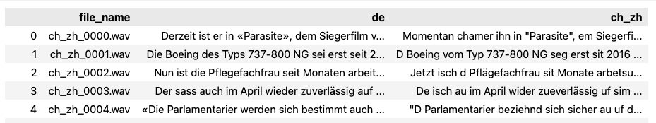

# T09 - Dialekte in der Spracherkennung

von *Muhammad Daniel BIN MOHD KHIR, Sofia GUTORANSKA, und Jimmy TAN*

## Abstract

Die automatische Spracherkennung (Automatic Speech Recognition, ASR) verspricht eine fließende, natürlichsprachliche Schnittstelle für die Interaktion von Menschen mit ihren digitalen Gegenübern. Trotz bemerkenswerter Fortschritte in diesem Bereich gibt es immer noch Herausforderungen, die gemeistert werden müssen. Eine davon ist das einzigartige Problem der dialektalen Varietäten in der gesprochenen Sprache. Dieser Bericht befasst sich mit dem speziellen Thema der Dialekte in der Spracherkennung und beleuchtet die Schwierigkeiten, mit denen ASR-Systeme konfrontiert sind, wenn sie mit dialektalen Eingaben umgehen müssen, sowie mögliche Verfahren zum Umgang mit diesen Problemen.

Dieser Bericht wird von einem Podcast, einem Fachvortrag und einer Code-Demo begleitet. Der Podcast führt den Leser in das Thema ein und gibt einen kurzen Überblick darüber, was Dialekte sind und warum derzeitige Spracherkennungssysteme Probleme mit ihnen haben. Er beleuchtet außerdem, warum dies ein wichtiges Problem ist, das gelöst werden muss.

Der Fachvortrag befasst sich ausführlich mit den Techniken und Ansätzen, die zur Behandlung von Dialekten verwendet werden, wie z. B. Daten-Augmentierung und Domain-Anpassung. Darüber hinaus wird ein kurzer Überblick über den Stand der Technik bei ASR-Modellen wie Whisper und XLSR vermittelt.

Schließlich wird in der Code-Demo der Vorgang zum Fine-Tuning eines Whisper-Modells für den schweizerdeutschen Zürcher Dialekt veranschaulicht.

## 1 Einleitung

!!! quote "Gespräch mit dem Sprachassistent Siri"
    — Hej Siri, tuä mal em Alex ahlütta![^1]

    — Entschuldigung, das habe ich leider nicht verstanden.

[^1]: Hej Siri, ruf den Alex mal an!

Das ist leider häufig der Fall, wenn man versucht, mit modernen Sprachassistenten in einem Dialekt zu reden. Sie sind einfach nicht in der Lage, mit nicht standardisierter Sprache umzugehen. Da es sich bei Dialekten um eine Nische handelt, fehlt es an Forschung und industriereifen Lösungen zur Lösung dieses Problems. Aber was genau sind Dialekte, und warum haben unsere derzeitigen KI-Systeme Probleme mit ihnen?

Dialekte sind Varianten einer Sprache, die in einer bestimmten Region überwiegend gesprochen werden. In den deutschsprachigen Teilen der Welt ist Hochdeutsch die Standardsprache - sie wird als offizielle Regierungssprache und als Sprache in den Medien verwendet. Varianten wie Bayerisch und Züritüütsch sind Dialekte, die sich stark von den Standardsprachen unterscheiden. So sehr, dass ein Muttersprachler oft kein einziges Wort davon verstehen kann. Dialekte können sich in folgenden Aspekten von Standardsprachen unterscheiden:

- lexikalisch - der Dialekt verwendet andere Wörter für ein Objekt; ein abweichender Wortschatz
- akustisch - die Aussprache der Wörter ist anders
- orthografisch - dieselben Wörter werden in einem Dialekt anders geschrieben

Auf der ganzen Welt gibt es unzählige Dialekte. Dieser Artikel wird sich nur auf Dialekte im Schweizerdeutschen konzentrieren, da diese Dialekte von einer bedeutenden Gruppe von Menschen in der DACH-Region gesprochen werden und auf diesem Gebiet viel geforscht wird.

In den folgenden Abschnitten werden einige Begriffe erläutert, die zum Verständnis der weiteren Ausarbeitung notwendig sind.

### 1.1 Automatische Spracherkennung

Die automatische Spracherkennung (*eng: Automatic Speech Recognition*, kurz ASR) ist der rechnerische Prozess, gesprochene Sprache in geschriebenen Text umzuwandeln. Es ist auch unter vielen anderen Namen bekannt, wie z. B. Speech to Text. ASR ist heute vor allem in Sprachassistenten wie Siri oder Alexa zu finden. Diese im Handy eingebetteten Agenten nutzen ASR, um Sprachbefehle des Benutzers zu erkennen, um bestimmte Aktionen auszuführen. Beispielsweise lässt sich mit einem Sprachbefehl einen Kontakt anrufen oder das Wetter abfragen. Ein weiterer Anwendungsfall für ASR ist die automatische Erstellung von Live-Transkriptionen für Videos auf Streaming-Seiten wie YouTube.

### 1.2 Schweizerdeutsch

Deutsch ist die dominierende Sprache der vier Hauptsprachen in der Schweiz, wobei 62% der Bevölkerung im Jahr 2020 Varianten vom Deutschen sprechen[^2]. Es ist wichtig, zwischen Schweizerdeutsch und Hochdeutsch zu unterscheiden.

Schweizerdeutsch ist kein einziger Dialekt von Hochdeutsch, sondern eine Gruppe von Dialekten, die in der Schweiz gesprochen werden. Die schweizen Mundarten können grob nach Kantonen (Verwaltungsregionen) unterteilt werden. Beispielsweise wird Bärndütsch in Bern gesprochen, und Züritüütsch in Zürich.

Schweizerdeutsch wird hauptsächlich gesprochen und koexistiert mit Hochdeutsch, das die Hauptform der schriftlichen Kommunikation ist. Da es vor allem gesprochen wird, hat es keine standardisierte Rechtschreibung, und jeder Dialekt unterscheidet sich in Phonetik, Grammatik und Wortschatz von anderen Dialekten. Der Berner Dialekt zum Beispiel wandelt das hochdeutsche *l* in ein *u* um. Das Wort a*l*t wird a*u*t ausgesprochen[^3].

Da sich diese Dialekte auf die Region konzentrieren, gibt es im Vergleich zum Hochdeutsch oder Englisch nur wenige Korpora und Daten zu ihnen, was das Schweizerdeutsch zu einer Low Resource Language macht. Aus diesem Grund und wegen der unzähligen regionalen Variationen ist die automatische Spracherkennung für Schweizerdeutsch eine fortlaufende Herausforderung.

## 2 Methoden

Es gibt jedoch einige Methoden zum Umgang mit Low Resource Languages wie Schweizerdeutsch beim Training von ASR-Modellen. Diese werden im Folgenden dargelegt.

### 2.1 Datenerfassung und Annotation

Um robuste und genaue ASR-Modelle für Dialekte zu trainieren, werden große Mengen an annotierten Daten benötigt. Die Datenerfassung in großem Umfang umfasst verschiedene Sprecher aus dem spezifischen dialektischen Hintergrund und ermöglicht es dem Modell, die Variationen und Nuancen zu erfassen, die in dieser spezifischen dialektischen Sprache vorhanden sind.

Zu diesen Daten gehören Audioaufnahmen sowie deren Transkriptionen und dialektische Labels, die für das Training und die Bewertung der Spracherkennungsmodelle wichtig sind. Die Audioaufnahmen können aus verschiedenen Kanälen stammen, einschließlich öffentlicher Sprachdatensätze, Audioarchiven, Interviews oder durch Aufnahme spezifischer Dialektsprecher in einer kontrollierten Umgebung. Die Datenannotation erfolgt oft auf zwei Arten, manuell und automatisch.

Die manuelle Annotation erfordert, dass der Muttersprachler in diesem speziellen Dialekt die Audiodaten manuell transkribiert, was sehr zeit- und ressourcenintensiv ist, aber sehr genau. Die automatische Transkription hingegen verwendet bereits trainierte Modelle für die automatische Transkription. Dieser Ansatz ist jedoch oft nicht machbar im Falle von Dialekten. Es gibt noch nicht viele Open-Source-Lösungen, die Dialekte genau transkribieren können, und vorhandene Modelle, die auf Standardsprachen trainiert wurden, liefern ungenaue Ergebnisse für dialektische Daten. Aus diesen Gründen werden manuelle Transkriptionen in diesem Kontext oft bevorzugt.

### 2.2 Daten-Augmentierung

Um die gesammelten Daten zu erweitern, kann man die Technik der Daten Augmentierung (*eng: Data Augmentation*) nutzen. Bei diesem Ansatz werden zusätzliche Trainingsbeispiele durch Anwendung verschiedener Transformationen auf die vorhandenen Daten generiert. Diese Transformationen können Variationen in Geschwindigkeit, Tonhöhe oder Hintergrundgeräuschen sein[^4]. Indem das ASR-Modell einem vielfältigeren Datensatz ausgesetzt wird, wird es widerstandsfähiger gegen verschiedene dialektische Variationen und generalisiert besser auf ungesehene Datenpunkte.

### 2.3 Domain-Anpassung

Die Domain-Anpassung (*eng: Domain Adaptation*) befasst sich mit der Anpassung des ASR-Modells an eine spezifische Domäne oder Anwendung, in der die Daten von den ursprünglichen Trainingsdaten abweichen könnten[^5]. Im Kontext von Dialekten wird die Domain-Anpassung entscheidend, da sich die akustischen Eigenschaften, der Wortschatz und die sprachlichen Muster erheblich von der Standardsprache unterscheiden können, auf der das ursprüngliche Modell trainiert wurde.

Techniken zur Domain-Anpassung zielen darauf ab, die Lücke zwischen den dialektischen Daten und dem vortrainierten Modell mithilfe von Transfer-Learning zu überbrücken. Das vortrainierte Modell, das allgemeine akustische und linguistische Darstellungen aus High Resource Languages gelernt hat, kann als Ausgangspunkt für das Training des ASR-Modells auf dialektischen Daten verwendet werden.

Durch die Initialisierung des Modells mit diesen vortrainierten Gewichten kann es von dem Wissen profitieren, das aus der Standardsprache gelernt wurde, und sich dann durch weiteres Training an den spezifischen Dialekt anpassen. Aufgrund dessen kann man eine kleinere Menge an in-domain-dialektischen Daten nutzen, um das Modell zu optimieren. Dies hilft dem Modell, sich besser auf die spezifischen dialektischen Variationen einzustellen und verbessert seine Leistung in diesem Bereich.

## 3 Stand der Forschung

Im folgenden Abschnitt werden Ressourcen für den Umgang mit Schweizerdeutsch in der ASR, wie Datensätze und Modelle, vorgestellt.

### 3.1 Datensätze

Modelle für maschinelles Lernen sind "garbage in, garbage out". Daher ist es von größter Bedeutung, gute Daten zu haben, aus denen die Modelle lernen können. In diesem Teil werden die verfügbaren schweizerdeutschen Datensätze vorgestellt. Alle genannten Datensätze sind öffentlich zugänglich.

#### Schweizer Dialektsammlung (2022)

Die Schweizer-Dialektsammlung[^6] umfasst insgesamt 200 Stunden gesprochenes Audiomaterial von 4000 Sprechern verschiedener Dialekte, Altersgruppen und Geschlechter. Die Audiodaten sind mit Sprecherangaben und Transkriptionen in Hochdeutsch annotiert. Die gesprochenen Texte stammen von Sätzen aus dem deutschen Common Voice Corpus sowie aus Schweizer Nachrichtenquellen.

Inspiriert durch das <a href="https://commonvoice.mozilla.org/" target="_blank">Mozilla CommonVoice Projekt</a> haben die Kuratoren des Korpus ein Open-Source-Tool verwendet, um die Aufnahme und Validierung der gesprochenen Audiodaten per Crowdfunding zu ermöglichen. Die Datensammlung wurde stark beworben und spielerisch gestaltet, da die Autoren mit Schweizer Medien zusammenarbeiteten, um eine große Reichweite zu erzielen. Es wurden Wettbewerbe veranstaltet, um zur Teilnahme zu ermutigen, wie z.B. ein kantonsübergreifender Wettbewerb, bei dem es darum ging, welcher Kanton die meisten Aufnahmen erstellen konnte.

#### SwissDial (2021)

SwissDial[^7] ist ein paralleles Audiokorpus, das 8 Hauptdialekte abdeckt, wovon jeder Dialekt mindestens 3 Stunden an Audiodaten enthält. Parallel bedeutet, dass das Korpus gesprochene Äußerungen von den identischen Sätzen je Dialekt enthält. Jeder Datenpunkt ist mit entsprechenden Transkriptionen sowohl im Dialekt als auch im Hochdeutschen annotiert. Die Domäne erstreckt sich über ein breites Spektrum von Themen wie Kultur, Wirtschaft, Wissenschaft und Politik. Das Korpus wurde erstellt, indem für jeden Dialekt ein Annotator ausgewählt und professionelle Aufnahmen durchgeführt wurden, um ihre Stimmen einzufangen.

#### Honorable Mentions

Die oben genannten Datensätze stellen aufgrund ihrer Breite und ihres Umfangs die aktuelle Crème de la Crème dar. Sie können leicht für die Entwicklung datengetriebener Schweizerdeutscher NLP-Anwendungen verwendet werden. Andere verfügbare Datensätze wie das Swiss Parliament Corpus[^8], ArchiMob[^9] und Radio Rottu Oberwallis[^10] sind entweder fachspezifisch, enthalten keine hochdeutschen Transkripte oder haben zu wenig Daten für ein optimales Modell-Finetuning.

### 3.2 Modelle

In diesem Abschnitt werden zwei gängige End-to-End-Modelle, Whisper und XLSR, kurz erläutert. End-to-End-Modelle verwenden Audiodaten als Eingabe und geben transkribierten Text aus dem Audiomaterial aus. Dies macht sie für Praktiker leicht anwendbar, da Zwischenschritte wie das Chunking von Audiodaten in 30-Sekunden-Intervallen und die Generierung von Log-Mel-Spektrogrammen in das Modelltraining integriert sind und während der Inferenz nicht separat durchgeführt werden müssen.

#### Whisper

Whisper[^11] ist ein Sequence to Sequence Spracherkennungs- und Übersetzungsmodell, das von OpenAI veröffentlicht wurde. Es wurde mit 680.000 Stunden gelabelter Audiotranskriptionsdaten trainiert, von denen 243.000 nicht-englische Daten sind. Dank der riesigen Menge an Trainingsdaten ist Whisper robust gegenüber Akzenten, Hintergrundgeräuschen und Fachsprache. Es zeichnet sich durch Zero-Shot-Learning aus und erfordert oft kein vorheriges Fine-Tuning für domänenspezifische Aufgaben. Aufgrund seiner hervorragenden Leistung und Benutzerfreundlichkeit wurde Whisper in beliebte kommerzielle Produkte wie <a href="https://auphonic.com/features#speechrec" target="_blank">Auphonic</a>, ein Podcasting-Tool mit KI, integriert.

Der Archiktekur von Whisper ist unten abgebildet[^12].

<figure markdown>
  
  <figcaption>Fig. 1: Der Encoder-Decoder-Transformer Architektur von Whisper.</figcaption>
</figure>

#### XLSR

XLSR[^13] basiert auf Wav2Vec 2.0 und ist ein mehrsprachiges Modell, das auf 60.000 Stunden ungelabelter Audiodaten trainiert wurde. Es führt unüberwachte maskierte Vorhersagen durch, d.h. es lernt Zwischenzuordnungen von Sprachaudio zu versteckten Zuständen im Modell. XLSR muss finetuned werden, um kontinuierliche Zuordnungen für Transkriptionen zu erzeugen.

### 3.3 Kommerzielle Dienste

Es gibt auch Unternehmen, die Sprache-zu-Text-Dienste als Online-Dienste für Kunden anbieten. Diese werden im Anschluss beschrieben.

#### Cloud-Anbieter

Die drei großen Cloud-Anbieter (<a href="https://aws.amazon.com/transcribe/" target="_blank">AWS</a>, <a href="https://azure.microsoft.com/en-us/products/cognitive-services/speech-to-text" target="_blank">Azure</a> und <a href="https://cloud.google.com/speech-to-text" target="_blank">GCP</a>) bieten alle kostenpflichtige APIs für ihre Text-to-Speech-Dienste an. Die APIs richten sich jedoch eher an Softwareentwickler, um ASR-Produkte mit ihren Diensten zu entwickeln, und sind nicht auf Endbenutzer ausgerichtet. Alle unterstützen die Transkription von schweizerdeutschem Audio.

#### Töggl

<a href="https://xn--tggl-5qa.ch/" target="_blank">Töggl</a> ist ein kostenpflichtiger TTS-Dienst von recapp, einem Schweizer Unternehmen, das sich auf die Spracherkennung von Dialekten spezialisiert hat. Es handelt sich um eine Webanwendung, die aus hochgeladenen Audiodateien Texttranskriptionen erstellt. Töggl richtet sich an Studenten und Journalisten, die in der Schweiz leben. Gemäss den AGB dürfen nämlich nur in der Schweiz wohnhafte Personen den Dienst nutzen. Im Gegensatz zu den Cloud-Anbietern ist Töggl datenschutzbewusst und bietet maßgeschneiderte On-Premise-Lösungen für Unternehmen an.

## 4 Anwendungen

Die oben dargestellten vortrainierten Modelle zeigen beeindruckende Ergebnisse. Es lohnt sich jedoch zu prüfen, ob durch Fine-Tuning eines bereits vorhandenen Modells mit einem der oben beschriebenen schweizerdeutschen Datensätze noch Verbesserungen erzielt werden können. Eine mögliche Verbesserung wäre, dass das Modell in der Lage ist, Transkriptionen in Schweizerdeutsch anstelle von Hochdeutsch auszugeben.

Dieser Teil erläutert die Schritte, die für das Fine-Tuning eines Whisper-Modells erforderlich sind. Anschließend wird das finetuned Whisper-Modell mit den nicht-finetuned Versionen der Modelle Whisper und XLSR verglichen. Der ganze Vorgang basiert auf einer <a href="https://huggingface.co/blog/fine-tune-whisper" target="_blank">Anleitung von HuggingFace</a>[^14].

### 4.1 Vorbereitende Schritte

Bevor das Modell tatsächlich finetuned wird, müssen einige vorbereitende Schritte durchgeführt werden. Dazu gehören das Laden und Verarbeiten des Datensatzes sowie das Laden einiger Hilfsklassen. Dieser Prozess wird in den folgenden Unterabschnitten beschrieben.

#### Laden des Datensatzes

Für das Finetuning wurde der SwissDial-Datensatz gewählt, da er ein grosses Audio-Korpus mit schweizerdeutschen und hochdeutschen Transkriptionen enthält. Dies ermöglicht einen einfachen Vergleich. SwissDial wurde bereits [oben](#swissdial-2021) beschrieben.

Da der Datensatz 8 verschiedene Dialekte enthält, wurde nur der Zürcher Dialekt (ZH) für das Finetuning ausgewählt, da er die meisten Audiodaten enthält, insgesamt 4,55 Stunden. Die Daten wurden in einem Verhältnis von 80:20 in Trainings- und Testdatensätze aufgeteilt, was zu 3,64 Stunden Trainingsdaten und den verbleibenden 0,91 Stunden für Tests führt. Ein Validierungs-Split wurde nicht durchgeführt, da nur wenige Daten zur Verfügung standen.

Der Datensatz muss zunächst verarbeitet werden. Er besteht aus einer Reihe von .wav-Audiodateien, die jeweils einen anderen Satz repräsentieren. Zusätzlich gibt es eine JSON-Datei, in der die Metadaten gespeichert sind. Die Metadaten enthalten Transkriptionen sowohl im Dialekt als auch im Hochdeutsch, sowie weitere Informationen wie die Domäne des Satzes.

Mit der Python-Bibliothek *pandas* wurden die Metadaten in einen DataFrame importiert, manipuliert und bereinigt. Der endgültige DataFrame bestand aus 3 Spalten: Die hochdeutsche Transkription, die Zürcher Dialekttranskription, sowie der Pfad zur entsprechenden Audiodatei. Dieser finale DataFrame umfasst die Metadaten unseres Korpus.

<figure markdown>
  
  <figcaption>Fig. 2: Der finale, bereinigte DataFrame.</figcaption>
</figure>

Mit Hilfe der HuggingFace <a href="https://huggingface.co/docs/datasets/index" target="_blank">*datasets*</a> Bibliothek werden die Metadaten und die Audiodateien zu einem einzigen Audio-Dataset-Objekt zusammengefasst, um sie später leichter verarbeiten zu können.

```python
from datasets import load_dataset

dataset = load_dataset("audiofolder", data_dir="../dataset/zh/")
```

#### Merkmalsextraktion

Sprachsignale können als eindimensionale Arrays betrachtet werden, die sich mit der Zeit verändern. Jeder Wert entspricht der Amplitude des Signals zu einem bestimmten Zeitpunkt. Kontinuierliche Sprache enthält eine unendliche Anzahl von Amplitudenwerten. Für den Computer ist dies ein Problem, da er diskrete Signale erwartet.

Um dieses Problem zu lösen, muss das Sprachsignal in festen Zeitschritten gesampelt werden. Das Intervall, in dem die Audiodaten abgetastet werden, wird als Abtastrate (*eng: Sample Rate*) bezeichnet. Diese wird normalerweise in Samples pro Sekunde oder Hertz (Hz) gemessen.

Die Abtastrate der Audiodaten muss mit der von Whisper erwarteten Rate identisch sein. Andernfalls kann es zu unerwarteten Ergebnissen kommen, da Audiosignale mit unterschiedlichen Abtastraten unterschiedlich verteilt werden. Für Whisper werden für die Trainingsdaten Audiodaten mit einer Abtastrate von 16 kHz benötigt.

Die HuggingFace <a href="https://huggingface.co/docs/transformers/index" target="_blank">*Transformers*</a> Bibliothek bietet praktische Hilfsklassen für das Finetuning und Training eines Whisper-Modells. Hier wird die `WhisperFeatureExtractor` Klasse für folgende Aufgaben verwendet:

- Resampling des Eingangssignals auf 16 kHz.
- Auffüllen oder Kürzen von Audiosamples auf eine feste Länge von 30 Sekunden.
- Umwandlung von Audio-Samples in Log-Mel-Spektrogramme.

Log-Mel-Spektrogramme sind eine visuelle Darstellung der Frequenz eines Signals und sind das, was Whisper als Eingabe erwartet. Ein beispielhaftes Spektrogramm ist unten abgebildet[^15].

<figure markdown>
  
  <figcaption>Fig. 3: Die Umwandlung von einem Audiosignal in ein Log-Mel-Spektrogramm.</figcaption>
</figure>

#### Tokenisierung von Text

Whisper gibt eine Serie von Text-Tokens aus, die für Menschen unverständlich sind. Diese Zahlenreihen stellen Indizes für bestimmte Wörter im internen Wörterbuch von Whisper dar und sind byte-pair kodiert. Diese Kodierungen werden mit Hilfe eines so genannten Tokenizers in echten Text umgewandelt.

```python
>>> encoded_tokens
[32, 84, 368, 40512, 271, 948, 20731, 302, ... 13]

>>> decoded_tokens
Au de Bewis enthaltet analytischi Schwäche wo erscht spöter händ chöne besitigt werde.
```

Weitere Informationen zu Byte-Paar-Kodierungen gibt es in diesem <a href="https://huggingface.co/learn/nlp-course/chapter6/5?fw=pt#bytepair-encoding-tokenization" target="_blank">HuggingFace-Tutorial</a>.

Hier erledigt die Hilfsklasse `WhisperTokenizer` genau das.

```python
from transformers import WhisperTokenizer

tokenizer = WhisperTokenizer.from_pretrained("openai/whisper-small", language="de", task="transcribe")
```

Um zu kontrollieren, ob der Tokenizer korrekt arbeitet, kann man einen bestimmten Datenpunkt heraussuchen und den Eingabe-String mit seiner tokenisierten und dekodierten Variante vergleichen.

```python
input_str = dataset_tt["train"][1]["ch_zh"]
labels = tokenizer(input_str).input_ids
decoded_str = tokenizer.decode(labels, skip_special_tokens=True)

>>> input_str
De Nils Puk hät ihn lut ahgschroue und gschwört sich zräche.

>>> decoded_str
De Nils Puk hät ihn lut ahgschroue und gschwört sich zräche.
```

#### Kombination von Feature Extraktor und Tokenizer

Der Feature Extractor und der Tokenizer können zur einfacheren Verwendung in einer einzigen Prozessor-Klasse kombiniert werden. Dies wird mit der Utility-Klasse WhisperProcessor gemacht. Dadurch wird das spätere Training vereinfacht, da nur der Prozessor und das Modell verfolgt werden müssen.

```python
from transformers import WhisperProcessor

processor = WhisperProcessor.from_pretrained("openai/whisper-small", language="de", task="transcribe")
```

#### Aufbereitung der Daten

Hier kommt der zuvor vorbereitete Audio-Dataset ins Spiel.

Jeder Datenpunkt enthält Folgendes:

- den Pfad zur Audiodatei.
- ein eindimensionales Array, das die Audiodaten repräsentiert.
- Sample-Rate (22kHz).
- Transkription in Hochdeutsch.
- Transkription im Zürcher Dialekt.

```python
>>> single_data_point

{
  "audio": {
    "path": "dataset/zh/ch_zh_2239.wav",
    "array": array([1.50373509e-07, ..., -3.17052582e-07]),
    "sampling_rate": 22050
  },
  "de": "Der Nis Puk schrie ihn laut an und schwor, sich zu rächen.",
  "ch_zh": "De Nils Puk hät ihn lut ahgschroue und gschwört sich zräche."
}
```

Jeder Datenpunkt muss so verarbeitet werden, dass:

- die Sample-Rate auf 16 kHz reduziert wird.
- das Audio-Array in ein Log-Mel-Spektrogramm umgewandelt wird.
- die Zürcher Dialekttranskription tokenisiert wird.

Die Funktion `prepare_dataset` erledigt genau das. Zusätzlich ermöglicht die `map` Funktion die parallele Verarbeitung des Datensatzes, was die Vorverarbeitung beschleunigt.

```python
def prepare_dataset(batch):
    # load and resample audio data from 22050Hz to 16kHz
    audio = batch["audio"]

    # compute log-Mel input features from input audio array
    batch["input_features"] = feature_extractor(audio["array"], sampling_rate=audio["sampling_rate"]).input_features[0]

    # encode taget text to label ids
    batch["labels"] = tokenizer(batch["ch_zh"]).input_ids

    return batch

dataset_after_prep = dataset.map(prepare_dataset, remove_columns=dataset.column_names["train"], num_proc=4)
```

#### Definieren eines Data Collators

Ein Data Collator fasst Inputdaten zu einem Batch zusammen, der später für das Training verwendet wird. Wenn der Collator aufgerufen wird, werden die oben beschriebenen Vorverarbeitungsschritte für jeden Batch durchlaufen. Anstatt den Feature Extractor und den Tokenizer separat zu verwenden, kann hier der kombinierte WhisperProcessor genutzt werden. Es gibt auch einige zusätzliche Schritte für die Umwandlung in PyTorch-Tensoren und das Padding von Labels.

#### Definieren einer Evaluierungsmetrik

Zur Bewertung der Leistung des Modells wird die Word-Error-Rate (WER) verwendet. Die WER ist eine gängige Metrik zur Beurteilung von ASR-Modellen und wird wie folgt berechnet:

$$
WER = \frac{S + D + I}{N}
$$

Wobei:

- S - Anzahl der substituierten Wörter (in der Ausgabe ersetzte Wörter)
- D - Anzahl der gelöschten Wörter (in der Ausgabe fehlende Wörter)
- I - Anzahl der eingefügten Wörter (in der Ausgabe hinzugefügte Wörter)
- N - Gesamtzahl der Wörter

Je niedriger der WER-Wert, desto besser ist die Leistung des Modells, da es weniger Inkonsistenzen zwischen der generierten Ausgabe und der Ground Truth gibt.

Die HuggingFace <a href="https://huggingface.co/docs/evaluate/index" target="_blank">*evaluate*</a> Bibliothek stellt eine fertige Implementierung der WER-Metrik zur Verfügung. Diese kann dann in eine Hilfsfunktion, `compute_metrics`, verpackt werden, die die Prognosen verarbeitet und das endgültige WER berechnet.

### 4.2 Training

Vor dem Training sind noch einige Schritte notwendig. Zunächst muss ein vortrainierter Checkpoint des Whisper-Modells aus dem Hugging Face Hub geladen werden. Danach müssen einige Trainingsargumente definiert werden, z. B. die Lernrate, die Schritte für das Checkpointing und der Speicherplatz für die Logs.

Schließlich können die Trainingsargumente, das vortrainierte Modell, der Datensatz, der Data Collator und der Metrikrechner an eine Trainer Klasse übergeben werden.

Das Training wird dann einfach mit einem Aufruf von `trainer.train()` durchgeführt.

Je nach Hardware kann das Training etwa 10-20 Stunden dauern.

### 4.3 Auswertung

Das finetuned Modell für den Zürcher Dialekt ist auf dem <a href="https://huggingface.co/ss0ffii/whisper-small-german-swiss" target="_blank">Hugging Face Hub</a> verfügbar.

Vor dem Finetuning lag der WER auf dem Testdatensatz bei 77%, was ziemlich hoch ist. Nach dem Finetuning sinkt dieser Wert jedoch auf einer wesentlich handlicheren 30%.

Zur Erinnerung: Je niedriger der WER, desto besser, da das Modell genauere Transkriptionen liefert. Etwa 30% der mit dem finetuned Modell ermittelten Ergebnisse stimmen nicht mit dem Ground Truth überein.

Der WER für die Trainingsdaten liegt jedoch bei sehr niedrigen 9,41%. Dies könnte bedeuten, dass Overfitting stattgefunden hat und das Modell schlecht generalisieren kann, so dass es bei fremden, vorher ungesehenen Daten schlechter abschneidet.

### 4.4 Modellvergleich

In diesem Abschnitt werden die generierten Transkriptionen des finetuned Whisper-Modells mit zwei anderen Modellen verglichen: dem kleinen Whisper Modell und einem XLSR-Modell, das für Deutsch finetuned wurde[^16]. Da während des Trainings kein Holdout-Set definiert wurde, wurden 5 zufällige Datenpunkte aus einem anderen Dialekt (Graubünden, GR) zum Vergleich genommen.

<figure markdown>
  
  <figcaption>Fig. 4: Tabelle zum Vergleich von 3 Modellen.</figcaption>
</figure>

Die obenstehende Tabelle zeigt die 5 Datenpunkte, zusammen mit den Ground Truth Labels und den vorhergesagten Transkriptionen. Die zweite bis vierte Spalte zeigen die Ground Truth Labels für Hochdeutsch, den Zürcher Dialekt und den Graubündner Dialekt, während die letzten drei Spalten die Vorhersagen der jeweiligen Modelle für den Graubündner Dialekt enthalten.

Wenn man einen anderen Dialekt zum Vergleich benutzt, gibt es einige Punkte, die zu beachten sind. Erstens sind einige lexikalische Abweichungen zu beobachten - im Zürcher Dialekt wird "Momentan" verwendet, während das entsprechende Wort in Graubünden stattdessen "Derziit" heißt. Auch in der Schreibweise gibt es Unterschiede, zum Beispiel beim Wort "nicht", das in Zürich als "nöd" und in Graubünden als "nit" transkribiert wird.

Das kleine Whisper-Modell ist in der Lage, weitgehend genaue Transkriptionen zu liefern, die die grobe Bedeutung des Satzes erfassen. Allerdings wird Sätze auf Hochdeutsch transkribiert, da noch kein Fine-Tuning für Schweizerdeutsch vorgenommen wurde. Nach dem Fine-Tuning des Modells stimmen die Vorhersagen besser mit dem Label überein und können die meisten Besonderheiten des Dialekts berücksichtigen. Dies korrespondiert mit einer niedrigeren Word-Error-Rate.

Das XLSR-Modell (in der Tabelle als Wave2Vec bezeichnet) weist die meisten Unterschiede auf. Der Tokenizer des Modells spielt hier die entscheidende Rolle. Der Tokenizer von Whisper kann Satzzeichen und Großschreibung verarbeiten, während der Tokenizer von XLSR dies nicht tut. Dies führt zu Vorhersagen, die weniger mit den Labels übereinstimmen, und somit zu einem höheren WER. Eine mögliche Verbesserung wäre jedoch, auch das XLSR-Modell finezutunen, um festzustellen, wie es dann abschneidet.

Insgesamt sind alle drei Modelle in der Lage, einen schweizerdeutschen Dialekt mit unterschiedlicher Genauigkeit zu transkribieren. Das finetuned Whisper-Modell zeigt die Fähigkeit, die besonderen Merkmale des Dialekts zu erfassen.

## 5 Fazit

Zusammenfassend lässt sich sagen, dass Dialekte erhebliche Herausforderungen für automatische Spracherkennungssysteme darstellen, da sie von den Standardsprachen abweichen. Die einzigartigen Eigenschaften dialektaler Variationen, wie lexikalische, akustische und orthografische Unterschiede, stellen aktuelle ASR-Modelle vor Schwierigkeiten. Allerdings werden diese Herausforderungen durch laufende Forschung und Fortschritte auf diesem Gebiet angegangen.

Zu den Key-Takeaways gehört die deutliche Verbesserung, die durch das Finetuning des Whisper-Modells speziell für schweizerdeutsche Dialekte erzielt wurde. Durch das Training des Modells anhand des SwissDial-Datensatzes, der annotierte Audioaufnahmen und Transkriptionen sowohl in Schweizerdeutsch als auch in Hochdeutsch enthält, zeigte das finetuned Whisper-Modell eine bemerkenswerte Reduzierung der Word-Error-Rate. Diese Verbesserung weist darauf hin, dass das finetuned Modell besser in der Lage ist, die einzigartigen phonetischen und sprachlichen Merkmale von schweizerdeutschen Dialekten zu erfassen.

Darüber hinaus spielen öffentlich verfügbare Datensätze wie die Schweizer Dialektsammlung und SwissDial eine wichtige Rolle zur Verbesserung von ASR-Modellen bei. Besonders umfangreich ist die Schweizer Dialektsammlung mit 200 Stunden Audiomaterial von 4000 Sprechern unterschiedlicher Dialekte, Altersgruppen und Geschlechter. Modellen wie Whisper und XLSR lassen sich leicht auf Dialekte finetunen, sofern genügend Daten vorhanden sind. Der einfache Zugang zu solchen Datensätzen und Modellen ermöglicht es Praktikern, ASR-Systeme, die mit Dialekte umgehen können, aufzubauen.

Zudem bieten Techniken wie Daten-Augmentierung und Domain-Anpassung die Möglichkeit, mit Dialekten zu arbeiten. Die Daten-Augmentierung macht ASR-Modelle robuster gegenüber dialektalen Varietäten, indem die Daten auf verschiedene Weise transformiert werden, um zusätzliche Trainingsbeispiele zu erstellen. Die Domain-Anpassung setzt Transfer-Learning ein, um gelernte akustischen und sprachlichen Muster von High-Resource Languages auf Dialekten anzuwenden und somit bessere Leistungen für Dialekten zu liefern.

​​Es ist noch ein weiter Weg, bis ASR-Systeme Dialekte problemlos verstehen und verarbeiten können. Die in diesem Bericht vorgestellten Methoden und Anwendungen sind jedoch bedeutende Fortschritte in diesem Bereich. In der Zukunft wird es sicherlich noch weitere spannende Entwicklungen geben.

## 6 Weiterführendes Material

### 6.1 Podcast

Hier Link zum Podcast.

### 6.2 Talk

Hier einfach Youtube oder THD System embedden.

### 6.3 Demo

Hier Link zum Demo Video.

Der Repository befindet sich [hier](https://mygit.th-deg.de/sg07789/sat-dialect_in_sr).

## 7 Literaturliste

Die Literatur in den Fußnoten sind hier vollständig zitiert.

[2] ‘Sprachen | Bundesamt für Statistik’. https://www.bfs.admin.ch/bfs/de/home/statistiken/bevoelkerung/sprachen-religionen/sprachen.html (accessed Jun. 27, 2023).
[^2]: 	‘Sprachen | Bundesamt für Statistik’.

[3] Scherrer, Y., & Rambow, O. (2010). Natural language processing for the Swiss German dialect area. Semantic Approaches in Natural Language Processing-Proceedings of the Conference on Natural Language Processing 2010 (KONVENS), 93–102.
[^3]: 	Scherrer, Y., & Rambow, O. (2010). Natural language processing for the Swiss German dialect area.

[4] T.-S. Nguyen, S. Stüker, J. Niehues, and A. Waibel, ‘Improving Sequence-To-Sequence Speech Recognition Training with On-The-Fly Data Augmentation’, in ICASSP 2020 - 2020 IEEE International Conference on Acoustics, Speech and Signal Processing (ICASSP), May 2020, pp. 7689–7693. doi: 10.1109/ICASSP40776.2020.9054130.
[^4]: T.-S. Nguyen, S. Stüker, J. Niehues, and A. Waibel, ‘Improving Sequence-To-Sequence Speech Recognition Training with On-The-Fly Data Augmentation’.

[5] T. Wang, Z. Ding, W. Shao, H. Tang, and K. Huang, ‘Towards Fair Cross-Domain Adaptation via Generative Learning’, in 2021 IEEE Winter Conference on Applications of Computer Vision (WACV), Waikoloa, HI, USA: IEEE, Jan. 2021, pp. 454–463. doi: 10.1109/WACV48630.2021.00050.
[^5]: T. Wang, Z. Ding, W. Shao, H. Tang, and K. Huang, ‘Towards Fair Cross-Domain Adaptation via Generative Learning’.

[6] M. Plüss et al., ‘SDS-200: A Swiss German Speech to Standard German Text Corpus’. arXiv, May 19, 2022. doi: 10.48550/arXiv.2205.09501.
[^6]: 	M. Plüss et al., ‘SDS-200: A Swiss German Speech to Standard German Text Corpus’.

[7] P. Dogan-Schönberger, J. Mäder, and T. Hofmann, ‘SwissDial: Parallel Multidialectal Corpus of Spoken Swiss German’. arXiv, Mar. 21, 2021. Accessed: Jun. 27, 2023. [Online]. Available: http://arxiv.org/abs/2103.11401
[^7]: 	P. Dogan-Schönberger, J. Mäder, and T. Hofmann, ‘SwissDial: Parallel Multidialectal Corpus of Spoken Swiss German’.

[8] M. Plüss, L. Neukom, C. Scheller, and M. Vogel, ‘Swiss Parliaments Corpus, an Automatically Aligned Swiss German Speech to Standard German Text Corpus’. arXiv, Jun. 09, 2021. Accessed: Jun. 27, 2023. [Online]. Available: http://arxiv.org/abs/2010.02810
[^8]: 	M. Plüss, L. Neukom, C. Scheller, and M. Vogel, ‘Swiss Parliaments Corpus, an Automatically Aligned Swiss German Speech to Standard German Text Corpus’.

[9] T. Samardžić, Y. Scherrer, and E. Glaser, ‘ArchiMob - A Corpus of Spoken Swiss German’, in Proceedings of the Tenth International Conference on Language Resources and Evaluation (LREC’16), Portorož, Slovenia: European Language Resources Association (ELRA), May 2016, pp. 4061–4066. Accessed: Jun. 27, 2023. [Online]. Available: https://aclanthology.org/L16-1641
[^9]: 	T. Samardžić, Y. Scherrer, and E. Glaser, ‘ArchiMob - A Corpus of Spoken Swiss German’.

[10] P. N. Garner, D. Imseng, and T. Meyer, Eds., ‘Automatic Speech Recognition and Translation of a Swiss German Dialect: Walliserdeutsch’, Proceedings of Interspeech, 2014, doi: 10.21437/Interspeech.2014-480.
[^10]: 	P. N. Garner, D. Imseng, and T. Meyer, Eds., ‘Automatic Speech Recognition and Translation of a Swiss German Dialect: Walliserdeutsch’.

[11] A. Radford, J. W. Kim, T. Xu, G. Brockman, C. McLeavey, and I. Sutskever, ‘Robust Speech Recognition via Large-Scale Weak Supervision’. arXiv, Dec. 06, 2022. doi: 10.48550/arXiv.2212.04356.
[^11]: A. Radford, J. W. Kim, T. Xu, G. Brockman, C. McLeavey, and I. Sutskever, ‘Robust Speech Recognition via Large-Scale Weak Supervision’.

[12] ‘Introducing Whisper’. https://openai.com/research/whisper (accessed Jun. 29, 2023).
[^12]: Bildquelle: ‘Introducing Whisper’.

[13] A. Conneau, A. Baevski, R. Collobert, A. Mohamed, and M. Auli, ‘Unsupervised Cross-lingual Representation Learning for Speech Recognition’. arXiv, Dec. 15, 2020. doi: 10.48550/arXiv.2006.13979.
[^13]: A. Conneau, A. Baevski, R. Collobert, A. Mohamed, and M. Auli, ‘Unsupervised Cross-lingual Representation Learning for Speech Recognition’.

[14] ‘Fine-Tune Whisper For Multilingual ASR with 🤗 Transformers’. https://huggingface.co/blog/fine-tune-whisper (accessed Jun. 30, 2023).
[^14]: ‘Fine-Tune Whisper For Multilingual ASR with 🤗 Transformers’. https://huggingface.co/blog/fine-tune-whisper (accessed Jun. 30, 2023).

[15] ‘SpecAugment: A New Data Augmentation Method for Automatic Speech Recognition’, Apr. 22, 2019. https://ai.googleblog.com/2019/04/specaugment-new-data-augmentation.html (accessed Jun. 29, 2023).
[^15]: Bildquelle: ‘SpecAugment: A New Data Augmentation Method for Automatic Speech Recognition’.

[16]	J. Grosman, Fine-tuned XLSR-53 large model for speech recognition in German. https://huggingface.co/jonatasgrosman/wav2vec2-large-xlsr-53-german, 2021. [Online]. Available: https://huggingface.co/jonatasgrosman/wav2vec2-large-xlsr-53-german
[^16]:	J. Grosman, Fine-tuned XLSR-53 large model for speech recognition in German.
