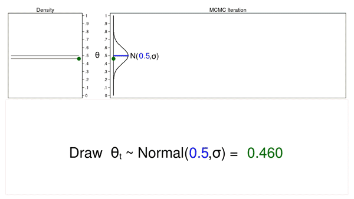

# Bayesian Modeling
von Serife-Nur Özdemir, Sanamjeet Meyer und Anna Postnikova

Die bayesianische Modellierung basiert auf der bayesianischen Statistik. Im Vergleich zum frequentistischen Ansatz spiegelt der bayesianische Ansatz eher die menschliche Denkweise wider. Der bayesianische Ansatz berücksichtigt das Vorwissen bei der Inferenz, was besonders hilfreich ist, wenn bereits Expertenwissen oder Vorkenntnisse in einem Bereich vorhanden sind. Nahezu alle klassischen Modelle des maschinellen Lernens können in bayesianische Modelle umgewandelt werden. In dieser Arbeit gehen wir darauf ein, was bayesianische Modellierung ist, wie sie funktioniert und welche Vor- und Nachteile sie hat.

## Einführung in die Bayes Statistik

### Bayes-Theorem

Das Bayes-Theorem ist ein grundlegendes Konzept der Wahrscheinlichkeitstheorie, das es uns ermöglicht, unsere Überzeugungen über ein Ereignis basierend auf neuen Beweisen zu aktualisieren. Es kann wie folgt formuliert werden:

* P(A|B) repräsentiert die Wahrscheinlichkeit, dass Ereignis A eintritt, unter der Bedingung, dass Ereignis B eingetreten ist.
* P(B|A) ist die Wahrscheinlichkeit, dass Ereignis B eintritt, unter der Bedingung, dass Ereignis A eingetreten ist.
* P(A) ist die Wahrscheinlichkeit, dass Ereignis A eintritt.
* P(B) bezeichnet die Wahrscheinlichkeit, dass Ereignis B eintritt.

$$ P(A|B) = \frac{P(B|A)P(A)}{P(B)} $$

$$ P(A|B) = \frac{P(B|A)P(A)}{P(B)} $$

Das Bayes-Theorem bietet eine Möglichkeit, die Wahrscheinlichkeit von Ereignis A unter Berücksichtigung vorhandener Kenntnisse und neuer Beweise zu berechnen. Es wird in verschiedenen Bereichen eingesetzt, darunter Statistik, maschinelles Lernen und Datenanalyse.

### Anwendungsbeispiel Medizinischer Test

- In 99,5% der Fälle fällt der Test positiv aus.
- Sollte die Krankheit nicht vorliegen, beträgt die Wahrscheinlichkeit für einen positiven Test 1%.
- Laut einer Studie leidet eine von vier Personen an der betreffenden Krankheit.
- Wie groß ist die Wahrscheinlichkeit, dass jemand an der Krankheit leidet, obwohl der Test ein negatives Ergebnis zeigt?

### Modell-Annahmen

K = Person ist krank  
T = Test fällt positiv aus

$$P(T|K) = 0.995$$


$$P(T|\overline{K}) = 0.01$$


$$P(K) = 0.25$$


### Gesucht wird die Wahrscheinlichkeit


$$P(K|\overline{T})$$


## Anwendungsbeispiel Bayes Theorem

### Bayes Theorem


$$P(A|B) = \frac{P(B|A)P(A)}{P(B)}$$


$$P(K|\overline{T}) = \frac{P(\overline{T}|K)P(K)}{P(\overline{T}|K)P(K) + P(\overline{T}|\overline{K})P(\overline{K})}$$


$$ = \frac{(1-0.995)\cdot 0.25}{(1-0.995)\cdot 0.25 + (1-0.01)\cdot 0.75}$$

$$
= 0.00185
$$


### Diagnostik seltener Ereignisse
Vorsorgliche Untersuchung auf einer Krankheit

Bekannte Informationne:

- $0,1\%$ der männlichen Bevölkerung ist mit der Krankheit infiziert
- $95\%$ Wahrscheinlichkeit für korrekte Diagnose bei erkrankter Person
- $98\%$ Wahrscheinlichkeit für negatives Ergebnis bei gesunder Person

Fragestellung:

- Wie groß ist die Wahrscheinlichkeit, dass der Mann tatsächlich krank
ist?
- Intuitive Antwort von $95\%$ ist falsch, da Ursache und Ereignis
vertauscht werden

Modell-Annahmen:

Gegebene Informationen:

- Hypothesen: $K$ = "Der Mann ist krank", $\overline{K}$ = "Der Mann ist gesund"

- A-priori-Wahrscheinlichkeiten: $P(K) = 0,001$, $P(\overline{K}) = 0,999$

- Likelihoods: $P(P|K) = 0,95$, $P(P|\overline{K}) = 0,02$

Gesucht: 

- A-posteriori-Wahrscheinlichkeit $P(K|P)$

### Anwendung Bayes Theorem:

\\[P(K|P) = \frac{{P(K) \cdot P(P|K)}}{{P(K) \cdot P(P|K) + P(\overline{K}) \cdot P(P|\overline{K})}}\\]
\\[P(K|P) = \frac{{0.001 \cdot 0.95}}{{0.001 \cdot 0.95 + 0.999 \cdot 0.02}}\\]
\\[P(K|P) \approx 0.05 \\]

Hier ist ein konkretes Beispiel, das verdeutlicht, wie stark sich die berechnete Wahrscheinlichkeit von unserer intuitiven Annahme unterscheiden kann. In diesem Beispiel verwenden wir relative Häufigkeiten anstelle von Wahrscheinlichkeiten, um das überraschend kleine Ergebnis verständlicher zu machen. In der Regel arbeiten wir jedoch mit Wahrscheinlichkeiten, was im folgenden Abschnitt genauer erläutert wird.

### Rechnen mit Wahrscheinlichkeitsverteilungen

### Alternative Form der Darstellung:

$$ P(\theta|data) = \frac{P(data|\theta) \cdot P(\theta)}{P(data)} $$

$$ Posteriori = \frac{Likelihood \cdot Priori}{Normalisierungskonstante} $$

### Fairer Münzwurf

Am besten lassen sich die Begriffe Likelihood, Priori und Posteriori am Beispiel eines fairen Münzwurfs erklären. Wir möchten herausfinden, ob eine Münze "fair" ist, d.h., ob Kopf oder Zahl beim Münzwurf bevorzugt wird. In diesem Beispiel konzentrieren wir uns auf die Kopfseite. Unser Vorwissen (Priori) besagt, dass die Wahrscheinlichkeit für Kopf 50% beträgt. Als Priori-Verteilung wählen wir die Beta-Verteilung. Um zu verstehen, warum gerade die Beta-Verteilung gewählt wurde und keine andere, betrachten wir das Konzept der Konjugiertheit.

### Konjugiertheit

Eine konjugierte Priori-Verteilung gehört zur gleichen Verteilungsfamilie wie die Posteriori-Verteilung. Wenn Priori-Verteilung und Likelihood-Verteilung konjugiert sind, kann die Posteriori-Verteilung analytisch bestimmt werden.

Hier sind einige Beispiele für konjugierte Priori-Verteilungen und die zugehörige Likelihood-Verteilung:

| Likelihood-Verteilung        | Konjugierte Priorverteilung |
|------------------------------|-----------------------------|
| Binomial                     | Beta                        |
| Normal (bekannte Varianz)    | Normal                      |
| Normal (unbekannte Varianz)  | Normal-Gamma                |
| Exponential                  | Gamma                       |
| Poisson                      | Gamma                       |

Wenn wir wieder auf das Münzwurf-Beispiel zurückkommen, können wir die Binomial-Verteilung als Likelihood-Verteilung verwenden. Die Binomial-Verteilung eignet sich besonders gut, da unsere Daten nur aus Nullen (Zahl) und Einsen (Kopf) bestehen. 

Folgende informationen liegen uns vor:

### Priori

\\[P(\theta) = \frac{\theta^{\alpha-1}(1-\theta)^{\beta - 1}}{B(\alpha, \beta)}\\]

- $B(\alpha, \beta)$ ist die Betafunktion (Normalisierungkonstante)
- $B(\alpha, \beta) = \int_{0}^{1} \theta^{\alpha-1} \cdot (1-\theta)^{\beta-1} dt$

### Likelihood

\\[ P(y \mid \theta) \propto \underbrace{\theta^y (1-\theta)^{n-y}}_{\text Binomialverteilung} \\]

### Normalisierungskonstante
Die Normalisierungskonstante in diesem Beispiel, $B(\alpha, \beta)$, stellt sicher, dass es sich um eine valide Wahrscheinlichkeitsverteilung handelt und hat keinen direkten Einfluss auf $\theta$. In diesem Fall können wir das $\propto$-Zeichen (sprich: "proportional zu") verwenden. Es bedeutet, dass die linke und rechte Seite bis auf eine Konstante übereinstimmen.

$$ P(\theta) \propto \theta^{\alpha-1}(1-\theta)^{\beta - 1} $$

### Posteriori

\\[P(\theta \mid y) \propto \theta^{\textcolor{blue}{y}} (1-\theta)^{\textcolor{black}{\textcolor{red}{n-y}}} \cdot \theta^{\textcolor{blue}{\alpha-1}}(1-\theta)^{\textcolor{red}{\beta - 1}}\\]

\\[P(\theta \mid y) \propto \theta^{\textcolor{blue}{y+\alpha-1}} (1-\theta)^{\textcolor{red}{n-y+\beta-1}}\\]

\\[P(\theta \mid y) \propto \theta^{\textcolor{blue}{\alpha_n}-1} (1-\theta)^{\textcolor{red}{\beta_n}-1}\\]

\\[P(\theta \mid y) = \frac{\theta^{\textcolor{blue}{\alpha_n}-1} (1-\theta)^{\textcolor{red}{\beta_n}-1}}{B(\textcolor{blue}{\alpha_n},\textcolor{red}{\beta_n})}\\]

*$\textcolor{blue}{\alpha_n} = y + \alpha , \textcolor{red}{\beta_n} = n-y+\beta$

Wir erkennen, dass die Posteriori-Verteilung eine Beta-Verteilung ist. Dies ist ein Beweis dafür, dass die Beta-Verteilung konjugiert zur Binomialverteilung ist.

### Visualizierung


In dieser Abbildung ist die Priori-Verteilung rot, die Likelihood-Verteilung grün und die Posteriori-Verteilung blau dargestellt. In diesem Beispiel entspricht die Likelihood bzw. Binomialverteilung $Binomial(10,7)$. Das bedeutet, bei $y=10$ Würfen ergab sich $n=7$ Mal "Kopf". Die Beta-Verteilung ist als $Beta(30,30)$ mit $\alpha=30$ und $\beta=30$ definiert und ähnelt einer Normalverteilung. Dies drückt aus, dass die Wahrscheinlichkeit für $\theta$ bei 0,5 bzw. 50% am höchsten ist. Die Posteriori-Verteilung ist leicht nach rechts verschoben, da das Ergebnis häufiger "Kopf" als "Zahl" war. Daraus lässt sich ableiten, dass die Wahrscheinlichkeit, beim nächsten Wurf "Kopf" zu erhalten, minimal gestiegen ist.

### Interpretation der Posterioriverteilung


Die Posteriori-Verteilung ermöglicht Schätzungen wie den Mittelwert oder Durchschnitt sowie die Bildung eines Glaubwürdigkeitsintervalls für den Wert $\theta$. Die Entscheidung für eine dieser Möglichkeiten hängt vom Ziel und der vorliegenden Posteriori-Verteilung ab. In der obigen Abbildung sehen wir die Posteriori-Verteilung für unser Münzwurf-Beispiel. Die Linien für den Mittelwert und den Durchschnitt überlappen sich, und das 95%-Glaubwürdigkeitsintervall deckt nur einen relativ schmalen Bereich ab. Wenn wir uns also für eine Punkt- oder Schätzungsgröße wie den Mittelwert oder den Durchschnitt entscheiden, haben wir eine hohe Sicherheit, dass dieser Wert korrekt ist. Im folgenden Beispiel sehen wir jedoch, dass eine Posteriori-Verteilung auch anders aussehen kann.


In diesem Beispiel sehen wir, dass der Mittelwert und der Durchschnitt nicht übereinstimmen, sondern etwas voneinander entfernt sind. Wenn man sich für einen dieser Werte entscheidet, muss man jedoch berücksichtigen, dass dieser Wert nicht unbedingt dem tatsächlichen Wert für $\theta$ entspricht, da das $95%$ HDI einen großen Bereich der Verteilung abdeckt. Die Quantifizierung von Unsicherheiten ist einer der großen Vorteile des Bayesianischen Modellierens.

## MCMC
In dem obigen Beispiel war es möglich, die Posteriori-Verteilung analytisch zu bestimmen, da die Beta-Verteilung (Priori) konjugiert zur Binomialverteilung (Likelihood) ist. In der Praxis ist dies jedoch selten der Fall, da man mit verschiedenen Verteilungen arbeiten muss. In solchen Fällen muss die Posteriori-Verteilung numerisch oder approximativ bestimmt werden. Eine der bekanntesten Methoden dafür ist MCMC (Monte Carlo Markov Chain). MCMC ist eine Gruppe von verschiedenen Algorithmen, wobei eines der einfachsten Methoden Metropolis-Hastings ist. Schauen wir uns anhand des Münzwurf-Beispiels an, wie Metropolis-Hastings funktioniert.

### Monte Carlo 

Die Monte Carlo Methode erzeugt Pseudozufallszahlen (im Folgenden als Zufallszahlen bezeichnet).


In der Abbildung sehen wir die Proposal Distribution, den Trace-Plot und das Dichte-Diagramm. Die Proposal Distribution ist eine Normalverteilung mit dem Median $\mu = 0,5$ und einer beliebigen Varianz $\sigma$. Aus der Proposal Distribution werden Zufallszahlen für $\theta$ generiert. Im Trace-Plot sieht man die Zufallszahlen in der Reihenfolge, in der sie erzeugt wurden. Das Dichte-Diagramm ist ein Histogramm der Stichprobe, das um 90 Grad gedreht ist. Der grüne Punkt im Dichte-Diagramm zeigt den aktuellen Wert von $\theta$ an.

Wenn wir 10.000 zufällige Werte für $\theta$ ziehen, sieht der Prozess so aus.



Diese Animation veranschaulicht mehrere wichtige Merkmale. Die Proposal Distribution ändert sich von einer Iteration zur nächsten nicht. Die Dichtekurve ähnelt mit zunehmendem Stichprobenumfang immer mehr der Proposal Distribution. Das Muster der Variation sieht in allen Iterationen gleich aus, was bedeutet, dass die Kurvendarstellung stationär ist.

In diesem Fall hat die Monte-Carlo-Simulation eine Stichprobe generiert, die der Proposal distribution ähnelt.

### Markov Chain

Die Markov Chain ist eine Folge von Zahlen, bei der jede Zahl von der vorherigen Zahl in der Folge abhängt. Ein Beispiel dafür ist das Ziehen der Werte von $\theta$ aus einer Normalverteilung, deren Median dem vorherigen Wert von $\mu = \theta_{t-1}$ entspricht.

Die Abbildung unten zeigt einen Trace-Plot und ein Density-Diagramm, bei dem der aktuelle Wert von $\theta_t = 0,530$ aus der Proposal Distribution mit einem Mittelwert, der dem vorherigen Wert von $\theta_{t-1} = 0,712$ entspricht.


Schauen wir uns die nächste Iteration genauer an. Der Wert von $\theta_t$ beträgt nun 0,4111, und der Mittelwert der Normalverteilung $\theta_{t-1}$ ist $0,530$.


Wenn wir erneut 10.000 zufällige Werte für $\theta$ ziehen, sieht der Prozess wie folgt aus.


Diese Animation zeigt die Unterschiede zwischen Monte Carlo und Markov Chain. Im Vergleich zur Monte Carlo Methode ändert sich die Proposal Distribution mit jeder Iteration. Dadurch entsteht eine Kurve mit einem "Random-Walk"-Muster. Die resultierende Dichtekurve ähnelt weder der Proposal Distribution noch einer anderen nützlichen Verteilung. 

Der Grund dafür, dass MCMC allein keine Stichprobe aus der Posterior-Verteilung erzeugen konnte, liegt darin, dass wir keine Informationen über die Posterior-Verteilung in den Prozess der Stichprobenbildung einbezogen haben. Wir könnten unsere Stichprobe verbessern, indem wir die vorgeschlagenen Werte von $\theta$, die gemäß der Posterior-Verteilung wahrscheinlicher sind, beibehalten und die weniger wahrscheinlichen Werte verwerfen.

Die offensichtliche Schwierigkeit bei der Annahme und Ablehnung vorgeschlagener Werte von $\theta$ basierend auf der Posterior-Verteilung besteht jedoch darin, dass wir die funktionale Form der Posterior-Verteilung in der Regel nicht kennen. Wenn wir die funktionale Form kennen würden, könnten wir die Wahrscheinlichkeiten direkt berechnen, ohne eine Zufallsstichprobe zu erzeugen. Wie können wir also vorgeschlagene Werte von $\theta$ akzeptieren oder ablehnen, ohne die funktionale Form zu kennen? Die Antwort lautet: der Metropolis-Hastings-Algorithmus!

### Metropolis Hastings

Der Metropolis-Hastings-Algorithmus kann verwendet werden, um zu entscheiden, welche vorgeschlagenen Werte von $\theta$ akzeptiert oder abgelehnt werden sollen, auch wenn wir die funktionale Form der posterioren Verteilung nicht kennen. Schauen wir uns den Algorithmus genauer an. 


Diese Abbildung zeigt einen Trace-Plot und ein Dichtediagramm für eine Proposal Distribution mit einem Mittelwert von $\theta_{t-1} = 0,517$. Der gezogene Wert $\theta_{new} = 0,380$ wird als "new" bezeichnet, da noch nicht entschieden wurde, ob dieser Wert akzeptiert oder abgelehnt wird.

Im ersten Schritt des Metropolis-Hastings-Algorithmus berechnen wir das Verhältnis $r(\theta_{new}, \theta_{t-1})$:

$$r(\theta_{new}, \theta_{t-1}) = \frac{Posteriori(\theta_{new})}{Posteriori(\theta_{t-1})}$$

In der Abbildung beträgt dieser Wert für $\theta_{new} = 0,380$ und $\theta_{t-1} = 0,517$ 1,307. 

Im zweiten Schritt wird die Akzeptanzwahrscheinlichkeit $\alpha(\theta_{new},\theta_{t-1})$ berechnet. Diese ergibt sich als Minimum von $r(\theta_{new}, \theta_{t-1})$ und 1. Dieser Schritt is wichtig, damit die Wahrscheinlichkeiten zwischen 0 und 1 liegt. 

$$alpha(\theta_{new},\theta_{t-1}) = \text{min}\\{r(\theta_{new}, \theta_{t-1}), 1\\}$$

In der Abbildung ist dieser Wert 1,00. Das bedeutet, dass wir $\theta_{new} = 0,380$ akzeptieren und diesen Wert als Mittelwert für die Proposal Distribution in der nächsten Iteration verwenden.


Diese Abbildung zeigt die nächste Iteration, bei der $\theta_{new} = 0,286$ aus der Proposal Distribution mit dem Mittelwert $\theta_{t-1} = 0,380$ gezogen wurde. Das zuvor berechnete Verhältnis $r(\theta_{new}, \theta_{t-1})$ beträgt 0,747, also weniger als 1. Die berechnete Akzeptanzwahrscheinlichkeit $\alpha(\theta_{new},\theta_{t-1})$ beträgt 0,747.

Wir lehnen $\theta_{new}$ nicht automatisch ab, nur weil die Akzeptanzwahrscheinlichkeit kleiner als 1 ist. Stattdessen ziehen wir in Schritt 3 eine Zufallszahl $u$ aus einer uniformen Verteilung zwischen 0 und 1. Wenn $u$ kleiner als die Akzeptanzwahrscheinlichkeit ist, akzeptieren wir den vorgeschlagenen Wert von $\theta_{new}$. Andernfalls lehnen wir $\theta_{new}$ ab und behalten $\theta_{t-1}$ bei.

Hier ist $u = 0,094$ kleiner als die Akzeptanzwahrscheinlichkeit ($0,747$), also akzeptieren wir $\theta_{new} = 0,286$. $\theta_{new}$ und $0,286$ sind grün dargestellt, um anzuzeigen, dass sie akzeptiert wurden. Im Folgenden betrachten wir eine Iteration, in der $\theta_{new}$ abgelehnt wird.


Diese Abbildung zeigt die nächste Iteration, bei der $\theta_{new} = 0,088$ aus unserer Proposal Distribution mit dem Mittelwert $\theta_{t-1} = 0,286$ gezogen wurde. Das zuvor berechnete Verhältnis $r(\theta_{new}, \theta_{t-1})$ beträgt 0,039, also kleiner als 1. Die berechnete Akzeptanzwahrscheinlichkeit $\alpha(\theta_{new},\theta_{t-1})$ beträgt 0,039.

Der berechnete Wert von $u$ in Schritt 3 beträgt $0,247$ und ist somit größer als die Akzeptanzwahrscheinlichkeit. Daher verwerfen wir $\theta_{new} = 0,088$ und behalten $\theta_{t-1} = 0,286$ in Schritt 4 bei.

Schauen wir uns nun diesen Prozess für 10.000 Zufallszahlen für $\theta$ an. 


Diese Animation veranschaulicht mehrere Aspekte. Die Proposal Distribution ändert sich in den meisten Iterationen. Der Trace-Plot zeigt kein "Random-Walk"-Muster. Das Dichte-Diagramm ähnelt einer nützlichen Verteilung.

Betrachten wir nun das Dichte-Diagramm genauer.


Wir sehen ein Histogramm der Stichprobe, die wir mit MCMC und dem Metropolis-Hastings-Algorithmus erstellt haben. In diesem Beispiel wissen wir, dass die Posterior-Verteilung eine Beta-Verteilung mit den Parametern 5 und 7 ist. Die rote Linie zeigt die analytische Posterior-Verteilung, und die blaue Linie ist ein Kernel-Dichte-Diagramm für unsere Stichprobe. Die Kernel-Dichte-Darstellung ähnelt der Beta(5,7)-Verteilung, was darauf hindeutet, dass unsere Stichprobe eine gute Annäherung an die theoretische Posterior-Verteilung ist.

Mit dieser Stichprobe könnten wir den Mittelwert oder Median der Posterior-Verteilung, ein 95%-Glaubwürdigkeitsintervall oder die Wahrscheinlichkeit berechnen, dass $\theta$ in ein beliebiges Intervall fällt.

## Bayesian Modeling

In diesem Abschnitt betrachten wir, wie ein Bayes'sches Modell in Python implementiert werden kann. Dazu verwenden wir PyMC3 und vergleichen klassische lineare Regression mit Bayes'scher linearer Regression.

### PyMC3

PyMC3 ist eine Python-Bibliothek für probabilistische Programmierung, die bei der bayesianischen Statistik hilft. Mit PyMC3 können komplexe Modelle erstellt und analysiert werden, um bayesianische Inferenz und Schätzungen durchzuführen.

```python
import pymc3 as pm
```
Zunächst erzeugen wir 10 zufällige Werte 'x_vals' zwischen 0 und 1 und berechnen die entsprechenden wahren y-Werte (true_y_vals). Schließlich werden zu den wahren y-Werten Zufallszahlen aus einer Normalverteilung mit einer Standardabweichung (sigma) addiert, um die beobachteten y-Werte (y_vals) zu erhalten.
### Erzeugen von Daten
$$y_{true}=mx+b$$
$$y=y_{true} + N(0,\sigma)$$

```python
true_slope = 5
true_intercept = 10
true_sigma = 1

true_params = {'slope': true_slope, 'intercept': true_intercept, 'sigma': true_sigma}
num_points = 10

x_vals = np.linspace(0, 1, num_points)
true_y_vals = true_slope * x_vals + true_intercept
y_vals = true_y_vals + np.random.normal(scale=true_sigma, size=num_points)
```

In der folgenden Abbildung sehen wir die erzeugten y-Werte (y_vals) und x-Werte (x_vals) sowie die berechnete Gerade. Unser Ziel ist es, eine Gerade zu finden, die die x_vals am besten beschreibt.


Nun führen wir die klassiche Lineare Regression aus.

```python
clf = LinearRegression()
clf.fit(x_vals.reshape(-1,1), y_vals)
preds = clf.predict(x_vals.reshape(-1,1))
resids = preds - y_vals

Output:

True Model:
y_true = 5*x + 10
True sigma: 1

Estimated Model:
y_hat = 6.602808064975681*x + 9.703400820259425
Sd Residuals: 0.4703668242377374
```

### Bayes Lineare Regression

Im folgenden Abschnitt gehen wir auf die Bayes'sche lineare Regression ein und vergleichen abschließend die Ergebnisse mit der klassischen linearen Regression.

Piori:
$$m \sim N(0,20)$$
$$b \sim N(0,20)$$
$$\sigma \sim Exp(1)$$

Likelihood:
$$y|m,b,\sigma \sim N(mx+b, \sigma)$$

Posterori:
$$m,b,\sigma | y \sim ?$$
$$P(m,b,\sigma|y) \propto P(y|m,b,\sigma) \times P(m) \times P(b) \times P(\sigma)$$

### Modell erstellen

Mit Hilfe von PyMC3 lässt sich das Modell sehr einfach und schnell definieren.

```Pyton
basic_model = pm.Model()

with basic_model:
    #priors
    sigma = pm.Exponential("sigma", lam=1.0)
    intercept = pm.Normal("intercept", mu=0, sigma=20)
    slope = pm.Normal("slope", mu=0, sigma=20)

    # Expected value of outcome
    mu = slope*x_vals + intercept

    # Likelihood (sampling distribution) of observations
    likelihood = pm.Normal("Y_obs", mu=mu, sigma=sigma, observed=y_vals)
```

### MCMC

Da es sich hier nicht um konjugierte Prioriverteilungen handelt, müssen wir die Posterioriverteilung approximativ bestimmen. 

```Pyton
with basic_model:
    trace = pm.sample(1000, cores = 4)
```
Wir führen hier 1000 Iterationen mit 4 Kernen durch. Die Proposal-Distributions sind in diesem Fall die Prioriverteilungen.

PyMC3 entscheidet automatisch, welche der MCMC-Methoden für das vorliegende Problem am besten geeignet ist. In diesem Fall wird der Hamilton-Monte-Carlo-NUTS-Algorithmus verwendet, um die Posterioriverteilungen zu approximieren.


Dies ist das Ergebnis. Auf der linken Seite sehen wir die entstandenen Dichteverteilungen, und auf der rechten Seite den entsprechenden Trace-Plot. Wir sehen, dass die Ergebnisse für slope, intercept und sigma identisch mit den Ergebnissen der klassischen linearen Regression sind.

Ein bayesianischer Ansatz wie in diesem Beispiel liefert also nicht unbedingt andere oder bessere Ergebnisse, sondern eine bessere Interpretation des Ergebnisses. Nur in sehr bestimmten Fällen lohnt sich der bayesianische Ansatz.

## Vor und Nachteile

In folgenden Fällen lohnt sich ein bayesianischer Ansatz:

- Quantifizierbare vorherige Erkenntnisse
- Wenige Daten
- Quantifizierung von Unsicherheit
- Hierarchische Modellierung

Nachteile eines bayesianischen Ansatzes:

- Auswahl der Priori
- Hoher Rechenaufwand
- Erfordert mehr statistisches Fachwissen als einige andere Methoden

Das war unsere kurze Einführung in das bayesianische Modellieren. Es ist wichtig, dass man die Bayes-Statistik beherrscht, um bayesianische Methoden effektiv einsetzen zu können. Weiterführende Materialien, einschließlich eines entsprechenden Kurses der LMU und weiteren relevanten Quellen, finden Sie unter "Weiterführende Materialien". Für viele klassische Machine Learning Modelle gibt es auch entsprechende bayesianische Modelle wie z.B. bayesianische logistische Regression und bayesianische neuronale Netze. Allerdings würde die Behandlung dieser Modelle den Rahmen dieser Ausarbeitung sprengen. 

## Weiterführendes Material

- [LMU Kurs](http://bayeskurs.volkerschmid.de/)
- [PyMC3](https://www.pymc.io/projects/docs/en/v3/index.html) 
### Podcast
Hier Link zum Podcast.

### Talk
Hier einfach Youtube oder THD System embedden.

### Demo
[Link zur Code Demo](https://mygit.th-deg.de/so22245/bayesian-modeling)


## Literaturliste
- [MCMC Metroplis Hastings](https://blog.stata.com/2016/11/15/introduction-to-bayesian-statistics-part-2-mcmc-and-the-metropolis-hastings-algorithm/)
