# Transfer Learning in der Sprachverarbeitung
von *Simon Wolf, Tim Staudinger und Miguel Meindl*
## Abstract
Die Sprachverarbeitung ist ein grundlegender Aspekt der künstlichen Intelligenz (KI) und hat in den letzten Jahren beträchtliche Fortschritte erzielt. 
Eine vielversprechende Methode zur Verbesserung der Leistung von Sprachmodellen ist Transfer Learning. Transfer Learning ermöglicht es, 
vortrainierte Modelle auf eine neue Aufgabe anzuwenden, indem das Wissen, das in einem Modell für eine bestimmte Aufgabe erlernt wurde, 
auf eine andere, verwandte Aufgabe übertragen wird.

Der Podcast bietet eine oberflächliche Einführung in das Thema Transfer Learning in der Sprachverarbeitung, 
um fachfremde Zuhörer mit den grundlegenden Konzepten vertraut zu machen. Er erklärt, wie Transfer Learning funktioniert 
und genutzt werden kann, um vortrainierte Modelle auf neue sprachverarbeitende Aufgaben anzuwenden. Außerdem gibt er einen Überblick über 
verschiedene Anwendungsfälle und beleuchtet die Herausforderungen von Transfer Learning. Zudem werden die Auswirkungen der Datenmenge und Qualität diskutiert.

Der Fachvortrag liefert einen tieferen Einblick in das Thema. Hier wird zunächst versucht die verschiedenen Aspekte von Transfer Learning einzuordnen. Die Herausforderungen von herausgearbeitet und potentielle Lösungen gezeigt. Anschließend werden die verschiedenen Kategorien elaboriert und beschrieben, um einen Überblick zu geben. Modernere Ansätze mit Hilfe von Deep Learning werden vorgestellt und deren Vorteile aufgezeigt. Anschließend wird der Ansatz des Modelltransfers näher erläutert dessen Technik und Funktionsweise erörtert.

Im Schlussteil der Arbeit wird anhand eines konkreten Beispiels gezeigt, wie Transfer Learning angewandt werden kann. 
Hierfür wird das Sprachmodell _BERT_ auf den Anwendungsfall der Fake-News-Erkennung trainiert. Die einzelnen Phasen dieses Prozesses
werden im Detail erläutert und mit Codebeispielen versehen.

## Einleitung und Motivation
In der heutigen digitalen Zeit hat die Spracherkennung einen enormen Einfluss auf unser tägliches Leben. Von virtuellen Assistenten 
über Sprachbefehle in mobilen Geräten bis hin zu automatisierten Kundenservice-Systemen - die Fähigkeit, menschliche Sprache zu verstehen 
und zu verarbeiten, hat zahlreiche Anwendungen revolutioniert. Doch die Entwicklung präziser und effizienter Spracherkennungssysteme 
stellt nach wie vor eine Herausforderung dar.

Transfer Learning bietet in der Spracherkennung eine Reihe von Vorteilen. Anstatt jedes Mal von Grund auf ein neues Modell für 
jede spezifische Aufgabe zu trainieren, kann Transfer Learning genutzt werden, um auf bereits existierende Modelle zurückzugreifen, 
die auf ähnlichen Sprachdaten trainiert wurden. Dadurch wird nicht nur die Trainingszeit erheblich verkürzt, sondern auch der 
Bedarf an umfangreichen Datenmengen reduziert.

Des Weiteren ermöglicht Transfer Learning die Nutzung von vortrainiertem Wissen, das bereits in einem anderen Kontext erworben wurde. 
Dieses Wissen kann auf die Spracherkennung angewendet werden, um eine bessere Anpassung an spezifische Aufgaben zu erreichen. 
Dadurch wird die Genauigkeit der Spracherkennungssysteme verbessert, selbst wenn die verfügbaren Daten begrenzt sind.

Die Anwendungsmöglichkeiten von Transfer Learning in der Spracherkennung sind vielfältig. Egal ob es darum geht, 
Sprachbefehle in Smart-Home-Geräten zu erkennen, Transkriptionen von Audioaufnahmen zu erstellen oder Sprachanrufe automatisch zu analysieren, 
Transfer Learning bietet eine effektive Methode, um maßgeschneiderte Modelle für spezifische Aufgaben zu entwickeln.

Die Idee von Transfer Learning hat ihre Wurzeln in der Künstlichen Intelligenz und dem maschinellen Lernen. In den letzten Jahrzehnten wurden 
verschiedene Ansätze und Techniken entwickelt, um Transfer Learning zu ermöglichen. Diese Fortschritte haben die Spracherkennung maßgeblich beeinflusst.

## Stand der Forschung
Doch wie sieht der aktuelle Stand der Forschung im Bereich Transfer Learning in der Spracherkennung aus? 
Welche neuen Ansätze und Techniken wurden entwickelt, um die Effizienz und Genauigkeit von Spracherkennungssystemen weiter zu verbessern? 
Im nachfolgenden Abschnitt wird genauer auf diese Themen eingegangen.

In den letzten Jahren hat die Forschung intensiv daran gearbeitet, Transfer Learning in der Spracherkennung voranzutreiben. 
Ein herausragendes Beispiel für ein erfolgreiches vortrainiertes Sprachmodell ist ChatGPT. Ursprünglich entwickelt für 
die Generierung von Texten, hat ChatGPT das Potenzial gezeigt, auch für die Spracherkennung genutzt zu werden.

Durch den Einsatz von ChatGPT als Ausgangspunkt für Transfer Learning können Spracherkennungsmodelle von dem breiten Wissen profitieren, 
das im Modell von ChatGPT vorhanden ist. Dies ermöglicht eine verbesserte Sprachverarbeitung. Durch die Übertragung des vortrainierten Wissens
auf spezifische Spracherkennungsaufgaben können Modelle schneller und genauer lernen, wodurch die Genauigkeit der Spracherkennungssysteme erhöht wird.

Ein weiterer vielversprechender Ansatz ist die Kombination von Transfer Learning mit Active Learning. 
Active Learning ermöglicht es, gezielt unsichere Beispiele auszuwählen, um das Modell iterativ zu trainieren. Durch den gezielten Einsatz von Transfer Learning 
in Kombination mit Active Learning können Spracherkennungsmodelle schneller und effizienter lernen. Das Modell kann von bereits gelernten Aufgaben 
profitieren und sich schneller an neue Spracherkennungsaufgaben anpassen.

Darüber hinaus wird als weiterer Ansatz Transfer Learning mit weiteren Techniken wie Reinforcement Learning und Generative Adversarial Networks (GANs) kombiniert. 
Diese Kombination eröffnet neue Möglichkeiten, die Leistungsfähigkeit von Spracherkennungssystemen zu steigern. 
Beispielsweise können Reinforcement Learning-Algorithmen eingesetzt werden, um die Interaktion mit dem Spracherkennungssystem zu verbessern und es an spezifische Nutzerpräferenzen anzupassen.

Ein weiterer vielversprechender Aspekt ist die Erweiterung von Transfer Learning auf mehrsprachige Szenarien. 
Indem Modelle auf verschiedenen Sprachen trainiert und dann auf neue Sprachen übertragen werden, kann die Effizienz und Genauigkeit 
der Spracherkennung in verschiedenen Sprachen verbessert werden. Dies ist besonders relevant in globalen Umgebungen, 
in denen mehrsprachige Unterstützung von entscheidender Bedeutung ist.

Der aktuelle Stand der Forschung im Bereich Transfer Learning in der Spracherkennung zeigt das Potenzial dieser Technik. 
Durch den Einsatz von vortrainierten Sprachmodellen wie ChatGPT, kombiniert mit Active Learning, Reinforcement Learning und anderen Techniken, 
können Spracherkennungssysteme effizienter, präziser und anpassungsfähiger trainiert werden.

## Methoden

### Definition
Die Motivation für Transfer Learning basiert auf der Idee des "Lernens zu lernen", die besagt, dass das Lernen von Grund auf oft begrenzt ist und daher so viel wie möglich aus früheren Erfahrungen genutzt werden sollte.

| 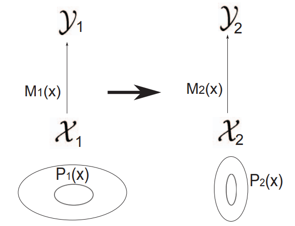 |
|:--:|
| Abbildung 1: Visualisierung von Transfer Learning:
Die linke Seite stellt das Quellsystem dar, die rechte Seite das Zielsystem. X1 und X2 sind die Featureräume, Y1 und Y2 die Labelräume der jeweiligen Modelle M1 und M2. P1(X) und P2(X) sind die jeweiligen Wahrscheinlichkeitsverteilungen der Features. |

Es gibt verschiedene Methoden und Kategorien des Transfer Learnings, die je nach Beziehung zwischen dem bereits Gelernten (Quelle) und dem Neuen (Ziel) entwickelt wurden. Auf einige davon wird im späteren Verlauf im Kapitel "Kategorisierung" noch besonders eingegangen. Es ist allerdings zu Erwähnen, dass die Einteilung in diese Kategorien nicht immer eindeutig ist. Des Weiteren ist die Zugehörigkeit dieser zum Gebiet des Transfer Learnings teilweise umstritten.

### Herausforderungen
Die mit Abstand größte Herausforderung von Transfer Learning besteht im simplen Konzept: 
	**Positiven Transfer erzeugen, negativen Transfer vermeiden.**

Die Vorhersagefähigkeit von Transfermethoden hängt von der semantischen Ähnlicheit zwischen den Aufgabenstellungen im Quell- und Zielsystem ab. Bei einer starken Beziehung und einer geeigneten Ausnutzung durch die Transfermethode kann die Vorhersagekraft in der Zielaufgabe deutlich verbessert werden. Ist die Beziehung zwischen den Aufgaben jedoch unzureichend oder wird sie von der Transfermethode nicht optimal genutzt, kann die Leistung abnehmen.

Um negativen Transfer zu vermeiden, müssen Transfermethoden vorsichtig sein und die Beziehung zwischen Quell- und Zielaufgabe berücksichtigen. Vorsichtige Ansätze führen möglicherweise zu geringerem positivem Transfer, bieten jedoch Schutz vor negativem Transfer. Aggressive Ansätze erzielen möglicherweise größere Leistungssteigerungen, bergen jedoch auch das Risiko von negativem Transfer, wenn die Quellaufgabe nicht gut zur Zielaufgabe passt.

#### Ablehnung schlechter Informationen
Eine Möglichkeit negativen Transfer zu vermeiden besteht darin, dass schädliche Informationen der Quellaufgabe während des Lernens der Zielaufgabe erkannt und abgelehnt werden. Eine Methode, um dies zu erreichen, ist das optionenbasierte Transferlernen im Bereich des Reinforcement Learning, bei dem der Agent basierend auf der Leistung bestimmte Optionen auswählt oder ablehnt. Ein weiterer Ansatz ist der KBKR-Ratschlagalgorithmus, der die Ratschläge der Quellaufgabe als weiche Einschränkung berücksichtigt. Zusätzlich wurden Methoden zur Erkennung von negativem Transfer entwickelt, z.B. durch die Verwendung eines Hyperpriors, dessen Varianz mit der Unähnlichkeit der Aufgaben korreliert. Dadurch kann entschieden werden, ob überhaupt ein Transfer stattfinden sollte.

#### Auswahl der Quellaufgabe
Um negativen Transfer zu vermeiden, können mehrere Quellaufgaben zur Auswahl stehen. Eine Möglichkeit besteht darin, die Aufgaben nach Schwierigkeitsgrad zu ordnen und eine Quellaufgabe auszuwählen, die nur moderat schwieriger ist als die Zielaufgabe. Eine andere Methode ist die Suche nach ähnlichen Aufgaben mithilfe von Graphenrepräsentationen. Zudem kann auch die Auswahl aus Kandidatenlösungen einer Quellaufgabe anstelle von Quellaufgaben selbst in Betracht gezogen werden. Dieser Ansatz ermöglicht die Berücksichtigung der Komplexität der Modelle und die Auswahl einer geeigneten Auflösung für den Transfer.

| 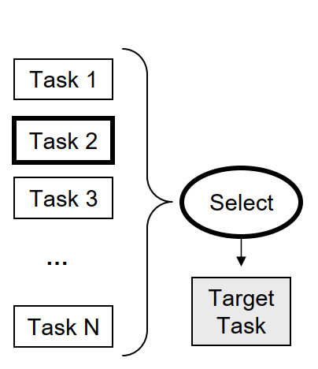 |
|:--:|
| Abbildung 2: Visualisierung der Auswahl der Quellaufgabe:
Eine Möglichkeit, negativen Transfer zu vermeiden, besteht darin, eine geeignete Quellaufgabe auszuwählen, von der der Transfer erfolgen soll. In diesem Beispiel wird Task 2 als am Relevantesten ausgewählt. |

#### Modellierung von Aufgabenähnlichkeit
Bei der Auswahl von Quellaufgaben kann es vorteilhaft sein, mehrere Aufgaben zu berücksichtigen, anstatt nur eine auszuwählen. Einige Ansätze modellieren explizit die Beziehungen zwischen den Aufgaben und integrieren diese Informationen in die Transfermethode. Dies ermöglicht eine bessere Nutzung des Wissens aus den Quellaufgaben und verringert das Risiko von negativem Transfer. Beispiele für solche Ansätze sind die Entwicklung von Ähnlichkeitsmaßen für Aufgaben im Bereich des Reinforcement Learning, die Konstruktion eines Graphen zur Darstellung der Aufgaben und die Verwendung von Kernel-Methoden zur Berechnung eines Ähnlichkeitskerns für die Zielaufgabe.

| 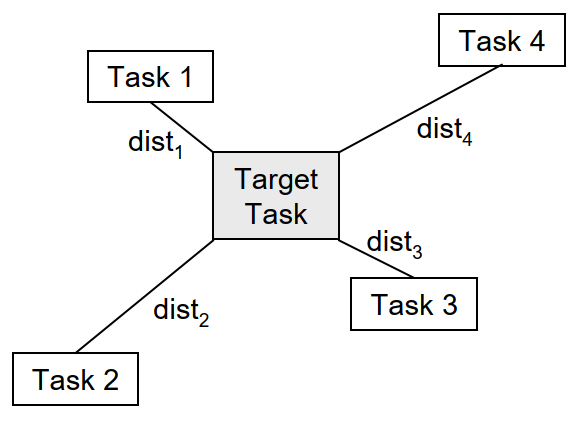 |
|:--:|
| Abbildung 3: Modellierung von Aufgabenähnlichkeit:
Eine andere Möglichkeit, negativen Transfer zu vermeiden, besteht darin, das Verhältnis zwischen den Quellaufgaben und der Zielaufgabe zu modellieren und das Wissen unter Berücksichtigung dieser Beziehungen zu kombinieren. |


### Kategorisierung
Die folgende Tabelle gibt einen Überblick über die Gebiete des Transferlernens.

| 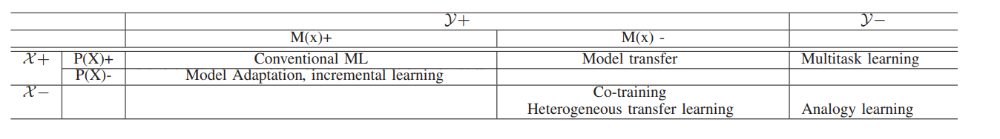 | 
|:--:| 
| Abbildung 4: Überblickstabelle über die Kategorien von Transfer Learning:|


| Variable      | Beschreibung                                                   |
| :---          |  :---                                                          |
|X:             | feature space	(Audio-, Text-, Bilddaten, …)                    |
|y:             | label space		(Phoneme, Kategorien, …)                     |
|M(X):          | Model                                                          |
|P(X):          | Verteilung der Features                                        |
|+:             | Daten und Tasks sind **gleich** für Quell- und Zieldomäne          |
|-:             | Daten und Tasks sind **unterschiedlich** für Quell- und Zieldomäne |

#### Modelladaption und inkrementelles Lernen 
Die einfachste Art des Transfer Learnings ist die Modelladaption. Hier bleiben das Model und die Label- und Featureräume gleich, wobei das vorhandene Modell an die veränderte Datenverteilung angepasst wird. Es gibt verschiedene Ansätze für die Modellanpassung, wie die Maximum-a-posteriori-Schätzung (MAP) und den Maximum-Likelihood-Lineare-Regression (MLLR) Algorithmus. Falls sich die Verteilung stetig ändert, spricht man von inkrementellem Lernen. Die Anpassung kann supervised oder unsupervised erfolgen. Falls das Quellmodell allerdings erst die Label generieren muss, spricht man von semi-supervised Learning. Eine alternative Herangehensweise mit ungelabelten Daten umzugehen, besteht darin, neue Merkmale zu extrahieren, indem Daten aus Quell- und Ziel- Domänen linear abgeleitet werden. Dies kann mit Hilfe von Techniken wie der transfer component analysis (TCA) erreicht werden. In einigen Fällen können ungelabelte Daten verwendet werden, um robustere Merkmale abzuleiten. Dieser Ansatz wird als self-taught learning bezeichnet und ähnelt dem Konzept des tiefen Repräsentationslernens.


| 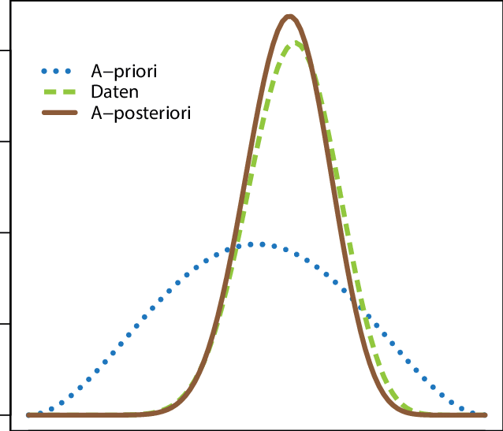 |
|:--:|
| Abbildung 5: Beispiel für die A-priori-Verteilung, die Likelihood-Funktion der Daten sowie die A-posteriori-Verteilung. |


#### Heterogenes Transferlernen
Heterogenes Transferlernen bezieht sich auf den Fall, in dem sich die Merkmale der Quell- und Ziel-Domänen unterscheiden, während die Labels und das Modell unverändert bleiben. Das Ziel besteht darin, die vorhandene Entsprechung zwischen den Domänen zu nutzen, um Wissen von einer Domäne auf die andere zu übertragen. Frühe Ansätze konzentrierten sich auf die Definition und Nutzung der Entsprechung auf Instanzebene. Aktuellere Ansätze zielen darauf ab, gemeinsame Repräsentationen der Quell- und Ziel-Domänen zu finden, entweder durch Matrixfaktorisierung, RBM-basiertes latentes Faktorlernen oder durch die Kombination von Deep Learning und Transferlernen. Eine besondere Herausforderung besteht darin, aus sehr unterschiedlichen Aufgaben zu lernen, bei denen sich der Labelraum von der Ziel-Domäne unterscheidet. Das Lernen von Korrespondenzen zwischen solchen unabhängigen, aber analogen Domänen ist für Maschinen schwierig, obwohl Menschen dazu neigen, Analogien leichter zu erkennen. Aktuelle Fortschritte im Bereich des Deep Learning bieten jedoch neue Möglichkeiten durch ein einheitliches Rahmenwerk für Repräsentationslernen und Multitask-Lernen.


#### Multitask-Lernen
| 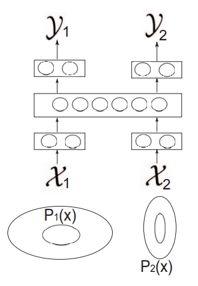 |
|:--:|
| Abbildung 6: Grafische Darstellung von Multitask Learning |

Multitask Learning bezieht sich auf den Fall, in dem die Merkmalsräume der Quell- und Ziel-Domänen identisch sind, jedoch die Aufgabenlabels signifikant unterschiedlich sind. Bei diesem Ansatz wird angenommen, dass die Quell- und Ziel-Aufgaben eng miteinander verbunden sind und das Lernen einer Aufgabe das Lernen der anderen Aufgabe in Form einer gegenseitigen Regularisierung unterstützt. Multitask Learning ist ein allgemeiner Ansatz, der auf verschiedene Modelle angewendet werden kann, einschließlich Kernel-Regression und k-nearest neighbor. Die Bewertung der Relevanz von zwei Aufgaben ist eine Herausforderung, und es gibt interessante Ansätze, die die Überlappung verschiedener Aufgaben im selben semantischen Raum zur Schätzung der Relevanz verwenden.

Eine Möglichkeit eine solche Schätzung durchzuführen ist es einen Score für die Überlappung der semantischen Räume zu definieren:

| 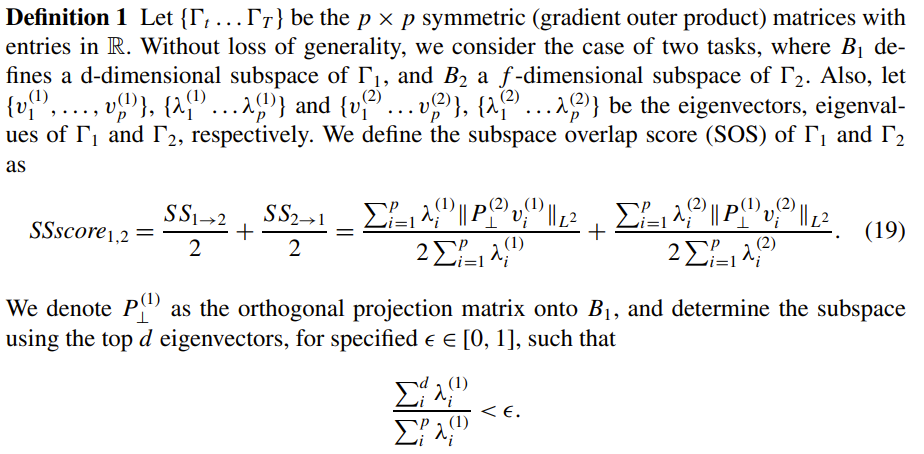 |
|:--:|
| Abbildung 7: Definition eines Überlappungsscores der semantischen Räume bei Multitask-Lernen |

Der hier definierte Score weist einen Wert zwischen 0 und 1 auf. Eine starke Überlappung weist einen Wert nahe 1 auf.

### Deep Transfer Learning
Deep Learning hat einen starken Einfluss auf das Transferlernen, insbesondere in den Bereichen der Sprach- und Sprachverarbeitung. Es umfasst verschiedene Modelle wie Deep Belief Networks, Deep Boltzmann Machines, Deep Autoencoders, Deep Neural Networks und Deep Recurrent Neural Networks. Diese Modelle sind in der Lage, mehrschichtige Repräsentationen zu lernen, die eine hierarchische Verarbeitung von Informationen nachahmen. Das mehrschichtige Feature-Lernen bietet mehrere Vorteile, wie Robustheit gegenüber Datenvariationen, hierarchische Parameterverteilung, die Möglichkeit des supervised learnings und die Anpassungsfähigkeit an spezifische Aufgaben durch feinabstimmendes Training. Dadurch bietet Deep Learning einen geeigneten Rahmen für das Transferlernen, bei dem robuste Features gelernt werden, die von mehreren Merkmalen und Aufgaben gemeinsam genutzt werden.

In einer beispielhaften Umsetzung von deep transfer learning werden bei einem großen Modell die meisten layer bis zu einem gewissen Punkt eingefroren. Die letzten layer werden anschließend neu trainiert. In folgender Visualisierung wird dies illustriert:

| 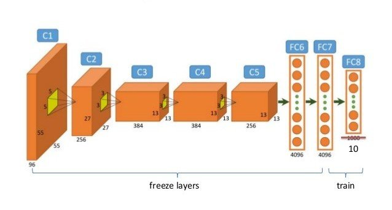 |
|:--:|
| Abbildung 8: Visualisierung von Deep Transfer Learning mit gefrorenen layern. |

Folgende Abbildung zeigt eine Transferlernen-Architektur, die auf tiefer Repräsentation basiert. Im linken Teil der Abbildung findet das gemeinsame Training statt, bei dem unterschiedliche Eingabemerkmale durch Vorverarbeitungsnetzwerke in einen gemeinsamen semantischen Raum projiziert werden. Die gemeinsamen Merkmale umfassen aussagekräftige Faktoren, die für mehrere Aufgaben verwendet werden können. Aleinstehend handelt es sich bei der linken Seite der Abbildung im Wesentlichen um ein Multitask-Lernen.

Im rechten Teil der Abbildung wird die Anpassungsphase dargestellt, in der neue Daten für die Zielaufgabe bereitgestellt werden, entweder mit oder ohne Labels. Das Modell wird mit den neuen Daten aktualisiert, die einer anderen Verteilung folgen als in der gemeinsamen Trainingphase.

| 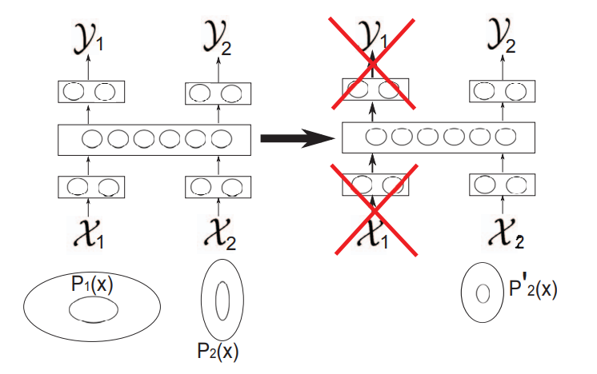 |
|:--:|
| Abbildung 9: Visualisierung von Deep Transfer Learning |

Ein großer Vorteil des unsupervised Trainings ist die Fähigkeit, den Merkmalsextraktor ohne gelabelte Daten zu trainieren und somit den Bedarf an gelabelten Daten zu reduzieren. Durch unsupervised Learning kann die überwachte Lernphase verbessert werden, indem Konvergenzgeschwindigkeit, Datenmenge und Modellqualität beeinflusst werden.

In der Studie "Domain adaptation for large-scale sentiment classification: A deep learning approach" von X. Glorot et al. wurden hochrangige Merkmale mittels unsupervised Learning extrahiert. Die Ergebnisse zeigten, dass diese abstrakten Merkmale domänenunabhängig sind und erfolgreich auf neue Domänen übertragen werden können, ohne Anpassungen vorzunehmen. Ähnliche Ergebnisse wurden auch in anderen Studien erzielt, z.B. bei der Übertragung von CNN-basierten Merkmalen auf Bilderkennungsaufgaben. Es wurde gezeigt, dass nur wenige gelabelte Daten ausreichen, um Modelle anzupassen und unbekannte Objekte zu erkennen. In einigen Fällen kann sogar die Beziehung zwischen Eingangsdaten, Aufgabenvektor und Aufgabenlabels in einem Deep-Netzwerk erlernt werden, was zu Zero-Data Learning und Zero-Shot Learning führt.


### Modelltransfer
Beim Transfer von Wissen zwischen Modellen gibt es verschiedene Ansätze. Ein häufig verwendetes Verfahren ist das Modelltransferverfahren, bei dem das im Quellmodell gelernte Wissen auf das Zielmodell übertragen wird. Dabei kann das Quellmodell beispielsweise ein Gaussian mixture model (GMM) sein, während das Zielmodell ein Deep Neural Network (DNN) ist. Das Wissen wird durch Initialisierung und Anpassung des Zielmodells mithilfe des GMM genutzt.

Ein weiterer Ansatz ist das Lehrer-Schüler-Modell, bei dem ein neues Modell von einem bestehenden Modell lernt. Das Lehrermodell enthält bereits reichhaltiges Wissen, das zur Anleitung des Schülermodells genutzt wird. Es gibt verschiedene Methoden, um das Wissen des Lehrermodells auf das Schülermodell zu übertragen.

Eine Möglichkeit ist das Abgleichen der Aktivierungen (Logit matching) des Schülermodells mit denen des Lehrermodells. Dabei werden die Logits verglichen, um eine möglichst geringe quadratische Abweichung zu erzielen. Eine andere Methode ist die Verwendung von "dark knowledge", bei der die Ausgaben des Schülermodells an die Ausgaben des Lehrermodells angepasst werden. Im Folgenden wird erklärt, wie hier die loss function errechnet wird.

Die Loss Funktion des Schülermodells wird wie folgt errechnet:

| 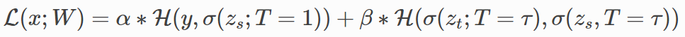 |
|:--:|
| Abbildung 10: Formel zur Errechnung der Loss Funktion des Schülermodells mit Hilfe von Dark Knowledge Destilation |


| 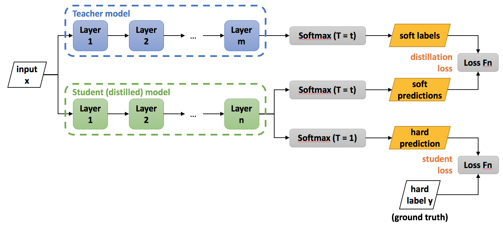 |
|:--:|
| Abbildung 11: Roadmap zum besseren Verständnis der Formel |

| Variable      | Beschreibung                                                   |
| :---          |  :---                                                          |
|L:             | loss function errechnet aus Schüler- und Lehrer- loss function |
|T:             | “Temperatur Parameter” Wenn T=1: Softmax-Funktion, mit zunehmendem T wird die Wahrscheinlichkeitsverteilung, die von der Softmax-Funktion generiert wird, weicher und liefert mehr Informationen darüber, welche Klassen das Lehrermodell als ähnlicher zur vorhergesagten Klasse betrachtet hat.                     |
|H:             | Cross Entropy loss function                                    |
|W:             | Child model Parameter                                          |
|zs und zt:     | Logits von Lehrer- und Schülermodell                           |
|τ, α und β:    | Hyperparameter                                                 |
|σ:             | Softmax Funktion                                               |
|x:             | Input                                                          |
|y:             | wahres Label                                                   |


## Anwendungen
Im Folgenden wird anhand eines Beispiels die Vorgehensweise bei der Implementierung von Transfer Learning in der Sprachverarbeitung erläutert.
Konkret geht es hierbei um die Implementierung einer Fake-News-Erkennung. 

Zunächst ein kurzer Überblick über die einzelnen Phasen, welche wir durchlaufen werden. In Phase 1 werden die Daten visualisiert und vorbereitet. 
Phase 2 beschäftigt sich mit dem Large Language Model _BERT_, welches wir für unseren Anwendungsfall fine-tunen wollen. Es wird auf die ursprünglichen Anwendungsfälle 
eingegangen, wofür das Modell einst trainiert wurde. Anschließend wird das Modell angepasst, damit es für die Fake-News-Erkennung verwendet werden kann. 
Ein entscheidender Schritt im Transfer Learning ist das Einfrieren der einzelnen Schichten. Dies wird im Phase 4 erläutert bevor in Phase 5 das Modell trainiert wird. 
Zu guter Letzt muss das Modell noch evaluiert werden.

|  |
|:--:|
| Abbildung 12: Verschiedene Phasen der Code Demo |

### 1.1 Daten - Visualisierung
Beide Datensätze bestehen aus folgenden Variablen:
- _title:_ Entspricht der Schlagzeile des Artikels. Diese Variable wird später zum Trainieren verwendet.
- _text:_ Enthält den gesamten Text des Artikels.
- _subject:_ Beschreibt, wo der Artikel veröffentlicht wurde.
- _date:_ Datum der Veröffentlichung

Hierbei fällt auf, dass keine Variable Auskunft darüber gibt, ob der Artikel fake oder tatsächlich wahr ist. Bevor die Datensätze zusammengefügt werden, 
muss zunächst diese Variable generiert werden.

```python
true_data['Target'] = ['True'] * len(true_data)
fake_data['Target'] = ['Fake'] * len(fake_data)

data = pd.concat([true_data, fake_data]).sample(frac=1).reset_index(drop=True)
data['label'] = pd.get_dummies(data.Target)['Fake']
```

Als Nächstes wurde die Verteilung der Daten visualisiert, um sicherzustellen, dass ein ausbalancierter Datensatz vorliegt. Mit einer Verteilung von 
52,3 % Fake- und 47,7 % Echt-Daten, ist dies der Fall. Die Länge der Schlagzeilen wurde ebenfalls visualisiert. Diese wird später beim Tokenisieren noch 
eine Rolle spielen.

|  |
|:--:|
| Abbildung 13: Länge der Überschriften |


### 1.2 Daten - Vorbereitung
Wie bei jedem maschinellen Lernverfahren müssen die Daten in Trainings-, Validierungs- und Testdaten aufgeteilt werden. 
Da ein Modell mit Textdaten nicht arbeiten kann, müssen diese zunächst tokenisiert werden. Damit ist gemeint, dass die Wörter in sogenannte Tokens umgewandelt 
werden, welche wiederum numerische Repräsentationen darstellen. 

Da wir das Sprachmodell BERT verwenden wollen, nehmen wir hierfür _BertTokenizerFast_, welcher speziell für das Modell entwickelt wurde. Dieser verwendet den WordPiece-Algorithmus, 
welcher auf der Idee basiert, häufig vorkommende Zeichenfolgen in einem Textkorpus zu identifizieren und sie zu einem neuen Wort zusammenzufügen. 

Zusätzlich zum Text, welcher tokenisiert werden soll, sind folgende Parameter zu übergeben:
- _max_length:_ Dieser Parameter definiert die maximale Länge einer Sequence. Wenn wir uns die Grafik _Länge der Überschriften_ nochmals genauer ansehen fällt auf, 
dass die meisten Schlagzeilen unter 20 Wörter haben. Um nicht unnötig große Datenmenge verarbeiten zu müssen, setzen wir die maximale Länge der Sequenzen daher auf diesen Wert.
- _padding:_ Da unser Modell mit einer bestimmten Anzahl an Tokens rechnet, müssen wir diesen Parameter auf _true_ setzen. Dies sorgt dafür, dass Schlagzeilen welche weniger
als 20 Wörter enthalten, am Ende der Sequenz mit Nullen aufgefüllt werden. 
- _truncation:_ Es gibt allerdings auch Schlagzeilen mit mehr als 20 Wörtern. Wird dieser Parameter auf _true_ gesetzt, so werden alle Sequenzen länger als der definierte 
Wert bei _max_length_ abgeschnitten.

```python
MAX_LENGTH = 20

tokenizer = BertTokenizerFast.from_pretrained('bert-base-uncased')
tokens_train = tokenizer.batch_encode_plus(
    train_text.tolist(),
    max_length=MAX_LENGTH,
    padding=True,
    truncation=True
)

tokens_val = tokenizer.batch_encode_plus(
    val_text.tolist(),
    max_length=MAX_LENGTH,
    padding=True,
    truncation=True
)

tokens_test = tokenizer.batch_encode_plus(
    test_text.tolist(),
    max_length=MAX_LENGTH,
    padding=True,
    truncation=True
)
```

Betrachten wir nun die Ausgabe des Tokenizers anhand eines Beispiels. Als Rückgabewert erhalten wir ein Dictionary mit drei key-value Paaren:
- _input_ids:_ Enthält die tokenisierten Sequenzen. Bei genauer Betrachtung fällt auf, dass diese jeweils mit dem Wert 101 starten und 
mit 102 enden. Das hat den Grund, dass diese Tokens keine Wörter darstellen, sondern dem Algorithmus den Anfang und das Ende einer 
Sequenz signalisieren. Des Weiteren kann der zuvor beschriebene Effekt des _padding_ bei der zweiten Sequenz beobachtet werden. Hier wurden 
zwei Nullen an das Ende angefügt, damit Sequenz 1 und 2 die gleiche Länge haben.
- _token_type_ids:_ Wird beim Umgang mit Sequenzpaaren verwendet und gibt an welcher Token zu welchem Satz gehört. Für unseren 
Anwendungsfall jedoch nicht relevant.
- _attention_mask:_ Binäre Sequenz, die angibt, welche Token vom Modell berücksichtigt bzw. ignoriert werden sollen. Beispielsweise sollen 
die Einträge welche bei Sequenz 2 durch _padding_ hinzugefügt wurden, nicht beachtet werden.

```python
sample_data = ["Build a fake news detection model.",
               "Using a bert model."]

tokenized_sample_data = tokenizer.batch_encode_plus(sample_data, padding=True)
print(tokenized_sample_data)
```

```python
{'input_ids': [[101, 3857, 1037, 8275, 2739, 10788, 2944, 1012, 102], [101, 2478, 1037, 14324, 2944, 1012, 102, 0, 0]],
 'token_type_ids': [[0, 0, 0, 0, 0, 0, 0, 0, 0], [0, 0, 0, 0, 0, 0, 0, 0, 0]], 
 'attention_mask': [[1, 1, 1, 1, 1, 1, 1, 1, 1], [1, 1, 1, 1, 1, 1, 1, 0, 0]]
 }
```

Da wir nun wissen, welche Daten wir an das Modell übergeben müssen und wie diese aussehen, werden die Daten im nächsten Schritt zu Tensoren 
konvertiert. Dies ist notwendig, da wir mit der PyTorch-Bibliothek arbeiten wollen und diese auf Tensoren als grundlegende Datenstruktur für 
Berechnungen aufbaut. Des Weiteren verwenden wir einen sogenannten _data loader_, welcher uns beim Laden und Verwalten der Daten behilflich ist und uns diese in Batches aufteilt.

```python
# Convert lists to tensors
train_seq = torch.tensor(tokens_train['input_ids'])
train_mask = torch.tensor(tokens_train['attention_mask'])
train_y = torch.tensor(train_labels.tolist())


# Crate data loader
batch_size = 32
train_data = TensorDataset(train_seq, train_mask, train_y)
train_sampler = RandomSampler(train_data)
train_dataloader = DataLoader(train_data, sampler=train_sampler, batch_size=batch_size)
```


### 2. BERT (Bidirectional Encoder Representations from Transformers)
Das bekannte Large Language Model _Bert (Bidirectional Encoder Representations from Transformers)_ wird als Ausgangspunkt verwendet. Das Modell wurde 2018 von 
Google veröffentlicht und wurde mittlerweile für eine Vielzahl von NLP-Aufgaben eingesetzt. Ursprünglich wurde das Modell auf einem großen Textkorpus trainiert, 
welcher beispielsweise die gesamte Wikipedia (2.5 Billionen Wörter) und den sogenannten BookCorpus (985 Millionen Wörter) enthält.
Das Training wurde hierfür in zwei Phasen aufgeteilt:
- _Masked Language Modeling:_ In dieser Phase wurden 15 % der Wörter zufällig maskiert. Die Aufgabe bestand nun darin, die maskierten Wörter basierend auf dem Kontext vorherzusagen. 
Dabei lernte das Modell die Beziehungen zwischen Wörtern innerhalb von Sätzen. Im folgenden in ein Codebeispiel im welchem die beschriebene Funktion ausgeführt werden kann.


```python
unmasker = pipeline('fill-mask', model='bert-base-uncased')

text = "I will need an [MASK] because it is raining."
unmasker(text)
```

- _Next Sentence Prediction:_ Als nächsten Schritt musste das Modell die Beziehungen zwischen Sätzen lernen. Hierfür wurde die Aufgabe so umgewandelt, dass das Modell vorhersagen sollte, 
ob zwei Sätze aufeinanderfolgen. Wie für die erste Phase wird auch hierfür ein Codebeispiel zur Verfügung gestellt. Das Modell soll vorhersagen, ob Satz 1 und 2 bzw. Satz 2 und 3 
in einer Beziehung zueinander stehen.

```python
model = BertForNextSentencePrediction.from_pretrained("bert-base-uncased")
tokenizer = BertTokenizer.from_pretrained("bert-base-uncased")

sentences = ["Elon Musk lives in California.", "You can't buy anything on sundays in germany.",
             "You are not supposed to work on sundays in germany."]

for i in range(2):
    inputs = tokenizer(sentences[i], sentences[i + 1], return_tensors="pt")
    outputs = model(**inputs)
    prediction = torch.argmax(outputs.logits)

    if prediction == 0:
        print("The sentences belong together.")
    else:
        print("The sentences do not belong together.")
```


### 3. Model
In Phase 3 erstellen wir ein Modell, welches die Architektur des BERT Modells als Grundlage verwendet. Um das Modell auf unseren Anwendungsfall anzupassen, 
fügen wir weitere Schichten hinzu. So werden beispielsweise zwei Linear-Layers hinzugefügt, um die Anzahl der Ausgänge auf zwei (Fake/Wahr) zu reduzieren. Ebenfalls wird die 
Regularisierungstechnik _Dropout_ angewandt, um Overfitting vorzubeugen.

In der _forward_ Funktion wird definiert, wie die Eingabe durch das Modell fließt und die Ausgabe berechnet wird.

```python
class BERT_Arch(nn.Module):
    def __init__(self, bert):
        super(BERT_Arch, self).__init__()
        self.bert = bert
        self.dropout = nn.Dropout(0.1)
        self.relu = nn.ReLU()
        self.fc1 = nn.Linear(768, 512)
        self.fc2 = nn.Linear(512, 2)
        self.softmax = nn.LogSoftmax(dim=1)

    def forward(self, sent_id, mask):
        cls_hs = self.bert(sent_id, attention_mask=mask)['pooler_output']
        x = self.fc1(cls_hs)
        x = self.relu(x)
        x = self.dropout(x)
        x = self.fc2(x)
        x = self.softmax(x)
        return x
```


### 4. Einfrieren der Schichten
Beim Transfer Learning werden oft bestimmte Schichten des vortrainierten Modells eingefroren, um die Gewichte während des Trainings nicht
zu aktualisieren. Dies wird aus folgenden Gründen gemacht:
- Schutz des bereits gelernten Wissens
- Reduzieren der Trainingszeit
- Prävention vor Overfitting

Besonders nützlich ist dies, wenn die ursprüngliche Aufgabe Ähnlichkeiten mit der neuen Aufgabe aufweist. Es gibt drei verschiedene Ansätze welche verfolgt
werden können. Im Folgenden werden diese stichpunktartig beschrieben.
1. _Keine Schichten einfrieren:_ 
   1. Es wird das gesamte Modell trainiert
   2. Großer Datensatz benötigt
   3. Die ursprüngliche Aufgabe unterscheidet sich stark von der neuen Aufgabe
   

2. _Teilweises einfrieren der Schichten:_
   1. Es werden nur die unteren Schichten eingefroren
   2. Die oberen Schichten werden trainiert
   3. Mittelgroßer Datensatz notwendig
   

3. _Alle Schichten einfrieren:_
   1. Alle Schichte des vortrainierten Modell werden eingefroren
   2. Nur die aufgabenspezifische Schichten werden trainiert
   3. Kleiner Datensatz
   4. Ähnlichkeiten zwischen ursprünglicher und neuer Aufgabe sind vorhanden

Für unseren Anwendungsfall wählen wir Methode 3. Hierfür iterieren wir über die einzelnen Schichten des BERT Modells und setzten den Parameter
_requires_grad_ jeweils auf den Wert _false_. Dadurch wird verhindert, dass der Gradient während des Trainings berechnet und die Gewichte aktualisiert werden.

```python
for param in bert.parameters():
    param.requires_grad = False
```

### 5. Fine-Tuning
Wie es für Pytorch üblich ist, müssen nun die Trainings- und Evaluierungsschleife implementiert werden. In der Trainingsschleife 
erfolgt pro Iteration der gleiche Ablauf:
1. _Datenbereitstellung:_ Die Eingabedaten und die Labels werden aus den aktuellen Batch extrahiert.
2. _Vorwärtsdurchlauf:_ Die Eingabedaten werden in das Modell gegeben, welches Vorhersagen generiert.
3. _Fehlerberechnung:_ Es folgt ein Abgleich der vorhergesagten Werte mit den tatsächlichen Werten.
4. _Rückwärtsdurchlauf und Gewichtsaktualisierung:_ Der Backpropagation-Algorithmus wird verwendet, um die Gradienten der Gewichte 
des Modells zu berechnen. Der Optimizer nutzt diese Gradienten, um die Gewichte entsprechend anzupassen und das Modell zu optimieren.

Ähnlich verhält sich die Evaluierungsschleife, mit dem Unterschied, dass der Rückwärtsdurchlauf nicht durchgeführt wird.

```python
def train():
    model.train()
    total_loss, total_accuracy = 0, 0

    for step, batch in enumerate(train_dataloader):
        if step % 50 == 0 and not step == 0:
            print('  Batch {:>5,}  of  {:>5,}.'.format(step, len(train_dataloader)))

        input_id, mask, labels = batch
        model.zero_grad()
        preds = model(input_id, mask)
        loss = cross_entropy(preds, labels)
        total_loss = total_loss + loss.item()
        loss.backward()
        torch.nn.utils.clip_grad_norm_(model.parameters(), 1.0)
        optimizer.step()

    avg_loss = total_loss / len(train_dataloader)
    return avg_loss
```

Nachdem das Modell trainiert wurde, ist es an der Zeit die Performance des Modells auf den Testdaten zu überprüfen. Die folgende 
Tabelle zeigt die erhaltenen Metriken:


|        | precision | recall | f1-score | support |
|--------|-----------|--------|----------|---------|
| 0      | 0.99      | 0.99   | 0.99     | 3212    |
| 1      | 0.99      | 0.99   | 0.99     | 3523    |
| accuracy |           |        | 0.99     | 6735    |
| macro avg | 0.99     | 0.99   | 0.99     | 6735    |
| weighted avg | 0.99 | 0.99   | 0.99     | 6735    |


### 6. Inference 
Um mit dem Modell Vorhersagen machen zu können, müssen folgende Schritte durchgeführt werden:
1. Tokenisieren der Schlagzeile 
```python
unseen_news_text = ["Donald Trump Sends Out Embarrassing New Year’s Eve Message; This is Disturbing"]

MAX_LENGTH = 20
tokenizer = BertTokenizerFast.from_pretrained('bert-base-uncased')
tokens_unseen = tokenizer.batch_encode_plus(
    unseen_news_text,
    max_length=MAX_LENGTH,
    padding=True,
    truncation=True
)
```
2. _input_ids_ und _attention_mask_ zu Tensoren konvertieren
```python
unseen_seq = torch.tensor(tokens_unseen['input_ids'])
unseen_mask = torch.tensor(tokens_unseen['attention_mask'])
```
3. Vorhersage und Ausgabe
```python
preds = model(unseen_seq, unseen_mask)
preds = np.argmax(preds, axis=1)

for idx, pred in enumerate(preds):
    if pred == 0:
        print(f"Headline {idx+1} is True")
        continue
    print(f"Headline {idx+1} is Fake")
```


## Fazit


## Weiterführendes Material

### Podcast
[Der Campus Talk - Silicon Forest]()

### Talk
[Video Fachvortrag]()

### Demo
[Video Code Demonstration]()

[Source Code](https://github.com/StaudTim/NLP-TransferLearning)

### Literaturliste
[Taylor, Matthew E., and Peter Stone. "Transfer learning for reinforcement learning domains: A survey." Journal of Machine Learning Research 10, no. 7 2009.](https://www.jmlr.org/papers/volume10/taylor09a/taylor09a.pdf?ref=https://codemonkey.link)

[Wang, Dong, and Thomas Fang Zheng. "Transfer learning for speech and language processing." 2015 Asia-Pacific Signal and Information Processing Association Annual Summit and Conference (APSIPA). IEEE, 2015.](https://arxiv.org/pdf/1511.06066.pdf)

[S. Thrun and L. Pratt, Learning to learn. Springer Science & Business
Media, 2012.](https://books.google.co.uk/books?hl=en&lr=&id=X_jpBwAAQBAJ&oi=fnd&pg=PA4&dq=S.+Thrun+and+L.+Pratt,+Learning+to+learn.+Springer+Science+%26+Business+Media,+2012.&ots=gWUg2XChul&sig=FJLVnquImEbPqfMCw9XYCMLywQA&redir_esc=y#v=onepage&q=S.%20Thrun%20and%20L.%20Pratt%2C%20Learning%20to%20learn.%20Springer%20Science%20%26%20Business%20Media%2C%202012.&f=false)

[S. J. Pan and Q. Yang, “A survey on transfer learning,” Knowledge and
Data Engineering, IEEE Transactions on, vol. 22, no. 10, pp. 1345–
1359, 2010.](https://www.cse.ust.hk/~qyang/Docs/2009/tkde_transfer_learning.pdf)

[Torrey, Lisa, and Jude Shavlik. "Transfer learning." Handbook of research on machine learning applications and trends: algorithms, methods, and techniques. IGI global, 2010. 242-264.](https://ftp.cs.wisc.edu/machine-learning/shavlik-group/torrey.handbook09.pdf)

[R. Caruana, “Multitask learning,” Machine learning, vol. 28, no. 1, pp.
41–75, 1997.](https://link.springer.com/content/pdf/10.1023/A:1007379606734.pdf)

[J.-L. Gauvain and C.-H. Lee, “Maximum a posteriori estimation for
multivariate Gaussian mixture observations of Markov chains,” IEEE
Transactions on Speech and audio processing, vol. 2, no. 2, pp. 291–
298, 1994.](http://speech.csie.ntu.edu.tw/previous_version/Channel-MAP(SAP-1994).pdf)

[C. J. Leggetter and P. Woodland, “Maximum likelihood linear re-
gression for speaker adaptation of continuous density hidden Markov
models,” Computer Speech & Language, vol. 9, no. 2, pp. 171–185,
1995.](https://www.eecs.yorku.ca/course_archive/2007-08/W/6328/Reading/Leg_MLLR.pdf)

[P. E. Utgoff, “Incremental induction of decision trees,” Machine
learning, vol. 4, no. 2, pp. 161–186, 1989.](https://www.vislab.ucr.edu/PUBLICATIONS/pubs/Chapters/2007/Learningastatistical07.pdf)

[A. Blum and T. Mitchell, “Combining labeled and unlabeled data
with co-training,” in Proceedings of the eleventh annual conference
on Computational learning theory. ACM, 1998, pp. 92–100.](https://dl.acm.org/doi/pdf/10.1145/279943.279962)

[C. Wang and S. Mahadevan, “Heterogeneous domain adaptation using
manifold alignment,” in IJCAI Proceedings-International Joint Confer-
ence on Artificial Intelligence, vol. 22, no. 1, 2011, p. 1541.](https://people.cs.umass.edu/~mahadeva/papers/IJCAI2011-DA.pdf)

[Y. Zhu, Y. Chen, Z. Lu, S. J. Pan, G.-R. Xue, Y. Yu, and Q. Yang,
“Heterogeneous transfer learning for image classification.” in AAAI,
2011.](https://ojs.aaai.org/index.php/AAAI/article/view/8090/7948)

[O. Arandjelovic and R. Cipolla, “Incremental learning of temporally-
coherent Gaussian mixture models,” Society of Manufacturing Engi-
neers (SME) Technical Papers, pp. 1–1, 2006.](https://dro.deakin.edu.au/articles/conference_contribution/Incremental_learning_of_temporally-coherent_gaussian_mixture_models/20953423/1/files/37238638.pdf)

[A. Declercq and J. H. Piater, “Online learning of Gaussian mixture
models-a two-level approach.” in VISAPP (1), 2008, pp. 605–611.](https://people.montefiore.uliege.be/declercq/publications/Declercq-visapp2008.pdf)

[X. Zhu, “Semi-supervised learning literature survey,” Computer Sci-
ences TRP 1530, University of Wisconsin C Madison, 2005.](https://minds.wisconsin.edu/bitstream/handle/1793/60444/TR1530.pdf?sequence=1)

[S. J. Pan, I. W. Tsang, J. T. Kwok, and Q. Yang, “Domain adaptation
via transfer component analysis,” Neural Networks, IEEE Transactions
on, vol. 22, no. 2, pp. 199–210, 2011.](https://repository.hkust.edu.hk/ir/bitstream/1783.1-6830/1/ijcai09.pdf)

[R. Raina, A. Battle, H. Lee, B. Packer, and A. Y. Ng, “Self-taught
learning: transfer learning from unlabeled data,” in Proceedings of the
24th international conference on Machine learning. ACM, 2007, pp.
759–766.](https://dl.acm.org/doi/abs/10.1145/1273496.1273592)

[P. Prettenhofer and B. Stein, “Cross-lingual adaptation using structural
correspondence learning,” ACM Transactions on Intelligent Systems
and Technology (TIST), vol. 3, no. 1, p. 13, 2011.](https://arxiv.org/pdf/1008.0716.pdf)

[W. Dai, Y. Chen, G.-R. Xue, Q. Yang, and Y. Yu, “Translated learning:
Transfer learning across different feature spaces,” in Advances in neural
information processing systems, 2008, pp. 353–360.](https://proceedings.neurips.cc/paper/2008/file/0060ef47b12160b9198302ebdb144dcf-Paper.pdf)

[B. Kulis, K. Saenko, and T. Darrell, “What you saw is not what you get:
Domain adaptation using asymmetric kernel transforms,” in Computer
Vision and Pattern Recognition (CVPR), 2011 IEEE Conference on.
IEEE, 2011, pp. 1785–1792.](http://people.ee.duke.edu/~lcarin/cvpr_adapt.pdf)

[B. Wei and C. J. Pal, “Heterogeneous transfer learning with RBMs.”
in AAAI, 2011.](https://ojs.aaai.org/index.php/AAAI/article/view/7925/7784)

[X. Shi, Q. Liu, W. Fan, P. S. Yu, and R. Zhu, “Transfer learning
on heterogenous feature spaces via spectral transformation,” in Data
Mining (ICDM), 2010 IEEE 10th International Conference on. IEEE,
2010, pp. 1049–1054.](https://d1wqtxts1xzle7.cloudfront.net/30758870/xiaoxiaoICDM10_2-libre.pdf?1392059836=&response-content-disposition=inline%3B+filename%3DTransfer_learning_on_heterogenous_featur.pdf&Expires=1688671236&Signature=LNuc-RFqUc1ETIeQ1ipza5eKg12X2dbaqCZOO4GAfPzpXe7s3ivwui0q48gQLxt13fgTnoerFfyMnFy~23H8ZpgVFASBH8nJKrcSh4TDce6XYjY5voFU9R9Po27~eAtQOMIklk1vfNIV9XTVLtPk1c2lu5SODx-m7e0k9EWI~tSMlow1dJeequ0mCEar8LRHhIHxTplYgS0i1C4NHYh5P9xMqQCSrFGwHK2XpP~fXxfh0hLT81LszAIbek7tDOeQk-Oy1eF2jMjMFOU66SV67qYCBmdYuBvWOinrNsE-oO-psjh-1lGz2mqgcwEk2NPMQR8hKxYR79NHKVU5XvuTiQ__&Key-Pair-Id=APKAJLOHF5GGSLRBV4ZA)

[L. Duan, D. Xu, and I. Tsang, “Learning with augmented features
for heterogeneous domain adaptation,” arXiv preprint arXiv:1206.4660,
2012.](https://arxiv.org/ftp/arxiv/papers/1206/1206.4660.pdf)

[J. T. Zhou, S. J. Pan, I. W. Tsang, and Y. Yan, “Hybrid heterogeneous
transfer learning through deep learning,” in Twenty-Eighth AAAI Con-
ference on Artificial Intelligence, 2014.](https://ojs.aaai.org/index.php/AAAI/article/view/8961/8820)

[D. Gentner, “Structure-mapping: A theoretical framework for analogy,”
Cognitive science, vol. 7, no. 2, pp. 155–170, 1983.](https://onlinelibrary.wiley.com/doi/pdfdirect/10.1207/s15516709cog0702_3)

[D. Gentner and K. J. Holyoak, “Reasoning and learning by analogy:
Introduction.” American Psychologist, vol. 52, no. 1, p. 32, 1997.](https://psycnet.apa.org/record/1997-02239-004)

[J. Blitzer, R. McDonald, and F. Pereira, “Domain adaptation with struc-
tural correspondence learning,” in Proceedings of the 2006 conference
on empirical methods in natural language processing. Association
for Computational Linguistics, 2006, pp. 120–128.](https://aclanthology.org/W06-1615.pdf)

[H.-Y. Wang and Q. Yang, “Transfer learning by structural analogy,” in
AAAI. Citeseer, 2011.](https://ojs.aaai.org/index.php/AAAI/article/view/7907/7766)

[J. G. Carbonell, Learning by analogy: Formulating and generalizing
plans from past experience. Springer, 1983.](https://apps.dtic.mil/sti/pdfs/ADA120124.pdf)

[J. Baxter, “A model of inductive bias learning,” J. Artif. Intell.
Res.(JAIR), vol. 12, pp. 149–198, 2000.](https://www.jair.org/index.php/jair/article/download/10253/24418/)

[J. Guinney, Q. Wu, and S. Mukherjee, “Estimating variable structure
and dependence in multitask learning via gradients,” Machine Learning,
vol. 83, no. 3, pp. 265–287, 2011.](https://link.springer.com/content/pdf/10.1007/s10994-010-5217-4.pdf)

[B. Romera-Paredes, A. Argyriou, N. Berthouze, and M. Pontil, “Ex-
ploiting unrelated tasks in multi-task learning,” in International Con-
ference on Artificial Intelligence and Statistics, 2012, pp. 951–959.](http://proceedings.mlr.press/v22/romera12/romera12.pdf)

[D. Wang, C. Liu, Z. Tang, Z. Zhang, and M. Zhao, “Recurrent
neural network training with dark knowledge transfer,” arXiv preprint
arXiv:1505.04630, 2015.](https://arxiv.org/pdf/1505.04630.pdf)

[Z. Tang, D. Wang, Y. Pan, and Z. Zhang, “Knowledge transfer pre-
training,” arXiv preprint arXiv:1506.02256, 2015.](https://arxiv.org/pdf/1506.02256.pdf)

[J. Ba and R. Caruana, “Do deep nets really need to be deep?” in
Advances in Neural Information Processing Systems, 2014, pp. 2654–
2662.](https://proceedings.neurips.cc/paper/2014/file/ea8fcd92d59581717e06eb187f10666d-Paper.pdf)

[G. Hinton, L. Deng, D. Yu, G. E. Dahl, A.-r. Mohamed, N. Jaitly,
A. Senior, V. Vanhoucke, P. Nguyen, T. N. Sainath et al., “Deep neural
networks for acoustic modeling in speech recognition: The shared
views of four research groups,” IEEE Signal Processing Magazine,
vol. 29, no. 6, pp. 82–97, 2012.](https://www.microsoft.com/en-us/research/wp-content/uploads/2016/02/HintonDengYuEtAl-SPM2012.pdf)

[L. Deng and D. Yu, “Deep learning: Methods and applications,”
Foundations and Trends in Signal Processing, vol. 7, no. 3-4, pp. 197–
387, 2013](http://dx.doi.org/10.1561/2000000039)

[X. He, J. Gao, and L. Deng, “Deep learning for natural language
processing and related applications (Tutorial at ICASSP),” in IEEE
International Conference on Acoustics, Speech, and Signal Processing
(ICASSP), 2014.](https://www.microsoft.com/en-us/research/wp-content/uploads/2016/02/ICASSP_DeepTextLearning_v07.pdf)

[J. Hirschberg and C. D. Manning, “Advances in natural language
processing,” Science, vol. 349, no. 6245, pp. 261–266, 2015.](https://nlp.stanford.edu/~manning/xyzzy/Hirschberg-Manning-Science-2015.pdf)

[G. E. Hinton, S. Osindero, and Y.-W. Teh, “A fast learning algorithm
for deep belief nets,” Neural computation, vol. 18, no. 7, pp. 1527–
1554, 2006.](https://www.cs.utoronto.ca/~hinton/absps/ncfast.pdf)

[R. Salakhutdinov and G. E. Hinton, “Deep boltzmann machines,” in
International Conference on Artificial Intelligence and Statistics, 2009,
pp. 448–455.](http://proceedings.mlr.press/v5/salakhutdinov09a/salakhutdinov09a.pdf)

[Y. Bengio, P. Lamblin, D. Popovici, H. Larochelle et al., “Greedy
layer-wise training of deep networks,” Advances in neural information
processing systems, vol. 19, p. 153, 2007.](https://proceedings.neurips.cc/paper/2006/file/5da713a690c067105aeb2fae32403405-Paper.pdf)

[P. Vincent, H. Larochelle, I. Lajoie, Y. Bengio, and P.-A. Manzagol,
“Stacked denoising autoencoders: Learning useful representations in a
deep network with a local denoising criterion,” The Journal of Machine
Learning Research, vol. 11, pp. 3371–3408, 2010.](https://www.jmlr.org/papers/volume11/vincent10a/vincent10a.pdf?ref=https://githubhelp.com)

[G. E. Dahl, D. Yu, L. Deng, and A. Acero, “Context-dependent pre-
trained deep neural networks for large-vocabulary speech recognition,”
Audio, Speech, and Language Processing, IEEE Transactions on,
vol. 20, no. 1, pp. 30–42, 2012.](https://citeseerx.ist.psu.edu/document?repid=rep1&type=pdf&doi=6658bbf68995731b2083195054ff45b4eca38b3a)

[A. Graves, A.-R. Mohamed, and G. Hinton, “Speech recognition with
deep recurrent neural networks,” in Proceedings of IEEE International
Conference on Acoustics, Speech and Signal Processing (ICASSP).
IEEE, 2013, pp. 6645–6649.](https://arxiv.org/pdf/1303.5778.pdf%C3%AF%C2%BC%E2%80%B0%C3%AF%C2%BC%C5%A1%E2%80%9C%C3%A5%C2%A6%E2%80%9A%C3%A6%C5%BE%C5%93LSTM%C3%A7%E2%80%9D%C2%A8%C3%A4%C2%BA%C5%BD%C3%A9%C5%A1%20%C3%A8%E2%80%94%20%C3%A5%C2%B1%E2%80%9A%C3%AF%C2%BC%C5%92%C3%A6%CB%86%E2%80%98%C3%A4%C2%BB%C2%AC%C3%A5%C2%B0%E2%80%A0%C3%A5%C2%BE%E2%80%94%C3%A5%CB%86%C2%B0)

[Y. Bengio and O. Delalleau, “On the expressive power of deep
architectures,” in Algorithmic Learning Theory. Springer, 2011, pp.
18–36.](http://www.iro.umontreal.ca/~lisa/bib/pub_subject/finance/pointeurs/ALT2011.pdf)

[R. Collobert and J. Weston, “A unified architecture for natural lan-
guage processing: Deep neural networks with multitask learning,” in
Proceedings of the 25th international conference on Machine learning.
ACM, 2008, pp. 160–167.](https://thetalkingmachines.com/sites/default/files/2018-12/unified_nlp.pdf)

[L. Deng, J. Li, J.-T. Huang, K. Yao, D. Yu, F. Seide, M. Seltzer,
G. Zweig, X. He, J. Williams et al., “Recent advances in deep learning
for speech research at Microsoft,” in Acoustics, Speech and Signal
Processing (ICASSP), 2013 IEEE International Conference on. IEEE,
2013, pp. 8604–8608.](https://citeseerx.ist.psu.edu/document?repid=rep1&type=pdf&doi=6bdccfe195bc49d218acc5be750aa49e41f408e4)

[S. M. Gutstein, Transfer learning techniques for deep neural nets. The
University of Texas at El Paso, 2010.](https://scholarworks.utep.edu/cgi/viewcontent.cgi?article=3698&context=open_etd)

[J. Ngiam, A. Khosla, M. Kim, J. Nam, H. Lee, and A. Y. Ng,
“Multimodal deep learning,” in Proceedings of the 28th international
conference on machine learning (ICML-11), 2011, pp. 689–696.](https://ai.stanford.edu/~ang/papers/icml11-MultimodalDeepLearning.pdf)

[Y. Bengio, I. J. Goodfellow, and A. Courville, Deep Learning, 2015, book in preparation for MIT Press.](http://www.iro.umontreal.ca/∼bengioy/dlbook)

[G. E. Hinton and R. R. Salakhutdinov, “Reducing the dimensionality of
data with neural networks,” Science, vol. 313, no. 5786, pp. 504–507,
2006.](https://dbirman.github.io/learn/hierarchy/pdfs/Hinton2006.pdf)

[X. Glorot, A. Bordes, and Y. Bengio, “Domain adaptation for large-
scale sentiment classification: A deep learning approach,” in Proceed-
ings of the 28th International Conference on Machine Learning (ICML-
11), 2011, pp. 513–520.](http://www.iro.umontreal.ca/~lisa/bib/pub_subject/language/pointeurs/ICML2011_sentiment.pdf)

[M. Oquab, L. Bottou, I. Laptev, and J. Sivic, “Learning and transferring
mid-level image representations using convolutional neural networks,”
in Computer Vision and Pattern Recognition (CVPR), 2014 IEEE
Conference on. IEEE, 2014, pp. 1717–1724.](https://openaccess.thecvf.com/content_cvpr_2014/papers/Oquab_Learning_and_Transferring_2014_CVPR_paper.pdf)

[W. Zhang, R. Li, T. Zeng, Q. Sun, S. Kumar, J. Ye, and S. Ji, “Deep
model based transfer and multi-task learning for biological image
analysis,” in Proceedings of the 21th ACM SIGKDD International
Conference on Knowledge Discovery and Data Mining. ACM, 2015,
pp. 1475–1484.](https://ieeexplore.ieee.org/ielaam/6687317/9098178/7480825-aam.pdf)

[L. Fei-Fei, R. Fergus, and P. Perona, “One-shot learning of object cate-
gories,” Pattern Analysis and Machine Intelligence, IEEE Transactions
on, vol. 28, no. 4, pp. 594–611, 2006.](https://www.cs.huji.ac.il/w~daphna/course/student%20lectures/cobi%20cario.pdf)

[H. Larochelle, D. Erhan, and Y. Bengio, “Zero-data learning of new
tasks.” in AAAI, vol. 1, no. 2, 2008, p. 3.](https://cdn.aaai.org/AAAI/2008/AAAI08-103.pdf)

[R. Socher, M. Ganjoo, C. D. Manning, and A. Ng, “Zero-shot learning
through cross-modal transfer,” in Advances in neural information
processing systems, 2013, pp. 935–943.](https://proceedings.neurips.cc/paper/2013/file/2d6cc4b2d139a53512fb8cbb3086ae2e-Paper.pdf)

[Y. Bengio, “Deep learning of representations for unsupervised and
transfer learning,” in ICML Unsupervised and Transfer Learning, 2012.](http://proceedings.mlr.press/v27/bengio12a/bengio12a.pdf)

[T. Croonenborghs, K. Driessens, and M. Bruynooghe. "Learning relational skills for
inductive transfer in relational reinforcement learning." In International Conference
on Inductive Logic Programming, 2007.](https://lirias.kuleuven.be/retrieve/23910)

[L. Torrey, J. Shavlik, T. Walker, and R. Maclin. "Relational skill transfer via
advice taking." In ICML Workshop on Structural Knowledge Transfer for Machine
Learning, 2006.](ftp://ftp.cs.wisc.edu/machine-learning/shavlik-group/torrey.icml-wkshp06.pdf)

[L. Torrey, T. Walker, J. Shavlik, and R. Maclin. "Using advice to transfer knowledge
acquired in one reinforcement learning task to another." In European Conference
on Machine Learning, 2005.](https://citeseerx.ist.psu.edu/document?repid=rep1&type=pdf&doi=abbc5430f09fa5e4ed6a1efb105593eca0722bf0)

[M. Rosenstein, Z. Marx, L. Kaelbling, and T. Dietterich. "To transfer or not to
transfer." In NIPS Workshop on Inductive Transfer, 2005.](https://pal.sri.com/wp-content/uploads/publications/calo/2005/rosenstein-marx-kaelbling-dietterich-hnb-nips2005-transfer-workshop.pdf)

[M. Taylor, G. Kuhlmann, and P. Stone. "Accelerating search with transferred
heuristics." In ICAPS Workshop on AI Planning and Learning, 2007.](https://d1wqtxts1xzle7.cloudfront.net/30660437/ICAPS07WS-taylor-libre.pdf?1391830165=&response-content-disposition=inline%3B+filename%3DAccelerating_search_with_transferred_heu.pdf&Expires=1688673123&Signature=FqvwkocrPPwfZcyyxPDMJt3WbgEiy~YWTCyMNzLKYuBxo6Hy99oIstgrcen1kEHBi2cs2fKAfe9jqG8vaXrOeCAMRStyI3LIhk3LHbA4LGsGTnrHrpQebqS~QFpLUATcaHgmCdJHbnMtlLGU~FGvpU6p568xDYt52873lJ9cVIzECC1iuAojIXPQJtImLhujywzzxsFN4muPP27n01DgB967ekWxTo-ZXM0-W8yLcp3gBP22ocflwJ4FYYJV5q08a6-5vi2AWt8-vMX2co1eqDH~qGwZigPnp3UP1kKWzykoIlmY2A-e-agMOSa4tzWhz~kc~6uM8~kK74BLhuEaRA__&Key-Pair-Id=APKAJLOHF5GGSLRBV4ZA)

[E. Talvitie and S. Singh. "An experts algorithm for transfer learning. In Interna-
tional Joint Conference on Artificial Intelligence, 2007.](https://citeseerx.ist.psu.edu/document?repid=rep1&type=pdf&doi=65873acfc47fdc16a29a7415ed96f8983eee050d)

[G. Kuhlmann and P. Stone. "Graph-based domain mapping for transfer learning in
general games." In European Conference on Machine Learning, 2007.](https://www.cs.utexas.edu/~ai-lab/pubs/ECML07-rulegraphs.pdf)

[E. Eaton and M. DesJardins. "Knowledge transfer with a multiresolution ensemble
of classifiers." In ICML Workshop on Structural Knowledge Transfer for Machine
Learning, 2006.](https://www.cis.upenn.edu/~eeaton/papers/Eaton2006Knowledge.pdf)

[C. Carroll and K. Seppi. "Task similarity measures for transfer in reinforcement
learning task libraries." In IEEE International Joint Conference on Neural Net-
works, 2005.](https://scholarsarchive.byu.edu/cgi/viewcontent.cgi?article=2006&context=facpub)

[E. Eaton, M. DesJardins, and T. Lane. "Modeling transfer relationships between
learning tasks for improved inductive transfer." In European Conference on Machine
Learning, 2008.](https://link.springer.com/content/pdf/10.1007/978-3-540-87479-9_39.pdf?pdf=inline%20link)

[U. Ruckert and S. Kramer. "Kernel-based inductive transfer." In European Confer-
ence on Machine Learning, 2008.](https://citeseerx.ist.psu.edu/document?repid=rep1&type=pdf&doi=45b132687d62da38ca2ce0a05e4b52bcf51f1f6f)

[Bardovi‐Harlig K, Sprouse RA. "Negative versus positive transfer." The TESOL encyclopedia of English language teaching. 2018 Feb 12:1-6.](https://onlinelibrary.wiley.com/doi/full/10.1002/9781118784235.eelt0084)

[Korner-Nievergelt, Fränzi & Hüppop, Ommo. "A short introduction to bayes statistics with R for ornithologists." Vogelwarte. 2016. pp. 181-194.](https://www.researchgate.net/profile/Ommo-Hueppop/publication/326111028_A_short_introduction_to_bayes_statistics_with_R_for_ornithologists/links/5b3db7a0aca272078511a8da/A-short-introduction-to-bayes-statistics-with-R-for-ornithologists.pdf)

[Knowledge Distillation, 2023.07.06](https://intellabs.github.io/distiller/knowledge_distillation.html#hinton-et-al-2015)

[Buciluǎ, Cristian, Rich Caruana, and Alexandru Niculescu-Mizil. "Model compression." In Proceedings of the 12th ACM SIGKDD international conference on Knowledge discovery and data mining, pp. 535-541. 2006.](http://www.niculescu-mizil.org/papers/rtpp364-bucila.rev2.pdf)

[Hinton, Geoffrey, Oriol Vinyals, and Jeff Dean. "Distilling the knowledge in a neural network." arXiv preprint arXiv:1503.02531 2015.](https://arxiv.org/pdf/1503.02531.pdf)

[Tann, Hokchhay, Soheil Hashemi, R. Iris Bahar, and Sherief Reda. "Hardware-software codesign of accurate, multiplier-free deep neural networks." In Proceedings of the 54th Annual Design Automation Conference 2017, pp. 1-6. 2017.](https://arxiv.org/pdf/1705.04288.pdf)

[Mishra, Asit, and Debbie Marr. "Apprentice: Using knowledge distillation techniques to improve low-precision network accuracy." arXiv preprint arXiv:1711.05852 2017.](https://arxiv.org/pdf/1711.05852.pdf)

[Polino, Antonio, Razvan Pascanu, and Dan Alistarh. "Model compression via distillation and quantization." arXiv preprint arXiv:1802.05668 2018.](https://arxiv.org/pdf/1802.05668.pdf)

[Ashok, Anubhav, Nicholas Rhinehart, Fares Beainy, and Kris M. Kitani. "N2n learning: Network to network compression via policy gradient reinforcement learning." arXiv preprint arXiv:1709.06030 2017.](https://arxiv.org/pdf/1709.06030.pdf)

[Theis, Lucas, Iryna Korshunova, Alykhan Tejani, and Ferenc Huszár. "Faster gaze prediction with dense networks and fisher pruning." arXiv preprint arXiv:1801.05787 2018.](https://arxiv.org/pdf/1801.05787.pdf)

[Preprocess data for Natural Language Processing](https://huggingface.co/docs/transformers/preprocessing)

[An Explanatory Guide to BERT Tokenizer](https://www.analyticsvidhya.com/blog/2021/09/an-explanatory-guide-to-bert-tokenizer/)

[BERT base model (uncased)](https://huggingface.co/bert-base-uncased)

[Transfer Learning Guide: A Practical Tutorial With Examples for Images and Text in Keras](https://neptune.ai/blog/transfer-learning-guide-examples-for-images-and-text-in-keras)
