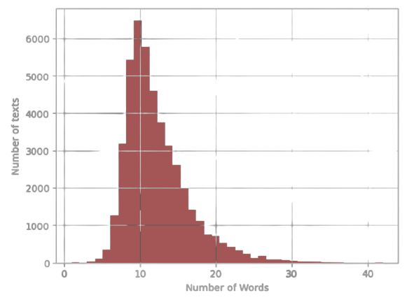

# Transfer Learning in der Sprachverarbeitung
von *Simon Wolf, Tim Staudinger und Miguel Meindl*
## Abstract
Die Sprachverarbeitung ist ein grundlegender Aspekt der künstlichen Intelligenz (KI) und hat in den letzten Jahren beträchtliche Fortschritte erzielt. Eine vielversprechende Methode zur Verbesserung der Leistung von Sprachmodellen ist das Transfer Learning. Transfer Learning ermöglicht es, vortrainierte Modelle auf eine neue Aufgabe anzuwenden, indem das Wissen, das in einem Modell für eine bestimmte Aufgabe erlernt wurde, auf eine andere, verwandte Aufgabe übertragen wird.

Der Podcast bietet eine oberflächliche Einführung in das Thema Transfer Learning in der Sprachverarbeitung, um fachfremde Zuhörer mit den grundlegenden Konzepten vertraut zu machen. Er erklärt, wie Transfer Learning funktioniert und genutzt werden kann, um vortrainierte Modelle auf neue sprachverarbeitende Aufgaben anzuwenden. Der Podcast gibt einen Überblick über verschiedene Anwendungsfälle und beleuchtet die Herausforderungen von Transfer Learning. Dabei werden auch die Auswirkungen von Datenmenge und Qualität  diskutiert.

Der Fachvortrag liefert einen tieferen Einblick in das Transfer Learning und zeigt ... auf.

Zuletzt werden durch die Codedemonstration verschiedene Ansätze für die Verwendung von Transfer Learning in der Sprachverarbeitung aufgezeigt. Es wird vorgestellt, wie ...... verwendet wird. Dafür werden ... 

## Einleitung und Motivation
In der heutigen digitalen Zeit hat die Spracherkennung einen enormen Einfluss auf unser tägliches Leben. Von virtuellen Assistenten über Sprachbefehle in mobilen Geräten bis hin zu automatisierten Kundenservice-Systemen - die Fähigkeit, menschliche Sprache zu verstehen und zu verarbeiten, hat zahlreiche Anwendungen revolutioniert. Doch die Entwicklung präziser und effizienter Spracherkennungssysteme stellt nach wie vor eine Herausforderung dar.

Transfer Learning bietet in der Spracherkennung eine Reihe von Vorteilen. Anstatt jedes Mal von Grund auf ein neues Modell für jede spezifische Aufgabe zu trainieren, kann Transfer Learning genutzt werden, um auf bereits existierende Modelle zurückzugreifen, die auf ähnlichen Sprachdaten trainiert wurden. Dadurch wird nicht nur die Trainingszeit erheblich verkürzt, sondern auch der Bedarf an umfangreichen Datenmengen reduziert.

Des Weiteren ermöglicht Transfer Learning die Nutzung von vortrainiertem Wissen, das bereits in einem anderen Kontext erworben wurde. Dieses Wissen kann auf die Spracherkennung angewendet werden, um eine bessere Anpassung an spezifische Aufgaben zu erreichen. Dadurch wird die Genauigkeit der Spracherkennungssysteme verbessert, selbst wenn die verfügbaren Daten begrenzt sind.

Die Anwendungsmöglichkeiten von Transfer Learning in der Spracherkennung sind vielfältig. Egal ob es darum geht, Sprachbefehle in Smart-Home-Geräten zu erkennen, Transkriptionen von Audioaufnahmen zu erstellen oder Sprachanrufe automatisch zu analysieren, Transfer Learning bietet eine effektive Methode, um maßgeschneiderte Modelle für spezifische Aufgaben zu entwickeln.

Die Idee des Transfer Learnings hat ihre Wurzeln in der Künstlichen Intelligenz und dem maschinellen Lernen. In den letzten Jahrzehnten wurden verschiedene Ansätze und Techniken entwickelt, um Transfer Learning zu ermöglichen. Diese Fortschritte haben die Spracherkennung maßgeblich beeinflusst.

## Stand der Forschung
Doch wie sieht der aktuelle Stand der Forschung im Bereich Transfer Learning in der Spracherkennung aus? Welche neuen Ansätze und Techniken wurden entwickelt, um die Effizienz und Genauigkeit von Spracherkennungssystemen weiter zu verbessern? Im nachfolgenden Abschnitt wird genauer auf dieses Thema eingegangen und diese Fragen beantwortet.

In den letzten Jahren hat die Forschung intensiv daran gearbeitet, Transfer Learning in der Spracherkennung voranzutreiben. Ein herausragendes Beispiel für ein erfolgreiches vortrainiertes Sprachmodell ist ChatGPT. Ursprünglich entwickelt für die Generierung von Texten, hat ChatGPT das Potenzial gezeigt, auch für die Spracherkennung genutzt zu werden.

Durch den Einsatz von ChatGPT als Ausgangspunkt für Transfer Learning können Spracherkennungsmodelle von dem breiten Wissen profitieren, das im Modell von ChatGPT vorhanden ist. Dies ermöglicht eine verbesserte Sprachverarbeitung. Durch die Übertragung des vortrainierten Wissens von ChatGPT auf spezifische Spracherkennungsaufgaben können Modelle schneller und genauer lernen wodurch die Genauigkeit der Spracherkennungssysteme erhöht wird.

Ein weiterer vielversprechender Ansatz ist die Kombination von Transfer Learning mit Active Learning. Active Learning ermöglicht es, gezielt unsichere Beispiele auszuwählen, um das Modell iterativ zu trainieren. Durch den gezielten Einsatz von Transfer Learning in Kombination mit Active Learning können Spracherkennungsmodelle schneller und effizienter lernen. Das Modell kann von bereits gelernten Aufgaben profitieren und sich schneller an neue Spracherkennungsaufgaben anpassen.

Darüber hinaus wird als weiterer Ansatz Transfer Learning mit weiteren Techniken wie Reinforcement Learning und Generative Adversarial Networks (GANs) kombiniert. Diese Kombination eröffnet neue Möglichkeiten, die Leistungsfähigkeit von Spracherkennungssystemen zu steigern. Beispielsweise können Reinforcement Learning-Algorithmen eingesetzt werden, um die Interaktion mit dem Spracherkennungssystem zu verbessern und es an spezifische Nutzerpräferenzen anzupassen.

Ein weiterer vielversprechender Aspekt ist die Erweiterung von Transfer Learning auf mehrsprachige Szenarien. Indem Modelle auf verschiedenen Sprachen trainiert und dann auf neue Sprachen übertragen werden, kann die Effizienz und Genauigkeit der Spracherkennung in verschiedenen Sprachen verbessert werden. Dies ist besonders relevant in globalen Umgebungen, in denen mehrsprachige Unterstützung von entscheidender Bedeutung ist.

Der aktuelle Stand der Forschung im Bereich Transfer Learning in der Spracherkennung zeigt das Potenzial dieser Technik. Durch den Einsatz von vortrainierten Sprachmodellen wie ChatGPT, kombiniert mit Active Learning, Reinforcement Learning und anderen Techniken, können Spracherkennungssysteme effizienter, präziser und anpassungsfähiger trainiert werden.

## Methoden
Fachpräsentation hier vorstellen

## Anwendungen
Im Folgenden wird anhand eines Beispiels die Vorgehensweise bei der Implementierung von Transfer Learning in der Sprachverarbeitung erläutert.
Konkret geht es hierbei um die Implementierung einer Fake-News-Erkennung. 

Zunächst ein kurzer Überblick über die einzelnen Phasen, welche wir durchlaufen werden. In Phase 1 werden die Daten visualisiert und vorbereitet. 
Phase 2 beschäftigt sich mit dem Large Language Model BERT, welches wir für unseren Anwendungsfall fine-tunen wollen. Es wird auf die ursprünglichen Anwendungsfälle 
eingegangen, wofür das Modell einst trainiert wurde. Anschließend wird das Modell angepasst, damit es für die Fake-News-Erkennung verwendet werden kann. 
Ein entscheidender Schritt im Transfer Learning ist das Einfrieren der einzelnen Schichten. Dies wird im Phase 4 erläutert bevor in Phase 5 das Modell trainiert wird. 
Zu guter Letzt muss das Modell noch evaluiert werden.

|  |
|:--:|
| Abbildung 1: Verschiedene Phasen |

### 1.1 Daten - Visualisierung
Beide Datensätze bestehen aus folgenden Variablen:
- _title:_ Entspricht der Schlagzeile des Artikels. Diese Variable wird später zum Trainieren verwendet.
- _text:_ Enthält den gesamten Text des Artikels.
- _subject:_ Beschreibt, wo der Artikel veröffentlicht wurde.
- _date:_ Datum der Veröffentlichung

Hierbei fällt auf, dass keine Variable Auskunft darüber gibt, ob der Artikel fake oder tatsächlich wahr ist. Bevor die Datensätze zusammengefügt werden, 
muss zunächst diese Variable generiert werden.

```python
true_data['Target'] = ['True'] * len(true_data)
fake_data['Target'] = ['Fake'] * len(fake_data)

data = pd.concat([true_data, fake_data]).sample(frac=1).reset_index(drop=True)
data['label'] = pd.get_dummies(data.Target)['Fake']
```

Als Nächstes wurde die Verteilung der Daten visualisiert, um sicherzustellen, dass ein ausbalancierter Datensatz vorliegt. Mit einer Verteilung von 
52,3 % Fake- und 47,7 % Echt-Daten, ist dies der Fall. Die Länge der Schlagzeilen wurde ebenfalls visualisiert. Diese wird später beim Tokenisieren noch 
eine Rolle spielen.

| {width="400"}  |
|:--:|
| Abbildung 2: Länge der Überschriften |


### 1.2 Daten - Vorbereitung
Wie bei jedem maschinellen Lernverfahren müssen die Daten in Trainings-, Validierungs- und Testdaten aufgeteilt werden. 
Da ein Modell mit Textdaten nicht arbeiten kann, müssen diese zunächst tokenisiert werden. Damit ist gemeint, dass die Wörter in sogenannte Tokens umgewandelt 
werden, welche wiederum numerische Repräsentationen darstellen. 

Da wir das Sprachmodell BERT verwenden wollen, nehmen wir hierfür _BertTokenizerFast_, welcher speziell für das Modell entwickelt wurde. Dieser verwendet den WordPiece-Algorithmus, 
welcher auf der Idee basiert, häufig vorkommende Zeichenfolgen in einem Textkorpus zu identifizieren und sie zu einem neuen Wort zusammenzufügen. 

Zusätzlich zum Text, welcher tokenisiert werden soll, sind folgende Parameter zu übergeben:
- _max_length:_ Dieser Parameter definiert die maximale Länge einer Sequence. Wenn wir uns die Grafik _Länge der Überschriften_ nochmals genauer ansehen fällt auf, 
dass die meisten Schlagzeilen unter 20 Wörter haben. Um nicht unnötig große Datenmenge verarbeiten zu müssen, setzen wir die maximale Länge der Sequenzen daher auf diesen Wert.
- _padding:_ Da unser Modell mit einer bestimmten Anzahl an Tokens rechnet, müssen wir diesen Parameter auf _true_ setzen. Dies sorgt dafür, dass Schlagzeilen welche weniger
als 20 Wörter enthalten, am Ende der Sequenz mit Nullen aufgefüllt werden. 
- _truncation:_ Es gibt allerdings auch Schlagzeilen mit mehr als 20 Wörtern. Wird dieser Parameter auf _true_ gesetzt, so werden alle Sequenzen länger als der definierte 
Wert bei _max_length_ abgeschnitten.

```python
MAX_LENGTH = 20

tokenizer = BertTokenizerFast.from_pretrained('bert-base-uncased')
tokens_train = tokenizer.batch_encode_plus(
    train_text.tolist(),
    max_length=MAX_LENGTH,
    padding=True,
    truncation=True
)

tokens_val = tokenizer.batch_encode_plus(
    val_text.tolist(),
    max_length=MAX_LENGTH,
    padding=True,
    truncation=True
)

tokens_test = tokenizer.batch_encode_plus(
    test_text.tolist(),
    max_length=MAX_LENGTH,
    padding=True,
    truncation=True
)
```

Betrachten wir nun die Ausgabe des Tokenizers anhand eines Beispiels. Als Rückgabewert erhalten wir ein Dictionary mit drei key-value Paaren:
- _input_ids:_ Enthält die tokenisierten Sequenzen. Bei genauer Betrachtung fällt auf, dass diese jeweils mit dem Wert 101 starten und 
mit 102 enden. Das hat den Grund, dass diese Tokens keine Wörter darstellen, sondern dem Algorithmus den Anfang und das Ende einer 
Sequenz signalisieren. Des Weiteren kann der zuvor beschriebene Effekt des _padding_ bei der zweiten Sequenz beobachtet werden. Hier wurden 
zwei Nullen an das Ende angefügt, damit Sequenz 1 und 2 die gleiche Länge haben.
- _token_type_ids:_ Wird beim Umgang mit Sequenzpaaren verwendet und gibt an welcher Token zu welchem Satz gehört. Für unseren 
Anwendungsfall jedoch nicht relevant.
- _attention_mask:_ Binäre Sequenz, die angibt, welche Token vom Modell berücksichtigt bzw. ignoriert werden sollen. Beispielsweise sollen 
die Einträge welche bei Sequenz 2 durch _padding_ hinzugefügt wurden, nicht beachtet werden.

```python
sample_data = ["Build a fake news detection model.",
               "Using a bert model."]

tokenized_sample_data = tokenizer.batch_encode_plus(sample_data, padding=True)
print(tokenized_sample_data)
```

```python
{'input_ids': [[101, 3857, 1037, 8275, 2739, 10788, 2944, 1012, 102], [101, 2478, 1037, 14324, 2944, 1012, 102, 0, 0]],
 'token_type_ids': [[0, 0, 0, 0, 0, 0, 0, 0, 0], [0, 0, 0, 0, 0, 0, 0, 0, 0]], 
 'attention_mask': [[1, 1, 1, 1, 1, 1, 1, 1, 1], [1, 1, 1, 1, 1, 1, 1, 0, 0]]
 }
```

Da wir nun wissen, welche Daten wir an das Modell übergeben müssen und wie diese aussehen, werden die Daten im nächsten Schritt zu Tensoren 
konvertiert. Dies ist notwendig, da wir mit der PyTorch-Bibliothek arbeiten wollen und diese auf Tensoren als grundlegende Datenstruktur für 
Berechnungen aufbaut. Des Weiteren verwenden wir einen sogenannten _data loader_, welcher uns beim Laden und Verwalten der Daten behilflich ist und uns diese in Batches aufteilt.

```python
# Convert lists to tensors
train_seq = torch.tensor(tokens_train['input_ids'])
train_mask = torch.tensor(tokens_train['attention_mask'])
train_y = torch.tensor(train_labels.tolist())


# Crate data loader
batch_size = 32
train_data = TensorDataset(train_seq, train_mask, train_y)
train_sampler = RandomSampler(train_data)
train_dataloader = DataLoader(train_data, sampler=train_sampler, batch_size=batch_size)
```


### 2. BERT (Bidirectional Encoder Representations from Transformers)
Das bekannte Large Language Model _Bert (Bidirectional Encoder Representations from Transformers)_ wird als Ausgangspunkt verwendet. Das Modell wurde 2018 von 
Google veröffentlicht und wurde mittlerweile für eine Vielzahl von NLP-Aufgaben eingesetzt. Ursprünglich wurde das Modell auf einem großen Textkorpus trainiert, 
welcher beispielsweise die gesamte Wikipedia (2.5 Billionen Wörter) und den sogenannten BookCorpus (985 Millionen Wörter) enthält.
Das Training wurde hierfür in zwei Phasen aufgeteilt:
- _Masked Language Modeling:_ In dieser Phase wurden 15 % der Wörter zufällig maskiert. Die Aufgabe bestand nun darin, die maskierten Wörter basierend auf dem Kontext vorherzusagen. 
Dabei lernte das Modell die Beziehungen zwischen Wörtern innerhalb von Sätzen. Im folgenden in ein Codebeispiel im welchem die beschriebene Funktion ausgeführt werden kann.

```python
unmasker = pipeline('fill-mask', model='bert-base-uncased')

text = "I will need an [MASK] because it is raining."
unmasker(text)
```

- _Next Sentence Prediction:_ Als nächsten Schritt musste das Modell die Beziehungen zwischen Sätzen lernen. Hierfür wurde die Aufgabe so umgewandelt, dass das Modell vorhersagen sollte, 
ob zwei Sätze aufeinanderfolgen. Wie für die erste Phase wird auch hierfür ein Codebeispiel zur Verfügung gestellt. Das Modell soll vorhersagen, ob Satz 1 und 2 bzw. Satz 2 und 3 
in einer Beziehung zueinander stehen.

```python
model = BertForNextSentencePrediction.from_pretrained("bert-base-uncased")
tokenizer = BertTokenizer.from_pretrained("bert-base-uncased")

sentences = ["Elon Musk lives in California.", "You can't buy anything on sundays in germany.",
             "You are not supposed to work on sundays in germany."]

for i in range(2):
    inputs = tokenizer(sentences[i], sentences[i + 1], return_tensors="pt")
    outputs = model(**inputs)
    prediction = torch.argmax(outputs.logits)

    if prediction == 0:
        print("The sentences belong together.")
    else:
        print("The sentences do not belong together.")
```


### 3. Model
In Phase 3 erstellen wir ein Modell, welches die Architektur des BERT Modells als Grundlage verwendet. Um das Modell auf unseren Anwendungsfall anzupassen, 
fügen wir weitere Schichten hinzu. So werden beispielsweise zwei Linear-Layers hinzugefügt, um die Anzahl der Ausgänge auf zwei (Fake/Wahr) zu reduzieren. Ebenfalls wird die 
Regularisierungstechnik _Dropout_ angewandt, um Overfitting vorzubeugen.

In der _forward_ Funktion wird definiert, wie die Eingabe durch das Modell fließt und die Ausgabe berechnet wird.

```python
class BERT_Arch(nn.Module):
    def __init__(self, bert):
        super(BERT_Arch, self).__init__()
        self.bert = bert
        self.dropout = nn.Dropout(0.1)
        self.relu = nn.ReLU()
        self.fc1 = nn.Linear(768, 512)
        self.fc2 = nn.Linear(512, 2)
        self.softmax = nn.LogSoftmax(dim=1)

    def forward(self, sent_id, mask):
        cls_hs = self.bert(sent_id, attention_mask=mask)['pooler_output']
        x = self.fc1(cls_hs)
        x = self.relu(x)
        x = self.dropout(x)
        x = self.fc2(x)
        x = self.softmax(x)
        return x
```


### 4. Einfrieren der Schichten
Beim Transfer Learning werden oft bestimmte Schichten des vortrainierten Modells eingefroren, um die Gewichte während des Trainings nicht
zu aktualisieren. Dies wird aus folgenden Gründen gemacht:
- Schutz des bereits gelernten Wissens
- Reduzieren der Trainingszeit
- Prävention vor Overfitting

Besonders nützlich ist dies, wenn die ursprüngliche Aufgabe Ähnlichkeiten mit der neuen Aufgabe aufweist. Es gibt drei verschiedene Ansätze welche verfolgt
werden können. Im Folgenden werden diese stichpunktartig beschrieben.
1. _Keine Schichten einfrieren:_ 
   1. Es wird das gesamte Modell trainiert
   2. Großer Datensatz benötigt
   3. Die ursprüngliche Aufgabe unterscheidet sich stark von der neuen Aufgabe
   

2. _Teilweises einfrieren der Schichten:_
   1. Es werden nur die unteren Schichten eingefroren
   2. Die oberen Schichten werden trainiert
   3. Mittelgroßer Datensatz notwendig
   

3. _Alle Schichten einfrieren:_
   1. Alle Schichte des vortrainierten Modell werden eingefroren
   2. Nur die aufgabenspezifische Schichten werden trainiert
   3. Kleiner Datensatz
   4. Ähnlichkeiten zwischen ursprünglicher und neuer Aufgabe sind vorhanden

Für unseren Anwendungsfall wählen wir Methode 3. Hierfür iterieren wir über die einzelnen Schichten des BERT Modells und setzten den Parameter
_requires_grad_ jeweils auf den Wert _false_. Dadurch wird verhindert, dass der Gradient während des Trainings berechnet und die Gewichte aktualisiert werden.

```python
for param in bert.parameters():
    param.requires_grad = False
```

### 5. Fine-Tuning
Wie es für Pytorch üblich ist, müssen nun die Trainings- und Evaluierungsschleife implementiert werden. In der Trainingsschleife 
erfolgt pro Iteration der gleiche Ablauf:
1. _Datenbereitstellung:_ Die Eingabedaten und die Labels werden aus den aktuellen Batch extrahiert.
2. _Vorwärtsdurchlauf:_ Die Eingabedaten werden in das Modell gegeben, welches Vorhersagen generiert.
3. _Fehlerberechnung:_ Es folgt ein Abgleich der vorhergesagten Werte mit den tatsächlichen Werten.
4. _Rückwärtsdurchlauf und Gewichtsaktualisierung:_ Der Backpropagation-Algorithmus wird verwendet, um die Gradienten der Gewichte 
des Modells zu berechnen. Der Optimizer nutzt diese Gradienten, um die Gewichte entsprechend anzupassen und das Modell zu optimieren.

Ähnlich verhält sich die Evaluierungsschleife, mit dem Unterschied, dass der Rückwärtsdurchlauf nicht durchgeführt wird.

```python
def train():
    model.train()
    total_loss, total_accuracy = 0, 0

    for step, batch in enumerate(train_dataloader):
        if step % 50 == 0 and not step == 0:
            print('  Batch {:>5,}  of  {:>5,}.'.format(step, len(train_dataloader)))

        input_id, mask, labels = batch
        model.zero_grad()
        preds = model(input_id, mask)
        loss = cross_entropy(preds, labels)
        total_loss = total_loss + loss.item()
        loss.backward()
        torch.nn.utils.clip_grad_norm_(model.parameters(), 1.0)
        optimizer.step()

    avg_loss = total_loss / len(train_dataloader)
    return avg_loss
```

Nachdem das Modell trainiert wurde, ist es an der Zeit die Performance des Modells auf den Testdaten zu überprüfen. Die folgende 
Tabelle zeigt die erhaltenen Metriken:

| | precision | recall | f1-score | support |
| 0 | 0.99 | 0.99 | 0.99 | 3212 |
| 1 | 0.99 | 0.99 | 0.99 | 3523 |
| accuracy |  |  | 0.99 | 6735 |
| macro avg | 0.99 | 0.99 | 0.99 | 6735 |
| weighted avg | 0.99 | 0.99 | 0.99 | 6735 |


### 6. Inference 
Um mit dem Modell Vorhersagen machen zu können, müssen folgende Schritte durchgeführt werden:
1. Tokenisieren der Schlagzeile 
```python
unseen_news_text = ["Donald Trump Sends Out Embarrassing New Year’s Eve Message; This is Disturbing"]

MAX_LENGTH = 20
tokenizer = BertTokenizerFast.from_pretrained('bert-base-uncased')
tokens_unseen = tokenizer.batch_encode_plus(
    unseen_news_text,
    max_length=MAX_LENGTH,
    padding=True,
    truncation=True
)
```
2. _input_ids_ und _attention_mask_ zu Tensoren konvertieren
```python
unseen_seq = torch.tensor(tokens_unseen['input_ids'])
unseen_mask = torch.tensor(tokens_unseen['attention_mask'])
```
3. Vorhersage und Ausgabe
```python
preds = model(unseen_seq, unseen_mask)
preds = np.argmax(preds, axis=1)

for idx, pred in enumerate(preds):
    if pred == 0:
        print(f"Headline {idx+1} is True")
        continue
    print(f"Headline {idx+1} is Fake")
```


## Fazit


## Weiterführendes Material

### Podcast
[Der Campus Talk - Silicon Forest]()

### Talk
[Video Fachvortrag]()

### Demo
[Video Code Demonstration]()
[Source Code](https://github.com/StaudTim/NLP-TransferLearning)

### Literaturliste
[Matthew E. Taylor, Peter Stone. (2009). Transfer Learning for Reinforcement Learning Domains: A Survey. Journal of Machine Learning Research 10](https://www.jmlr.org/papers/volume10/taylor09a/taylor09a.pdf?ref=https://codemonkey.link)
